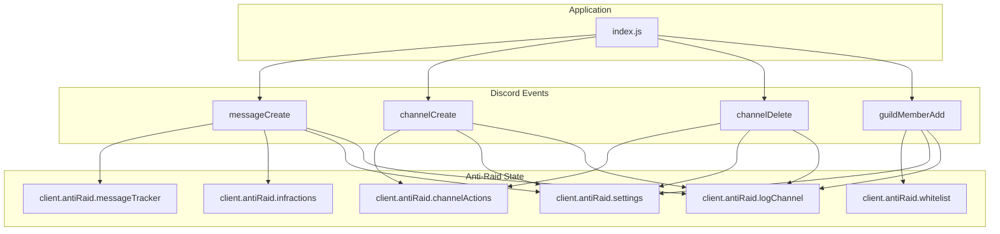
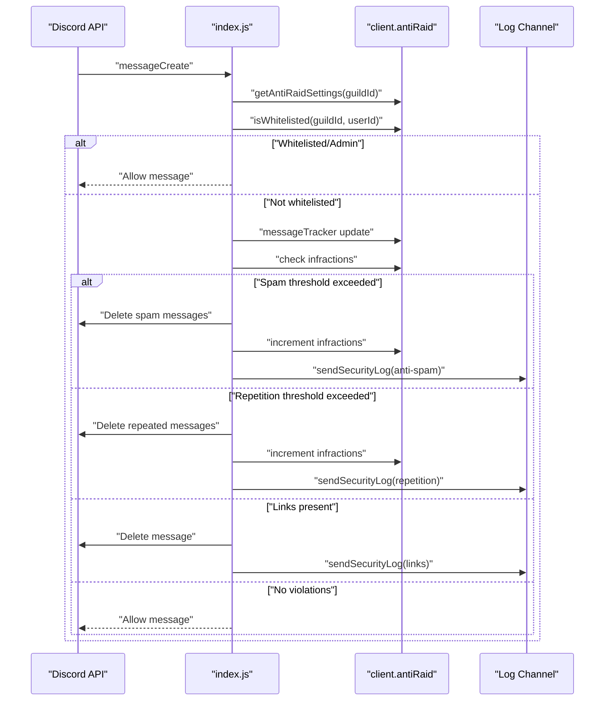
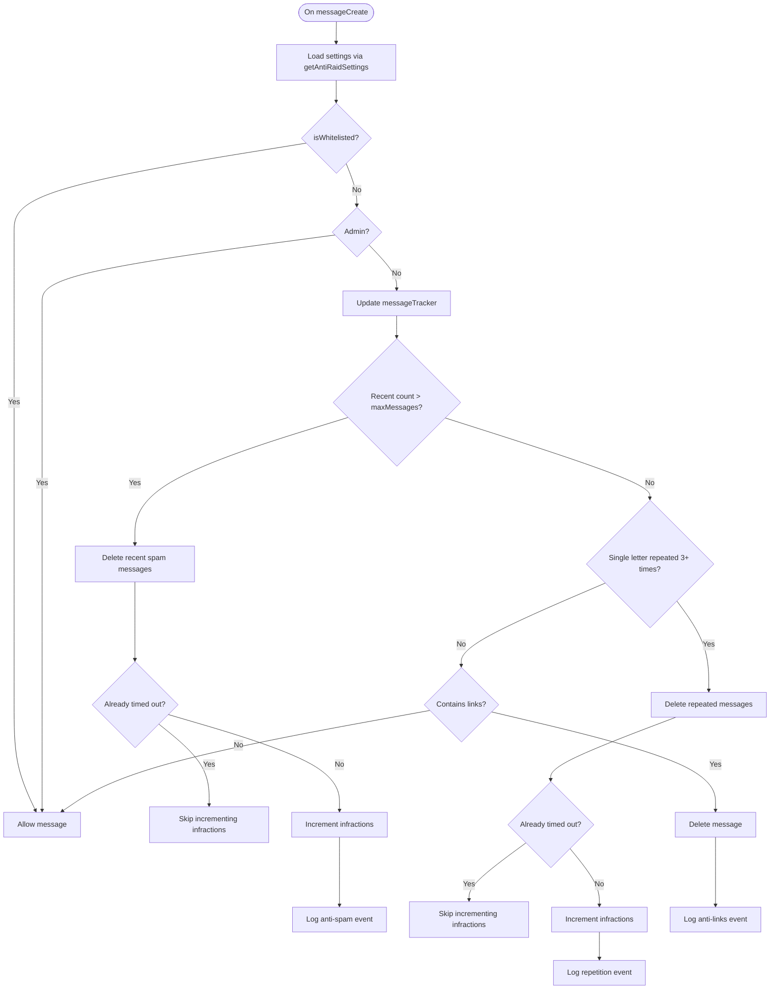
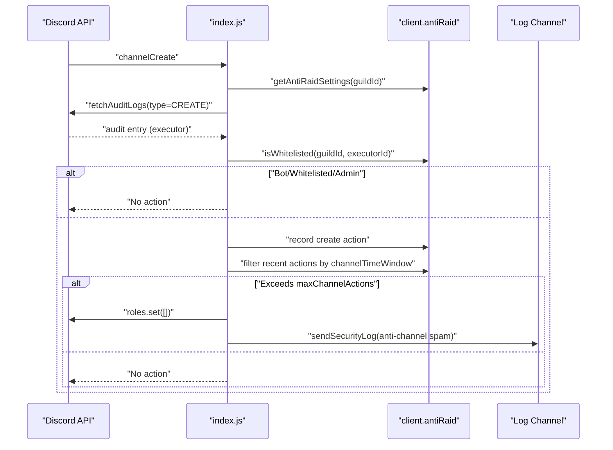
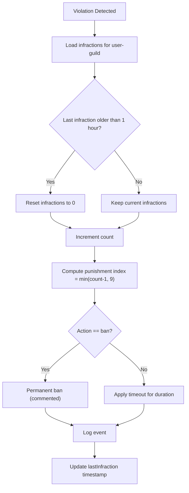
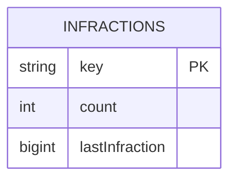
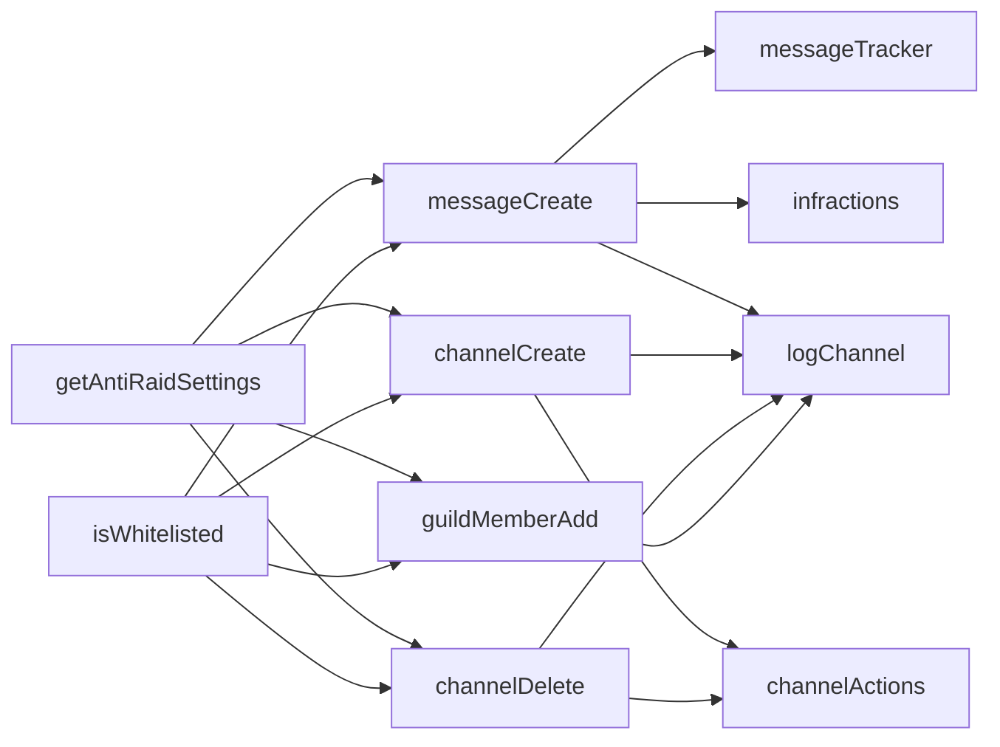

# Anti-Raid System

<cite>
**Referenced Files in This Document**
- [index.js](file://index.js)
- [README.md](file://README.md)
</cite>

## Table of Contents
1. [Introduction](#introduction)
2. [Project Structure](#project-structure)
3. [Core Components](#core-components)
4. [Architecture Overview](#architecture-overview)
5. [Detailed Component Analysis](#detailed-component-analysis)
6. [Dependency Analysis](#dependency-analysis)
7. [Performance Considerations](#performance-considerations)
8. [Troubleshooting Guide](#troubleshooting-guide)
9. [Conclusion](#conclusion)
10. [Appendices](#appendices)

## Introduction
This document explains the anti-raid system implemented in the project, focusing on:
- Message tracking via client.antiRaid.messageTracker
- Channel action monitoring via client.antiRaid.channelActions
- Progressive punishment escalation from timeouts to permanent bans
- Server-specific configuration via getAntiRaidSettings
- Whitelisting via isWhitelisted
- Domain model for user infractions stored in client.antiRaid.infractions
- Shared punishment framework across anti-spam, anti-links, anti-bots, and anti-channel spam
- Operational reset behavior after 1 hour of inactivity
- Practical guidance to reduce false positives in spam detection

## Project Structure
The anti-raid system is implemented in a single application file with a central client object that holds anti-raid state and handlers. The README outlines the protection features and operational notes.

**Diagram sources**
- [index.js](file://index.js#L520-L528)
- [index.js](file://index.js#L936-L954)
- [index.js](file://index.js#L1748-L2092)
- [index.js](file://index.js#L2121-L2214)
- [index.js](file://index.js#L2095-L2119)

**Section sources**
- [index.js](file://index.js#L520-L528)
- [README.md](file://README.md#L62-L73)

## Core Components
- Anti-Raid namespace: Holds messageTracker, channelActions, whitelist, logChannel, settings, and infractions collections.
- Settings provider: getAntiRaidSettings returns server-specific toggles and thresholds.
- Whitelist checker: isWhitelisted returns whether a user is exempt from protections.
- Infractions model: Tracks progressive punishment counts and timestamps per user-guild.
- Event handlers:
  - Message creation: anti-spam, anti-links, anti-repetition, and progressive infractions
  - Channel creation/deletion: anti-channel spam
  - Member join: anti-bots
  - Security logs: centralized logging for actions

**Section sources**
- [index.js](file://index.js#L520-L528)
- [index.js](file://index.js#L936-L954)
- [index.js](file://index.js#L1748-L2092)
- [index.js](file://index.js#L2121-L2214)
- [index.js](file://index.js#L2095-L2119)

## Architecture Overview
The system is event-driven. Each incoming event is evaluated against server settings and whitelists. If a violation is detected, the system updates infractions and logs the action. Anti-spam and anti-repetition use messageTracker to compute thresholds. Anti-channel spam uses channelActions to track rapid create/delete sequences. Anti-bots and anti-links apply immediate actions (kick or delete) and log outcomes.

**Diagram sources**
- [index.js](file://index.js#L1748-L2092)
- [index.js](file://index.js#L2070-L2092)

## Detailed Component Analysis

### Message Tracking and Anti-Spam
- Purpose: Detect mass messaging within a short time window.
- Mechanism:
  - messageTracker stores recent messages per user-guild tuple.
  - On each message, recent messages are filtered by timeWindow and appended.
  - If recent count exceeds maxMessages, the system deletes recent messages and increments infractions.
- Progressive Punishment:
  - infractions tracks count and lastInfraction timestamp per user-guild.
  - After 1 hour without activity, infractions are reset to zero.
  - A 10-level progression array defines escalating timeouts; the 10th level is permanent ban (commented out in code).
- Anti-Links:
  - Regex detects http(s) and invite links; messages are deleted unless the author has ManageMessages permission.
- Anti-Repetition:
  - Detects repeated single-letter messages and deletes duplicates; also increments infractions.

**Diagram sources**
- [index.js](file://index.js#L1748-L2092)
- [index.js](file://index.js#L1848-L1909)
- [index.js](file://index.js#L1973-L2068)
- [index.js](file://index.js#L2070-L2092)

**Section sources**
- [index.js](file://index.js#L1748-L2092)
- [index.js](file://index.js#L1848-L1909)
- [index.js](file://index.js#L1973-L2068)
- [index.js](file://index.js#L2070-L2092)

### Channel Action Monitoring (Anti-Channel Spam)
- Purpose: Detect mass channel creation/deletion by a single executor.
- Mechanism:
  - channelActions tracks per-user-guild create/delete events within a time window.
  - If the number of actions exceeds maxChannelActions, the executor loses roles and is logged.
- Whitelisting and permissions:
  - Executors who are bots or whitelisted are ignored.
  - Administrators are protected.

**Diagram sources**
- [index.js](file://index.js#L2121-L2167)
- [index.js](file://index.js#L2169-L2214)

**Section sources**
- [index.js](file://index.js#L2121-L2214)

### Anti-Bots
- Purpose: Prevent unauthorized bot joins.
- Mechanism:
  - On guildMemberAdd, if the member is a bot and antiBots is enabled, the bot is kicked unless whitelisted.
  - Logs the action.

**Section sources**
- [index.js](file://index.js#L2095-L2119)

### Progressive Punishment Escalation
- Infractions model:
  - Stored per user-guild key with count and lastInfraction timestamp.
  - Reset after 1 hour without activity.
- 10-level progression:
  - Increasing timeout durations (1 min, 2 min, 5 min, 10 min, 15 min, 30 min, 1 h, 2 h, 1 day, ban).
  - The ban level is present in the progression array but is currently commented out in the handler logic.

**Diagram sources**
- [index.js](file://index.js#L1897-L1924)
- [index.js](file://index.js#L1999-L2024)

**Section sources**
- [index.js](file://index.js#L1897-L1924)
- [index.js](file://index.js#L1999-L2024)

### Domain Model: User Infractions
- Storage: client.antiRaid.infractions is a Map keyed by guildId-userId.
- Fields:
  - count: number of infractions in the current cycle
  - lastInfraction: timestamp of the last infraction
- Reset policy: If more than 1 hour elapsed since lastInfraction, count and lastInfraction are reset to 0.

**Diagram sources**
- [index.js](file://index.js#L1897-L1909)
- [index.js](file://index.js#L2000-L2010)

**Section sources**
- [index.js](file://index.js#L1897-L1909)
- [index.js](file://index.js#L2000-L2010)

### Configuration and Whitelisting
- getAntiRaidSettings(guildId):
  - Returns server-specific toggles and thresholds (antiSpam, maxMessages, timeWindow, antiChannelSpam, maxChannelActions, channelTimeWindow, antiLinks, antiBots).
- isWhitelisted(guildId, userId):
  - Checks if a user is whitelisted for the server.

**Section sources**
- [index.js](file://index.js#L936-L954)

### Logging and Reporting
- Security logs are sent to a configured log channel per guild.
- Logs include details about detected violations, actions taken, and reasons.

**Section sources**
- [index.js](file://index.js#L2218-L2269)
- [index.js](file://index.js#L2332-L2362)

## Dependency Analysis
- Event-driven dependencies:
  - messageCreate depends on messageTracker, infractions, settings, and logs.
  - channelCreate/channelDelete depend on channelActions, settings, and logs.
  - guildMemberAdd depends on settings, whitelist, and logs.
- Cross-feature shared framework:
  - All violations increment infractions and log outcomes.
  - Settings and whitelist gate enforcement uniformly.

**Diagram sources**
- [index.js](file://index.js#L936-L954)
- [index.js](file://index.js#L1748-L2092)
- [index.js](file://index.js#L2121-L2214)
- [index.js](file://index.js#L2095-L2119)

**Section sources**
- [index.js](file://index.js#L936-L954)
- [index.js](file://index.js#L1748-L2092)
- [index.js](file://index.js#L2121-L2214)
- [index.js](file://index.js#L2095-L2119)

## Performance Considerations
- Time-window filtering is O(n) per user-guild per message; acceptable for typical servers.
- Recent actions/time-based trackers are cleaned per event; memory footprint remains bounded by time windows.
- Logging is asynchronous; errors are caught and logged to prevent blocking.

[No sources needed since this section provides general guidance]

## Troubleshooting Guide
- False positives in spam detection:
  - Reduce maxMessages or increase timeWindow in getAntiRaidSettings for the server.
  - Whitelist trusted users via isWhitelisted to bypass protections.
  - Ensure administrators are not affected by anti-spam checks.
- Timeout vs. ban:
  - The ban level exists in the progression array but is currently disabled in the handler. If you want bans, enable the ban branch in the handler.
- Logs not appearing:
  - Verify logChannel is configured per guild and the bot has Send Messages permission.
- Channel spam not detected:
  - Ensure antiChannelSpam is enabled and maxChannelActions/timeWindow are set appropriately.

**Section sources**
- [index.js](file://index.js#L942-L954)
- [index.js](file://index.js#L936-L940)
- [index.js](file://index.js#L1762-L1765)
- [index.js](file://index.js#L1929-L1948)
- [index.js](file://index.js#L2148-L2167)
- [index.js](file://index.js#L2195-L2214)

## Conclusion
The anti-raid system provides a robust, configurable, and scalable defense against raids and spam. It uses a shared framework across multiple protections, maintains progressive infractions with a 1-hour reset window, and logs all actions for transparency. Administrators can tune thresholds, whitelist users, and rely on consistent escalation from warnings to timeouts and bans.

[No sources needed since this section summarizes without analyzing specific files]

## Appendices

### Configuration Options
- antiSpam: Enable/disable anti-spam
- maxMessages: Maximum messages within timeWindow
- timeWindow: Milliseconds for spam window
- antiChannelSpam: Enable/disable anti-channel spam
- maxChannelActions: Maximum actions within channelTimeWindow
- channelTimeWindow: Milliseconds for channel spam window
- antiLinks: Enable/disable anti-links
- antiBots: Enable/disable anti-bots

**Section sources**
- [index.js](file://index.js#L942-L954)

### Example: 10-Level Punishment Array
- Levels: 1 min, 2 min, 5 min, 10 min, 15 min, 30 min, 1 h, 2 h, 1 day, ban
- The ban level is present in the progression array but is currently disabled in the handler.

**Section sources**
- [index.js](file://index.js#L1911-L1924)
- [index.js](file://index.js#L2013-L2024)
- [index.js](file://index.js#L1929-L1948)

### Reset Behavior
- Infractions reset after 1 hour without activity.

**Section sources**
- [index.js](file://index.js#L1901-L1904)
- [index.js](file://index.js#L2003-L2006)