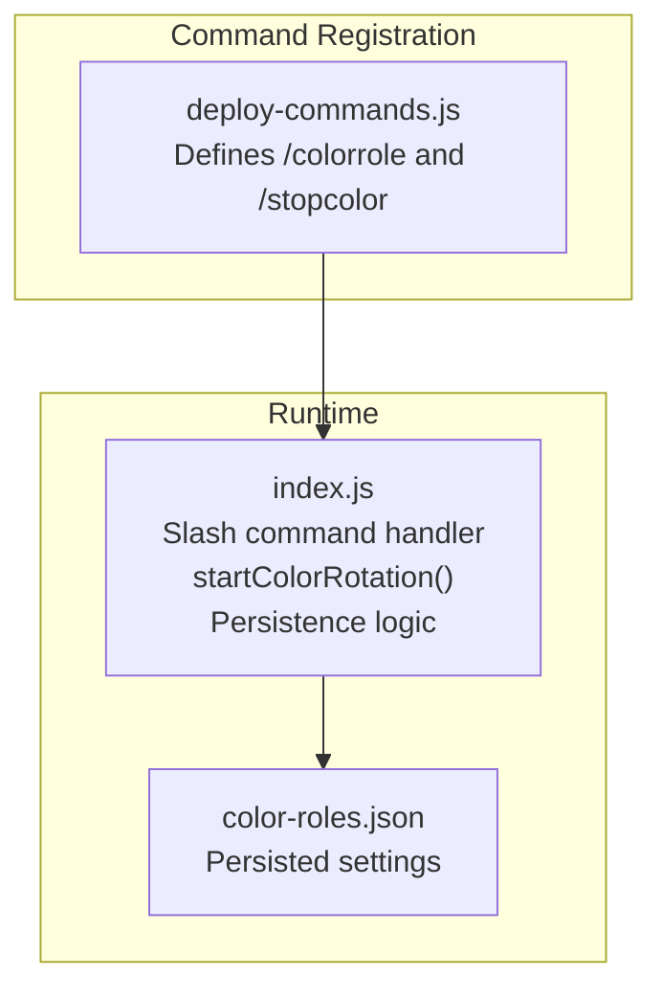
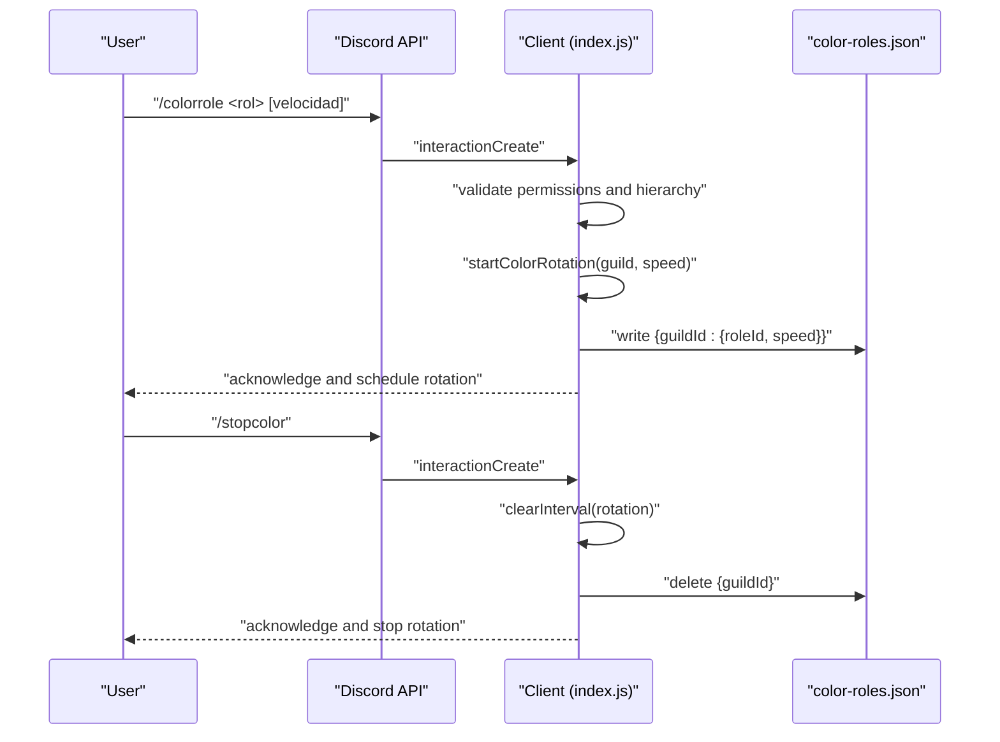
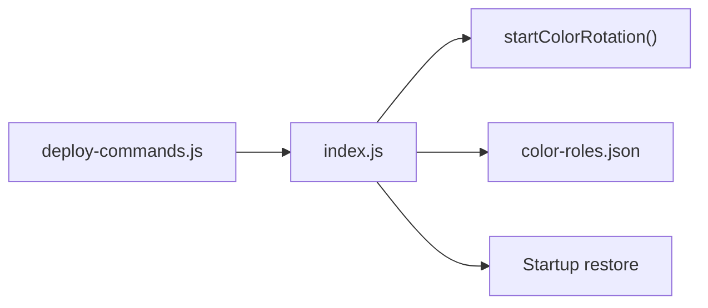

# Color Roles Commands

<cite>
**Referenced Files in This Document**
- [index.js](file://index.js)
- [deploy-commands.js](file://deploy-commands.js)
- [color-roles.json](file://color-roles.json)
- [README.md](file://README.md)
- [LISTA-COMANDOS.md](file://LISTA-COMANDOS.md)
- [ESQUEMA_BOT.md](file://ESQUEMA_BOT.md)
</cite>

## Table of Contents
1. [Introduction](#introduction)
2. [Project Structure](#project-structure)
3. [Core Components](#core-components)
4. [Architecture Overview](#architecture-overview)
5. [Detailed Component Analysis](#detailed-component-analysis)
6. [Dependency Analysis](#dependency-analysis)
7. [Performance Considerations](#performance-considerations)
8. [Troubleshooting Guide](#troubleshooting-guide)
9. [Conclusion](#conclusion)

## Introduction
This document explains the Color Roles command category, focusing on the two commands: /colorrole and /stopcolor. It details how these commands integrate with the color rotation system, how colors are persisted, and how the rotation interval is configured. It also covers the predefined color palette, the invocation flow, and relationships with role management and persistence.

## Project Structure
The Color Roles feature spans a few core files:
- Command registration and options are defined in the deployment script.
- Command handlers and rotation logic live in the main application file.
- Persistence of color-role settings is handled via a JSON file.

**Diagram sources**
- [deploy-commands.js](file://deploy-commands.js#L98-L107)
- [index.js](file://index.js#L3047-L3076)
- [index.js](file://index.js#L5106-L5208)
- [color-roles.json](file://color-roles.json#L1-L10)

**Section sources**
- [deploy-commands.js](file://deploy-commands.js#L98-L107)
- [index.js](file://index.js#L3047-L3076)
- [index.js](file://index.js#L5106-L5208)
- [color-roles.json](file://color-roles.json#L1-L10)

## Core Components
- Command definitions: /colorrole and /stopcolor are registered with Discord’s application command API.
- Runtime handlers: The application listens for slash command interactions and executes the appropriate logic.
- Rotation engine: A periodic timer cycles through a predefined set of colors for the selected role.
- Persistence: Settings are saved to a JSON file to survive restarts.

Key behaviors:
- /colorrole validates permissions, checks the target role position relative to the bot, validates speed bounds (1–60 seconds), starts rotation, and persists the configuration.
- /stopcolor stops rotation, clears the persisted setting, and informs the user.
- On startup, the bot restores previous rotations from the JSON file.

**Section sources**
- [deploy-commands.js](file://deploy-commands.js#L98-L107)
- [index.js](file://index.js#L3047-L3076)
- [index.js](file://index.js#L5106-L5208)
- [index.js](file://index.js#L708-L727)
- [color-roles.json](file://color-roles.json#L1-L10)

## Architecture Overview
The Color Roles system is composed of:
- Slash command registration with options for role selection and speed.
- Interaction handler that enforces permissions and role hierarchy.
- Rotation loop that updates the role color periodically.
- Persistence layer that stores the active role and speed per guild.

**Diagram sources**
- [deploy-commands.js](file://deploy-commands.js#L98-L107)
- [index.js](file://index.js#L5106-L5208)
- [index.js](file://index.js#L3047-L3076)
- [color-roles.json](file://color-roles.json#L1-L10)

## Detailed Component Analysis

### Command Registration: /colorrole and /stopcolor
- Both commands are registered with the Discord API. The /colorrole command accepts:
  - A required role option.
  - An optional integer option for speed with min/max values (1–60).
- The /stopcolor command has no options.

These definitions ensure that users can configure rotation speed and stop it cleanly.

**Section sources**
- [deploy-commands.js](file://deploy-commands.js#L98-L107)

### Command Handler: /colorrole
Behavior:
- Validates that the invoking user has permission to manage roles.
- Validates that the chosen role is not higher in the role hierarchy than the bot’s highest role.
- Validates that the speed is within the allowed range (1–60 seconds).
- Stops any existing rotation for the guild.
- Stores the target role ID and speed in memory and starts the rotation loop.
- Persists the configuration to the JSON file keyed by guild ID.

Rotation loop:
- Uses a periodic interval computed from the speed in seconds.
- Iterates through a fixed palette of colors.
- Updates the role’s color and advances to the next color.

Persistence:
- Writes a JSON object with guild ID as the key and an object containing role ID and speed.

Notes:
- The handler replies to the interaction with a non-ephemeral message to inform all users in the channel.
- The rotation continues even after bot restarts because the settings are restored on startup.

**Section sources**
- [index.js](file://index.js#L5106-L5162)
- [index.js](file://index.js#L3047-L3076)
- [index.js](file://index.js#L708-L727)
- [color-roles.json](file://color-roles.json#L1-L10)

### Command Handler: /stopcolor
Behavior:
- Validates that the invoking user has permission to manage roles.
- Clears the existing rotation interval for the guild.
- Removes the stored role ID for the guild from memory.
- Deletes the guild’s entry from the JSON file.
- Replies to the interaction indicating the role name (if known) and that rotation has stopped.

**Section sources**
- [index.js](file://index.js#L5164-L5208)
- [index.js](file://index.js#L3047-L3076)
- [index.js](file://index.js#L708-L727)
- [color-roles.json](file://color-roles.json#L1-L10)

### Rotation Engine: startColorRotation
- Defines the color palette as a fixed array of numeric color values.
- Ensures any existing interval for the guild is cleared before starting a new one.
- Creates a new interval that:
  - Retrieves the stored role ID for the guild.
  - Applies the next color in the palette cyclically.
  - Handles errors during color updates silently to keep the loop resilient.

Interval cadence:
- The interval delay is derived from the speed parameter in seconds.

**Section sources**
- [index.js](file://index.js#L3047-L3076)

### Persistence Layer: color-roles.json
Format:
- Root is an object keyed by guild ID.
- Each guild entry contains:
  - roleId: the ID of the role whose color rotates.
  - speed: the rotation interval in seconds.

Startup restoration:
- On startup, the bot reads the JSON file and restores rotation for each guild entry.

Example structure:
- See [color-roles.json](file://color-roles.json#L1-L10) for a concrete example.

**Section sources**
- [index.js](file://index.js#L708-L727)
- [color-roles.json](file://color-roles.json#L1-L10)

### Invocation Relationship with Role Management and Persistence
- Role management:
  - The bot checks the invoking user’s permission to manage roles.
  - The bot checks the target role’s position relative to the bot’s highest role to respect Discord’s role hierarchy.
- Persistence:
  - The bot writes and deletes entries per guild to the JSON file to persist rotation settings.
- Startup:
  - The bot restores rotation settings from the JSON file upon startup.

**Section sources**
- [index.js](file://index.js#L5106-L5162)
- [index.js](file://index.js#L5164-L5208)
- [index.js](file://index.js#L708-L727)

### Predefined Color Palette
- The rotation cycle uses a fixed palette of numeric color values.
- The README and schema documents list the colors as red, green, blue, yellow, magenta, cyan, orange, purple.

**Section sources**
- [index.js](file://index.js#L3047-L3076)
- [README.md](file://README.md#L7-L12)
- [ESQUEMA_BOT.md](file://ESQUEMA_BOT.md#L8-L13)

### Rotation Interval Configuration
- The speed parameter is validated to be between 1 and 60 seconds.
- The interval is created using the speed in seconds.
- The JSON file stores the speed per guild.

**Section sources**
- [index.js](file://index.js#L5106-L5162)
- [index.js](file://index.js#L3047-L3076)
- [color-roles.json](file://color-roles.json#L1-L10)

### Example: How Colors Are Stored in color-roles.json
- The file contains an object keyed by guild ID.
- Each entry holds the role ID and the rotation speed in seconds.
- See [color-roles.json](file://color-roles.json#L1-L10) for a concrete example.

**Section sources**
- [color-roles.json](file://color-roles.json#L1-L10)

### Example: How Rotation Works with the Predefined Palette
- The rotation loop cycles through the fixed palette and applies the next color each tick.
- The loop handles errors during color updates to keep running.

**Section sources**
- [index.js](file://index.js#L3047-L3076)

## Dependency Analysis
- Command registration depends on the deployment script to register options and descriptions.
- Runtime handlers depend on:
  - The Discord client’s interaction event.
  - The rotation engine function.
  - The persistence layer (JSON file).
- Startup restoration depends on the presence of the JSON file and the client collections used to track intervals and role IDs.

**Diagram sources**
- [deploy-commands.js](file://deploy-commands.js#L98-L107)
- [index.js](file://index.js#L3047-L3076)
- [index.js](file://index.js#L708-L727)
- [color-roles.json](file://color-roles.json#L1-L10)

**Section sources**
- [deploy-commands.js](file://deploy-commands.js#L98-L107)
- [index.js](file://index.js#L3047-L3076)
- [index.js](file://index.js#L708-L727)
- [color-roles.json](file://color-roles.json#L1-L10)

## Performance Considerations
- Rotation interval is lightweight; it performs a single role update per tick.
- The loop handles errors internally to prevent crashes.
- Persisting to disk occurs only when starting or stopping rotation, minimizing IO overhead.

[No sources needed since this section provides general guidance]

## Troubleshooting Guide
Common issues and resolutions:
- Colors do not change:
  - Verify the bot has permission to manage roles and that the target role is not above the bot’s highest role.
  - Ensure the speed is between 1 and 60 seconds.
  - Confirm that the JSON file exists and contains the expected guild entry.
  - Restart the bot to trigger startup restoration of rotation.
- Rotation does not stop:
  - Run /stopcolor and verify the JSON entry for the guild was removed.
  - Check that the bot still has Manage Roles permission.
- Role remains unchanged after stop:
  - The role retains its current color after stopping rotation. If you want a specific color, manually set it using role management commands.

**Section sources**
- [index.js](file://index.js#L5106-L5208)
- [index.js](file://index.js#L708-L727)
- [color-roles.json](file://color-roles.json#L1-L10)

## Conclusion
The Color Roles system provides a simple yet robust way to automatically cycle a role’s color across a predefined palette. The /colorrole and /stopcolor commands integrate tightly with the runtime rotation engine and a small JSON file for persistence. Permissions and role hierarchy checks ensure safe operation, while startup restoration guarantees continuity across restarts.