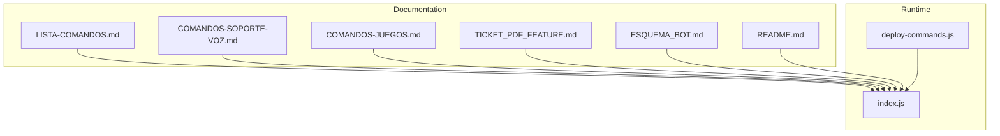
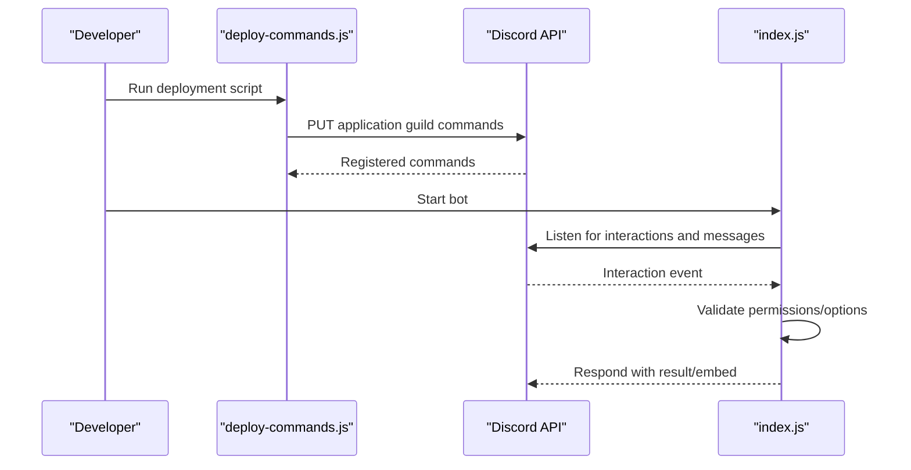
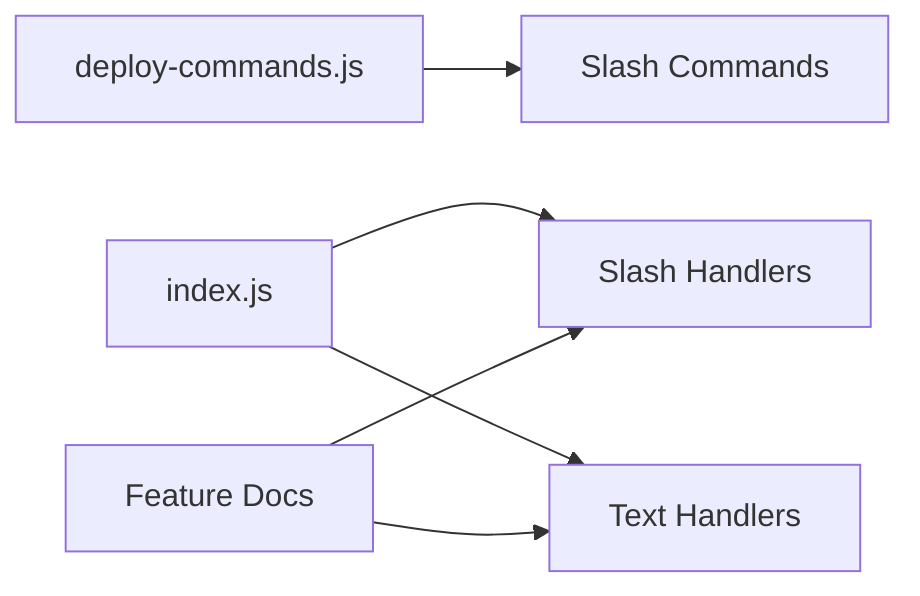

# Commands Reference

<cite>
**Referenced Files in This Document**
- [LISTA-COMANDOS.md](file://LISTA-COMANDOS.md)
- [COMANDOS-SOPORTE-VOZ.md](file://COMANDOS-SOPORTE-VOZ.md)
- [COMANDOS-JUEGOS.md](file://COMANDOS-JUEGOS.md)
- [TICKET_PDF_FEATURE.md](file://TICKET_PDF_FEATURE.md)
- [ESQUEMA_BOT.md](file://ESQUEMA_BOT.md)
- [README.md](file://README.md)
- [deploy-commands.js](file://deploy-commands.js)
- [index.js](file://index.js)
</cite>

## Table of Contents
1. [Introduction](#introduction)
2. [Project Structure](#project-structure)
3. [Core Components](#core-components)
4. [Architecture Overview](#architecture-overview)
5. [Detailed Component Analysis](#detailed-component-analysis)
6. [Dependency Analysis](#dependency-analysis)
7. [Performance Considerations](#performance-considerations)
8. [Troubleshooting Guide](#troubleshooting-guide)
9. [Conclusion](#conclusion)
10. [Appendices](#appendices)

## Introduction
This document provides a comprehensive reference for all available commands in the bot, organized by functional categories as defined in the repository’s documentation. It covers slash commands and text-based commands, including Voice Support, Temporary Voice Channels, Tickets, Moderation, Color Roles, Direct Messages, Communication, Information, Fun, and Utility. For each command, it documents syntax, parameters with types and constraints, practical usage examples, and cross-references to features such as Anti-Raid and Ticket PDF export. Availability status is included where applicable.

## Project Structure
The repository organizes command-related information across several markdown files and the main runtime script. Command registration is centralized in a deployment script, while command handlers and interactive flows are implemented in the main script.

**Diagram sources**
- [LISTA-COMANDOS.md](file://LISTA-COMANDOS.md#L1-L303)
- [COMANDOS-SOPORTE-VOZ.md](file://COMANDOS-SOPORTE-VOZ.md#L1-L347)
- [COMANDOS-JUEGOS.md](file://COMANDOS-JUEGOS.md#L1-L242)
- [TICKET_PDF_FEATURE.md](file://TICKET_PDF_FEATURE.md#L1-L94)
- [ESQUEMA_BOT.md](file://ESQUEMA_BOT.md#L1-L306)
- [README.md](file://README.md#L1-L188)
- [deploy-commands.js](file://deploy-commands.js#L1-L293)
- [index.js](file://index.js#L1-L200)

**Section sources**
- [LISTA-COMANDOS.md](file://LISTA-COMANDOS.md#L1-L303)
- [deploy-commands.js](file://deploy-commands.js#L1-L293)
- [index.js](file://index.js#L1-L200)

## Core Components
- Slash command registration: The deployment script defines all slash commands and their options, including parameter types, min/max values, and choices.
- Runtime command handlers: The main script implements both slash command handlers and text-based command handlers, including interactive menus and anti-raid protections.

Key references:
- Slash command builder and option definitions: [deploy-commands.js](file://deploy-commands.js#L1-L293)
- Slash command handlers and interactions: [index.js](file://index.js#L3551-L6655)
- Text-based command handlers: [index.js](file://index.js#L1026-L1595)

**Section sources**
- [deploy-commands.js](file://deploy-commands.js#L1-L293)
- [index.js](file://index.js#L1026-L1595)
- [index.js](file://index.js#L3551-L6655)

## Architecture Overview
The command architecture separates registration from execution:
- Registration: A dedicated script registers all slash commands with Discord.
- Execution: The main script listens for interactions and message events, validates permissions and constraints, and executes the appropriate logic.

**Diagram sources**
- [deploy-commands.js](file://deploy-commands.js#L280-L293)
- [index.js](file://index.js#L3551-L6655)

## Detailed Component Analysis

### Voice Support
Slash commands:
- /createsupportchannels <rol> [rol2-5]: Creates voice support channels and sets staff roles.
- /addsupportrole <rol> [rol2-5]: Adds additional staff roles to existing support channels.
- /voicesupportnextrole <rol>: Sets the role that can use !nex.
- /voicesanctionedrole <rol>: Sets the sanctioned role (automatically moved to support-1).
- /sanctionsupport <usuario> [motivo]: Applies sanctions to support users.

Text-based command:
- !nex or !next: Moves the next user in the queue to the staff member’s support channel. Requires being in the support log channel and having the configured role or staff role.

Availability status: ✅ ACTIVOS

Cross-reference:
- Anti-Raid protection for voice support: [COMANDOS-SOPORTE-VOZ.md](file://COMANDOS-SOPORTE-VOZ.md#L124-L209)
- Ticket PDF export feature: [TICKET_PDF_FEATURE.md](file://TICKET_PDF_FEATURE.md#L1-L94)

Practical usage examples:
- Configure support roles and channels: [COMANDOS-SOPORTE-VOZ.md](file://COMANDOS-SOPORTE-VOZ.md#L280-L300)
- Use !nex to move next user: [COMANDOS-SOPORTE-VOZ.md](file://COMANDOS-SOPORTE-VOZ.md#L106-L122)

**Section sources**
- [deploy-commands.js](file://deploy-commands.js#L53-L87)
- [index.js](file://index.js#L1596-L1673)
- [COMANDOS-SOPORTE-VOZ.md](file://COMANDOS-SOPORTE-VOZ.md#L1-L123)
- [COMANDOS-SOPORTE-VOZ.md](file://COMANDOS-SOPORTE-VOZ.md#L124-L209)
- [TICKET_PDF_FEATURE.md](file://TICKET_PDF_FEATURE.md#L1-L94)

### Temporary Voice Channels
Slash commands:
- /voiceinterface: Voice room management interface.
- /setup: Full private rooms setup.
- /createcategory: Creates category "🍺 Salas privadas" with subchannels.
- /voiceadmin: Voice administration panel.

Availability status: ✅ ACTIVOS

Practical usage examples:
- Setup voice rooms: [ESQUEMA_BOT.md](file://ESQUEMA_BOT.md#L43-L54)

**Section sources**
- [deploy-commands.js](file://deploy-commands.js#L11-L22)
- [index.js](file://index.js#L4827-L5051)
- [ESQUEMA_BOT.md](file://ESQUEMA_BOT.md#L43-L54)

### Tickets
Slash commands:
- /ticketpanel: Publishes the ticket opening panel.
- /staffrole <rol>: Configures the staff role for mentions.

Ticket PDF/HTML export feature:
- When a ticket closes, the bot generates an HTML file containing the full message history and attaches it to the logs channel.

Practical usage examples:
- Configure staff role and panel: [ESQUEMA_BOT.md](file://ESQUEMA_BOT.md#L21-L30)
- Ticket PDF/HTML generation flow: [TICKET_PDF_FEATURE.md](file://TICKET_PDF_FEATURE.md#L38-L51)

**Section sources**
- [deploy-commands.js](file://deploy-commands.js#L27-L31)
- [deploy-commands.js](file://deploy-commands.js#L48-L52)
- [index.js](file://index.js#L4827-L5051)
- [TICKET_PDF_FEATURE.md](file://TICKET_PDF_FEATURE.md#L1-L94)
- [ESQUEMA_BOT.md](file://ESQUEMA_BOT.md#L21-L30)

### Moderation
Slash commands:
- /ban <usuario> [razon]
- /unban <usuario> [razon]
- /kick <usuario> [razon]
- /timeout <usuario> <duracion> [razon] (duration 1-40320 minutes)
- /warn <usuario> [razon]
- /warnings <usuario>
- /clear <cantidad> (1-100)
- /slowmode <segundos> (0 to disable)
- /rol <usuario> <rol>
- /rename <nombre>
- /setroles <rol1> [rol2] [rol3]

Availability status: ✅ ACTIVOS

Practical usage examples:
- Moderation examples: [LISTA-COMANDOS.md](file://LISTA-COMANDOS.md#L214-L223)

**Section sources**
- [deploy-commands.js](file://deploy-commands.js#L175-L209)
- [deploy-commands.js](file://deploy-commands.js#L171-L175)
- [index.js](file://index.js#L3825-L3845)
- [index.js](file://index.js#L4027-L4045)
- [index.js](file://index.js#L4047-L4101)
- [index.js](file://index.js#L4088-L4101)
- [index.js](file://index.js#L4600-L4612)
- [index.js](file://index.js#L4791-L4825)
- [index.js](file://index.js#L5054-L5076)
- [index.js](file://index.js#L4827-L5051)
- [LISTA-COMANDOS.md](file://LISTA-COMANDOS.md#L214-L223)

### Color Roles
Slash commands:
- /colorrole <rol> [velocidad] (speed 1-60 seconds)
- /stopcolor

Availability status: ✅ ACTIVOS

Practical usage examples:
- Color roles configuration: [ESQUEMA_BOT.md](file://ESQUEMA_BOT.md#L8-L13)

**Section sources**
- [deploy-commands.js](file://deploy-commands.js#L98-L107)
- [index.js](file://index.js#L4827-L5051)
- [ESQUEMA_BOT.md](file://ESQUEMA_BOT.md#L8-L13)
- [LISTA-COMANDOS.md](file://LISTA-COMANDOS.md#L54-L63)

### Direct Messages
Slash command:
- /enviarmd <usuario> <titulo> <descripcion> [subtitulo] [color] [imagen] [footer]

Availability status: ✅ ACTIVOS

Practical usage examples:
- Send a personalized DM: [ESQUEMA_BOT.md](file://ESQUEMA_BOT.md#L31-L42)

**Section sources**
- [deploy-commands.js](file://deploy-commands.js#L158-L169)
- [index.js](file://index.js#L4827-L5051)
- [ESQUEMA_BOT.md](file://ESQUEMA_BOT.md#L31-L42)
- [LISTA-COMANDOS.md](file://LISTA-COMANDOS.md#L65-L82)

### Communication
Slash commands:
- /anuncio <titulo> <descripcion> <canal> [color] [imagen]
- /poll <pregunta> <opciones>
- /say <mensaje> [canal]

Availability status: ✅ ACTIVOS

Practical usage examples:
- Announcement and poll examples: [LISTA-COMANDOS.md](file://LISTA-COMANDOS.md#L224-L230)

**Section sources**
- [deploy-commands.js](file://deploy-commands.js#L211-L231)
- [index.js](file://index.js#L4027-L4045)
- [index.js](file://index.js#L4047-L4101)
- [index.js](file://index.js#L4088-L4101)
- [LISTA-COMANDOS.md](file://LISTA-COMANDOS.md#L224-L230)

### Information
Slash commands:
- /ping
- /serverinfo
- /membercount
- /avatar [usuario]
- /userinfo [usuario]
- /channelinfo [canal]
- /serverrole [rol]
- /comandos

Availability status: ✅ ACTIVOS

Practical usage examples:
- Information commands: [README.md](file://README.md#L39-L46)

**Section sources**
- [deploy-commands.js](file://deploy-commands.js#L232-L278)
- [index.js](file://index.js#L4047-L4101)
- [index.js](file://index.js#L4088-L4101)
- [index.js](file://index.js#L4827-L5051)
- [README.md](file://README.md#L39-L46)

### Fun
Slash commands:
- /trivia [categoria] (categories: geografia, historia, ciencia, videojuegos, cine, musica, deportes, random)
- /ship <persona1> <persona2>

Text-based commands:
- !juegos (interactive menu with buttons)
- !8ball <pregunta>
- !coinflip
- !dado [caras] (2-100)
- !rps <eleccion>
- !roll <dados> (format: [cantidad]d[caras], 1-20 dados, 2-100 caras)
- !meme (Reddit r/MemesESP integration)

Availability status: ✅ ACTIVOS

Practical usage examples:
- Fun commands overview: [COMANDOS-JUEGOS.md](file://COMANDOS-JUEGOS.md#L1-L192)
- Interactive games menu: [index.js](file://index.js#L1083-L1332)

**Section sources**
- [deploy-commands.js](file://deploy-commands.js#L246-L268)
- [index.js](file://index.js#L1083-L1332)
- [index.js](file://index.js#L1336-L1595)
- [COMANDOS-JUEGOS.md](file://COMANDOS-JUEGOS.md#L1-L242)

### Utility
Slash commands:
- /help (interactive button menu)
- /logs (server logging system)
- /test (bot health check)

Availability status: ✅ ACTIVOS

Practical usage examples:
- Help and logs: [ESQUEMA_BOT.md](file://ESQUEMA_BOT.md#L77-L81)

**Section sources**
- [deploy-commands.js](file://deploy-commands.js#L153-L175)
- [index.js](file://index.js#L3551-L3824)
- [index.js](file://index.js#L4827-L5051)
- [ESQUEMA_BOT.md](file://ESQUEMA_BOT.md#L77-L81)

## Dependency Analysis
The bot’s command system depends on:
- Slash command registration: [deploy-commands.js](file://deploy-commands.js#L1-L293)
- Runtime command handlers: [index.js](file://index.js#L3551-L6655)
- Text-based command handlers: [index.js](file://index.js#L1026-L1595)
- Feature documentation: [COMANDOS-SOPORTE-VOZ.md](file://COMANDOS-SOPORTE-VOZ.md#L1-L347), [TICKET_PDF_FEATURE.md](file://TICKET_PDF_FEATURE.md#L1-L94), [ESQUEMA_BOT.md](file://ESQUEMA_BOT.md#L1-L306)

**Diagram sources**
- [deploy-commands.js](file://deploy-commands.js#L1-L293)
- [index.js](file://index.js#L3551-L6655)
- [index.js](file://index.js#L1026-L1595)
- [COMANDOS-SOPORTE-VOZ.md](file://COMANDOS-SOPORTE-VOZ.md#L1-L347)
- [TICKET_PDF_FEATURE.md](file://TICKET_PDF_FEATURE.md#L1-L94)
- [ESQUEMA_BOT.md](file://ESQUEMA_BOT.md#L1-L306)

**Section sources**
- [deploy-commands.js](file://deploy-commands.js#L1-L293)
- [index.js](file://index.js#L3551-L6655)
- [index.js](file://index.js#L1026-L1595)
- [COMANDOS-SOPORTE-VOZ.md](file://COMANDOS-SOPORTE-VOZ.md#L1-L347)
- [TICKET_PDF_FEATURE.md](file://TICKET_PDF_FEATURE.md#L1-L94)
- [ESQUEMA_BOT.md](file://ESQUEMA_BOT.md#L1-L306)

## Performance Considerations
- Slash command handlers validate permissions and options early to minimize unnecessary operations.
- Text-based command handlers implement cooldowns and guards to prevent spam.
- Ticket PDF/HTML generation streams content to disk and attaches it to logs, avoiding large memory overhead.

[No sources needed since this section provides general guidance]

## Troubleshooting Guide
Common issues and resolutions:
- Missing permissions for slash commands: Handlers check permission flags and reply with ephemeral messages.
- Option constraints violations: Handlers validate min/max values and return helpful error messages.
- Text command cooldowns: The bot enforces cooldowns for interactive menus to reduce spam.
- Ticket PDF/HTML generation errors: The system logs failures and still closes tickets, ensuring no downtime.

**Section sources**
- [index.js](file://index.js#L3825-L3845)
- [index.js](file://index.js#L4027-L4045)
- [index.js](file://index.js#L1083-L1332)
- [TICKET_PDF_FEATURE.md](file://TICKET_PDF_FEATURE.md#L68-L91)

## Conclusion
This reference consolidates all available commands across functional categories, including slash and text-based commands, with syntax, parameters, constraints, and practical examples. It also cross-references key features such as Anti-Raid and Ticket PDF/HTML export, ensuring consistency with the repository’s documentation and codebase.

[No sources needed since this section summarizes without analyzing specific files]

## Appendices

### Command Availability Status
- Voice Support: ✅ ACTIVOS
- Temporary Voice Channels: ✅ ACTIVOS
- Tickets: ✅ ACTIVOS
- Moderation: ✅ ACTIVOS
- Color Roles: ✅ ACTIVOS
- Direct Messages: ✅ ACTIVOS
- Communication: ✅ ACTIVOS
- Information: ✅ ACTIVOS
- Fun: ✅ ACTIVOS
- Utility: ✅ ACTIVOS

**Section sources**
- [LISTA-COMANDOS.md](file://LISTA-COMANDOS.md#L54-L63)
- [ESQUEMA_BOT.md](file://ESQUEMA_BOT.md#L1-L306)

### Practical Usage Examples
- Moderation examples: [LISTA-COMANDOS.md](file://LISTA-COMANDOS.md#L214-L223)
- Communication examples: [LISTA-COMANDOS.md](file://LISTA-COMANDOS.md#L224-L230)
- Information examples: [LISTA-COMANDOS.md](file://LISTA-COMANDOS.md#L231-L237)
- Fun examples: [LISTA-COMANDOS.md](file://LISTA-COMANDOS.md#L238-L249)

**Section sources**
- [LISTA-COMANDOS.md](file://LISTA-COMANDOS.md#L214-L249)