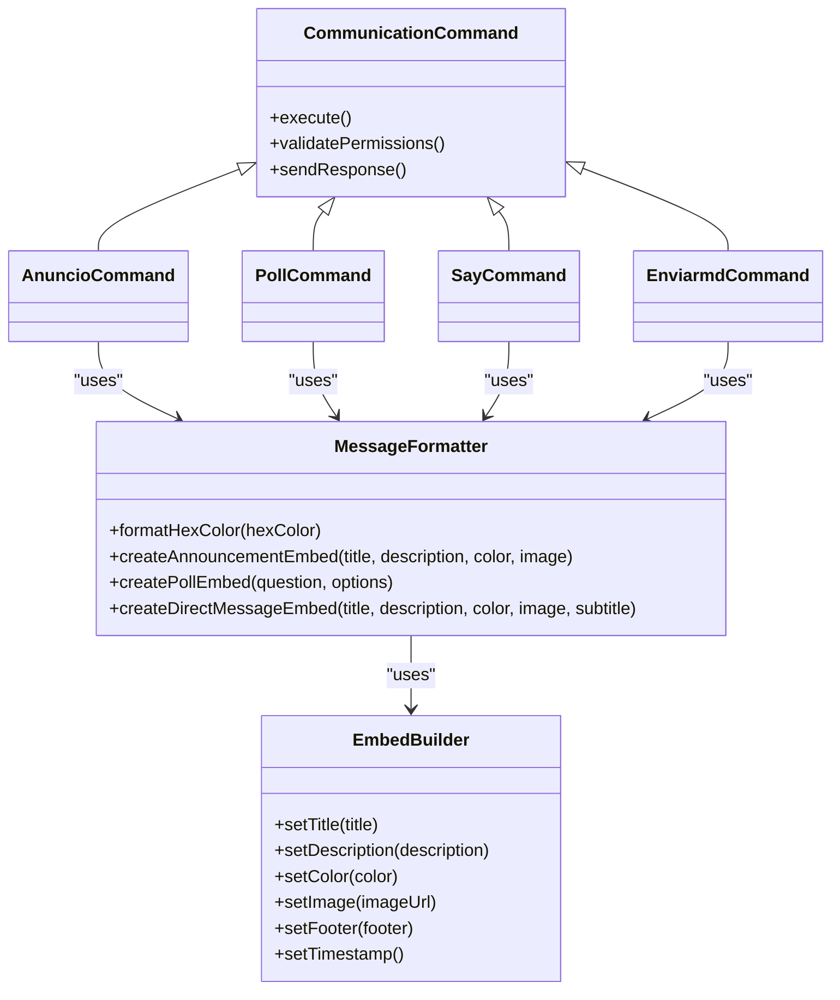

# Communication Commands

<cite>
**Referenced Files in This Document**   
- [index.js](file://index.js#L3082-L3190)
- [index.js](file://index.js#L3943-L3979)
- [index.js](file://index.js#L3981-L4024)
- [index.js](file://index.js#L4026-L4045)
- [LISTA-COMANDOS.md](file://LISTA-COMANDOS.md#L84-L91)
- [README.md](file://README.md#L32-L36)
- [ESQUEMA_BOT.md](file://ESQUEMA_BOT.md#L31-L42)
</cite>

## Table of Contents
1. [Introduction](#introduction)
2. [Command Overview](#command-overview)
3. [/anuncio Command](#anuncio-command)
4. [/poll Command](#poll-command)
5. [/say Command](#say-command)
6. [/enviarmd Command](#enviarmd-command)
7. [Message Formatting System](#message-formatting-system)
8. [Relationships with Other Components](#relationships-with-other-components)
9. [Common Issues and Solutions](#common-issues-and-solutions)
10. [Conclusion](#conclusion)

## Introduction
The Communication command category provides essential tools for server administrators and staff members to effectively communicate with users through various messaging formats. These commands enable the creation of professional announcements, interactive polls, direct messages, and channel-specific messages, enhancing community engagement and information dissemination. The system is designed to be accessible to beginners while offering sufficient technical depth for experienced developers, with a focus on message formatting, permissions management, and integration with other bot components.

## Command Overview
The Communication command category consists of four primary commands: `/anuncio`, `/poll`, `/say`, and `/enviarmd`. These commands serve different communication purposes within a Discord server, from broadcasting announcements to sending personalized direct messages. All commands require appropriate permissions (typically Manage Messages) to prevent misuse, and they leverage Discord's embed system for rich message formatting. The commands are implemented in the main index.js file and are registered through the bot's command deployment system.

**Section sources**
- [LISTA-COMANDOS.md](file://LISTA-COMANDOS.md#L84-L91)
- [README.md](file://README.md#L32-L36)

## /anuncio Command
The `/anuncio` command creates formatted announcements with customizable colors and optional images. This command allows staff members to send professional-looking announcements to specified channels. The implementation begins with permission verification to ensure only authorized users can create announcements. The command accepts parameters for title, description, target channel, color (in HEX format), and image URL. When executed, it creates an embed with the specified title and description, applies the custom color, adds the image if provided, and sends it to the designated channel. The footer automatically includes the name of the user who created the announcement.

```mermaid
flowchart TD
A[/anuncio Command] --> B{Permission Check}
B --> |Success| C[Parse Parameters]
C --> D[Create Embed]
D --> E{Color Provided?}
E --> |Yes| F[Apply Custom Color]
E --> |No| G[Use Default Color]
F --> H{Image Provided?}
G --> H
H --> |Yes| I[Add Image to Embed]
H --> |No| J[Send Embed to Channel]
I --> J
J --> K[Send Confirmation]
```

**Diagram sources **
- [index.js](file://index.js#L3943-L3979)

**Section sources**
- [index.js](file://index.js#L3943-L3979)
- [LISTA-COMANDOS.md](file://LISTA-COMANDOS.md#L88)

## /poll Command
The `/poll` command creates interactive polls with automatic reaction emojis. This command enables staff to gather community feedback through structured questions with multiple options. The implementation starts with permission verification, followed by parsing the question and options. The options are split by commas and validated to ensure there are between 2 and 10 options. The system then creates an embed with the question as the title and formats the options with corresponding numbered emojis (1️⃣, 2️⃣, etc.). After sending the embed to the current channel, the bot automatically adds reaction emojis to the message, allowing users to vote by clicking on the appropriate emoji. This creates an interactive polling system without requiring additional commands.

```mermaid
flowchart TD
A[/poll Command] --> B{Permission Check}
B --> |Success| C[Parse Question and Options]
C --> D{Valid Options?}
D --> |2-10 Options| E[Create Poll Embed]
D --> |Invalid| F[Send Error Message]
E --> G[Format Options with Emojis]
G --> H[Send Embed to Channel]
H --> I[Add Reaction Emojis]
I --> J[Send Success Confirmation]
```

**Diagram sources **
- [index.js](file://index.js#L3981-L4024)

**Section sources**
- [index.js](file://index.js#L3981-L4024)
- [LISTA-COMANDOS.md](file://LISTA-COMANDOS.md#L89)

## /say Command
The `/say` command relays messages through the bot in specified channels. This command allows staff members to have the bot send plain text messages, making it appear as if the bot itself is communicating. The implementation begins with permission verification, ensuring only authorized users can use the bot to send messages. The command accepts a message text parameter and an optional channel parameter. If no channel is specified, the message is sent to the current channel. The system then sends the message to the designated channel and provides confirmation to the user who executed the command. This command is useful for making announcements that appear to come directly from the bot, adding emphasis to important messages.

```mermaid
flowchart TD
A[/say Command] --> B{Permission Check}
B --> |Success| C[Get Message Text]
C --> D{Channel Specified?}
D --> |Yes| E[Send to Specified Channel]
D --> |No| F[Send to Current Channel]
E --> G[Send Confirmation]
F --> G
```

**Diagram sources **
- [index.js](file://index.js#L4026-L4045)

**Section sources**
- [index.js](file://index.js#L4026-L4045)
- [LISTA-COMANDOS.md](file://LISTA-COMANDOS.md#L90)

## /enviarmd Command
The `/enviarmd` command sends personalized direct messages to users with custom embed formatting. This command is particularly useful for sending private notifications, such as ticket closure confirmations or moderation warnings. The implementation starts with immediate response deferral to prevent timeout, followed by permission verification. The command accepts parameters for the target user, title, description, and optional elements like subtitle, color, image URL, and footer text. When executed, it creates a customized embed with the specified elements and sends it directly to the user's DMs. This command is referenced in the documentation as a key tool for staff communication, especially in the context of ticket management and user notifications.

```mermaid
flowchart TD
A[/enviarmd Command] --> B[Defer Reply]
B --> C{Permission Check}
C --> |Success| D[Parse Parameters]
D --> E[Create Custom Embed]
E --> F{Color Provided?}
F --> |Yes| G[Apply Custom Color]
F --> |No| H[Use Default Color]
G --> I{Image Provided?}
H --> I
I --> |Yes| J[Add Image to Embed]
I --> |No| K{Subtitle Provided?}
J --> K
K --> |Yes| L[Add Subtitle Field]
K --> |No| M[Send Embed to User DMs]
L --> M
M --> N[Send Confirmation]
```

**Diagram sources **
- [index.js](file://index.js#L3082-L3190)

**Section sources**
- [index.js](file://index.js#L3082-L3190)
- [ESQUEMA_BOT.md](file://ESQUEMA_BOT.md#L31-L42)

## Message Formatting System
The message formatting system is a core component that enables rich, visually appealing messages across multiple communication commands. This system leverages Discord's EmbedBuilder class to create structured messages with titles, descriptions, colors, images, and footers. The formatting system is shared across `/anuncio`, `/poll`, `/say`, and `/enviarmd` commands, ensuring consistency in message appearance. Color formatting uses HEX codes converted to integer values for Discord's color system, allowing for precise color matching. Image integration is handled through URL references, enabling the inclusion of visual elements in announcements and direct messages. The system also incorporates automatic footer information, such as the name of the user who created the message, adding accountability and context to communications.



**Diagram sources **
- [index.js](file://index.js#L3082-L3190)
- [index.js](file://index.js#L3943-L3979)
- [index.js](file://index.js#L3981-L4024)
- [index.js](file://index.js#L4026-L4045)

**Section sources**
- [index.js](file://index.js#L3082-L3190)
- [index.js](file://index.js#L3943-L3979)
- [index.js](file://index.js#L3981-L4024)
- [index.js](file://index.js#L4026-L4045)

## Relationships with Other Components
The Communication commands are integrated with several other components of the bot system, creating a cohesive ecosystem for server management. The `/enviarmd` command is closely related to the direct messaging system and is frequently used in conjunction with the ticket management system to notify users when their tickets are closed. The `/anuncio` and `/poll` commands interact with the information systems by potentially referencing data from user, channel, or server information commands. All communication commands respect the permission system, checking user roles and permissions before execution. The message formatting system is shared across commands, ensuring consistent appearance and functionality. Additionally, these commands may trigger logging mechanisms, with their usage recorded in the server's audit logs for accountability and moderation purposes.

```mermaid
graph TD
A[/anuncio] --> B[Message Formatting System]
C[/poll] --> B
D[/say] --> B
E[/enviarmd] --> B
E --> F[Direct Messaging System]
E --> G[Ticket Management System]
A --> H[Information Systems]
C --> H
D --> H
A --> I[Permission System]
C --> I
D --> I
E --> I
A --> J[Logging System]
C --> J
D --> J
E --> J
B --> K[Discord API]
F --> K
G --> K
H --> K
I --> K
J --> K
```

**Diagram sources **
- [index.js](file://index.js#L3082-L3190)
- [index.js](file://index.js#L3943-L3979)
- [index.js](file://index.js#L3981-L4024)
- [index.js](file://index.js#L4026-L4045)
- [ESQUEMA_BOT.md](file://ESQUEMA_BOT.md#L144-L149)

**Section sources**
- [index.js](file://index.js#L3082-L3190)
- [index.js](file://index.js#L3943-L3979)
- [index.js](file://index.js#L3981-L4024)
- [index.js](file://index.js#L4026-L4045)
- [ESQUEMA_BOT.md](file://ESQUEMA_BOT.md#L144-L149)

## Common Issues and Solutions
Several common issues may arise when using the Communication commands, primarily related to permissions and message delivery. The most frequent issue is insufficient permissions, where users receive an error message indicating they lack the required Manage Messages permission. This is resolved by ensuring users have the appropriate roles or by adjusting role hierarchies. Another common issue is failed message delivery, particularly with `/enviarmd`, when users have direct messages disabled or are not in the same server as the bot. This can be mitigated by checking user status before sending messages or using alternative communication methods. Image loading failures can occur if the image URL is invalid or the server hosting the image blocks Discord's embed scraper. Using reliable image hosting services and verifying URLs before use can prevent this issue. Finally, command timeout errors can occur with `/enviarmd` if the bot doesn't respond quickly enough, which is addressed by using deferred replies to acknowledge command receipt immediately.

**Section sources**
- [index.js](file://index.js#L3082-L3190)
- [index.js](file://index.js#L3943-L3979)
- [index.js](file://index.js#L3981-L4024)
- [index.js](file://index.js#L4026-L4045)
- [ESQUEMA_BOT.md](file://ESQUEMA_BOT.md#L266)

## Conclusion
The Communication command category provides a comprehensive set of tools for effective server communication, from public announcements to private direct messages. These commands leverage Discord's embed system to create visually appealing and informative messages, enhancing user engagement and information clarity. The implementation demonstrates thoughtful design with proper permission checks, error handling, and integration with other bot components. By understanding the relationships between these commands and the message formatting system, administrators can effectively utilize these tools to maintain clear communication within their communities. The documentation provides both beginner-friendly explanations and technical details for developers, ensuring accessibility while maintaining depth of information.