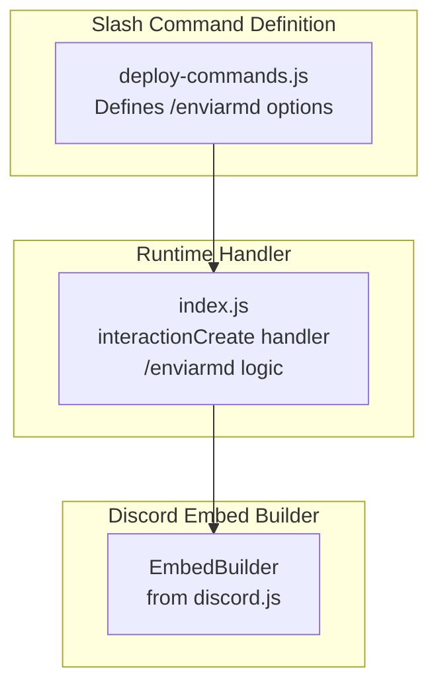
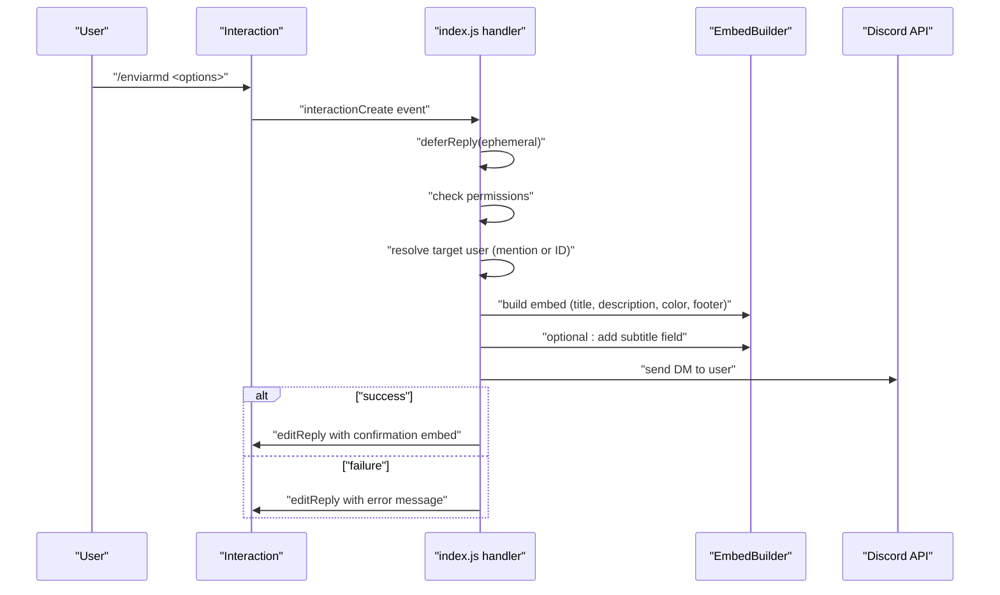
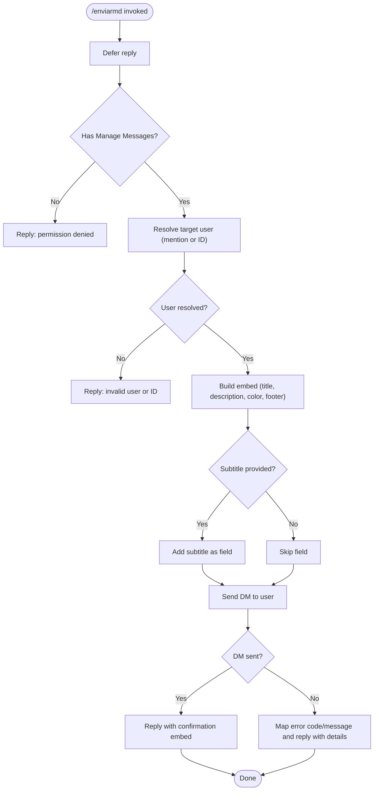
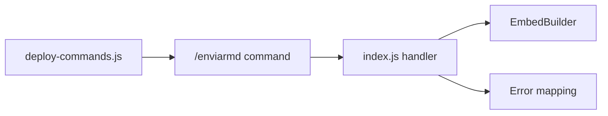

# Direct Messages Commands

<cite>
**Referenced Files in This Document**
- [index.js](file://index.js)
- [deploy-commands.js](file://deploy-commands.js)
- [README.md](file://README.md)
- [LISTA-COMANDOS.md](file://LISTA-COMANDOS.md)
</cite>

## Table of Contents
1. [Introduction](#introduction)
2. [Project Structure](#project-structure)
3. [Core Components](#core-components)
4. [Architecture Overview](#architecture-overview)
5. [Detailed Component Analysis](#detailed-component-analysis)
6. [Dependency Analysis](#dependency-analysis)
7. [Performance Considerations](#performance-considerations)
8. [Troubleshooting Guide](#troubleshooting-guide)
9. [Conclusion](#conclusion)

## Introduction
This document focuses on the Direct Messages command category, specifically the /enviarmd command. It explains how the command constructs and sends personalized embeds to users, the invocation flow, and how it integrates with Discord’s embed system. It also covers parameter handling (subtitle, color, image, footer), error scenarios (invalid color formats, blocked DMs), and relationships with other components such as communication tools and moderation notifications.

## Project Structure
The Direct Messages command is implemented as a slash command registered in the deployment script and handled in the main application file. The README and command list provide high-level usage and parameter descriptions.

**Diagram sources**
- [deploy-commands.js](file://deploy-commands.js#L156-L169)
- [index.js](file://index.js#L3078-L3203)

**Section sources**
- [README.md](file://README.md#L32-L37)
- [LISTA-COMANDOS.md](file://LISTA-COMANDOS.md#L65-L81)
- [deploy-commands.js](file://deploy-commands.js#L156-L169)
- [index.js](file://index.js#L3078-L3203)

## Core Components
- Slash command definition: /enviarmd with parameters for title, description, recipient (mention or ID), subtitle, color, image, and footer.
- Runtime handler: Validates permissions, resolves the target user, builds an embed, and attempts to send a direct message.
- Embed builder integration: Uses EmbedBuilder to construct the message and set fields, color, footer, and timestamp.
- Error handling: Provides actionable feedback for common DM delivery failures.

Key implementation references:
- Command registration and options: [deploy-commands.js](file://deploy-commands.js#L156-L169)
- Interaction handler and logic: [index.js](file://index.js#L3078-L3203)
- Embed building and sending: [index.js](file://index.js#L3135-L3151)
- Confirmation embed: [index.js](file://index.js#L3154-L3165)
- Error handling and DM failure reasons: [index.js](file://index.js#L3167-L3188)

**Section sources**
- [deploy-commands.js](file://deploy-commands.js#L156-L169)
- [index.js](file://index.js#L3078-L3203)

## Architecture Overview
The /enviarmd command follows a predictable flow:
- The command is invoked by a user with required and optional parameters.
- The handler immediately defers the reply to prevent timeouts.
- Permissions are checked (requires Manage Messages).
- The target user is resolved either by mention or by ID lookup.
- An embed is built with title, description, color, footer, and optional subtitle field.
- The embed is sent to the user’s DMs.
- On success, a confirmation embed is shown to the command issuer; on failure, a detailed error message is returned.

**Diagram sources**
- [index.js](file://index.js#L3078-L3203)

## Detailed Component Analysis

### /enviarmd Command Implementation
- Invocation: Triggered via slash command /enviarmd.
- Immediate response: Defers reply to avoid “app did not respond” errors.
- Permission check: Requires Manage Messages.
- Target resolution:
  - Accepts a user mention or a user ID string.
  - If ID is provided, fetches the user object.
  - If neither is provided, returns an error.
- Embed construction:
  - Title and description are required.
  - Optional subtitle is added as a field.
  - Color defaults to a safe hex value and accepts a valid hex string.
  - Footer includes the guild name; timestamp is set.
- Delivery and confirmation:
  - Attempts to send the embed to the user’s DMs.
  - On success, replies with a confirmation embed containing recipient, title, and truncated description.
  - On failure, returns a detailed error message based on error code or message content.

Concrete code references:
- Command registration and options: [deploy-commands.js](file://deploy-commands.js#L156-L169)
- Handler entry and permission check: [index.js](file://index.js#L3078-L3101)
- User resolution and validation: [index.js](file://index.js#L3102-L3121)
- Parameter extraction and default color: [index.js](file://index.js#L3123-L3127)
- Color validation and conversion: [index.js](file://index.js#L3128-L3133)
- Embed creation and optional subtitle: [index.js](file://index.js#L3135-L3145)
- DM send and confirmation embed: [index.js](file://index.js#L3147-L3165)
- Error handling and messaging: [index.js](file://index.js#L3167-L3188)

**Diagram sources**
- [index.js](file://index.js#L3078-L3203)

**Section sources**
- [deploy-commands.js](file://deploy-commands.js#L156-L169)
- [index.js](file://index.js#L3078-L3203)

### Embed Message System Integration
- The command uses EmbedBuilder to construct the embed and sets:
  - Title and description from command options.
  - Color parsed from a hex string or default fallback.
  - Footer indicating origin guild.
  - Timestamp for traceability.
- Optional subtitle is added as a field.
- The embed is sent via the user’s DM channel using the Discord API.

References:
- Embed creation and fields: [index.js](file://index.js#L3135-L3145)
- Footer and timestamp: [index.js](file://index.js#L3135-L3140)
- DM send: [index.js](file://index.js#L3147-L3151)

**Section sources**
- [index.js](file://index.js#L3135-L3151)

### Relationship with Communication Tools and Moderation Notifications
- Communication tools:
  - The /enviarmd command complements other communication commands (e.g., /anuncio) by allowing targeted DM notifications with rich embeds.
  - Both share the same EmbedBuilder patterns for color, footer, and timestamp.
- Moderation notifications:
  - The bot demonstrates DM usage in moderation contexts (e.g., voice support sanctions), showing consistent embed patterns and error handling for DM delivery failures.
  - These examples illustrate how embeds are constructed and delivered to users, mirroring the /enviarmd approach.

References:
- Communication command example (/anuncio): [index.js](file://index.js#L3944-L3979)
- Moderation DM example (sanction): [index.js](file://index.js#L561-L612)

**Section sources**
- [index.js](file://index.js#L3944-L3979)
- [index.js](file://index.js#L561-L612)

### Parameter Details and Behavior
- title (required): Sets the embed title.
- description (required): Sets the embed description.
- usuario (optional): Target user by mention.
- id (optional): Target user by ID string.
- subtitulo (optional): Adds a field with additional information.
- color (optional): Hex color string; defaults to a safe value if invalid or omitted.
- imagen (optional): Image URL to attach to the embed.
- footer (optional): Footer text; the implementation sets a default footer indicating origin guild.

Notes:
- The command does not explicitly parse the footer option; the footer is set programmatically to indicate origin guild.
- The imagen option is supported in other commands (e.g., /anuncio) and can be adapted similarly if needed.

References:
- Options definition: [deploy-commands.js](file://deploy-commands.js#L156-L169)
- Default footer and timestamp: [index.js](file://index.js#L3135-L3140)
- Image handling in /anuncio: [index.js](file://index.js#L3969-L3971)

**Section sources**
- [deploy-commands.js](file://deploy-commands.js#L156-L169)
- [index.js](file://index.js#L3135-L3140)
- [index.js](file://index.js#L3969-L3971)

## Dependency Analysis
- Command definition depends on the deployment script to register options.
- Runtime handler depends on discord.js EmbedBuilder and interaction APIs.
- Error handling relies on Discord error codes and message content to provide actionable feedback.

**Diagram sources**
- [deploy-commands.js](file://deploy-commands.js#L156-L169)
- [index.js](file://index.js#L3078-L3203)

**Section sources**
- [deploy-commands.js](file://deploy-commands.js#L156-L169)
- [index.js](file://index.js#L3078-L3203)

## Performance Considerations
- Immediate reply: The handler defers the reply to avoid timeouts during user resolution and DM send operations.
- Minimal external calls: User resolution uses cached or fetched user objects; embed building is local.
- Error early exits: Validation checks (permissions, user presence) reduce unnecessary work.

[No sources needed since this section provides general guidance]

## Troubleshooting Guide
Common issues and resolutions:
- Invalid color format:
  - The command validates hex color strings and falls back to a default if invalid. Ensure the color is a six-digit hex prefixed with #.
  - Reference: [index.js](file://index.js#L3128-L3133)
- Cannot send messages to this user:
  - Causes include blocked DMs, privacy settings, or the bot not sharing a server with the user.
  - The handler maps error codes and messages to actionable guidance.
  - Reference: [index.js](file://index.js#L3167-L3188)
- Missing permissions:
  - The command requires Manage Messages. If missing, the handler replies with a permission denial.
  - Reference: [index.js](file://index.js#L3092-L3096)
- Invalid user or ID:
  - If neither mention nor a valid ID is provided, the handler returns an error.
  - Reference: [index.js](file://index.js#L3102-L3121)

**Section sources**
- [index.js](file://index.js#L3128-L3133)
- [index.js](file://index.js#L3167-L3188)
- [index.js](file://index.js#L3092-L3096)
- [index.js](file://index.js#L3102-L3121)

## Conclusion
The /enviarmd command provides a robust, user-friendly way to send personalized embeds via DMs. It integrates cleanly with Discord’s embed system, validates inputs, and offers clear feedback for common failure modes. Its design mirrors patterns used elsewhere in the bot (e.g., /anuncio and moderation DMs), ensuring consistency and maintainability.