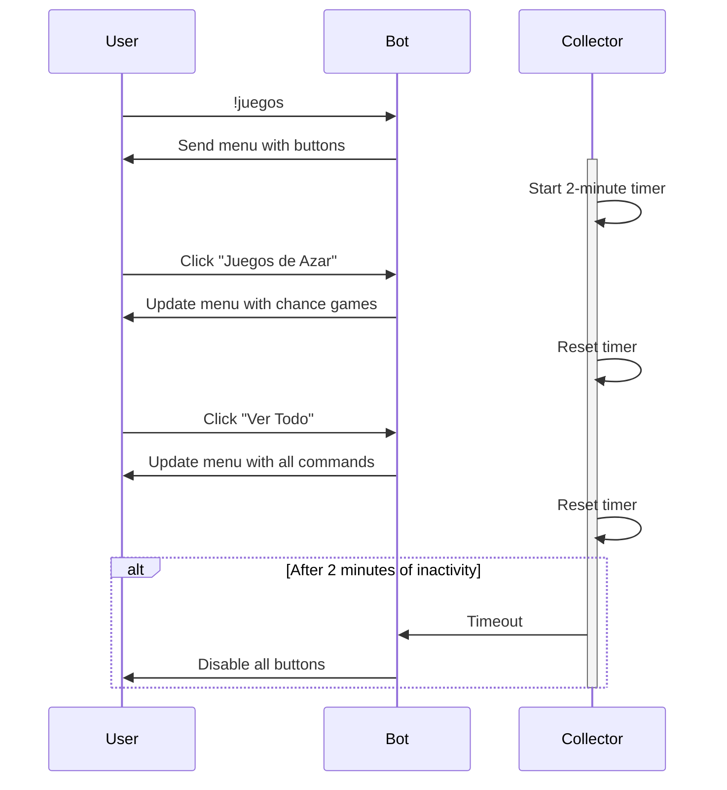
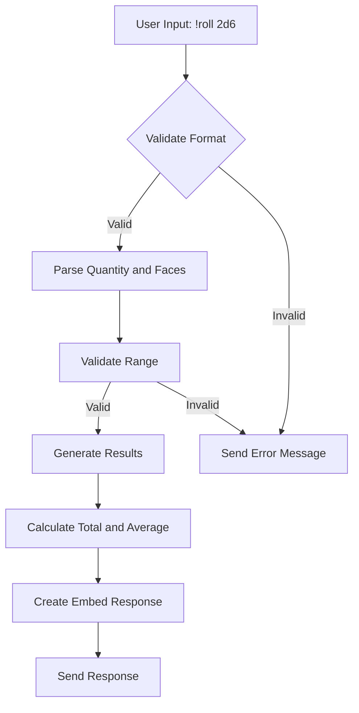
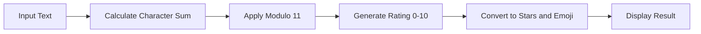

# Fun Commands

<cite>
**Referenced Files in This Document**   
- [index.js](file://index.js)
- [COMANDOS-JUEGOS.md](file://COMANDOS-JUEGOS.md)
- [NUEVOS-COMANDOS-JUEGOS.md](file://NUEVOS-COMANDOS-JUEGOS.md)
- [LISTA-COMANDOS.md](file://LISTA-COMANDOS.md)
</cite>

## Table of Contents
1. [Introduction](#introduction)
2. [Command Categories](#command-categories)
3. [Interactive Menu System](#interactive-menu-system)
4. [Games of Chance](#games-of-chance)
5. [Interactive Games](#interactive-games)
6. [Fun Commands](#fun-commands)
7. [Consistent Results System](#consistent-results-system)
8. [Common Issues and Solutions](#common-issues-and-solutions)
9. [Technical Implementation](#technical-implementation)

## Introduction

The Fun command category provides a comprehensive suite of entertainment features for Discord users, combining both text-based commands (using `!`) and interactive slash commands (using `/`). This system was designed to offer immediate access to simple games while providing more complex interactive experiences for advanced features. The commands are accessible to all users and are integrated with Discord's UI components like buttons and embeds to create engaging experiences. The implementation follows a clear pattern of using text commands for quick, simple interactions and slash commands for more complex, interactive experiences that require user input validation and timed responses.

**Section sources**
- [COMANDOS-JUEGOS.md](file://COMANDOS-JUEGOS.md#L1-L242)
- [NUEVOS-COMANDOS-JUEGOS.md](file://NUEVOS-COMANDOS-JUEGOS.md#L1-L255)

## Command Categories

The Fun commands are organized into three main categories based on their functionality and user interaction patterns:

### Games of Chance
Commands that rely on randomness and probability, including `!8ball`, `!coinflip`, `!dado`, and `!roll`. These commands provide immediate results based on random number generation and are designed for quick, one-off interactions.

### Interactive Games
Commands that require user participation and decision-making, including `!rps`, `/trivia`, and `/ship`. These commands often use Discord's interactive components like buttons and have more complex response patterns.

### Fun Commands
Commands designed purely for entertainment and humor, including `!meme` and `/meme`. These commands provide content that is meant to be shared and enjoyed socially within the server community.

```mermaid
graph TD
A[Fun Commands] --> B[Games of Chance]
A --> C[Interactive Games]
A --> D[Fun Commands]
B --> B1[!8ball]
B --> B2[!coinflip]
B --> B3[!dado]
B --> B4[!roll]
C --> C1[!rps]
C --> C2[/trivia]
C --> C3[/ship]
D --> D1[!meme]
D --> D2[/meme]
```

**Diagram sources**
- [COMANDOS-JUEGOS.md](file://COMANDOS-JUEGOS.md#L11-L165)
- [NUEVOS-COMANDOS-JUEGOS.md](file://NUEVOS-COMANDOS-JUEGOS.md#L1-L255)

**Section sources**
- [COMANDOS-JUEGOS.md](file://COMANDOS-JUEGOS.md#L11-L165)
- [NUEVOS-COMANDOS-JUEGOS.md](file://NUEVOS-COMANDOS-JUEGOS.md#L1-L255)

## Interactive Menu System

The `!juegos` command serves as the central navigation hub for all fun commands, providing an interactive menu with buttons that allow users to explore different categories without typing additional commands. This menu system enhances user experience by providing a visual interface for discovering and accessing all available games.

The menu features five interactive buttons:
- 🎲 Juegos de Azar (Games of Chance)
- 🎯 Interactivos (Interactive Games)
- 😂 Diversión (Fun)
- 📚 Ver Todo (View All)
- 🔙 Volver al Menú (Return to Menu)

The system implements several important features to ensure optimal performance and user experience:
- **Cooldown System**: A 30-second cooldown prevents spam and ensures fair usage
- **Personalized Interaction**: Only the user who invoked the command can interact with the buttons
- **Time Limit**: The interactive menu remains active for 2 minutes before buttons are automatically disabled
- **Visual Feedback**: Each category has a distinct color scheme for easy identification

When a user clicks a button, the menu dynamically updates to display the relevant commands and descriptions for that category. If no interaction occurs within 2 minutes, the collector times out and disables all buttons to prevent stale interactions.



**Diagram sources**
- [index.js](file://index.js#L1170-L1329)
- [NUEVOS-COMANDOS-JUEGOS.md](file://NUEVOS-COMANDOS-JUEGOS.md#L11-L33)

**Section sources**
- [index.js](file://index.js#L1170-L1329)
- [NUEVOS-COMANDOS-JUEGOS.md](file://NUEVOS-COMANDOS-JUEGOS.md#L11-L33)

## Games of Chance

### !8ball Command

The `!8ball` command implements a magic 8-ball fortune-telling experience where users can ask yes/no questions and receive mystical responses. The command processes user input by extracting the question text after the `!8ball` prefix and validates that a question was actually provided.

The response system uses an array of 20 predefined answers categorized into positive, negative, and uncertain responses. A random answer is selected using JavaScript's `Math.random()` function. The response is presented in an embed with the original question and the mystical answer, providing a clear and visually appealing format.

**Section sources**
- [index.js](file://index.js#L1335-L1379)
- [COMANDOS-JUEGOS.md](file://COMANDOS-JUEGOS.md#L13-L23)

### !coinflip Command

The `!coinflip` command simulates a coin toss with two possible outcomes: CARA (heads) or CRUZ (tails). The implementation uses a simple 50/50 probability model where `Math.random() < 0.5` determines the result. The command provides immediate feedback with an appropriate emoji (🪙 for heads, 🔵 for tails) and displays the result in a golden-colored embed to represent the coin's value.

This command is one of the simplest in the system, requiring no parameters and providing instant results, making it ideal for quick decisions or games of chance among users.

**Section sources**
- [index.js](file://index.js#L1381-L1393)
- [COMANDOS-JUEGOS.md](file://COMANDOS-JUEGOS.md#L27-L35)

### !dado Command

The `!dado` command allows users to roll a die with a specified number of faces. By default, it rolls a 6-sided die, but users can specify any number of faces between 2 and 100. The command parses the user input to extract the number of faces, validates that it falls within the acceptable range, and generates a random result using `Math.floor(Math.random() * caras) + 1`.

The result is displayed in an embed showing both the numeric result and the number of faces on the die, providing clear context for the roll. This command is particularly useful for board games or any situation requiring a random number within a specific range.

**Section sources**
- [index.js](file://index.js#L1396-L1418)
- [COMANDOS-JUEGOS.md](file://COMANDOS-JUEGOS.md#L39-L47)

### !roll Command

The `!roll` command implements a dice rolling system inspired by tabletop role-playing games like Dungeons & Dragons. It supports the standard notation `[quantity]d[faces]` (e.g., 2d6 for two six-sided dice). The command uses a regular expression to parse the input format, validates both the quantity (1-20 dice) and faces (2-100 per die), and then generates individual results for each die.

The implementation calculates and displays three key pieces of information:
- Individual results for each die
- Total sum of all dice
- Average value of the roll

This comprehensive feedback makes the command valuable for gaming sessions where detailed dice statistics are needed.



**Diagram sources**
- [index.js](file://index.js#L1469-L1513)
- [COMANDOS-JUEGOS.md](file://COMANDOS-JUEGOS.md#L51-L68)

**Section sources**
- [index.js](file://index.js#L1469-L1513)
- [COMANDOS-JUEGOS.md](file://COMANDOS-JUEGOS.md#L51-L68)

## Interactive Games

### !rps Command

The `!rps` command implements the classic rock-paper-scissors game, allowing users to play against the bot. Users specify their choice (piedra, papel, or tijera) as a parameter, and the bot randomly selects its move. The command validates the user's input to ensure it's one of the three valid options before proceeding.

The game logic follows the standard rules:
- Rock beats scissors
- Scissors beat paper
- Paper beats rock

The result is determined by comparing the user's choice with the bot's random selection, and the outcome is displayed in an embed that shows both choices with appropriate emojis (🪨, 📄, ✂️) and indicates whether the user won, lost, or tied. The embed color reflects the result (green for win, red for loss, gold for tie).

**Section sources**
- [index.js](file://index.js#L1420-L1467)
- [COMANDOS-JUEGOS.md](file://COMANDOS-JUEGOS.md#L73-L87)

### /trivia Command

The `/trivia` command provides an interactive trivia experience with multiple-choice questions across eight categories: Geography, History, Science, Video Games, Cinema & TV, Music, Sports, and Random. When invoked, the command presents a random question from the selected category with four possible answers displayed as interactive buttons.

Key features of the trivia system include:
- **Timed Responses**: Users have 30 seconds to answer before the question times out
- **Personalized Interaction**: Only the user who started the trivia can respond
- **Immediate Feedback**: The system reveals whether the answer was correct and shows the correct answer
- **Category Selection**: Users can choose a specific category or get random questions from all categories

The implementation uses a MessageComponentCollector to handle button interactions, with event listeners for both successful responses and timeouts. When a user clicks a button, the system validates that it was the original user, checks if they've already responded, and then evaluates the answer. If the collector times out, a timeout message is displayed showing the correct answer.

```mermaid
sequenceDiagram
participant User
participant Bot
participant Collector
User->>Bot : /trivia categoria : videojuegos
Bot->>User : Send question with 4 buttons
activate Collector
Collector->>Collector : Start 30-second timer
User->>Bot : Click answer button
Bot->>Bot : Validate user and response
Bot->>User : Show result (correct/incorrect)
Collector->>Collector : Stop collection
deactivate Collector
alt No response within 30 seconds
Collector->>Bot : Timeout
Bot->>User : Show timeout message with correct answer
deactivate Collector
end
```

**Diagram sources**
- [index.js](file://index.js#L4319-L4465)
- [NUEVOS-COMANDOS-JUEGOS.md](file://NUEVOS-COMANDOS-JUEGOS.md#L98-L123)

**Section sources**
- [index.js](file://index.js#L4319-L4465)
- [NUEVOS-COMANDOS-JUEGOS.md](file://NUEVOS-COMANDOS-JUEGOS.md#L98-L123)

### /ship Command

The `/ship` command calculates compatibility percentages between two users, creating a fun "relationship" metric for social interaction. Unlike other random commands, this command generates consistent results for the same pair of users, ensuring that repeated calculations yield the same percentage.

The consistency is achieved through a deterministic algorithm that uses the Discord user IDs as a seed for the random calculation. The implementation extracts the last 8 characters of each user ID, converts them from hexadecimal to integers, sums these values, and uses the modulo operator to generate a percentage between 0 and 100.

The result is presented with several visual elements:
- A percentage score (0-100%)
- A visual progress bar using block characters (█░)
- An emoji representing the relationship quality (💔, 💛, 💖, 💕)
- A descriptive message based on the score range

This combination of consistent results and rich visual feedback makes the command particularly engaging for users who enjoy testing compatibility with friends.

**Section sources**
- [index.js](file://index.js#L4219-L4270)
- [NUEVOS-COMANDOS-JUEGOS.md](file://NUEVOS-COMANDOS-JUEGOS.md#L60-L77)

## Fun Commands

### !meme Command

The `!meme` command retrieves random memes from the Reddit community r/MemesESP and displays them in the Discord channel. To prevent spam and ensure appropriate usage, the command is restricted to channels with "meme" or "memes" in their name.

The implementation includes a sophisticated system to avoid repeating memes within the same server:
- A `memesEnviados` Set tracks URLs that have already been displayed
- When all available memes have been shown, the set is cleared to start over
- The system filters results to include only posts with images (jpg, jpeg, png, gif)

The command uses the Reddit API to fetch a list of recent posts, filters for image content, selects a random unshown meme, and displays it in an embed with upvote count and author information. This creates a fresh and engaging experience while preventing the repetition of content.

**Section sources**
- [index.js](file://index.js#L1515-L1559)
- [COMANDOS-JUEGOS.md](file://COMANDOS-JUEGOS.md#L111-L119)

## Consistent Results System

Several fun commands implement systems to generate consistent results for the same inputs, creating a more predictable and engaging user experience. This is particularly important for social commands like `/ship` and `/rate` where users expect the same result when checking compatibility or ratings multiple times.

### /ship Consistency

The `/ship` command achieves consistency by using a deterministic algorithm based on user IDs:
1. Extract the last 8 characters of each user's Discord ID
2. Convert these hexadecimal strings to integers
3. Sum the two integer values
4. Use modulo 101 to generate a percentage (0-100)

This approach ensures that the same pair of users will always generate the same compatibility percentage, which is essential for the social dynamics of the command. Users can reference previous results and discuss them with confidence that the values won't change.

### /rate Consistency

The `/rate` command implements a similar consistency mechanism for text-based ratings:
1. Initialize a seed value to 0
2. Iterate through each character in the input text
3. Add the character's ASCII code to the seed
4. Use modulo 11 to generate a rating (0-10)

This character-based hashing ensures that the same input (e.g., "Mi servidor") will always receive the same rating, creating a stable reference point for users. The rating is then converted to a star-based display (⭐☆) and paired with an appropriate emoji and descriptive text based on the score range.



**Diagram sources**
- [index.js](file://index.js#L4272-L4317)
- [NUEVOS-COMANDOS-JUEGOS.md](file://NUEVOS-COMANDOS-JUEGOS.md#L80-L95)

**Section sources**
- [index.js](file://index.js#L4272-L4317)
- [NUEVOS-COMANDOS-JUEGOS.md](file://NUEVOS-COMANDOS-JUEGOS.md#L80-L95)

## Common Issues and Solutions

### Button Interaction Timeouts

One of the most common issues with interactive commands is button timeout, particularly in the `/trivia` command where users have only 30 seconds to respond. When a user fails to respond within this timeframe, the MessageComponentCollector automatically stops, and the buttons become unresponsive.

The system handles this gracefully by:
1. Detecting when the collector ends without a response
2. Sending a follow-up message indicating the time has expired
3. Revealing the correct answer to maintain educational value
4. Disabling all buttons to prevent further interaction

This approach ensures that even when users don't respond in time, they still receive valuable information and the interaction is properly concluded.

### Meme Availability Issues

The `!meme` command can encounter situations where no new memes are available because all recent posts from r/MemesESP have already been displayed in the server. The system addresses this by implementing a reset mechanism:

1. Track all previously shown meme URLs in a server-specific Set
2. When no unshown memes are available, clear the Set
3. Notify users that the meme rotation has restarted
4. Continue serving memes from the beginning

This creates a sustainable cycle that maximizes content variety while ensuring the command remains functional even when new content is temporarily limited.

### Input Validation Errors

Several commands perform rigorous input validation to ensure proper usage:
- `!dado` and `!roll` validate the number of faces (2-100)
- `!roll` validates the number of dice (1-20)
- `/ship` prevents users from shipping themselves
- `/trivia` validates category selection

When invalid input is detected, the commands provide clear, ephemeral error messages that guide users toward correct usage without cluttering the channel with error spam.

**Section sources**
- [index.js](file://index.js#L4158-L4163)
- [index.js](file://index.js#L4474-L4479)
- [index.js](file://index.js#L4224-L4226)

## Technical Implementation

The fun commands are implemented within the main `index.js` file, leveraging Discord.js features for message handling, embed creation, and component interaction. The architecture follows a clear pattern of command detection, input validation, processing, and response generation.

Text-based commands (using `!`) are processed by checking the message content prefix, while slash commands are handled through the interaction event system. Both types use EmbedBuilder to create visually appealing responses with consistent styling, colors, and timestamps.

The interactive components rely heavily on Discord's ActionRowBuilder and ButtonBuilder classes to create button interfaces, with MessageComponentCollector instances managing user interactions and timeouts. The system maintains state through the client object's properties, such as the `memesEnviados` collection that tracks previously displayed memes across server restarts.

Error handling is implemented throughout the command system, with try-catch blocks for external API calls (like Reddit) and input validation for user-provided parameters. The code structure prioritizes user experience by providing immediate feedback, clear error messages, and intuitive command patterns.

**Section sources**
- [index.js](file://index.js#L1-L6903)
- [NUEVOS-COMANDOS-JUEGOS.md](file://NUEVOS-COMANDOS-JUEGOS.md#L168-L227)