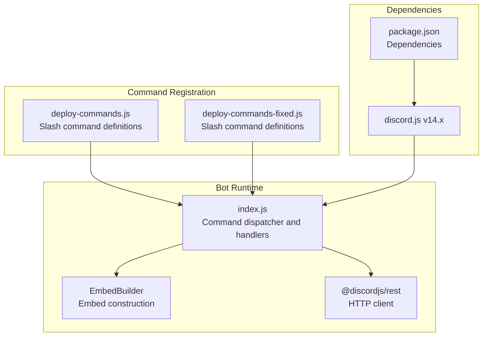
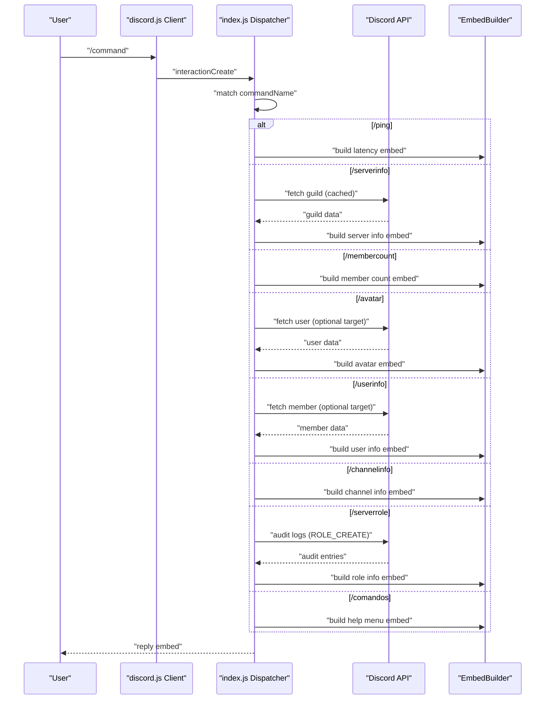
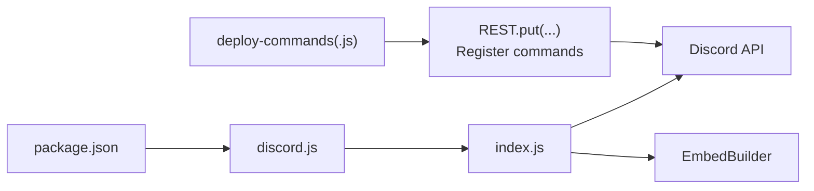

# Information Commands

<cite>
**Referenced Files in This Document**
- [index.js](file://index.js)
- [deploy-commands.js](file://deploy-commands.js)
- [deploy-commands-fixed.js](file://deploy-commands-fixed.js)
- [package.json](file://package.json)
- [LISTA-COMANDOS.md](file://LISTA-COMANDOS.md)
</cite>

## Table of Contents
1. [Introduction](#introduction)
2. [Project Structure](#project-structure)
3. [Core Components](#core-components)
4. [Architecture Overview](#architecture-overview)
5. [Detailed Component Analysis](#detailed-component-analysis)
6. [Dependency Analysis](#dependency-analysis)
7. [Performance Considerations](#performance-considerations)
8. [Troubleshooting Guide](#troubleshooting-guide)
9. [Conclusion](#conclusion)

## Introduction
This document explains the Information command category of the Discord bot, covering the commands /ping, /serverinfo, /membercount, /avatar, /userinfo, /channelinfo, /serverrole, and /comandos. It details how these commands interact with the Discord API, how latency is measured, how server statistics are collected, and how user, channel, and role details are formatted in embeds. It also outlines relationships with the UI system and moderation, and provides practical guidance for handling rate limiting and common issues.

## Project Structure
The bot is implemented in a single entry file that handles command dispatch and embed building. Command registration is performed by separate deployment scripts that define the slash command metadata. The bot uses the official Discord SDK to interact with the API and build rich embeds.

**Diagram sources**
- [index.js](file://index.js#L1-L60)
- [deploy-commands.js](file://deploy-commands.js#L232-L244)
- [deploy-commands-fixed.js](file://deploy-commands-fixed.js#L222-L234)
- [package.json](file://package.json#L10-L25)

**Section sources**
- [index.js](file://index.js#L1-L60)
- [deploy-commands.js](file://deploy-commands.js#L232-L244)
- [deploy-commands-fixed.js](file://deploy-commands-fixed.js#L222-L234)
- [package.json](file://package.json#L10-L25)

## Core Components
- Command dispatcher: Centralized handler that routes interactions to specific command logic.
- Embed builders: Construct rich embeds for each command’s response.
- Discord API integration: Uses the SDK to fetch guild, member, channel, and role data.
- UI helpers: Buttons and menus for interactive help categories.

Key implementation highlights:
- Latency measurement uses WebSocket ping and timestamp difference.
- Server statistics are derived from cached guild data.
- User, channel, and role details are fetched via API calls when needed.
- Embeds are built with consistent formatting and timestamps.

**Section sources**
- [index.js](file://index.js#L4046-L4101)
- [index.js](file://index.js#L3206-L3424)
- [index.js](file://index.js#L3426-L3625)
- [index.js](file://index.js#L3504-L3552)

## Architecture Overview
The Information commands follow a consistent flow:
- Interaction received by the dispatcher.
- Command-specific logic executes (fetches data from Discord API when needed).
- An embed is constructed and sent as the response.

**Diagram sources**
- [index.js](file://index.js#L4046-L4101)
- [index.js](file://index.js#L3206-L3424)
- [index.js](file://index.js#L3426-L3625)
- [index.js](file://index.js#L3504-L3552)

## Detailed Component Analysis

### /ping — Latency Measurement
- Measures two latency metrics:
  - WebSocket latency (client-side).
  - Round-trip time from interaction creation timestamp to response send.
- Color-codes the result based on thresholds for quick readability.
- Sends a single ephemeral reply with an embed containing both metrics.

Implementation notes:
- Uses the client’s WebSocket ping property for real-time connection health.
- Uses the interaction’s created timestamp to compute API round-trip latency.

**Section sources**
- [index.js](file://index.js#L4046-L4058)

### /serverinfo — Server Statistics
- Retrieves and displays:
  - Guild identifier, owner, creation date.
  - Member count, channel count, role count, emoji count.
  - Premium tier and boost count.
- Builds a rich embed with a thumbnail and timestamp.

Implementation notes:
- Uses cached guild data for fast retrieval.
- Formats dates using Discord’s timestamp formatting.

**Section sources**
- [index.js](file://index.js#L4060-L4086)

### /membercount — Member Counts
- Computes and displays:
  - Total members.
  - Human members (non-bots).
  - Bot members.
- Uses cached member collections for performance.

**Section sources**
- [index.js](file://index.js#L4088-L4101)

### /avatar — User Avatar
- Fetches the target user (defaults to invoker).
- Builds an embed with a large avatar image and metadata.
- Handles errors gracefully with an ephemeral message.

**Section sources**
- [index.js](file://index.js#L3206-L3232)

### /userinfo — Detailed User Information
- Validates that the command runs in a guild.
- Fetches the target member (optional user argument).
- Builds a comprehensive embed with:
  - User account details (username, ID, bot flag, creation date).
  - Server-specific details (joined date, nickname, booster status, display color).
  - Member status (communication disabled, activity level).
  - Presence and device information.
  - Roles and key permissions.
  - Discord badges.
- Uses presence and member cache data; falls back to defaults when unavailable.

**Section sources**
- [index.js](file://index.js#L3234-L3400)

### /channelinfo — Channel Details
- Resolves the target channel (optional channel argument).
- Builds an embed with:
  - Channel ID, type, creation date, NSFW flag, and topic.
- Sets the embed to ephemeral to keep the channel clean.

**Section sources**
- [index.js](file://index.js#L3402-L3424)

### /serverrole — Role Details
- Resolves the target role (optional role argument).
- Attempts to find the role creator via audit logs (ROLE_CREATE).
- Falls back to approximate age if audit logs are not available.
- Builds an embed with:
  - Role ID, name, creator, creation date, color, position, and mentionable status.

**Section sources**
- [index.js](file://index.js#L3426-L3501)

### /comandos — Help Menu
- Provides a categorized list of commands, including the Information category.
- Includes Moderation, Roles and Colors, Voice Rooms, Tickets, Logs and Configuration, and Utilities categories.

**Section sources**
- [index.js](file://index.js#L3504-L3552)
- [LISTA-COMANDOS.md](file://LISTA-COMANDOS.md#L95-L107)

## Dependency Analysis
- Command registration:
  - Slash command definitions are declared in deployment scripts and registered via the REST client.
  - The bot uses the official Discord SDK to construct commands and embeds.

- Runtime dependencies:
  - discord.js v14.x provides:
    - Client and gateway integration.
    - EmbedBuilder for rich embeds.
    - REST client for API calls.
    - Utility types and constants used across commands.

**Diagram sources**
- [deploy-commands.js](file://deploy-commands.js#L280-L293)
- [deploy-commands-fixed.js](file://deploy-commands-fixed.js#L266-L280)
- [index.js](file://index.js#L1-L60)
- [package.json](file://package.json#L10-L25)

**Section sources**
- [deploy-commands.js](file://deploy-commands.js#L232-L244)
- [deploy-commands-fixed.js](file://deploy-commands-fixed.js#L222-L234)
- [package.json](file://package.json#L10-L25)

## Performance Considerations
- Prefer cached data when possible:
  - /serverinfo and /membercount rely on cached guild/member counts for speed.
- Minimize API calls:
  - /userinfo fetches the member object only when needed.
  - /serverrole attempts to use audit logs efficiently and falls back to approximate age.
- Embed rendering is lightweight; avoid unnecessary loops or repeated fetches.

[No sources needed since this section provides general guidance]

## Troubleshooting Guide
Common issues and resolutions:
- Command not found or not responding:
  - Ensure commands are registered using the deployment scripts.
  - Verify environment variables for client and guild identifiers.
- Missing data in /userinfo or /serverrole:
  - Some presence and audit log information may be unavailable depending on permissions and cache state.
  - The code includes fallbacks (e.g., approximate role age) to prevent failures.
- Rate limiting and API errors:
  - The code includes global exception handlers to capture uncaught exceptions and rejections.
  - For bulk operations or frequent commands, consider adding retry logic with exponential backoff and respecting Discord’s rate limits.
- Ephemeral vs public replies:
  - Some commands intentionally reply ephemeral to reduce clutter (e.g., /channelinfo, /serverrole, /comandos).
- Permission-related failures:
  - Certain commands require specific permissions (e.g., moderation commands). Ensure the invoker has appropriate roles.

**Section sources**
- [index.js](file://index.js#L1-L10)
- [index.js](file://index.js#L3426-L3501)
- [index.js](file://index.js#L3504-L3552)

## Conclusion
The Information command category provides essential server, user, channel, and role insights with minimal overhead. The implementation leverages cached data for performance, constructs rich embeds for clarity, and integrates with Discord’s API where necessary. By following the deployment scripts and understanding the runtime behavior, administrators can confidently operate and extend these commands while maintaining reliability under typical usage patterns.