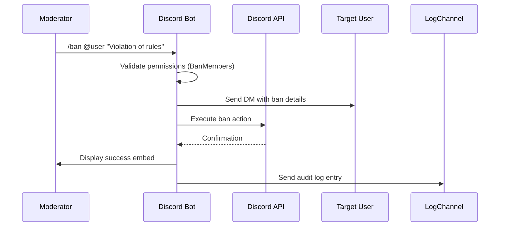
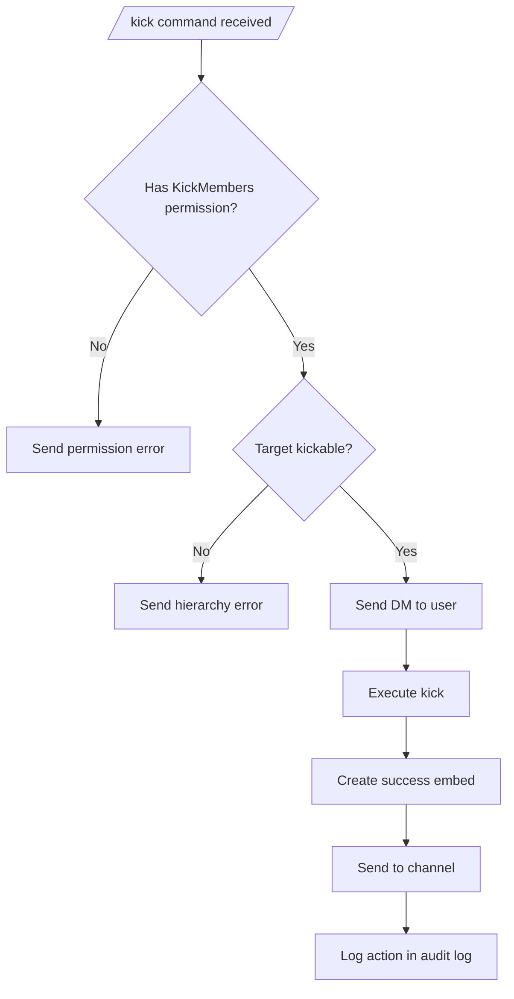
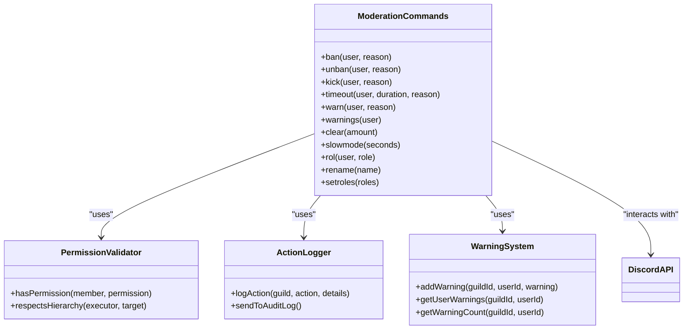
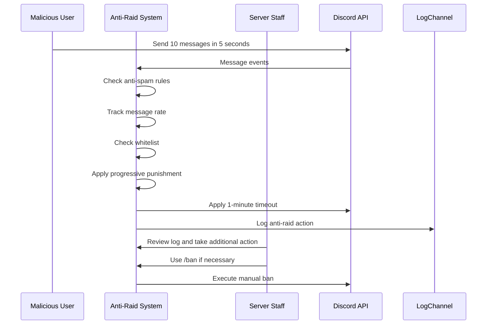

# Moderation Commands

<cite>
**Referenced Files in This Document**   
- [index.js](file://index.js)
- [deploy-commands.js](file://deploy-commands.js)
- [README.md](file://README.md)
</cite>

## Table of Contents
1. [Introduction](#introduction)
2. [Core Moderation Commands](#core-moderation-commands)
3. [Utility and Management Commands](#utility-and-management-commands)
4. [Anti-Raid System Integration](#anti-raid-system-integration)
5. [Permission Validation and Role Management](#permission-validation-and-role-management)
6. [Action Logging and Audit Trail](#action-logging-and-audit-trail)
7. [Common Issues and Solutions](#common-issues-and-solutions)
8. [Conclusion](#conclusion)

## Introduction
The moderation command category in this Discord bot provides a comprehensive suite of tools for server administrators and moderators to maintain order, enforce rules, and manage user behavior. These commands are designed with both simplicity for beginners and depth for experienced developers in mind. The system includes core moderation actions such as banning, kicking, and timeouts, as well as advanced features like warning tracking, message purging, and role management. All commands are integrated with a robust permission system, detailed logging, and an anti-raid protection mechanism that automatically detects and responds to malicious activity. This documentation provides a thorough explanation of each command's implementation, their relationships with other components, and practical examples from the actual codebase.

**Section sources**
- [README.md](file://README.md#L13-L30)

## Core Moderation Commands

The bot implements a complete set of moderation commands that allow administrators to take action against users who violate server rules. Each command follows a consistent pattern of permission validation, action execution, user notification, and logging. The commands `/ban`, `/unban`, `/kick`, `/timeout`, and `/warn` are fundamental to maintaining server security and are implemented with careful attention to error handling and user experience.

### Ban and Unban Commands
The `/ban` command permanently removes a user from the server and prevents them from rejoining. It first validates that the executor has the `BanMembers` permission before proceeding. The bot attempts to send a direct message to the user explaining the ban before executing the action. A detailed embed is then displayed to confirm the ban, including the user's tag, the moderator who performed the action, and the reason. The `/unban` command follows a similar pattern, first verifying the user is actually banned before removing the restriction. Both commands are logged in the server's audit log for transparency.

**Diagram sources**
- [index.js](file://index.js#L3612-L3655)
- [index.js](file://index.js#L3657-L3692)

### Kick and Timeout Commands
The `/kick` command removes a user from the server but allows them to rejoin, making it suitable for less severe infractions. Like the ban command, it validates permissions, notifies the user via DM, and logs the action. The `/timeout` command, also known as muting, temporarily restricts a user's ability to send messages and interact in voice channels. It accepts a duration in minutes (1-40320) and a reason. The timeout is applied using Discord's built-in moderation features, ensuring it appears in the server's audit log. Both commands include comprehensive error handling for cases where the bot lacks sufficient permissions or the target user has a higher role hierarchy.

**Diagram sources**
- [index.js](file://index.js#L3694-L3743)
- [index.js](file://index.js#L3745-L3791)

### Warning System
The `/warn` and `/warnings` commands implement a persistent warning system that tracks user infractions over time. When a moderator issues a warning with `/warn`, the system stores the warning in a Map structure organized by guild and user ID. Each warning includes the reason, the moderator who issued it, and a timestamp. The `/warnings` command allows moderators to view all warnings for a specific user, displaying them in a formatted list with dates and moderators. This system provides a historical record of user behavior, helping moderators make informed decisions about escalating actions. Users are notified of warnings via direct message, promoting transparency.

**Section sources**
- [index.js](file://index.js#L3847-L3941)
- [index.js](file://index.js#L3906-L3941)

## Utility and Management Commands

In addition to core moderation actions, the bot provides several utility commands that help maintain server order and manage content. These commands are essential for day-to-day server administration and complement the more severe moderation actions.

### Message Management
The `/clear` command allows moderators to bulk-delete messages from a channel, which is useful for removing spam or inappropriate content. It validates that the executor has the `ManageMessages` permission and ensures the requested amount is between 1 and 100 messages (Discord's limit for bulk delete). The command uses `bulkDelete()` to remove messages efficiently, then displays a confirmation embed showing how many messages were actually deleted. The `/slowmode` command controls the rate at which users can send messages in a channel by setting a cooldown period between messages. This helps prevent chat flooding and maintains a more organized conversation flow.

**Section sources**
- [index.js](file://index.js#L3793-L3823)
- [index.js](file://index.js#L3825-L3844)

### Role and Channel Management
The `/rol` command enables moderators to assign or remove specific roles from users, providing granular control over user permissions and access. It respects Discord's role hierarchy, preventing users from modifying roles higher than their own. The `/rename` command allows users to change the name of their current voice channel, which is particularly useful in temporary voice channel systems. The `/setroles` command configures which roles are permitted to use the bot's commands, adding an additional layer of access control beyond Discord's native permissions.

**Diagram sources**
- [index.js](file://index.js#L5054-L5100)
- [index.js](file://index.js#L4600-L4611)
- [index.js](file://index.js#L4792-L4824)

## Anti-Raid System Integration

The moderation commands are deeply integrated with the bot's anti-raid system, which provides automated protection against coordinated attacks and spam. This integration ensures that manual moderation actions complement automated defenses, creating a comprehensive security framework.

### Automated Threat Detection
The anti-raid system monitors several potential threats including spam, unauthorized bot additions, and channel spam (rapid creation/deletion of channels). When suspicious activity is detected, the system applies progressive punishments, starting with short timeouts and escalating to permanent bans for repeat offenders. The system uses a Map to track infractions per user, with punishments resetting after one hour of clean behavior. This automated response works in parallel with manual moderation commands, providing immediate protection while moderators assess the situation.

### Whitelist and Configuration
Server administrators can configure the anti-raid system using commands like `/antiraid` to set up protections and `/logs` to designate a logging channel. A whitelist system allows trusted users and roles to bypass automated restrictions, preventing false positives. The system respects these configurations when determining whether to take action, ensuring that legitimate server management activities aren't mistaken for raids. This integration means that manual moderation actions taken by administrators are not subject to automated restrictions, allowing them to respond to incidents without triggering the bot's defenses.

**Diagram sources**
- [index.js](file://index.js#L521-L528)
- [index.js](file://index.js#L1999-L2024)
- [index.js](file://index.js#L2095-L2202)

## Permission Validation and Role Management

The bot implements a multi-layered permission system that combines Discord's native permission model with custom role-based access control. This ensures that only authorized users can execute moderation commands while providing flexibility for server administrators to configure access.

### Hierarchical Permission Checks
Each moderation command begins with a permission validation step that checks whether the executor has the required Discord permission (e.g., `BanMembers`, `KickMembers`). The system respects Discord's role hierarchy, preventing users from moderating others with equal or higher roles. For commands like `/rol`, the bot additionally verifies that the executor's highest role is above the target user's highest role. The bot's own role position is also checked to ensure it has sufficient permissions to perform the requested action, providing clear error messages when it lacks necessary privileges.

### Custom Role Restrictions
Beyond Discord's native permissions, the bot supports custom role restrictions through the `/setroles` command. This allows server administrators to specify exactly which roles can use the bot's commands, creating a whitelist of authorized moderators. When a user attempts to use a command, the system checks if they have one of the configured roles. This feature is particularly useful for servers that want to limit bot access to specific moderation teams while keeping broader Discord permissions for other purposes. The role configuration is stored in a Map structure, with guild IDs as keys and arrays of role IDs as values.

**Section sources**
- [index.js](file://index.js#L3617-L3618)
- [index.js](file://index.js#L3699-L3700)
- [index.js](file://index.js#L3752-L3753)
- [index.js](file://index.js#L4792-L4824)

## Action Logging and Audit Trail

Every moderation action is logged to provide transparency and accountability. The logging system captures both manual actions performed by moderators and automated actions taken by the anti-raid system, creating a comprehensive audit trail of all security-related events.

### Comprehensive Event Logging
The bot listens to Discord's event system to capture important server events such as user joins, leaves, bans, unbans, and role changes. When a moderation command is executed, it creates a detailed embed containing information about the action, including the target user, the moderator, the reason, and a timestamp. This embed is sent to a designated log channel configured by the server administrator. For critical actions like bans and role changes, the bot queries Discord's audit log to identify the actual executor, ensuring accuracy even when commands are used through bots or webhooks.

### Integration with Security System
The logging system is tightly integrated with the anti-raid system, ensuring that automated actions are recorded alongside manual ones. This provides a complete picture of all moderation activities, allowing administrators to review both human and automated decisions. The log entries include contextual information such as user account age (for join events) and the number of previous infractions (for anti-raid actions), helping administrators assess potential risks. The system also logs attempts to use commands without proper permissions, providing visibility into potential security probing.

**Section sources**
- [index.js](file://index.js#L2271-L2296)
- [index.js](file://index.js#L2332-L2361)
- [index.js](file://index.js#L2364-L2391)
- [index.js](file://index.js#L2394-L2438)

## Common Issues and Solutions

While the moderation system is robust, certain issues may arise during operation. Understanding these common problems and their solutions helps ensure smooth administration.

### Permission Errors
The most common issue is permission errors, where a moderator receives a message that they lack permission to perform an action. This typically occurs when the moderator's role lacks the required Discord permission (e.g., `BanMembers`) or when the bot's role is positioned below the target user's highest role in the hierarchy. The solution is to adjust role permissions in Discord's server settings or reposition the bot's role above those it needs to manage. For the custom role restriction system, administrators should verify that the moderator has one of the roles configured with `/setroles`.

### Message Deletion Limitations
The `/clear` command may fail to delete messages older than 14 days, as this is a limitation of Discord's API. In such cases, the bot displays an error message explaining the restriction. For older messages, moderators must delete them individually or use Discord's built-in message search and deletion features. Additionally, the bot may not be able to delete messages from users with higher permissions, respecting Discord's permission model.

### Anti-Raid False Positives
In rare cases, legitimate server management activities (such as creating multiple channels) might trigger the anti-raid system. To prevent this, administrators should add trusted staff roles to the whitelist using the appropriate configuration commands. The system is designed to ignore users with administrator permissions, but custom roles may need explicit whitelisting to avoid automated restrictions during legitimate operations.

**Section sources**
- [index.js](file://index.js#L3618-L3619)
- [index.js](file://index.js#L3701-L3702)
- [index.js](file://index.js#L3753-L3754)
- [index.js](file://index.js#L3820-L3821)

## Conclusion
The moderation command system in this Discord bot provides a comprehensive and well-integrated suite of tools for server management. By combining manual moderation commands with automated anti-raid protection, detailed logging, and flexible permission controls, the system offers both immediate response capabilities and long-term user behavior tracking. The implementation prioritizes user experience with clear feedback and direct message notifications, while maintaining robust security through hierarchical permission checks and role-based access control. For developers, the codebase demonstrates effective patterns for handling Discord interactions, managing state with Collections and Maps, and integrating multiple systems into a cohesive whole. Administrators can confidently use these tools to maintain a safe and organized server environment, knowing that all actions are properly logged and that automated systems provide additional protection against coordinated attacks.