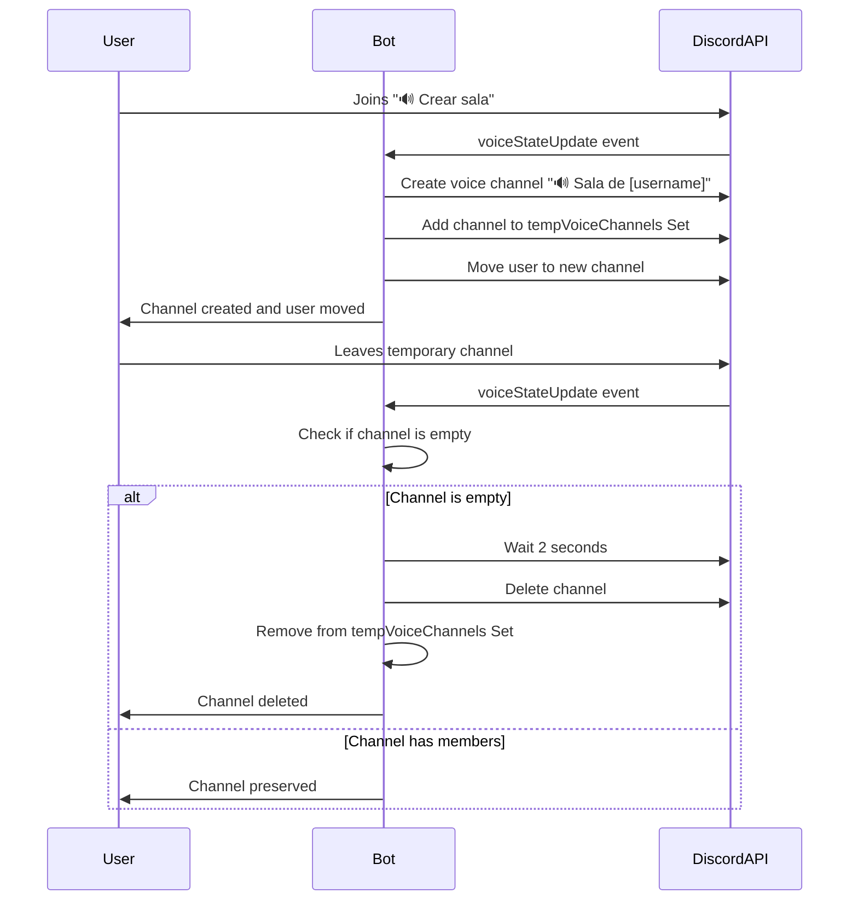
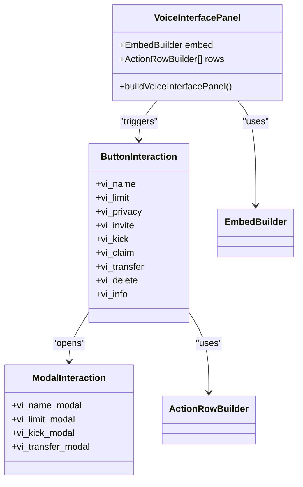

# Temporary Voice Channels Commands

<cite>
**Referenced Files in This Document**   
- [index.js](file://index.js)
- [deploy-commands.js](file://deploy-commands.js)
- [README.md](file://README.md)
- [LISTA-COMANDOS.md](file://LISTA-COMANDOS.md)
</cite>

## Table of Contents
1. [Introduction](#introduction)
2. [Command Overview](#command-overview)
3. [Implementation Details](#implementation-details)
4. [Automatic Channel Creation and Deletion](#automatic-channel-creation-and-deletion)
5. [Command Relationships and Invocation](#command-relationships-and-invocation)
6. [Voice Interface Panel](#voice-interface-panel)
7. [Common Issues and Solutions](#common-issues-and-solutions)
8. [Conclusion](#conclusion)

## Introduction

The Temporary Voice Channels command category provides a comprehensive system for managing dynamic voice channels in Discord servers. This system allows users to create temporary voice channels on demand and automatically manages their lifecycle based on user activity. The commands in this category work together to create a seamless experience for users who need private voice spaces for conversations, gaming, or collaboration.

The system is designed to be both user-friendly for beginners and technically robust for experienced developers. It leverages Discord's slash commands and interactive components to provide an intuitive interface for channel management. The automatic creation and deletion of channels reduces server clutter and ensures resources are only used when needed.

This documentation will explore the implementation details of the `/voiceinterface`, `/setup`, `/createcategory`, and `/voiceadmin` commands, explain their relationships, and detail how the automated voice channel system works.

**Section sources**
- [README.md](file://README.md#L52-L61)
- [index.js](file://index.js#L517)

## Command Overview

The Temporary Voice Channels system consists of four primary commands that serve different purposes in the channel management workflow:

- **/voiceinterface**: Provides an interactive panel for users to manage their temporary voice channels with buttons for various actions
- **/setup**: Comprehensive administration panel for managing all voice channels and server configuration
- **/createcategory**: Creates the "🍺 Salas privadas" category with necessary subchannels for the temporary voice system
- **/voiceadmin**: Administration panel specifically focused on voice channel management (functionally similar to /setup)

These commands work together to create a complete ecosystem for temporary voice channels. The `/createcategory` command sets up the infrastructure, `/voiceinterface` provides user-level controls, and `/setup` and `/voiceadmin` offer administrative capabilities.

The system is designed with a clear separation of responsibilities: regular users can create and manage their own channels through the interface, while administrators can configure the system and perform bulk operations on channels.

```mermaid
flowchart TD
A[/createcategory] --> |Creates infrastructure| B["🍺 Salas privadas Category"]
B --> C["🔊 Crear sala Voice Channel"]
B --> D["🧮 interface Text Channel"]
C --> |Triggers| E[/voiceinterface]
E --> F[User manages channel]
G[/setup] --> |Admin management| H[All voice channels]
I[/voiceadmin] --> |Voice-specific admin| H
F --> |Auto-delete when empty| J[Channel deletion]
```

**Diagram sources**
- [index.js](file://index.js#L4991-L5044)
- [README.md](file://README.md#L52-L61)

**Section sources**
- [README.md](file://README.md#L16-L23)
- [LISTA-COMANDOS.md](file://LISTA-COMANDOS.md#L16-L23)

## Implementation Details

The implementation of the temporary voice channels system is centered around the `client.tempVoiceChannels` Set, which tracks all temporary voice channels in the server. This Set is initialized in the client object and persists for the bot's session, allowing the system to remember which channels should be automatically deleted when empty.

The `/createcategory` command creates the foundational structure for the temporary voice system by establishing the "🍺 Salas privadas" category with two key components: a text channel named "🧮 interface" for the management panel and a voice channel named "🔊 Crear sala" that serves as the trigger point for channel creation. When executed, this command verifies administrator permissions before creating the category and its subchannels.

The `/voiceinterface` command displays an interactive panel either in the interface channel if it exists, or directly to the user as an ephemeral message. This command uses the `buildVoiceInterfacePanel()` function to generate a consistent interface with buttons for various channel management actions. The panel provides a user-friendly way to control voice channels without requiring users to remember multiple commands.

The `/setup` and `/voiceadmin` commands provide administrative interfaces with similar functionality but different scopes. Both verify administrator permissions before displaying their panels, ensuring that only authorized users can perform potentially disruptive operations on voice channels.

**Section sources**
- [index.js](file://index.js#L4991-L5044)
- [index.js](file://index.js#L4826-L4845)
- [index.js](file://index.js#L5293-L5352)

## Automatic Channel Creation and Deletion

The automatic channel creation and deletion system is implemented through the `voiceStateUpdate` event listener, which monitors when users join or leave voice channels. When a user joins the "🔊 Crear sala" channel, the system creates a new temporary voice channel named "🔊 Sala de [username]" in the same category.

The creation process involves several steps:
1. Creating a new voice channel with the user as the owner (having Connect, Speak, and ManageChannels permissions)
2. Adding the channel's ID to the `client.tempVoiceChannels` Set for tracking
3. Moving the user from the lobby channel to their newly created private channel

When a user leaves a temporary voice channel, the system checks if the channel is now empty. If so, it deletes the channel after a 2-second delay to ensure the user has actually left and isn't just switching channels momentarily. This delay prevents premature deletion if the user is quickly moving between channels.

The deletion process includes:
1. Verifying the channel is in the `client.tempVoiceChannels` Set
2. Checking if the channel has no remaining members
3. Deleting the channel and removing its ID from the tracking Set
4. Logging the deletion for debugging purposes

This automatic lifecycle management ensures that temporary channels don't clutter the server when not in use, providing a clean user experience.



**Diagram sources**
- [index.js](file://index.js#L2872-L2977)
- [index.js](file://index.js#L517)

**Section sources**
- [index.js](file://index.js#L2872-L2977)
- [README.md](file://README.md#L56-L60)

## Command Relationships and Invocation

The commands in the temporary voice channels system have a hierarchical relationship that reflects their roles in the overall workflow. The `/createcategory` command serves as the foundation, creating the necessary infrastructure that the other commands depend on. Without this initial setup, the automatic channel creation system cannot function.

Once the category is created, the `/voiceinterface` command becomes the primary interface for users. When users interact with the "🔊 Crear sala" channel, they are automatically provided with tools to manage their temporary channels through the interface panel. This creates a seamless user experience where channel management is accessible without requiring users to remember specific commands.

The `/setup` and `/voiceadmin` commands serve as administrative tools that operate at a higher level than the user-facing commands. These commands allow server administrators to perform bulk operations on voice channels, such as disconnecting all users or deleting all temporary channels at once. The `/voiceadmin` command is essentially an alias of `/setup` with a more focused scope on voice channel management.

The invocation relationship between these commands follows a clear pattern:
1. Administrators use `/createcategory` to initialize the system
2. Users join "🔊 Crear sala" to trigger automatic channel creation
3. Users access `/voiceinterface` to manage their channels
4. Administrators use `/setup` or `/voiceadmin` for server-wide voice management

This structure ensures that regular users have the tools they need for day-to-day channel management, while administrators retain control over the overall system.

**Section sources**
- [index.js](file://index.js#L4991-L5044)
- [index.js](file://index.js#L4826-L4845)
- [index.js](file://index.js#L5293-L5352)

## Voice Interface Panel

The voice interface panel is a key component of the user experience, providing a visual and interactive way to manage temporary voice channels. The panel is generated by the `buildVoiceInterfacePanel()` function, which creates an embed with descriptive information and a series of button rows for different actions.

The panel includes the following functionality:
- **NOMBRE (Name)**: Change the channel's name through a modal input
- **LÍMITE (Limit)**: Set the user limit for the channel
- **PRIVACIDAD (Privacy)**: Toggle between public and private channel states
- **INVITAR (Invite)**: Invite specific users to the channel
- **EXPULSAR (Kick)**: Remove users from the channel
- **REIVINDICAR (Claim)**: Take ownership of the channel if the original creator has left
- **TRANSFERIR (Transfer)**: Transfer ownership to another user
- **ELIMINAR (Delete)**: Delete the channel immediately

Each button triggers a specific interaction that either shows a modal for input, presents additional options, or performs the action directly. The interface is designed to be intuitive, with emojis providing visual cues for each action. When users click a button, they receive immediate feedback through ephemeral messages that confirm the action or request additional input.

The panel can be displayed in the dedicated "🧮 interface" text channel if it exists, or directly to the user as an ephemeral message if the interface channel is not available. This flexibility ensures that users can access the interface regardless of the server's configuration.



**Diagram sources**
- [index.js](file://index.js#L3000-L3028)
- [index.js](file://index.js#L5564-L5753)

**Section sources**
- [index.js](file://index.js#L3000-L3028)
- [index.js](file://index.js#L5564-L5753)

## Common Issues and Solutions

Several common issues can occur with the temporary voice channels system, primarily related to permissions, timing, and state management. Understanding these issues and their solutions is crucial for maintaining a reliable system.

**Channels not being deleted when empty**: This issue typically occurs when the channel ID is not properly registered in the `client.tempVoiceChannels` Set. The solution is to ensure that the channel creation process correctly adds the new channel's ID to this Set. Administrators can also use the `/voiceadmin` command to manually delete channels that weren't automatically removed.

**Users unable to create channels**: This problem often stems from permission issues in the category or voice channel. The bot requires Manage Channels permission to create new channels, and users need Connect permission to join channels. Ensuring the bot has the necessary permissions and that the category's permission overwrites are correctly configured resolves this issue.

**Interface panel not appearing**: If the `/voiceinterface` command doesn't display the panel in the expected channel, it may be because the "🧮 interface" channel doesn't exist or the bot lacks permission to send messages there. The command will fall back to sending the panel as an ephemeral message to the user, but creating the interface channel in the correct category ensures consistent behavior.

**Delayed channel deletion**: The system intentionally waits 2 seconds before deleting empty channels to prevent premature deletion when users are quickly switching between channels. While this delay is by design, administrators can use the `/voiceadmin` command to immediately delete channels if needed.

**Permission inheritance issues**: When transferring channel ownership, it's important to ensure that the new owner receives the correct permissions (Connect, Speak, and ManageChannels). The system handles this through permission overwrites, but issues can occur if the bot lacks permission to edit channel permissions.

Regular monitoring of the bot's logs can help identify and resolve these issues promptly, ensuring a smooth experience for all users.

**Section sources**
- [index.js](file://index.js#L2911-L2977)
- [index.js](file://index.js#L5931-L5968)

## Conclusion

The Temporary Voice Channels command category provides a robust and user-friendly system for managing dynamic voice channels in Discord servers. By combining automatic channel creation and deletion with intuitive user interfaces and powerful administrative tools, this system offers a comprehensive solution for temporary voice communication needs.

The implementation demonstrates thoughtful design with clear separation of responsibilities between user-facing and administrative commands. The automatic lifecycle management of channels ensures server organization while providing users with the flexibility to create private spaces as needed.

For developers looking to extend or modify this system, the code is well-structured with clear functions and event handlers. The use of Sets for tracking temporary channels and the modular approach to command implementation make it relatively straightforward to add new features or modify existing behavior.

Overall, this system represents an effective balance between automation and user control, providing a seamless experience for both regular users and server administrators.