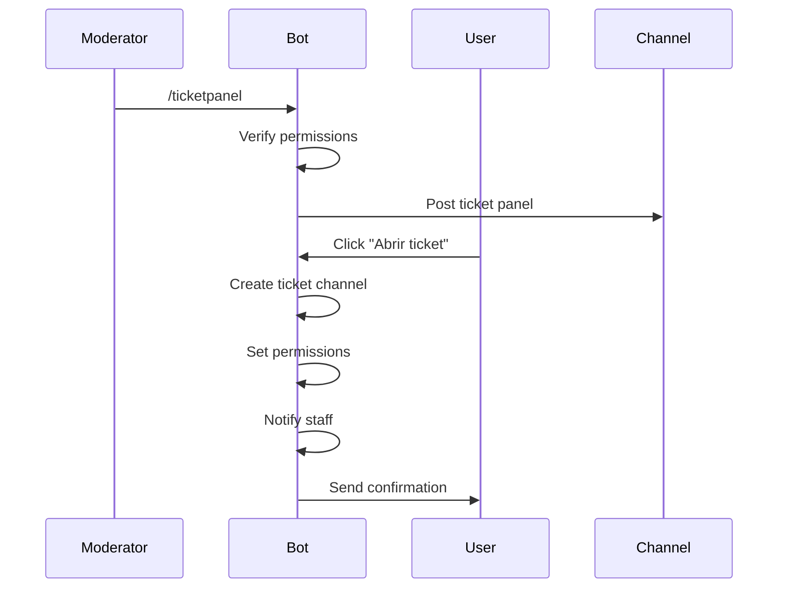
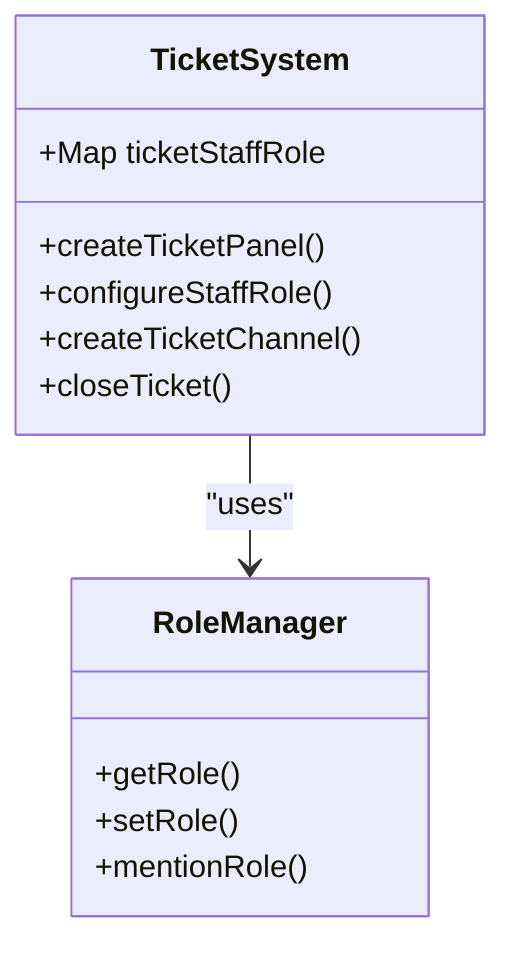
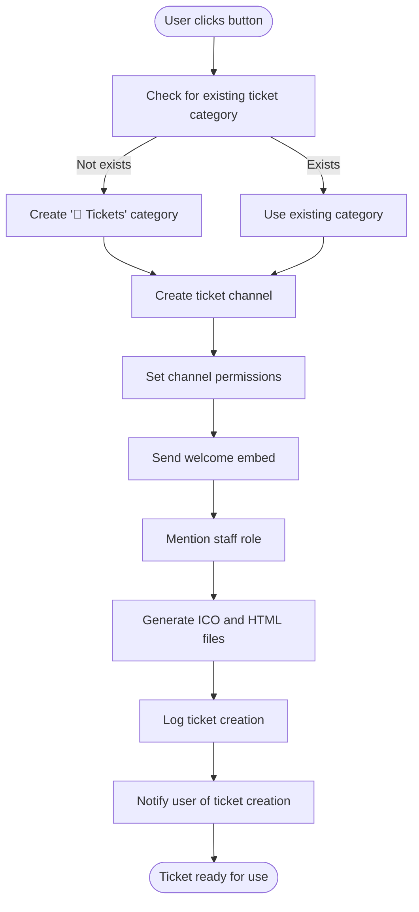
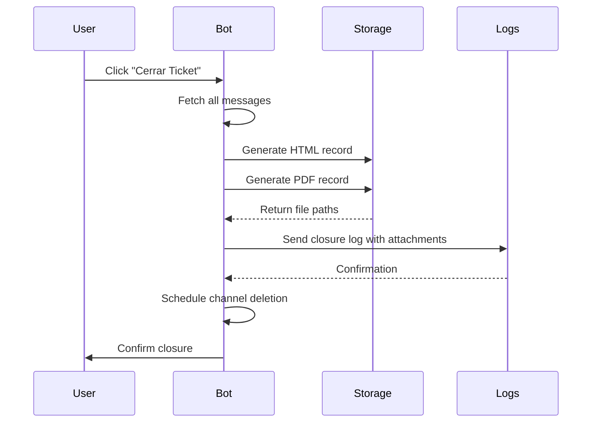
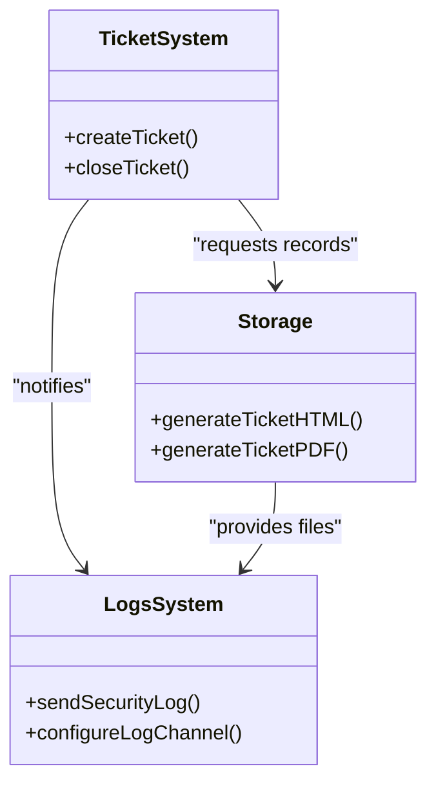
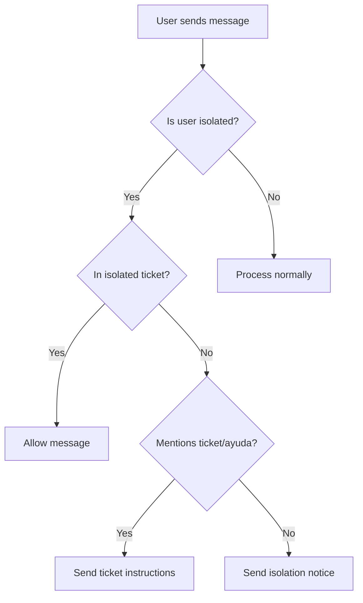
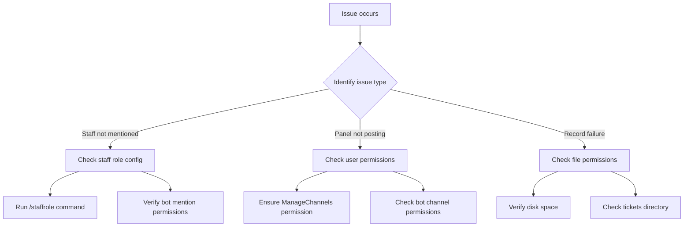

# Ticket System Commands

<cite>
**Referenced Files in This Document**   
- [index.js](file://index.js)
- [TICKET_PDF_FEATURE.md](file://TICKET_PDF_FEATURE.md)
- [README.md](file://README.md)
- [deploy-commands.js](file://deploy-commands.js)
</cite>

## Table of Contents
1. [Introduction](#introduction)
2. [Command Overview](#command-overview)
3. [Ticket Panel Implementation](#ticket-panel-implementation)
4. [Staff Role Configuration](#staff-role-configuration)
5. [Ticket Creation Workflow](#ticket-creation-workflow)
6. [Ticket Closure and Record Generation](#ticket-closure-and-record-generation)
7. [Integration with Logs System](#integration-with-logs-system)
8. [User Isolation Features](#user-isolation-features)
9. [Common Issues and Solutions](#common-issues-and-solutions)
10. [Conclusion](#conclusion)

## Introduction
The Ticket System commands provide a comprehensive solution for managing support tickets within Discord servers. This documentation details the implementation of `/ticketpanel` and `/staffrole` commands, explaining their invocation relationships and integration with the ticket lifecycle. The system enables moderators to create ticket panels, configure staff roles for notifications, and automatically generate HTML records upon ticket closure. It also integrates with user isolation features, allowing isolated users to communicate with administrators through dedicated ticket channels.

**Section sources**
- [README.md](file://README.md#L25-L31)
- [TICKET_PDF_FEATURE.md](file://TICKET_PDF_FEATURE.md#L1-L10)

## Command Overview
The ticket system consists of two primary commands: `/ticketpanel` for creating ticket interfaces and `/staffrole` for configuring staff notifications. These commands work together to establish a complete ticket management workflow.

```mermaid
flowchart TD
A[/ticketpanel] --> B[Create ticket panel]
C[/staffrole] --> D[Configure staff role]
B --> E[Ticket creation]
D --> F[Staff notifications]
E --> G[Ticket closure]
G --> H[Record generation]
F --> G
H --> I[Log integration]
```

**Diagram sources**
- [index.js](file://index.js#L5210-L5228)
- [index.js](file://index.js#L4613-L4622)

## Ticket Panel Implementation
The `/ticketpanel` command creates an interactive ticket interface that allows users to open support tickets. When executed, it posts an embed with a button that users can click to create a ticket channel.

The implementation checks for ManageChannels permission before allowing moderators to post the panel. The panel includes descriptive text that informs users they can create tickets even when isolated (in timeout). When a user clicks the "Abrir ticket" button, the system creates a new text channel in a dedicated ticket category.



**Diagram sources**
- [index.js](file://index.js#L5210-L5228)
- [index.js](file://index.js#L5764-L5845)

**Section sources**
- [index.js](file://index.js#L5210-L5228)
- [README.md](file://README.md#L27)

## Staff Role Configuration
The `/staffrole` command configures which role will be mentioned when new tickets are created. This allows server administrators to designate specific staff members who should be notified about new support requests.

The command requires ManageRoles permission to prevent unauthorized configuration. When executed, it stores the specified role ID in a Map collection keyed by guild ID, enabling per-server configuration. This role is then mentioned in the ticket channel when a new ticket is created, ensuring staff members are promptly notified.



**Diagram sources**
- [index.js](file://index.js#L4613-L4622)
- [index.js](file://index.js#L5814-L5816)

**Section sources**
- [index.js](file://index.js#L4613-L4622)
- [README.md](file://README.md#L28)

## Ticket Creation Workflow
The ticket creation process begins when a user interacts with the ticket panel button. The system follows a structured workflow to create and configure the ticket channel.

First, the bot searches for an existing ticket category, creating one if it doesn't exist. It then creates a text channel with restricted permissions, allowing only the ticket creator and staff members to view and participate. The channel name follows the format "ticket-username" for easy identification.

Upon creation, the system automatically generates both ICO and HTML files for the ticket, providing immediate record-keeping. The staff role is mentioned in the channel to notify support personnel, and a log entry is created with the HTML attachment.



**Diagram sources**
- [index.js](file://index.js#L5764-L5845)
- [index.js](file://index.js#L5818-L5825)

**Section sources**
- [index.js](file://index.js#L5764-L5845)
- [TICKET_PDF_FEATURE.md](file://TICKET_PDF_FEATURE.md#L32-L37)

## Ticket Closure and Record Generation
When a ticket is closed using the "Cerrar Ticket" button, the system initiates a comprehensive closure workflow that includes record generation and logging.

The closure process begins by generating both HTML and PDF records of the entire ticket conversation. The HTML file contains a formatted history of all messages, embeds, and attachments, styled with Discord-like aesthetics. These records are saved locally in a "tickets" directory with timestamps in their filenames for unique identification.

After record generation, the system sends a log entry to the configured logs channel, attaching the generated HTML and PDF files if they were successfully created. Finally, the ticket channel is scheduled for deletion after a 2-second delay, allowing users to see the closure confirmation.



**Diagram sources**
- [index.js](file://index.js#L5848-L5893)
- [index.js](file://index.js#L74-L273)
- [TICKET_PDF_FEATURE.md](file://TICKET_PDF_FEATURE.md#L38-L51)

**Section sources**
- [index.js](file://index.js#L5848-L5893)
- [TICKET_PDF_FEATURE.md](file://TICKET_PDF_FEATURE.md#L1-L94)

## Integration with Logs System
The ticket system is tightly integrated with the server's logging infrastructure, ensuring all ticket activities are properly recorded and archived.

The `sendSecurityLog` function handles the transmission of ticket events to the designated logs channel. When a ticket is opened or closed, an embed is created with relevant details and sent through this function. For closure events, the generated HTML and PDF files are attached to the log message if they exist.

The logs system checks for the configured log channel ID and verifies its existence before attempting to send messages. It also includes comprehensive error handling and debugging output to ensure reliable operation even when issues occur.



**Diagram sources**
- [index.js](file://index.js#L880-L934)
- [index.js](file://index.js#L5826-L5833)
- [index.js](file://index.js#L5868-L5878)

**Section sources**
- [index.js](file://index.js#L880-L934)
- [README.md](file://README.md#L74-L86)

## User Isolation Features
The ticket system includes special handling for users who are isolated (in timeout), allowing them to communicate with administrators despite their restricted status.

When an isolated user attempts to send a message outside their ticket channel, the system detects their communicationDisabledUntil status and redirects them to use the ticket system. If they mention "ticket" or "ayuda" (help), they receive specific instructions on how to create a ticket.

Isolated users can create special "ticket-aislado-username" channels that allow them to communicate with staff while maintaining their isolated status. The system also displays remaining timeout duration in these channels, providing transparency about their restriction period.



**Diagram sources**
- [index.js](file://index.js#L1768-L1846)
- [index.js](file://index.js#L1815-L1826)

**Section sources**
- [index.js](file://index.js#L1768-L1846)
- [README.md](file://README.md#L158-L160)

## Common Issues and Solutions
Several common issues can occur with the ticket system, primarily related to permissions and configuration. Understanding these issues and their solutions ensures smooth operation.

### Staff Not Being Mentioned
The most common issue is staff not being mentioned in new tickets. This typically occurs when the `/staffrole` command hasn't been configured. The solution is for a moderator to run `/staffrole @StaffRole` to designate the appropriate role.

Another cause is permission issues where the bot lacks sufficient permissions to mention roles. Ensuring the bot has the "Mention Everyone" permission and that the staff role is mentionable resolves this issue.

### Ticket Panel Not Posting
When the `/ticketpanel` command fails, it's usually due to insufficient permissions. The user must have the ManageChannels permission to post the panel. Additionally, the bot must have permissions to create messages and manage channels in the target channel.

### Record Generation Failures
HTML and PDF generation can fail if the bot lacks write permissions to its local directory. Ensuring the bot has appropriate file system permissions and sufficient disk space prevents these failures. The system is designed to continue functioning even if record generation fails, ensuring ticket operations aren't disrupted.



**Diagram sources**
- [index.js](file://index.js#L4616-L4618)
- [index.js](file://index.js#L5212-L5214)
- [index.js](file://index.js#L76-L77)

**Section sources**
- [index.js](file://index.js#L4613-L4622)
- [index.js](file://index.js#L5210-L5228)
- [index.js](file://index.js#L74-L273)

## Conclusion
The Ticket System commands provide a robust solution for managing support requests in Discord servers. The `/ticketpanel` and `/staffrole` commands work together to create an efficient workflow for ticket creation, staff notification, and resolution. The system's integration with HTML and PDF record generation ensures comprehensive documentation of all support interactions, while the logs integration provides centralized tracking of ticket activities.

Special features for isolated users ensure that even restricted members can access support when needed. The system's design prioritizes reliability, with fallback mechanisms that allow core functionality to continue even when secondary features like record generation fail.

By understanding the implementation details and relationships between components, server administrators can effectively configure and maintain the ticket system to provide excellent support experiences for their communities.