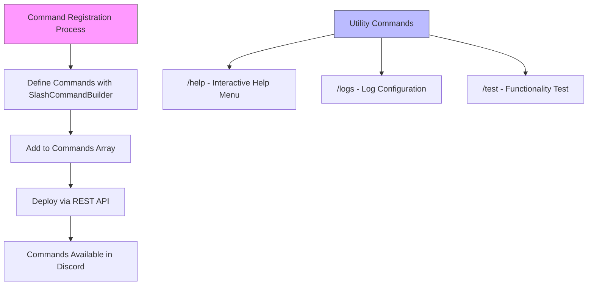
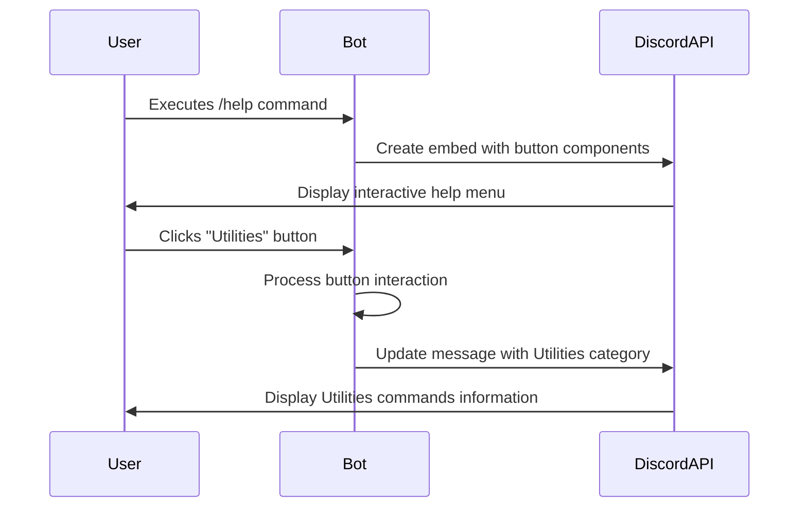
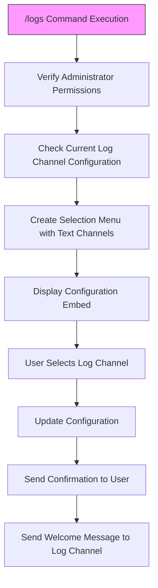
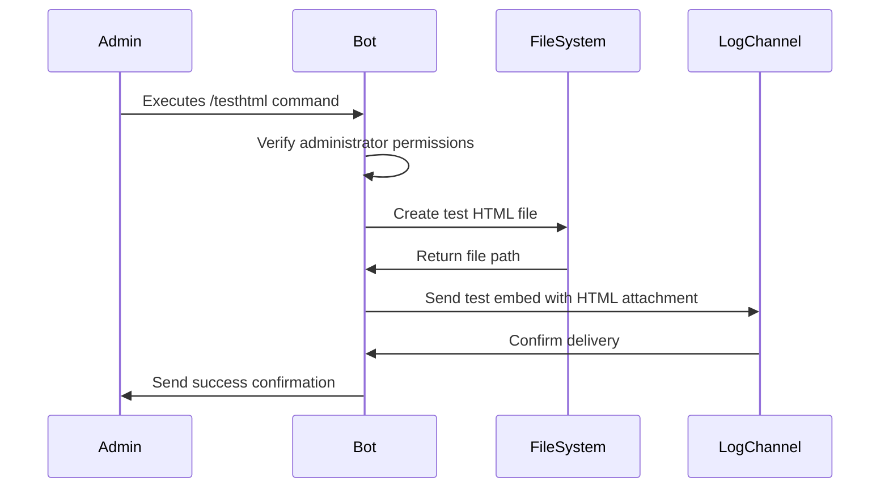
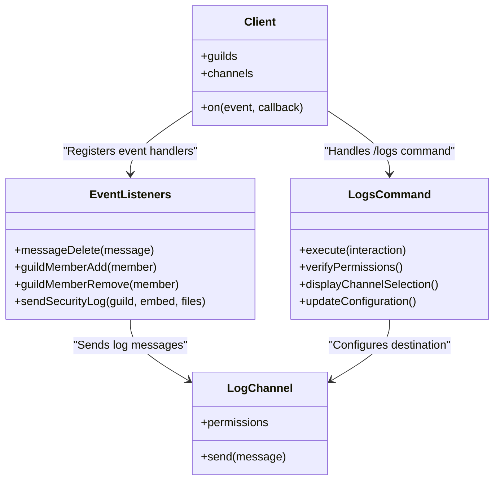

# Utility Commands

<cite>
**Referenced Files in This Document**   
- [index.js](file://index.js)
- [deploy-commands.js](file://deploy-commands.js)
- [LISTA-COMANDOS.md](file://LISTA-COMANDOS.md)
- [README.md](file://README.md)
</cite>

## Table of Contents
1. [Introduction](#introduction)
2. [Command Registration and Structure](#command-registration-and-structure)
3. [/help Command Implementation](#help-command-implementation)
4. [/logs Command Implementation](#logs-command-implementation)
5. [/test Command Implementation](#test-command-implementation)
6. [System Status Monitoring Integration](#system-status-monitoring-integration)
7. [Common Issues and Solutions](#common-issues-and-solutions)
8. [Conclusion](#conclusion)

## Introduction

The Utility command category in this Discord bot provides essential tools for users and administrators to interact with the bot's core functionality. This document thoroughly explains the implementation details of three key utility commands: `/help`, `/logs`, and `/test`. These commands serve as critical interfaces for user guidance, system monitoring, and functionality verification.

The `/help` command delivers an interactive menu with buttons that categorize all available bot commands, making it easy for users to discover functionality. The `/logs` command enables administrators to configure a dedicated channel for monitoring server events and security activities. The `/test` command verifies basic bot functionality and responsiveness. Together, these commands form a comprehensive utility suite that enhances user experience and system administration.

This documentation will explore the technical implementation of these commands, their relationship with the system status monitoring infrastructure, and provide concrete examples from the actual codebase. The content is designed to be accessible to beginners while providing sufficient technical depth for experienced developers.

**Section sources**
- [index.js](file://index.js#L3555-L3608)
- [deploy-commands.js](file://deploy-commands.js#L153-L157)

## Command Registration and Structure

The utility commands are registered through the Discord API using slash command definitions in the `deploy-commands.js` file. Each command is defined with a name, description, and appropriate permissions. The registration process ensures that these commands are available to users within the Discord interface.

The three utility commands are defined with specific purposes:
- `/help`: Provides an interactive menu with buttons to navigate through command categories
- `/logs`: Configures the system for logging server events to a designated channel
- `/test`: Verifies that the bot is operational and responsive

These commands are part of a larger command registration array that includes various functionality categories such as moderation, voice management, and ticket systems. The registration process uses Discord.js's `SlashCommandBuilder` to create the command definitions, which are then deployed to the guild through the Discord API.

**Diagram sources**
- [deploy-commands.js](file://deploy-commands.js#L148-L174)

**Section sources**
- [deploy-commands.js](file://deploy-commands.js#L148-L174)
- [index.js](file://index.js#L153-L157)

## /help Command Implementation

The `/help` command implements an interactive menu system using Discord's button components. When invoked, it displays an embed with two rows of buttons, each representing a different command category. This design allows users to navigate through various command groups without leaving the initial interaction.

The implementation creates an embed with a title and description, then constructs two action rows containing buttons for different command categories. The first row includes primary categories like Information, Moderation, Roles, and Voice, while the second row contains Tickets, Configuration, and Utilities. The response is sent as an ephemeral message, visible only to the user who invoked the command.

When a user clicks on a category button, the bot handles the button interaction and updates the message with a new embed specific to that category. For example, clicking the "Utilities" button displays information about the `/test`, `/testhtml`, `/comandos`, and `/help` commands themselves. This nested navigation system provides a clean and organized way to present the bot's extensive functionality.

**Diagram sources**
- [index.js](file://index.js#L3555-L3608)
- [index.js](file://index.js#L5534-L5550)

**Section sources**
- [index.js](file://index.js#L3555-L3608)
- [index.js](file://index.js#L5534-L5550)

## /logs Command Implementation

The `/logs` command provides a comprehensive system for configuring and managing server event logging. This command is restricted to administrators and guides them through setting up a dedicated channel for receiving logs of various server activities.

When executed, the command first verifies that the user has administrator permissions. It then retrieves the current log channel configuration, if any, and presents a selection menu of available text channels in the server. The command displays an embed with information about the current log channel status and lists the types of events that will be logged, including message deletions/edits, user joins/leaves, bans/unbans, role modifications, ticket activities, and anti-raid actions.

The implementation uses a string select menu component to allow administrators to choose the desired log channel from a dropdown list. This approach simplifies the configuration process and prevents errors from specifying invalid channel names. Once a channel is selected, the bot updates its internal configuration and sends a confirmation message both to the user and to the newly designated log channel.

**Diagram sources**
- [index.js](file://index.js#L5356-L5407)
- [index.js](file://index.js#L6594-L6619)

**Section sources**
- [index.js](file://index.js#L5356-L5407)
- [index.js](file://index.js#L6594-L6619)

## /test Command Implementation

The `/test` command serves as a simple functionality verification tool to ensure the bot is operational and responsive. While the codebase shows that a `/test` command is registered, the actual implementation in the interaction handler appears to have been commented out or removed, suggesting it may have been deprecated in favor of other testing methods.

However, the codebase includes a related command `/testhtml` that serves a similar verification purpose but with additional functionality. This command allows administrators to test the HTML generation and logging system by creating a test HTML file and sending it to the configured log channel. The implementation verifies administrator permissions, generates a test HTML file with timestamp and user information, and uses the `sendSecurityLog` function to deliver it to the log channel.

The presence of this testing infrastructure indicates that the bot's developers prioritized verifiability and debugging capabilities. The testing commands help administrators confirm that critical systems like file generation and log delivery are functioning correctly, which is essential for maintaining the bot's reliability in a production environment.

**Diagram sources**
- [index.js](file://index.js#L5230-L5289)

**Section sources**
- [index.js](file://index.js#L5230-L5289)
- [deploy-commands.js](file://deploy-commands.js#L171-L174)

## System Status Monitoring Integration

The utility commands are deeply integrated with the bot's system status monitoring infrastructure, particularly through the `/logs` command. This integration creates a comprehensive monitoring system that tracks various server events and security activities.

The logging system monitors several key events:
- Message deletions and edits
- User joins and leaves from the server
- Ban and unban actions
- Role additions and removals
- Ticket openings and closings
- Anti-raid system actions

These events are automatically logged to the configured channel through event listeners registered with the Discord client. For example, the `messageDelete` event listener captures when messages are deleted and creates an embed with details about the deleted message, which is then sent to the log channel. Similarly, user join and leave events trigger log entries that help administrators track server activity.

The `/logs` command serves as the configuration interface for this monitoring system, allowing administrators to designate which channel receives these logs. This separation of configuration and execution ensures that the monitoring system can operate continuously while still being manageable through a user-friendly interface.

**Diagram sources**
- [index.js](file://index.js#L2219-L2243)
- [index.js](file://index.js#L5356-L5407)
- [index.js](file://index.js#L880-L920)

**Section sources**
- [index.js](file://index.js#L2219-L2243)
- [index.js](file://index.js#L5356-L5407)
- [index.js](file://index.js#L880-L920)

## Common Issues and Solutions

Despite the robust implementation of the utility commands, certain issues may arise during usage. The most common issue with the `/help` command is button interactions not responding, which typically occurs when the bot restarts after a user has opened the help menu. Since the button interactions are tied to the current bot session, any buttons displayed before a restart become unresponsive.

To resolve this issue, users should simply invoke the `/help` command again after the bot has restarted. The bot's code includes proper error handling for interaction failures, but it cannot recover expired interactions from previous sessions. Administrators can minimize this issue by scheduling restarts during low-usage periods or implementing a bot uptime monitoring system.

For the `/logs` command, a common issue is permission errors when attempting to send logs to the configured channel. This occurs when the bot's role permissions have changed or when the log channel's permission settings have been modified. The solution is to verify that the bot has "Send Messages" and "Embed Links" permissions in the log channel, either through the channel's permission settings or by adjusting the bot's role permissions.

Another potential issue is with the `/test` and `/testhtml` commands failing to generate files, which can happen if the bot lacks write permissions to the server's file system. Ensuring that the bot has appropriate file system permissions and that the "tickets" directory exists with proper write access resolves this issue. Regular monitoring of the bot's console output can help identify and address these issues proactively.

**Section sources**
- [index.js](file://index.js#L5356-L5407)
- [index.js](file://index.js#L5230-L5289)
- [index.js](file://index.js#L3555-L3608)

## Conclusion

The utility commands `/help`, `/logs`, and `/test` form a critical component of the Discord bot's functionality, providing essential tools for user guidance, system monitoring, and functionality verification. The `/help` command's interactive button-based interface offers an intuitive way for users to discover the bot's capabilities, while the `/logs` command provides administrators with comprehensive server monitoring capabilities.

These commands demonstrate thoughtful design patterns, including proper permission verification, user-friendly interfaces, and integration with broader system functionality. The implementation leverages Discord's component system effectively, creating dynamic interactions that enhance the user experience. The tight integration between the `/logs` command and the event monitoring system exemplifies how configuration interfaces can work seamlessly with background processes.

For developers looking to extend or maintain this bot, understanding these utility commands provides insight into the overall architecture and design philosophy. The codebase shows a clear separation of concerns, with command registration, interaction handling, and system monitoring implemented as distinct but interconnected components. This modular approach makes the codebase maintainable and extensible, allowing for the addition of new commands and features without disrupting existing functionality.