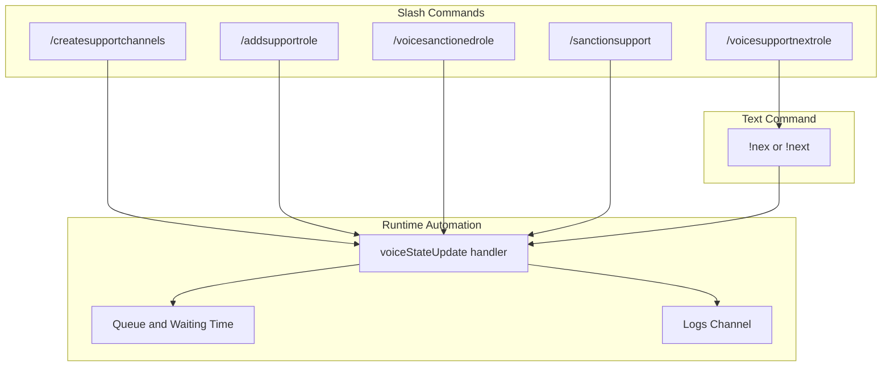
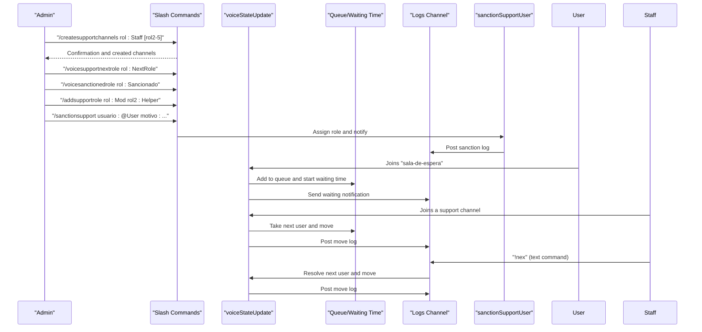
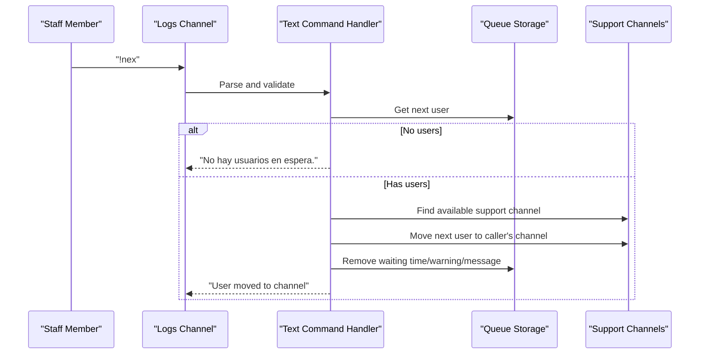
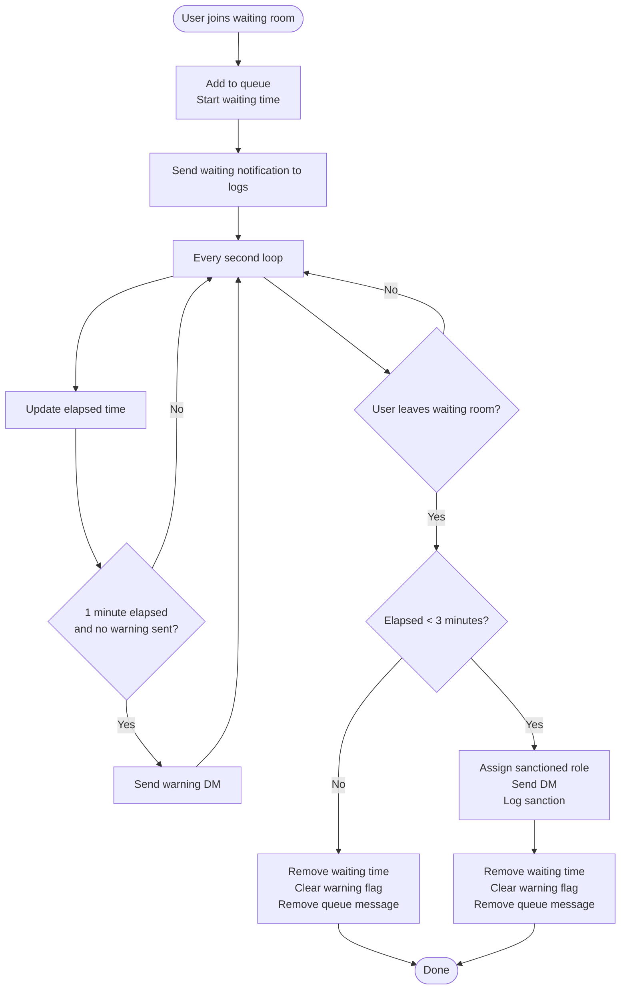
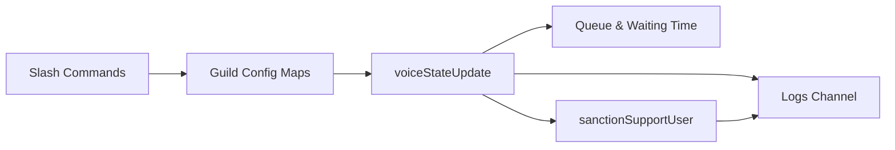

# Voice Support Commands

<cite>
**Referenced Files in This Document**
- [COMANDOS-SOPORTE-VOZ.md](file://COMANDOS-SOPORTE-VOZ.md)
- [index.js](file://index.js)
- [deploy-commands.js](file://deploy-commands.js)
</cite>

## Table of Contents
1. [Introduction](#introduction)
2. [Project Structure](#project-structure)
3. [Core Components](#core-components)
4. [Architecture Overview](#architecture-overview)
5. [Detailed Component Analysis](#detailed-component-analysis)
6. [Dependency Analysis](#dependency-analysis)
7. [Performance Considerations](#performance-considerations)
8. [Troubleshooting Guide](#troubleshooting-guide)
9. [Conclusion](#conclusion)
10. [Appendices](#appendices)

## Introduction
This document explains the Voice Support command category and the automated voice support system. It covers the slash commands for configuration and moderation, the text command used by staff, and how they integrate with the runtime voice state automation. It also includes operational examples, queue mechanics, and common issues with solutions.

## Project Structure
The Voice Support system spans:
- Command registration and documentation
- Runtime voice state automation
- Moderation and logging integrations

**Diagram sources**
- [deploy-commands.js](file://deploy-commands.js#L54-L87)
- [index.js](file://index.js#L4868-L4988)
- [index.js](file://index.js#L1596-L1738)
- [index.js](file://index.js#L2443-L2981)

**Section sources**
- [deploy-commands.js](file://deploy-commands.js#L54-L87)
- [index.js](file://index.js#L4868-L4988)

## Core Components
- Configuration commands:
  - Creates channels and sets staff roles
  - Adds additional staff roles to existing support channels
  - Sets the role allowed to use the text command
  - Sets the sanctioned role
- Moderation command:
  - Applies sanctions to users in voice support
- Text command:
  - Moves the next user from the queue to a staff member’s channel
- Runtime automation:
  - Queue management and waiting time tracking
  - Automatic movement of users based on roles and actions
  - Logging and notifications

**Section sources**
- [COMANDOS-SOPORTE-VOZ.md](file://COMANDOS-SOPORTE-VOZ.md#L1-L120)
- [index.js](file://index.js#L4868-L4988)
- [index.js](file://index.js#L1596-L1738)
- [index.js](file://index.js#L2443-L2981)

## Architecture Overview
The Voice Support system orchestrates:
- Slash commands that configure roles and channels
- A voice state event handler that manages queues, waiting times, and automatic movements
- A logs channel for notifications and moderation records
- A moderation function that assigns roles and sends direct messages

**Diagram sources**
- [index.js](file://index.js#L4868-L4988)
- [index.js](file://index.js#L1596-L1738)
- [index.js](file://index.js#L2443-L2981)
- [index.js](file://index.js#L531-L706)

## Detailed Component Analysis

### Configuration Commands

#### /createsupportchannels
- Purpose: Creates the Voice Support category, waiting room, two support channels, and a logs channel. Also stores the primary staff role and applies initial permissions.
- Behavior:
  - Creates category “🎧 Soporte de Voz”
  - Creates “soporte-log-de-voz” text channel (restricted)
  - Creates “sala-de-espera” voice channel
  - Creates “soporte-1” and “soporte-2” voice channels with restricted permissions
  - Grants Connect/Speak to all provided staff roles
  - Sends a setup guide to the logs channel
- Role storage:
  - Stores the primary staff role ID in a guild-scoped map for later checks
- Permissions:
  - Requires Administrator to run

**Section sources**
- [index.js](file://index.js#L4868-L4988)
- [deploy-commands.js](file://deploy-commands.js#L54-L62)

#### /addsupportrole
- Purpose: Adds additional staff roles to existing support channels.
- Behavior:
  - Fetches all existing support channels
  - Updates permission overwrites for each channel to allow Connect/Speak for the given roles
  - Replies with a summary of updated channels
- Notes:
  - Fails gracefully if no support channels are found

**Section sources**
- [index.js](file://index.js#L4624-L4689)
- [deploy-commands.js](file://deploy-commands.js#L63-L71)

#### /voicesupportnextrole
- Purpose: Sets the role that can use the text command “!nex”.
- Behavior:
  - Stores the role ID in a guild-scoped map
  - Only users with this role (or staff role) can use “!nex”

**Section sources**
- [index.js](file://index.js#L4733-L4744)
- [deploy-commands.js](file://deploy-commands.js#L72-L81)

#### /voicesanctionedrole
- Purpose: Sets the role assigned to users who violate the waiting time policy.
- Behavior:
  - Stores the role ID in a guild-scoped map
  - Attempts to update permission overwrites on all support channels to allow Connect/Speak for the role
  - Replies with whether channels were updated or if none were found

**Section sources**
- [index.js](file://index.js#L4746-L4789)
- [deploy-commands.js](file://deploy-commands.js#L77-L81)

### Moderation Command

#### /sanctionsupport
- Purpose: Applies a sanction to a user in voice support.
- Behavior:
  - Validates the caller has either the staff role or ManageRoles permission
  - Calls the shared sanction function to assign the sanctioned role, send a direct message, and log the action
  - Replies with success or error details

**Section sources**
- [index.js](file://index.js#L4691-L4731)
- [index.js](file://index.js#L531-L706)
- [deploy-commands.js](file://deploy-commands.js#L82-L87)

### Text Command: !nex or !next

#### Invocation and Requirements
- Must be used in the voice support logs channel
- Caller must have the role set by “/voicesupportnextrole” or the staff role
- If no users are in the queue, replies with a friendly message

#### Flow
- Retrieves the current queue for the guild
- If empty, responds accordingly
- Finds available support channels
- Moves the next user to the caller’s channel
- Removes waiting time, warning flag, and queue message for that user
- Posts a log embed to the logs channel

**Diagram sources**
- [index.js](file://index.js#L1596-L1738)

**Section sources**
- [index.js](file://index.js#L1596-L1738)
- [COMANDOS-SOPORTE-VOZ.md](file://COMANDOS-SOPORTE-VOZ.md#L106-L122)

### Runtime Voice State Automation

#### Queue and Waiting Time Management
- On join to the waiting room:
  - Adds the user to the queue
  - Starts tracking entry time
  - Sends a live notification embed to the logs channel with elapsed time
- Every second:
  - Updates the waiting notification embed with current elapsed time
  - After 1 minute without activity, sends a one-time warning DM
- On leave from the waiting room:
  - If the user left before 3 minutes, automatically assigns the sanctioned role and logs the event
  - Removes waiting time, warning flag, and queue message
- On staff joining a support channel:
  - Moves the next queued user to the staff member’s channel
  - Clears waiting time, warning flag, and queue message
  - Logs the move

**Diagram sources**
- [index.js](file://index.js#L730-L821)
- [index.js](file://index.js#L2730-L2838)
- [index.js](file://index.js#L531-L706)

**Section sources**
- [index.js](file://index.js#L730-L821)
- [index.js](file://index.js#L2730-L2838)
- [index.js](file://index.js#L531-L706)

### Role-Based Access Control for Support Channels
- Only users with the configured staff role (or roles granted via permission overwrites) can connect to support channels
- If someone attempts to enter a support channel without permission, they are moved out and notified, and a log is posted

**Section sources**
- [index.js](file://index.js#L2840-L2870)

### Logs and Notifications
- The logs channel receives:
  - New request notifications with queue length and elapsed time
  - Move-to-support notifications
  - Access-denied notifications
  - Sanction logs
- The system also sends direct messages to users for warnings and sanctions

**Section sources**
- [index.js](file://index.js#L2638-L2673)
- [index.js](file://index.js#L2714-L2724)
- [index.js](file://index.js#L2860-L2868)
- [index.js](file://index.js#L531-L706)

## Dependency Analysis
- Command registration:
  - Slash commands are registered in the guild via a deployment script
- Runtime dependencies:
  - Voice state updates trigger queue and movement logic
  - Moderation relies on a shared function that handles role assignment, DMs, and logging
- Data structures:
  - Collections store per-guild configurations (staff role, next role, sanctioned role)
  - Maps track queue, waiting times, warning flags, and queue messages

**Diagram sources**
- [deploy-commands.js](file://deploy-commands.js#L54-L87)
- [index.js](file://index.js#L4868-L4988)
- [index.js](file://index.js#L2443-L2981)
- [index.js](file://index.js#L531-L706)

**Section sources**
- [deploy-commands.js](file://deploy-commands.js#L54-L87)
- [index.js](file://index.js#L4868-L4988)
- [index.js](file://index.js#L2443-L2981)
- [index.js](file://index.js#L531-L706)

## Performance Considerations
- Real-time updates:
  - Waiting time updates occur every second; keep the logs channel embed lightweight
- Permission updates:
  - Adding roles to many channels can be expensive; batch updates and handle errors per-channel
- DM reliability:
  - Some users may block DMs; the system logs and continues without failing the whole operation

[No sources needed since this section provides general guidance]

## Troubleshooting Guide

Common issues and resolutions:
- Staff incorrectly placed in queue
  - Cause: Staff joined the waiting room by mistake
  - Resolution: The system detects staff and moves them to a support channel immediately; they are not added to the queue and are not sanctioned for leaving early
  - Evidence: Staff detection logic and immediate move on joining a support channel

- No users in queue when using “!nex”
  - Cause: The queue is empty
  - Resolution: The command replies with a friendly message indicating no users are waiting

- “!nex” used outside the logs channel
  - Cause: Command requirement not met
  - Resolution: Ensure the command is used in the voice support logs channel

- Sanction not applied
  - Cause: Sanctioned role not configured
  - Resolution: Configure the role with “/voicesanctionedrole”; then the system can assign it and log the sanction

- Users still appear in queue after leaving
  - Cause: Leaving the waiting room removes them from the queue and clears waiting time
  - Resolution: Verify the logs channel for the removal and that the user was moved if applicable

- Access denied to support channels
  - Cause: Caller lacks the staff role or explicit permission overwrites
  - Resolution: Grant Connect/Speak to the appropriate roles or ensure the staff role is configured

**Section sources**
- [index.js](file://index.js#L2443-L2981)
- [index.js](file://index.js#L1596-L1738)
- [index.js](file://index.js#L2840-L2870)
- [index.js](file://index.js#L4746-L4789)

## Conclusion
The Voice Support command category provides a robust, automated system for managing voice support queues, staff-driven user movement, and moderation actions. Configuration commands set up channels and roles, the text command enables quick queue management, and the runtime automation ensures fair treatment of users, timely warnings, and clear logs. Proper configuration of roles and channels prevents common pitfalls and keeps the system reliable.

## Appendices

### Command Reference and Examples
- /createsupportchannels
  - Example: Creates category, waiting room, two support channels, and logs channel; grants permissions to provided staff roles
- /addsupportrole
  - Example: Adds additional staff roles to existing support channels
- /voicesupportnextrole
  - Example: Allows a specific role to use “!nex”
- /voicesanctionedrole
  - Example: Configures the role assigned to users who leave the waiting room early
- /sanctionsupport
  - Example: Applies a sanction to a user and logs the action
- !nex or !next
  - Example: Moves the next user in the queue to the caller’s channel

**Section sources**
- [COMANDOS-SOPORTE-VOZ.md](file://COMANDOS-SOPORTE-VOZ.md#L1-L122)
- [index.js](file://index.js#L4868-L4988)
- [index.js](file://index.js#L4624-L4689)
- [index.js](file://index.js#L4733-L4744)
- [index.js](file://index.js#L4746-L4789)
- [index.js](file://index.js#L4691-L4731)
- [index.js](file://index.js#L1596-L1738)