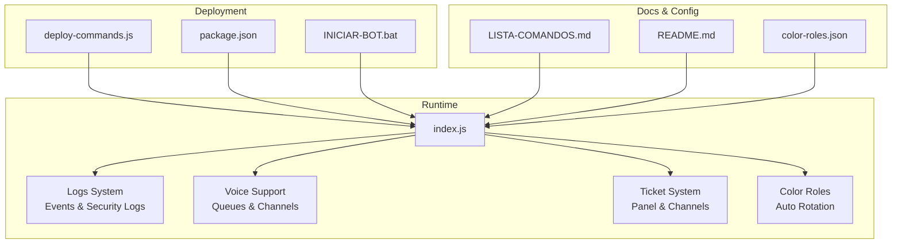
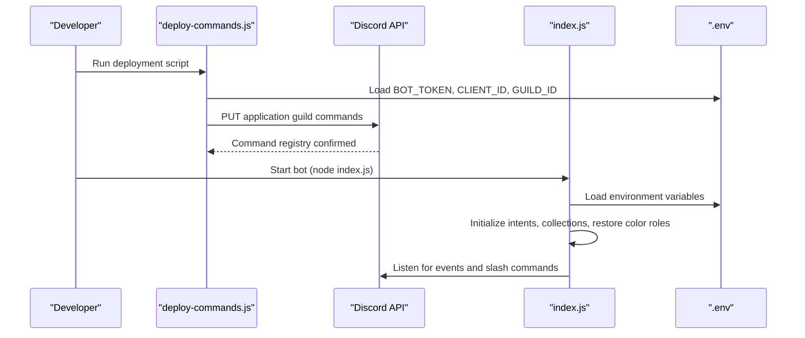
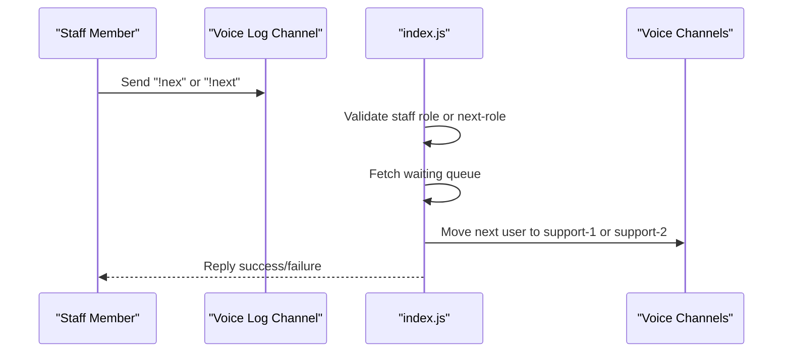
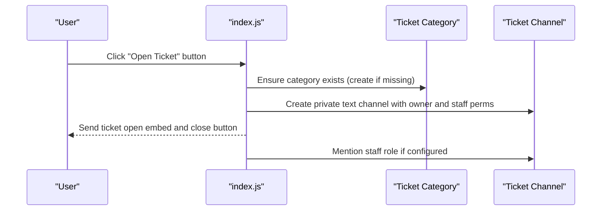
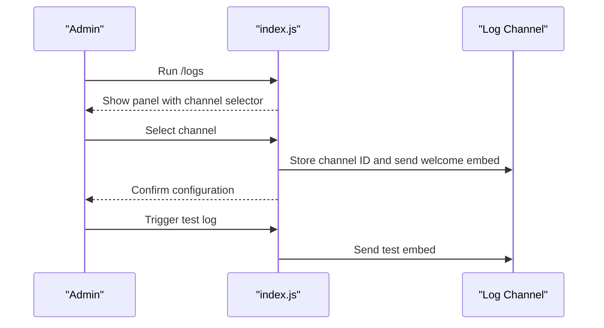
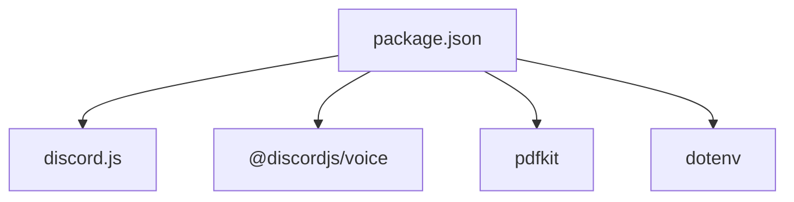

# Configuration Examples

<cite>
**Referenced Files in This Document**
- [index.js](file://index.js)
- [LISTA-COMANDOS.md](file://LISTA-COMANDOS.md)
- [README.md](file://README.md)
- [deploy-commands.js](file://deploy-commands.js)
- [package.json](file://package.json)
- [INICIAR-BOT.bat](file://INICIAR-BOT.bat)
- [color-roles.json](file://color-roles.json)
</cite>

## Table of Contents
1. [Introduction](#introduction)
2. [Project Structure](#project-structure)
3. [Core Components](#core-components)
4. [Architecture Overview](#architecture-overview)
5. [Detailed Component Analysis](#detailed-component-analysis)
6. [Dependency Analysis](#dependency-analysis)
7. [Performance Considerations](#performance-considerations)
8. [Troubleshooting Guide](#troubleshooting-guide)
9. [Conclusion](#conclusion)
10. [Appendices](#appendices)

## Introduction
This document provides practical, step-by-step configuration examples for setting up key bot features. It focuses on:
- Initializing the voice support system with /createsupportchannels and /voicesupportnextrole
- Configuring the ticket system with /staffrole and /ticketpanel
- Enabling logging with /logs
- Environment variable setup in .env (BOT_TOKEN, CLIENT_ID, GUILD_ID)
- Persistent settings like color roles via color-roles.json
- Embed customization in /anuncio and /enviarmd with color codes and image URLs
- Deployment and startup using the provided scripts

The recommended initial configuration sequence is taken from LISTA-COMANDOS.md.

## Project Structure
The repository contains the main bot implementation, deployment scripts, documentation, and configuration artifacts. The most relevant files for configuration are:
- index.js: Implements all commands, logging, voice support, tickets, and color roles
- deploy-commands.js: Registers slash commands with Discord
- LISTA-COMANDOS.md: Recommended initial configuration steps
- README.md: Installation and environment setup guidance
- package.json: Dependencies and scripts
- INICIAR-BOT.bat: Windows startup script
- color-roles.json: Persistent color role configuration

**Diagram sources**
- [index.js](file://index.js#L1-L120)
- [deploy-commands.js](file://deploy-commands.js#L1-L40)
- [package.json](file://package.json#L1-L27)
- [INICIAR-BOT.bat](file://INICIAR-BOT.bat#L1-L23)
- [LISTA-COMANDOS.md](file://LISTA-COMANDOS.md#L153-L166)
- [README.md](file://README.md#L104-L127)
- [color-roles.json](file://color-roles.json#L1-L10)

**Section sources**
- [index.js](file://index.js#L1-L120)
- [deploy-commands.js](file://deploy-commands.js#L1-L40)
- [package.json](file://package.json#L1-L27)
- [INICIAR-BOT.bat](file://INICIAR-BOT.bat#L1-L23)
- [LISTA-COMANDOS.md](file://LISTA-COMANDOS.md#L153-L166)
- [README.md](file://README.md#L104-L127)
- [color-roles.json](file://color-roles.json#L1-L10)

## Core Components
- Environment variables: Loaded via dotenv and used by deployment and runtime
- Slash command registration: deploy-commands.js registers all commands with Discord
- Runtime initialization: index.js loads environment, sets intents, initializes collections, and restores persistent settings
- Logging system: Automatic event logging and manual /logs configuration
- Voice support: Queue management, staff roles, next-role, sanctions, and channel creation
- Ticket system: Panel creation, staff role, channel creation, and auto-cleanup
- Color roles: Auto-rotation persistence via color-roles.json

**Section sources**
- [index.js](file://index.js#L1-L120)
- [deploy-commands.js](file://deploy-commands.js#L1-L40)
- [README.md](file://README.md#L104-L127)
- [LISTA-COMANDOS.md](file://LISTA-COMANDOS.md#L153-L166)
- [color-roles.json](file://color-roles.json#L1-L10)

## Architecture Overview
The bot follows a modular architecture:
- Environment loading and command registration occur during startup
- Runtime logic handles events, commands, and persistent state
- Logging integrates with Discord channels and file system outputs
- Voice and ticket systems rely on Discord channel management and role permissions

**Diagram sources**
- [deploy-commands.js](file://deploy-commands.js#L1-L40)
- [index.js](file://index.js#L1-L120)
- [README.md](file://README.md#L104-L127)

## Detailed Component Analysis

### Environment Setup (.env)
- Required variables:
  - BOT_TOKEN: Bot token
  - CLIENT_ID: Application ID
  - GUILD_ID: Server ID
- The deployment script reads these variables to register commands for the specified guild.
- The runtime also loads .env to access the same variables.

Practical steps:
1. Create a .env file in the project root with the required keys.
2. Run the deployment script to register commands for your guild.
3. Start the bot with node index.js or the included Windows batch script.

**Section sources**
- [README.md](file://README.md#L104-L127)
- [deploy-commands.js](file://deploy-commands.js#L1-L10)
- [index.js](file://index.js#L1-L120)
- [INICIAR-BOT.bat](file://INICIAR-BOT.bat#L1-L23)

### Recommended Initial Configuration Sequence
Follow the sequence from LISTA-COMANDOS.md to set up the bot effectively:
1. /setup
2. /createsupportchannels rol:@Staff
3. /voicesupportnextrole rol:@Staff
4. /voicesanctionedrole rol:@Sancionado-Voz
5. /staffrole rol:@Staff
6. /ticketpanel
7. /logs
8. /test

This order ensures voice channels, staff roles, ticket panel, logging, and verification are configured in a logical sequence.

**Section sources**
- [LISTA-COMANDOS.md](file://LISTA-COMANDOS.md#L153-L166)

### Voice Support System
Key commands and behavior:
- /createsupportchannels <rol> [rol2-5]: Creates waiting room, two support channels, and a log channel; grants Connect/Speak to configured staff roles; denies everyone else
- /voicesupportnextrole <rol>: Sets the role that can use !nex to move the next user
- !nex or !next: Moves the next user from the waiting queue to a support channel if available

Implementation highlights:
- Permission overwrites restrict voice access to staff roles
- Queue management and waiting-time tracking
- Automatic warnings and sanctions for early exits

Step-by-step setup:
1. Create voice support channels with /createsupportchannels specifying primary and optional additional staff roles.
2. Configure who can use !nex with /voicesupportnextrole.
3. Optionally configure a sanctioned role with /voicesanctionedrole.
4. Verify with !nex in the voice log channel.

**Diagram sources**
- [index.js](file://index.js#L1596-L1650)
- [index.js](file://index.js#L4926-L4976)

**Section sources**
- [index.js](file://index.js#L1596-L1650)
- [index.js](file://index.js#L4926-L4976)
- [COMANDOS-SOPORTE-VOZ.md](file://COMANDOS-SOPORTE-VOZ.md#L1-L52)
- [LISTA-COMANDOS.md](file://LISTA-COMANDOS.md#L7-L12)

### Ticket System
Key commands and behavior:
- /staffrole <rol>: Sets the staff role to mention when tickets are opened
- /ticketpanel: Publishes a button panel to open tickets; creates a category if missing and a private text channel per ticket

Implementation highlights:
- Category creation with restricted visibility
- Private channel creation with owner and staff permissions
- Mention of staff role when a ticket is created
- Ticket creation generates auxiliary files (ICO/HTML) for history

Step-by-step setup:
1. Configure the staff role with /staffrole.
2. Publish the ticket panel with /ticketpanel.
3. Test opening a ticket and verify staff mentions and channel creation.

**Diagram sources**
- [index.js](file://index.js#L5210-L5228)
- [index.js](file://index.js#L5764-L5828)

**Section sources**
- [index.js](file://index.js#L5210-L5228)
- [index.js](file://index.js#L5764-L5828)
- [LISTA-COMANDOS.md](file://LISTA-COMANDOS.md#L27-L33)

### Logging System (/logs)
Behavior:
- /logs opens a panel to select a log channel
- Once selected, all configured events are logged to that channel
- Events include deleted/edited messages, joins/leaves, bans/unbans, role changes, tickets, and anti-raid actions
- A test log can be sent to verify the channel is configured correctly
- Logs can be disabled from the panel

Step-by-step setup:
1. Run /logs to open the configuration panel
2. Select the desired log channel from the dropdown
3. Confirm the configuration; the bot will start sending logs automatically
4. Use the test action to verify logs appear

**Diagram sources**
- [index.js](file://index.js#L6595-L6619)
- [index.js](file://index.js#L6350-L6374)
- [index.js](file://index.js#L6804-L6822)

**Section sources**
- [index.js](file://index.js#L6595-L6619)
- [index.js](file://index.js#L6350-L6374)
- [index.js](file://index.js#L6804-L6822)
- [README.md](file://README.md#L74-L86)

### Embed Customization in /anuncio and /enviarmd
- /anuncio <titulo> <descripcion> <canal> [color] [imagen]: Creates an announcement embed with optional HEX color and image URL
- /enviarmd <usuario> <titulo> <descripcion> [subtitulo] [color] [imagen] [footer]: Sends a direct message with a customizable embed

Implementation highlights:
- Color parsing accepts a valid HEX color string; defaults otherwise
- Image URL is supported for both commands
- Footer and subtitle are optional fields

Example usage patterns:
- /anuncio titulo:"Event" descripcion:"Join us tomorrow" canal:#announcements color:"#00FF00" imagen:"https://example.com/image.png"
- /enviarmd usuario:@User titulo:"Ticket Closed" descripcion:"Your ticket has been resolved" color:"#00FF00" imagen:"https://example.com/image.png" footer:"Thank you"

**Section sources**
- [index.js](file://index.js#L3944-L3980)
- [deploy-commands.js](file://deploy-commands.js#L210-L219)
- [LISTA-COMANDOS.md](file://LISTA-COMANDOS.md#L66-L81)

### Persistent Color Roles via color-roles.json
Behavior:
- /colorrole <rol> [velocidad]: Starts auto-rotation for the specified role; saves configuration to color-roles.json
- /stopcolor: Stops rotation and removes saved configuration
- On restart, the bot restores color rotations from color-roles.json

Configuration file structure:
- A JSON object keyed by guild ID containing:
  - roleId: The role ID to rotate
  - speed: Rotation speed in seconds

Step-by-step setup:
1. Use /colorrole <rol> [velocidad] to configure rotation
2. Verify the rotation starts and color-roles.json is updated
3. Restart the bot; rotation persists automatically

**Section sources**
- [index.js](file://index.js#L5107-L5208)
- [index.js](file://index.js#L708-L740)
- [color-roles.json](file://color-roles.json#L1-L10)

### Deployment and Startup
- Install dependencies: npm install
- Register commands: node deploy-commands.js
- Start the bot: node index.js or double-click INICIAR-BOT.bat

Scripts and commands:
- package.json scripts: start (node index.js), deploy (node deploy-commands.js)
- INICIAR-BOT.bat: Windows batch script to run the bot

**Section sources**
- [package.json](file://package.json#L6-L10)
- [README.md](file://README.md#L104-L127)
- [INICIAR-BOT.bat](file://INICIAR-BOT.bat#L1-L23)
- [deploy-commands.js](file://deploy-commands.js#L1-L40)

## Dependency Analysis
External dependencies include discord.js, @discordjs/voice, pdfkit, and dotenv. These are declared in package.json and used by index.js and deploy-commands.js.

**Diagram sources**
- [package.json](file://package.json#L10-L27)

**Section sources**
- [package.json](file://package.json#L10-L27)

## Performance Considerations
- Voice support queues and intervals: Ensure reasonable speeds for color rotations and waiting-time updates
- Logging volume: Large servers may generate significant logs; monitor channel capacity and retention
- Ticket generation: PDF/HTML creation writes files; ensure disk space and permissions are adequate
- Embed customization: Large images may increase payload sizes; keep image URLs efficient

[No sources needed since this section provides general guidance]

## Troubleshooting Guide
Common issues and resolutions:
- Missing environment variables: Ensure .env contains BOT_TOKEN, CLIENT_ID, GUILD_ID
- Command registration errors: Verify CLIENT_ID and GUILD_ID match your development server
- Permission denied: Many commands require ManageRoles, ManageChannels, or Administrator depending on the command
- Logs not appearing: Confirm /logs channel selection and that the bot has Send Messages permission
- Voice channels not created: Ensure the bot has ManageChannels and ManageRoles permissions
- Color role not rotating: Check role position relative to the bot and speed range (1–60)

**Section sources**
- [README.md](file://README.md#L128-L141)
- [index.js](file://index.js#L6595-L6619)
- [index.js](file://index.js#L5107-L5208)

## Conclusion
With the recommended sequence from LISTA-COMANDOS.md and the environment variables configured, you can quickly set up voice support, tickets, logging, and embed customization. Persistent settings like color roles are handled automatically via color-roles.json. Use the provided scripts and deployment process to streamline installation and operation.

[No sources needed since this section summarizes without analyzing specific files]

## Appendices

### Appendix A: Step-by-Step Setup Checklist
- Prepare .env with BOT_TOKEN, CLIENT_ID, GUILD_ID
- Install dependencies: npm install
- Register commands: node deploy-commands.js
- Start bot: node index.js
- Run recommended sequence:
  1. /setup
  2. /createsupportchannels rol:@Staff
  3. /voicesupportnextrole rol:@Staff
  4. /voicesanctionedrole rol:@Sancionado-Voz
  5. /staffrole rol:@Staff
  6. /ticketpanel
  7. /logs
  8. /test

**Section sources**
- [LISTA-COMANDOS.md](file://LISTA-COMANDOS.md#L153-L166)
- [README.md](file://README.md#L104-L127)
- [deploy-commands.js](file://deploy-commands.js#L1-L40)
- [index.js](file://index.js#L1-L120)