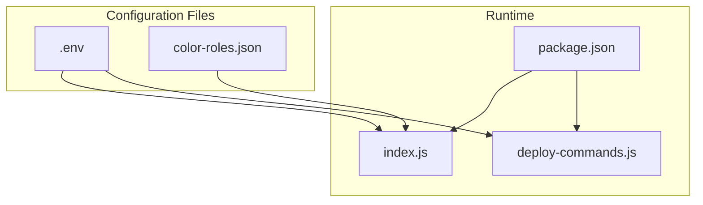
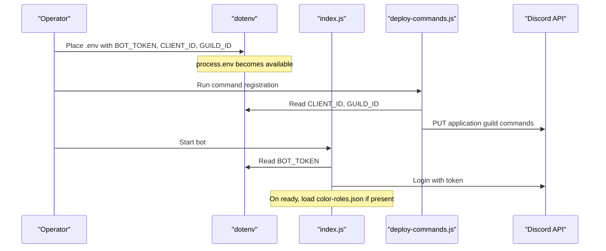
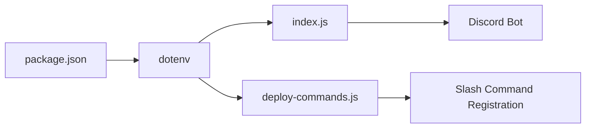

# Environment and Core Configuration

<cite>
**Referenced Files in This Document**
- [README.md](file://README.md)
- [ESQUEMA_BOT.md](file://ESQUEMA_BOT.md)
- [index.js](file://index.js)
- [deploy-commands.js](file://deploy-commands.js)
- [package.json](file://package.json)
- [color-roles.json](file://color-roles.json)
</cite>

## Table of Contents
1. [Introduction](#introduction)
2. [Project Structure](#project-structure)
3. [Core Components](#core-components)
4. [Architecture Overview](#architecture-overview)
5. [Detailed Component Analysis](#detailed-component-analysis)
6. [Dependency Analysis](#dependency-analysis)
7. [Performance Considerations](#performance-considerations)
8. [Troubleshooting Guide](#troubleshooting-guide)
9. [Conclusion](#conclusion)

## Introduction
This document explains how to set up the environment and core configuration for the Discord bot. It covers:
- Creating and placing the .env file with required values
- Required bot permissions and their purposes
- How configuration values are loaded via dotenv and used throughout the application
- Persistent settings for color roles using color-roles.json
- Step-by-step debugging for common setup issues

## Project Structure
The configuration-related files and their roles:
- .env: Stores secrets and IDs (BOT_TOKEN, CLIENT_ID, GUILD_ID)
- index.js: Loads .env and starts the bot using BOT_TOKEN
- deploy-commands.js: Loads .env and registers slash commands using CLIENT_ID and GUILD_ID
- package.json: Declares dotenv as a dependency
- color-roles.json: Stores persistent color role settings per guild

**Diagram sources**
- [index.js](file://index.js#L1-L10)
- [deploy-commands.js](file://deploy-commands.js#L1-L10)
- [package.json](file://package.json#L1-L27)
- [color-roles.json](file://color-roles.json#L1-L10)

**Section sources**
- [README.md](file://README.md#L104-L127)
- [ESQUEMA_BOT.md](file://ESQUEMA_BOT.md#L168-L176)
- [package.json](file://package.json#L1-L27)

## Core Components
- .env file: Contains BOT_TOKEN, CLIENT_ID, and GUILD_ID
- dotenv loader: Reads .env and exposes values via process.env
- index.js: Uses process.env.BOT_TOKEN to log in
- deploy-commands.js: Uses process.env.CLIENT_ID and process.env.GUILD_ID to register commands
- color-roles.json: Stores per-guild color role configuration

Key behaviors:
- dotenv is required at the top of both index.js and deploy-commands.js
- process.env.BOT_TOKEN is used to start the bot
- process.env.CLIENT_ID and process.env.GUILD_ID are used to register slash commands
- color-roles.json is read on startup to restore color rotation

**Section sources**
- [index.js](file://index.js#L1-L10)
- [index.js](file://index.js#L6900-L6903)
- [deploy-commands.js](file://deploy-commands.js#L1-L10)
- [deploy-commands.js](file://deploy-commands.js#L279-L293)
- [color-roles.json](file://color-roles.json#L1-L10)

## Architecture Overview
The configuration flow across the application:

**Diagram sources**
- [index.js](file://index.js#L1-L10)
- [index.js](file://index.js#L6900-L6903)
- [deploy-commands.js](file://deploy-commands.js#L1-L10)
- [deploy-commands.js](file://deploy-commands.js#L279-L293)

## Detailed Component Analysis

### .env Setup and Location
- Location: Place .env at the project root alongside index.js and package.json
- Required keys:
  - BOT_TOKEN: Your bot’s token
  - CLIENT_ID: Your application ID
  - GUILD_ID: Your server ID
- Formatting: Each key=value pair on its own line; no quotes around values are required
- Example format:
  - BOT_TOKEN=your_bot_token_here
  - CLIENT_ID=your_application_id
  - GUILD_ID=your_guild_id

Where to place:
- README.md shows the .env creation steps and example format
- ESQUEMA_BOT.md also documents the .env structure

**Section sources**
- [README.md](file://README.md#L111-L116)
- [ESQUEMA_BOT.md](file://ESQUEMA_BOT.md#L170-L175)

### Required Bot Permissions
The bot requires several permissions to function. These are documented in both README.md and ESQUEMA_BOT.md. They include:
- Administrator
- Manage Roles
- Ban Members
- Manage Channels
- Connect
- Speak
- Send Messages
- Use Slash Commands
- Manage Messages
- View Audit Log
- Move Members
- Timeout Members

Purpose of key permissions:
- Administrator: Enables administrative commands
- Manage Roles: Assigns/removes roles and creates color roles
- Ban Members: Executes bans
- Manage Channels: Creates channels for tickets and voice rooms
- Connect/Speak: Operates voice features
- Send Messages/Use Slash Commands: Posts messages and responds to slash commands
- Manage Messages: Cleans spam
- View Audit Log: Security logging
- Move Members: Voice room management
- Timeout Members: Anti-raid isolation

Missing permissions can cause:
- Command failures (e.g., ban/timeout)
- Role assignment errors
- Voice connection issues
- Missing logs or inability to manage channels

**Section sources**
- [README.md](file://README.md#L128-L141)
- [ESQUEMA_BOT.md](file://ESQUEMA_BOT.md#L177-L189)

### How dotenv Loads Configuration
- dotenv is required at the top of both index.js and deploy-commands.js
- process.env values are used immediately:
  - index.js uses process.env.BOT_TOKEN to log in
  - deploy-commands.js uses process.env.CLIENT_ID and process.env.GUILD_ID to register commands

Important note:
- deploy-commands.js extracts a numeric ID from GUILD_ID using a regex to avoid extra characters
- Both scripts rely on dotenv being loaded before accessing process.env

**Section sources**
- [index.js](file://index.js#L1-L10)
- [index.js](file://index.js#L6900-L6903)
- [deploy-commands.js](file://deploy-commands.js#L1-L10)
- [deploy-commands.js](file://deploy-commands.js#L279-L293)

### Persistent Settings: Color Roles
The bot supports persistent color roles across restarts. The configuration file is color-roles.json:
- Structure: A JSON object keyed by guild ID, each containing:
  - roleId: The target role ID to rotate
  - speed: Rotation speed in seconds
- Behavior:
  - On startup, index.js reads color-roles.json and restores color rotations for each guild

Example structure:
- See color-roles.json for a sample mapping of guild ID to role ID and speed

**Section sources**
- [index.js](file://index.js#L708-L728)
- [color-roles.json](file://color-roles.json#L1-L10)

## Dependency Analysis
- dotenv is declared as a dependency in package.json
- index.js and deploy-commands.js both require dotenv and use process.env
- The bot’s runtime depends on these environment variables being present and correct

**Diagram sources**
- [package.json](file://package.json#L1-L27)
- [index.js](file://index.js#L1-L10)
- [deploy-commands.js](file://deploy-commands.js#L1-L10)

**Section sources**
- [package.json](file://package.json#L1-L27)

## Performance Considerations
- Using dotenv avoids hardcoding secrets and reduces risk of accidental exposure
- Persisting color roles in color-roles.json prevents reconfiguration after restarts
- Keeping .env at the project root ensures fast and reliable loading

[No sources needed since this section provides general guidance]

## Troubleshooting Guide

Common issues and step-by-step debugging:

1) Invalid BOT_TOKEN
Symptoms:
- Startup fails or login errors
- Console shows authentication errors
Steps:
- Verify .env is at the project root
- Confirm BOT_TOKEN value is correct and not truncated
- Ensure dotenv is required at the top of index.js
- Re-run the bot after correcting the token

Evidence in code:
- index.js loads dotenv and uses process.env.BOT_TOKEN to log in

**Section sources**
- [index.js](file://index.js#L1-L10)
- [index.js](file://index.js#L6900-L6903)

2) Incorrect CLIENT_ID or GUILD_ID
Symptoms:
- Command registration fails
- Errors during deploy phase
Steps:
- Confirm CLIENT_ID and GUILD_ID are correct
- Ensure GUILD_ID contains only digits; deploy-commands.js extracts a 17–19 digit match
- Re-run the deployment script after correction

Evidence in code:
- deploy-commands.js reads CLIENT_ID and GUILD_ID and uses them to register commands
- deploy-commands.js sanitizes GUILD_ID with a numeric regex

**Section sources**
- [deploy-commands.js](file://deploy-commands.js#L1-L10)
- [deploy-commands.js](file://deploy-commands.js#L279-L293)

3) Missing Permissions
Symptoms:
- Commands fail with permission errors
- Role assignments or timeouts do not work
Steps:
- Review required permissions in README.md and ESQUEMA_BOT.md
- Ensure the bot role is above the roles it manages
- Reconfigure bot permissions in the server settings

Evidence in code:
- README.md and ESQUEMA_BOT.md enumerate required permissions

**Section sources**
- [README.md](file://README.md#L128-L141)
- [ESQUEMA_BOT.md](file://ESQUEMA_BOT.md#L177-L189)

4) Color Roles Not Restored After Restart
Symptoms:
- Color rotation does not resume after restart
Steps:
- Ensure color-roles.json exists at the project root
- Verify the JSON structure matches expected guild ID entries
- Confirm the bot has Manage Roles permission to rotate colors

Evidence in code:
- index.js reads color-roles.json on startup and restores rotations

**Section sources**
- [index.js](file://index.js#L708-L728)
- [color-roles.json](file://color-roles.json#L1-L10)

## Conclusion
- Place .env at the project root with BOT_TOKEN, CLIENT_ID, and GUILD_ID
- Install dependencies and run the deployment script to register commands
- Start the bot; it will load configuration via dotenv and restore persistent color roles
- Ensure the bot has all required permissions for full functionality
- Use the troubleshooting steps to diagnose common setup problems

[No sources needed since this section summarizes without analyzing specific files]