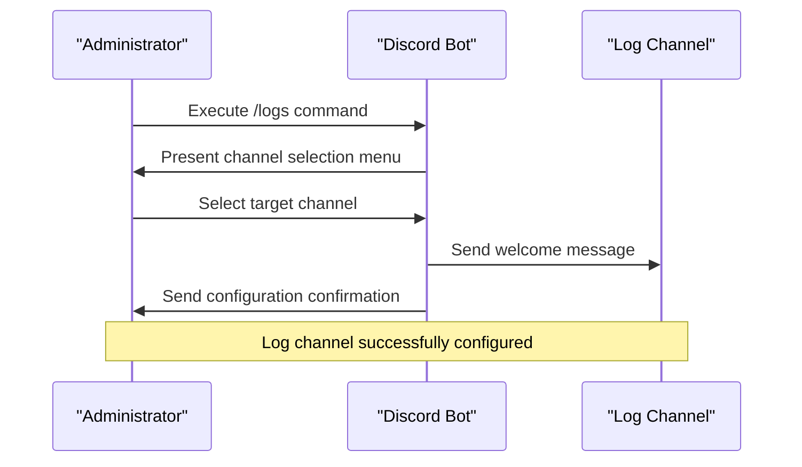
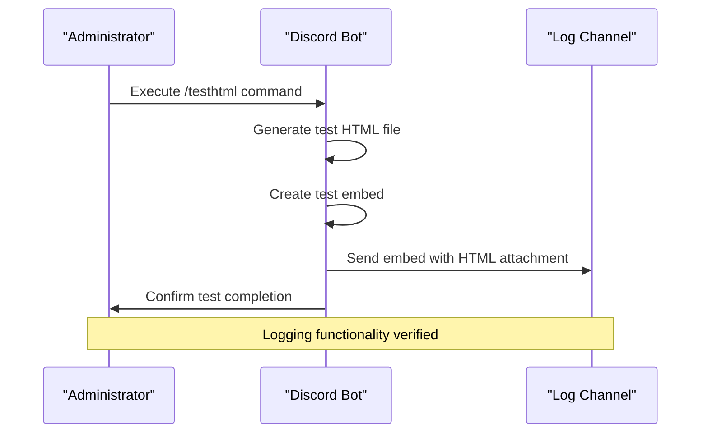
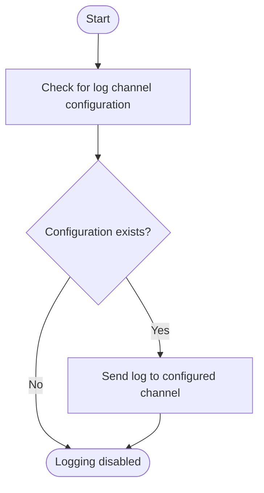
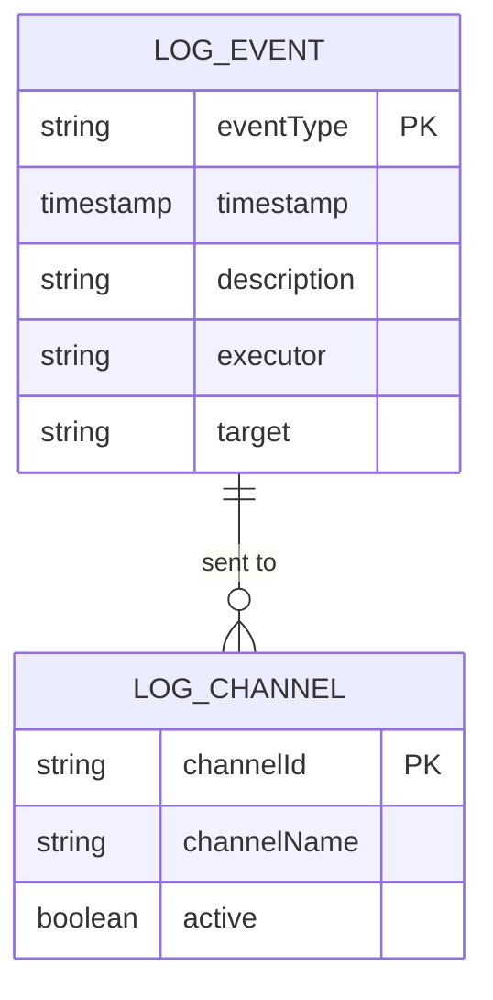
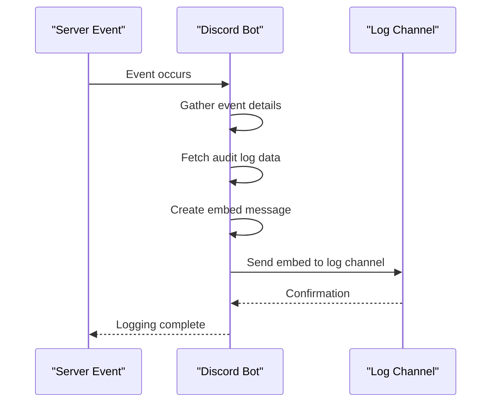
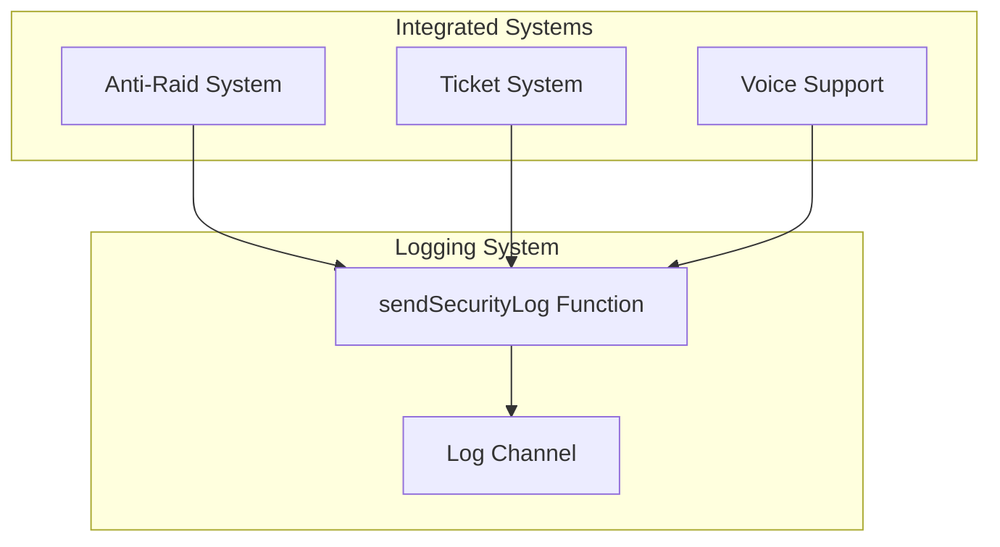
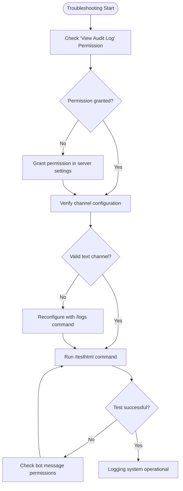

# Logging System Configuration

<cite>
**Referenced Files in This Document**   
- [ESQUEMA_BOT.md](file://ESQUEMA_BOT.md)
- [LISTA-COMANDOS.md](file://LISTA-COMANDOS.md)
- [index.js](file://index.js)
</cite>

## Table of Contents
1. [Introduction](#introduction)
2. [Enabling and Configuring the Log Channel](#enabling-and-configuring-the-log-channel)
3. [Testing Logging Functionality](#testing-logging-functionality)
4. [Disabling Logs](#disabling-logs)
5. [Logged Events Overview](#logged-events-overview)
6. [Log Formatting and Delivery](#log-formatting-and-delivery)
7. [Integration with Other Systems](#integration-with-other-systems)
8. [Common Issues and Troubleshooting](#common-issues-and-troubleshooting)
9. [Conclusion](#conclusion)

## Introduction
The logging system in this Discord bot provides comprehensive monitoring of server activities, security events, and user interactions. This documentation details how to configure, test, and manage the logging system, including all logged events such as message edits/deletions, user joins/leaves, bans/unbans, role changes, ticket activities, and anti-raid actions. The system integrates with various bot features and provides detailed embed-based notifications to the designated log channel.

**Section sources**
- [ESQUEMA_BOT.md](file://ESQUEMA_BOT.md#L102-L117)
- [LISTA-COMANDOS.md](file://LISTA-COMANDOS.md#L131-L132)

## Enabling and Configuring the Log Channel
To enable and configure the logging system, use the `/logs` command. This command is available to administrators and allows you to select a text channel where all server events will be recorded.

### Configuration Process
1. Execute the `/logs` command in any channel
2. The bot will present an interactive menu with all available text channels
3. Select the desired channel from the dropdown menu
4. The bot will confirm the configuration and send a welcome message to the selected log channel

### Configuration Requirements
- **Permissions**: The user must have Administrator permissions to configure the log channel
- **Channel Type**: Only text channels can be selected as log channels
- **Bot Permissions**: The bot requires the "View Audit Log" permission to capture detailed information about events

When a channel is successfully configured, the bot sends a confirmation embed to the user and a welcome message to the log channel itself, indicating that the logging system is active.

**Diagram sources **
- [index.js](file://index.js#L5355-L5402)
- [ESQUEMA_BOT.md](file://ESQUEMA_BOT.md#L113-L115)

**Section sources**
- [index.js](file://index.js#L5355-L5402)
- [ESQUEMA_BOT.md](file://ESQUEMA_BOT.md#L113-L115)

## Testing Logging Functionality
The bot provides multiple ways to test the logging functionality to ensure proper configuration and delivery.

### Using the /testhtml Command
Administrators can use the `/testhtml` command to generate a test HTML file and send it to the configured log channel along with a test embed. This command verifies that:
- The log channel is properly configured
- The bot can send messages to the log channel
- File attachments can be delivered

**Diagram sources **
- [index.js](file://index.js#L5230-L5289)

**Section sources**
- [index.js](file://index.js#L5230-L5289)

## Disabling Logs
To disable logging, simply re-run the `/logs` command and select a different channel or remove the current configuration. There is no explicit "disable" option, but removing the log channel configuration effectively stops all logging activities.

When no log channel is configured, the `sendSecurityLog` function checks for the presence of a log channel ID and returns early if none is found, preventing any log messages from being sent.

**Diagram sources **
- [index.js](file://index.js#L880-L887)

**Section sources**
- [index.js](file://index.js#L880-L887)

## Logged Events Overview
The logging system automatically records various server events as specified in the documentation. These events are categorized and logged with detailed information.

### Message Events
- **Message Edits**: When a user edits a message, the system logs the original and edited content
- **Message Deletions**: When a message is deleted, the system logs the message content and author

### User Events
- **User Joins**: Records when users join the server, including account age
- **User Leaves**: Records when users leave, distinguishing between voluntary leaves and kicks
- **Bans**: Logs when users are banned, including the executor and reason
- **Unbans**: Logs when users are unbanned, including the executor

### Role Events
- **Role Additions**: Logs when roles are added to users
- **Role Removals**: Logs when roles are removed from users

### Ticket Events
- **Ticket Creation**: Logs when tickets are opened
- **Ticket Closure**: Logs when tickets are closed, including generation of HTML/PDF records

### Anti-Raid Events
- **Spam Detection**: Logs when spam is detected and messages are deleted
- **Link Filtering**: Logs when unauthorized links are removed
- **Bot Expulsion**: Logs when unauthorized bots are kicked
- **Channel Spam Prevention**: Logs when users are blocked for creating/deleting channels excessively

**Diagram sources **
- [ESQUEMA_BOT.md](file://ESQUEMA_BOT.md#L104-L112)
- [index.js](file://index.js#L2271-L2439)

**Section sources**
- [ESQUEMA_BOT.md](file://ESQUEMA_BOT.md#L104-L112)
- [index.js](file://index.js#L2271-L2439)

## Log Formatting and Delivery
All logs are formatted as Discord embeds and sent to the configured log channel. The embeds follow a consistent structure with specific colors and information fields for different event types.

### Embed Structure
- **Title**: Clear indication of the event type with appropriate emoji
- **Description**: Detailed information about the event, including user mentions, reasons, and additional context
- **Color**: Event-specific colors (green for joins/positive actions, red for leaves/negative actions, orange for warnings)
- **Thumbnail**: User avatar when applicable
- **Footer**: Additional metadata such as timestamps and member counts
- **Timestamp**: Automatic timestamp showing when the event occurred

### Delivery Process
1. Event occurs in the server
2. Bot detects the event through Discord gateway events
3. Bot gathers relevant information, including audit log data when available
4. Bot creates an embed with the formatted information
5. Bot sends the embed to the configured log channel
6. If the log channel is not configured, the event is not recorded

The `sendSecurityLog` function handles the delivery process, checking for the presence of a configured log channel and handling potential errors in message delivery.

**Diagram sources **
- [index.js](file://index.js#L880-L933)
- [index.js](file://index.js#L2271-L2439)

**Section sources**
- [index.js](file://index.js#L880-L933)
- [index.js](file://index.js#L2271-L2439)

## Integration with Other Systems
The logging system is deeply integrated with other bot features, providing comprehensive monitoring across multiple subsystems.

### Anti-Raid Integration
The logging system works closely with the anti-raid protection system, recording all security-related events:
- Spam detection and message deletion
- Link filtering actions
- Unauthorized bot expulsions
- Channel spam prevention measures
- Progressive punishment tracking

When anti-raid actions occur, the system creates detailed logs that include the infraction count, action taken, and relevant context.

### Ticket System Integration
The logging system integrates with the ticket management system by:
- Logging ticket creation events
- Recording ticket closure with HTML/PDF generation
- Notifying staff roles when tickets are opened
- Generating comprehensive records of ticket interactions

When a ticket is closed, the system generates HTML and/or PDF files containing the complete ticket history and attaches them to the log message.

### Voice Support Integration
The logging system also integrates with the voice support system by:
- Logging when users join the waiting room
- Recording when staff move users to support channels
- Documenting sanctions applied to users who violate voice support rules
- Tracking queue positions and wait times

**Diagram sources **
- [index.js](file://index.js#L1954-L1962)
- [index.js](file://index.js#L5831-L5876)
- [index.js](file://index.js#L637-L658)

**Section sources**
- [index.js](file://index.js#L1954-L1962)
- [index.js](file://index.js#L5831-L5876)
- [index.js](file://index.js#L637-L658)

## Common Issues and Troubleshooting
Several common issues can prevent the logging system from functioning correctly. This section addresses the most frequent problems and their solutions.

### Missing "View Audit Log" Permission
**Symptoms**: Logs show generic information without executor details or reasons.

**Solution**: Ensure the bot has the "View Audit Log" permission in the server settings. Without this permission, the bot cannot access audit log data to determine who performed actions and why.

### Incorrect Channel Configuration
**Symptoms**: No logs are appearing in the expected channel.

**Solutions**:
1. Verify the correct channel was selected using the `/logs` command
2. Ensure the selected channel is a text channel, not a voice channel
3. Check that the bot has permission to send messages in the selected channel
4. Reconfigure the log channel using the `/logs` command

### Log Delivery Problems
**Symptoms**: Intermittent or missing log messages.

**Troubleshooting Steps**:
1. Check bot connectivity and ensure it's online
2. Verify the log channel still exists and hasn't been deleted
3. Confirm the bot still has permission to send messages in the log channel
4. Check for rate limiting issues by monitoring the bot's message frequency
5. Review console logs for error messages related to log delivery

### Debugging Log Delivery
Administrators can use the `/testhtml` command to test log delivery. This command generates a test HTML file and sends it to the log channel with a test embed, verifying that:
- The log channel is properly configured
- The bot can send messages to the channel
- File attachments can be delivered successfully

If the test fails, check the bot's permissions and the channel configuration.

**Diagram sources **
- [index.js](file://index.js#L880-L933)
- [index.js](file://index.js#L5230-L5289)

**Section sources**
- [index.js](file://index.js#L880-L933)
- [index.js](file://index.js#L5230-L5289)

## Conclusion
The logging system provides comprehensive monitoring of server activities through the `/logs` command configuration. Administrators can enable logging by selecting a dedicated text channel, test functionality with the `/testhtml` command, and troubleshoot issues related to permissions and channel configuration. The system automatically records critical events including message edits/deletions, user joins/leaves, bans/unbans, role changes, ticket activities, and anti-raid actions. Logs are formatted as detailed embeds and integrated with other bot systems like anti-raid protection and ticket management. Proper configuration requires the bot to have the "View Audit Log" permission to capture complete event details.