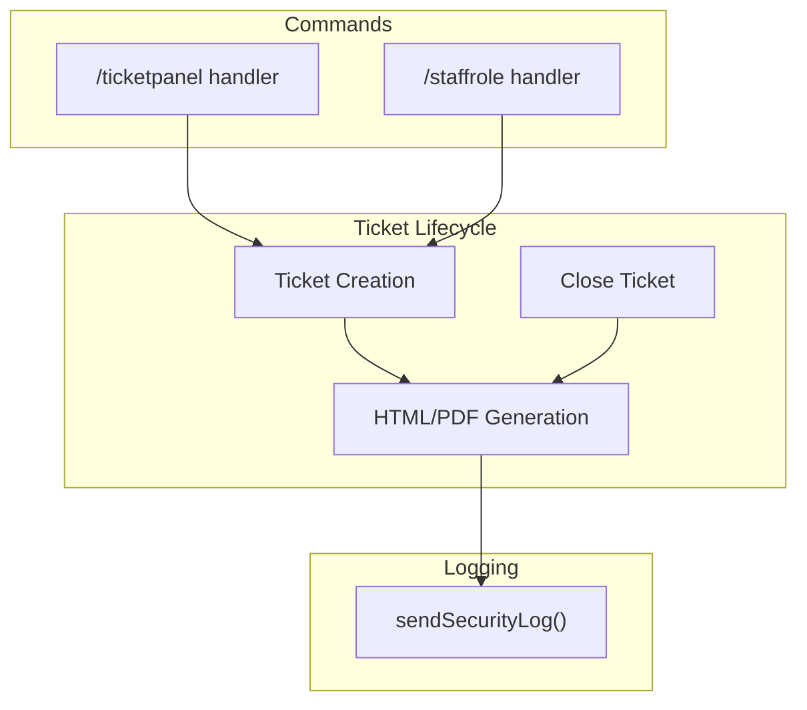
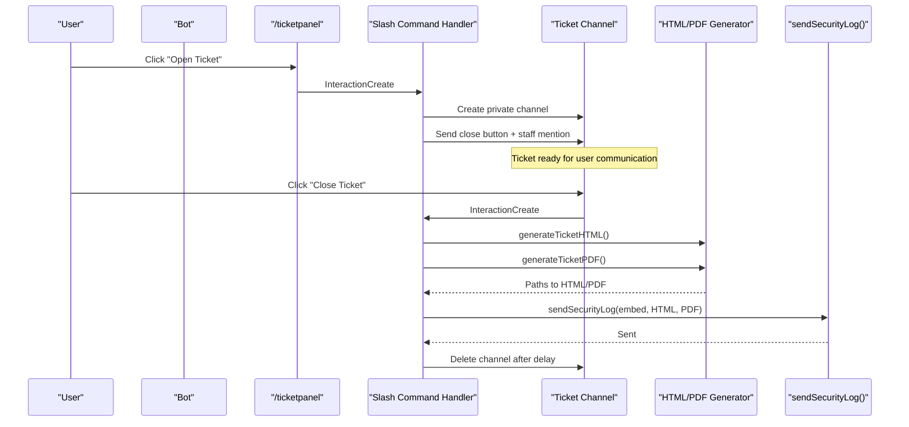
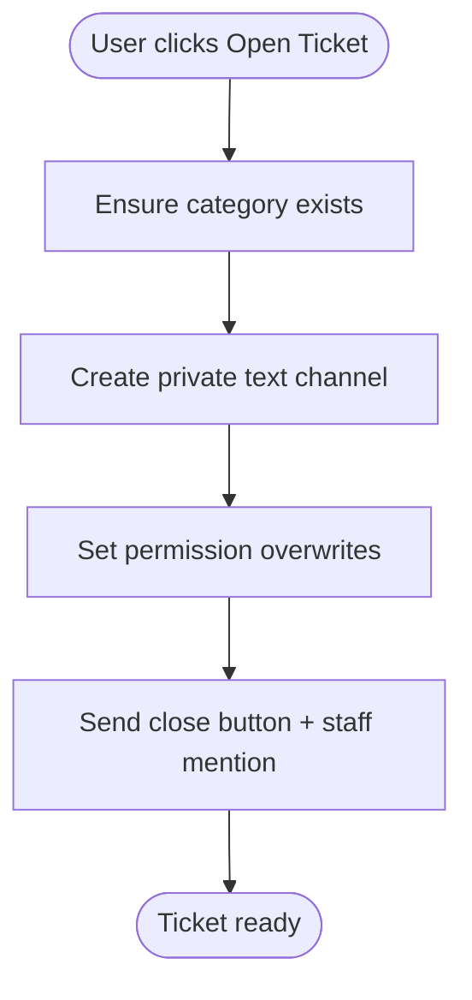
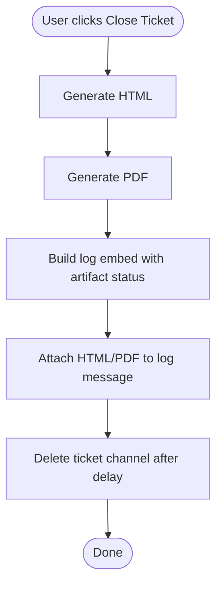
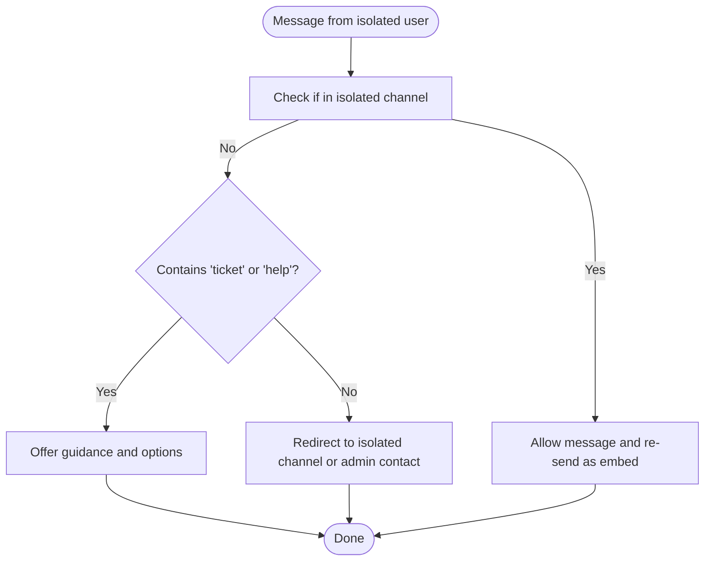
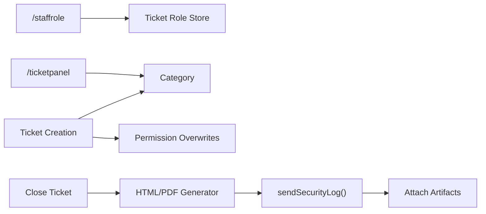

# Ticket System Configuration

<cite>
**Referenced Files in This Document**
- [index.js](file://index.js)
- [LISTA-COMANDOS.md](file://LISTA-COMANDOS.md)
- [README.md](file://README.md)
- [TICKET_PDF_FEATURE.md](file://TICKET_PDF_FEATURE.md)
</cite>

## Table of Contents
1. [Introduction](#introduction)
2. [Project Structure](#project-structure)
3. [Core Components](#core-components)
4. [Architecture Overview](#architecture-overview)
5. [Detailed Component Analysis](#detailed-component-analysis)
6. [Dependency Analysis](#dependency-analysis)
7. [Performance Considerations](#performance-considerations)
8. [Troubleshooting Guide](#troubleshooting-guide)
9. [Conclusion](#conclusion)

## Introduction
This document explains how to configure and operate the ticket system, including setting up the ticket panel, configuring the staff role, creating special tickets for isolated users, and enabling automatic HTML generation upon ticket closure. It also covers the integration between ticket closure, HTML generation, and the logging system, along with practical configuration sequences and troubleshooting tips.

## Project Structure
The ticket system spans several areas of the codebase:
- Command handlers for ticket panel and staff role configuration
- Ticket creation and closure logic
- HTML/PDF generation utilities
- Logging integration for ticket events
- Recommended configuration sequence

**Diagram sources**
- [index.js](file://index.js#L5210-L5228)
- [index.js](file://index.js#L4613-L4622)
- [index.js](file://index.js#L5847-L5893)
- [index.js](file://index.js#L881-L934)

**Section sources**
- [index.js](file://index.js#L5210-L5228)
- [index.js](file://index.js#L4613-L4622)
- [index.js](file://index.js#L5847-L5893)
- [index.js](file://index.js#L881-L934)

## Core Components
- Ticket panel command: publishes a button to open tickets and mentions the configured staff role.
- Staff role configuration: sets the role used for staff mentions in tickets.
- Ticket creation: creates a private text channel under a dedicated category, sends a close button and staff mention.
- Ticket closure: generates HTML and PDF, logs the event, and deletes the channel.
- Logging integration: attaches generated artifacts to the log message and records ticket events.

**Section sources**
- [index.js](file://index.js#L5210-L5228)
- [index.js](file://index.js#L4613-L4622)
- [index.js](file://index.js#L5847-L5893)
- [index.js](file://index.js#L881-L934)

## Architecture Overview
The ticket system integrates with Discord’s slash commands and message interactions. When a user clicks the “Open Ticket” button, the bot creates a private channel, sends a “Close Ticket” button, and mentions the configured staff role. On closure, the bot generates HTML and PDF artifacts, stores them locally, and attaches them to a log message in the configured log channel.

**Diagram sources**
- [index.js](file://index.js#L5210-L5228)
- [index.js](file://index.js#L5847-L5893)
- [index.js](file://index.js#L881-L934)

## Detailed Component Analysis

### Ticket Panel Setup (/ticketpanel)
- Purpose: Publishes a panel with a button to open tickets.
- Permissions: Requires ManageChannels.
- Behavior: Sends an embed with a primary button labeled “Open Ticket”. The panel is posted in the channel where the command is executed.

Practical usage:
- Run the command in the desired channel.
- Ensure the staff role is configured before publishing the panel.

**Section sources**
- [index.js](file://index.js#L5210-L5228)
- [README.md](file://README.md#L26-L31)
- [LISTA-COMANDOS.md](file://LISTA-COMANDOS.md#L30-L33)

### Staff Role Configuration (/staffrole)
- Purpose: Sets the staff role used for mentions in tickets.
- Permissions: Requires ManageRoles.
- Behavior: Stores the selected role per guild and uses it when creating tickets.

Practical usage:
- Run the command with the desired staff role.
- The role is stored in memory per guild.

**Section sources**
- [index.js](file://index.js#L4613-L4622)
- [README.md](file://README.md#L26-L31)
- [LISTA-COMANDOS.md](file://LISTA-COMANDOS.md#L30-L33)

### Ticket Creation Workflow
- Category: The bot ensures a dedicated category exists and creates the ticket channel under it.
- Permissions: Everyone is denied ViewChannel; the creator is granted ViewChannel and SendMessages.
- Close Button: Adds a danger-styled button labeled “Close Ticket”.
- Staff Mention: Mentions the configured staff role when the ticket opens.

**Diagram sources**
- [index.js](file://index.js#L5787-L5817)

**Section sources**
- [index.js](file://index.js#L5787-L5817)

### Ticket Closure and Automatic HTML Generation
- Trigger: User clicks “Close Ticket”.
- Actions:
  - Generate HTML and PDF artifacts.
  - Send a log embed to the configured log channel with attached artifacts.
  - Delete the ticket channel after a short delay.

**Diagram sources**
- [index.js](file://index.js#L5847-L5893)
- [index.js](file://index.js#L881-L934)

**Section sources**
- [index.js](file://index.js#L5847-L5893)
- [index.js](file://index.js#L881-L934)

### Automatic HTML Generation Details
- Storage: Artifacts are saved in the local tickets/ directory with filenames derived from the ticket name and timestamp.
- Attachment: The HTML artifact is attached to the log message when a ticket is closed.
- Logging: The system logs whether HTML and/or PDF were generated.

**Section sources**
- [TICKET_PDF_FEATURE.md](file://TICKET_PDF_FEATURE.md#L27-L37)
- [index.js](file://index.js#L881-L934)

### Special Tickets for Isolated Users
- Detection: When a user is in timeout, the bot detects this condition and provides guidance.
- Special handling: The bot does not auto-create a ticket for isolated users; it informs them of available channels and actions. A separate command exists for creating tickets, which can be used by isolated users who wish to open a ticket manually.

**Diagram sources**
- [index.js](file://index.js#L1771-L1837)

**Section sources**
- [index.js](file://index.js#L1771-L1837)

### Recommended Configuration Sequence
Follow this order to set up the system:
1. Configure logging channel (required for HTML/PDF attachments).
2. Set the staff role for tickets.
3. Publish the ticket panel.
4. Test the system.

Reference: The recommended initial setup sequence includes /logs, /staffrole, and /ticketpanel.

**Section sources**
- [LISTA-COMANDOS.md](file://LISTA-COMANDOS.md#L153-L166)
- [README.md](file://README.md#L74-L86)

## Dependency Analysis
- Command dependencies:
  - /ticketpanel depends on ManageChannels permission and the presence of a category for tickets.
  - /staffrole depends on ManageRoles permission and stores the role per guild.
- Ticket lifecycle dependencies:
  - Ticket creation depends on category existence and permission overwrites.
  - Ticket closure depends on HTML/PDF generation and logging integration.
- Logging integration:
  - sendSecurityLog() attaches artifacts to the log message and verifies file existence before attaching.

**Diagram sources**
- [index.js](file://index.js#L4613-L4622)
- [index.js](file://index.js#L5210-L5228)
- [index.js](file://index.js#L5787-L5817)
- [index.js](file://index.js#L5847-L5893)
- [index.js](file://index.js#L881-L934)

**Section sources**
- [index.js](file://index.js#L4613-L4622)
- [index.js](file://index.js#L5210-L5228)
- [index.js](file://index.js#L5787-L5817)
- [index.js](file://index.js#L5847-L5893)
- [index.js](file://index.js#L881-L934)

## Performance Considerations
- Message fetching during HTML/PDF generation uses paginated fetches; ensure the channel history is not excessively large to avoid long processing times.
- Local file I/O writes artifacts to disk; ensure adequate disk space and permissions.
- Logging with attachments adds overhead; monitor channel capacity and attachment limits.

[No sources needed since this section provides general guidance]

## Troubleshooting Guide
Common issues and resolutions:
- Missing permissions
  - /ticketpanel requires ManageChannels.
  - /staffrole requires ManageRoles.
  - Ticket creation requires permission to manage channels and create categories.
  - Resolution: Verify the bot has the required permissions and roles.

- Missing logging channel
  - HTML/PDF attachments require a configured log channel.
  - Resolution: Set the log channel via the logging system before closing tickets.

- HTML generation failures
  - If HTML generation fails, the ticket still closes; the log will indicate failure.
  - Resolution: Check disk permissions and free space; verify the tickets/ directory exists and is writable.

- PDF generation failures
  - If PDF generation fails, the log will indicate failure; HTML may still be generated.
  - Resolution: Confirm the PDF library is installed and the bot has write permissions.

- Staff role not applied
  - Ensure /staffrole was run and the role is configured per guild.
  - Resolution: Re-run /staffrole with the correct role.

- Isolated users cannot auto-open tickets
  - The system does not auto-create tickets for isolated users; it provides guidance and redirects.
  - Resolution: Isolated users can still open tickets manually using the panel after configuring the staff role.

**Section sources**
- [index.js](file://index.js#L5210-L5228)
- [index.js](file://index.js#L4613-L4622)
- [index.js](file://index.js#L5847-L5893)
- [index.js](file://index.js#L881-L934)
- [TICKET_PDF_FEATURE.md](file://TICKET_PDF_FEATURE.md#L61-L73)

## Conclusion
The ticket system is straightforward to configure: set the staff role, publish the ticket panel, and ensure logging is configured. Closing a ticket automatically generates HTML and PDF artifacts, logs the event, and attaches the artifacts to the configured log channel. For isolated users, the system provides guidance and does not auto-create tickets; they can still open tickets manually. Proper permissions and a writable tickets/ directory are essential for reliable operation.