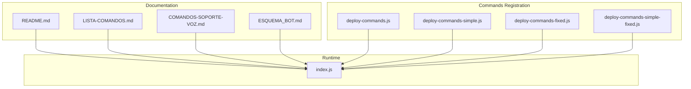
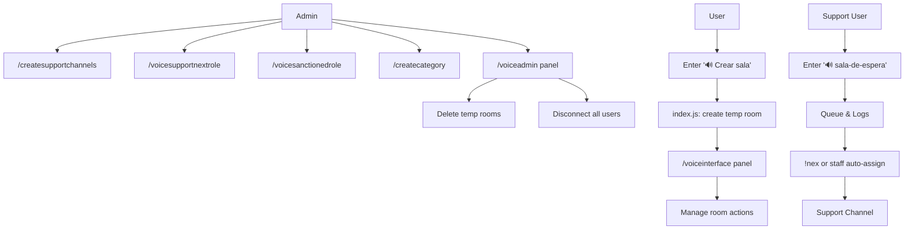
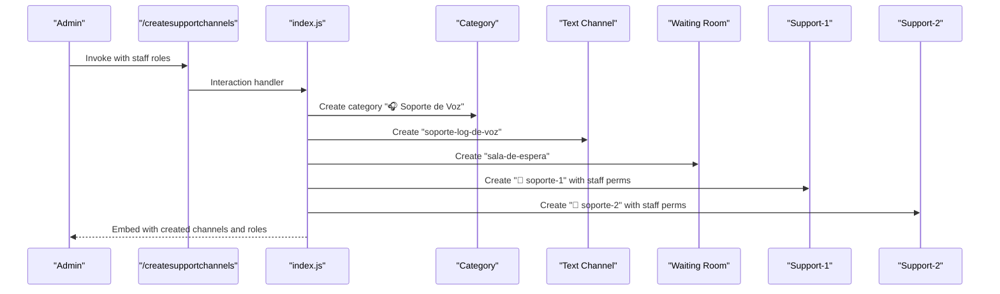
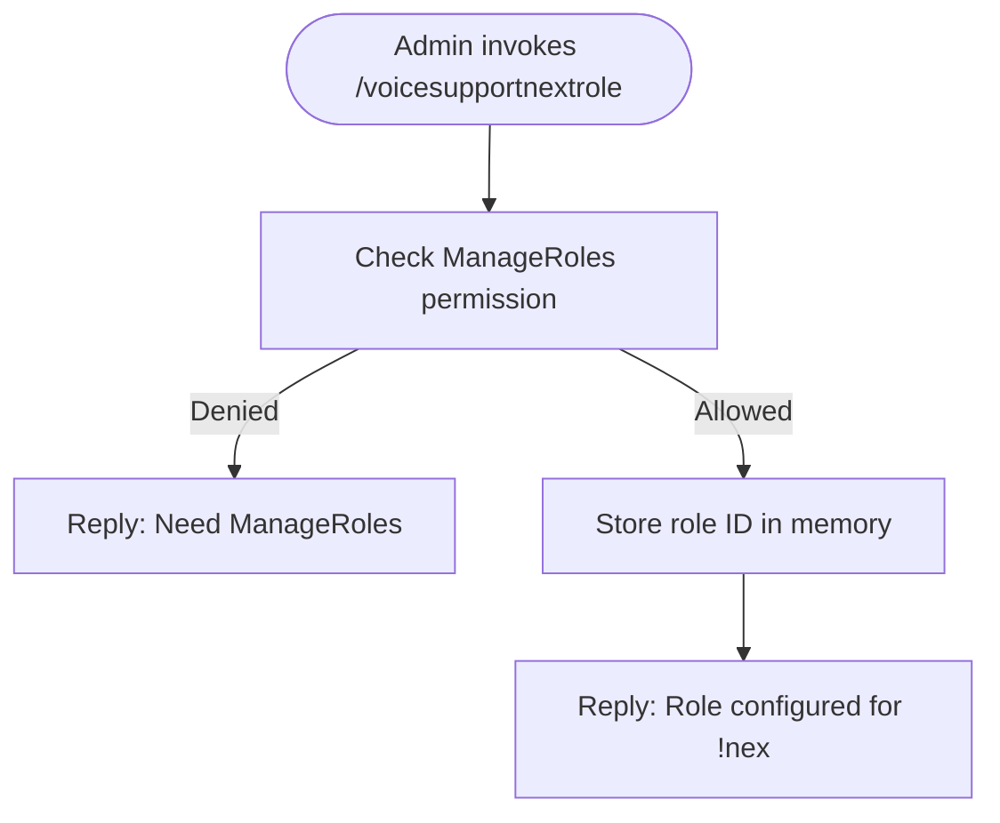
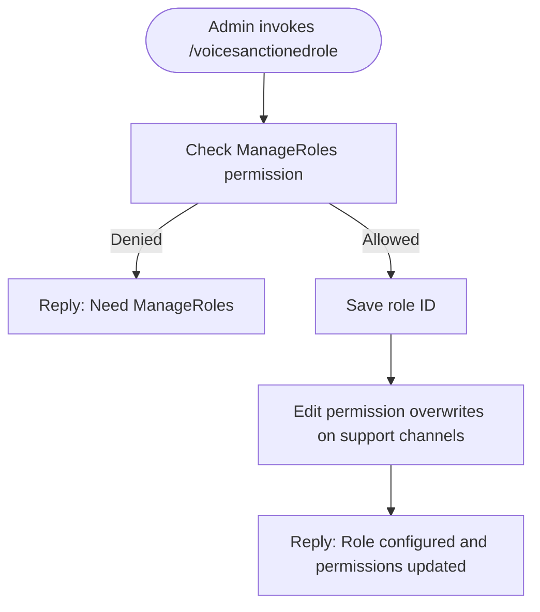
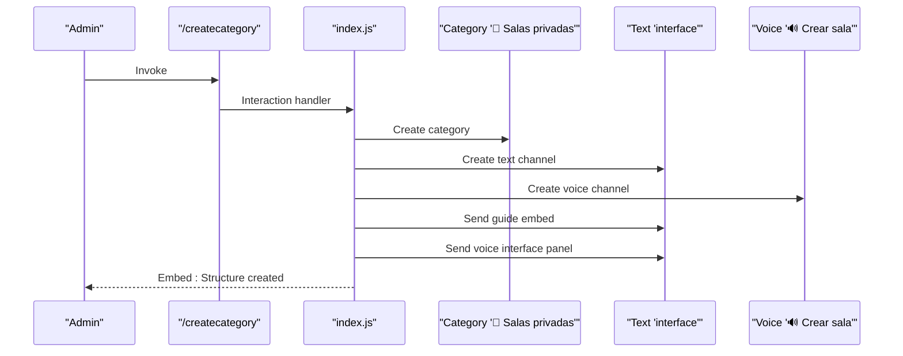
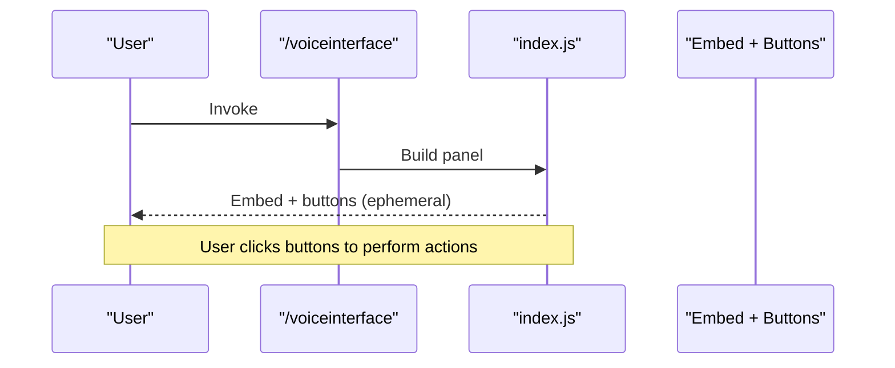
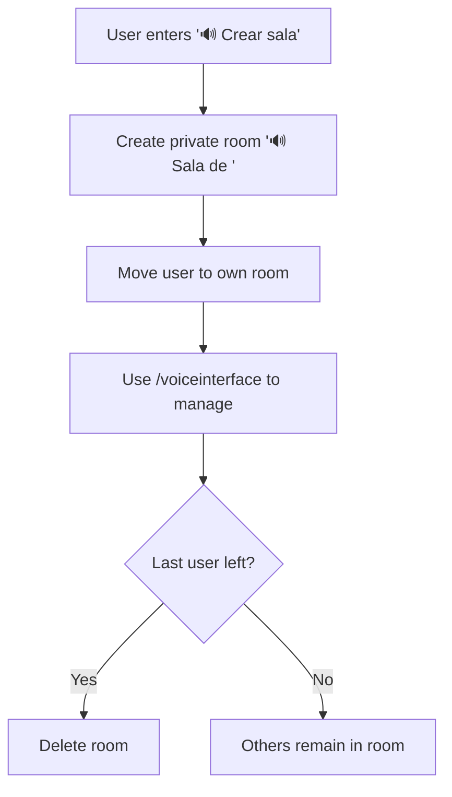
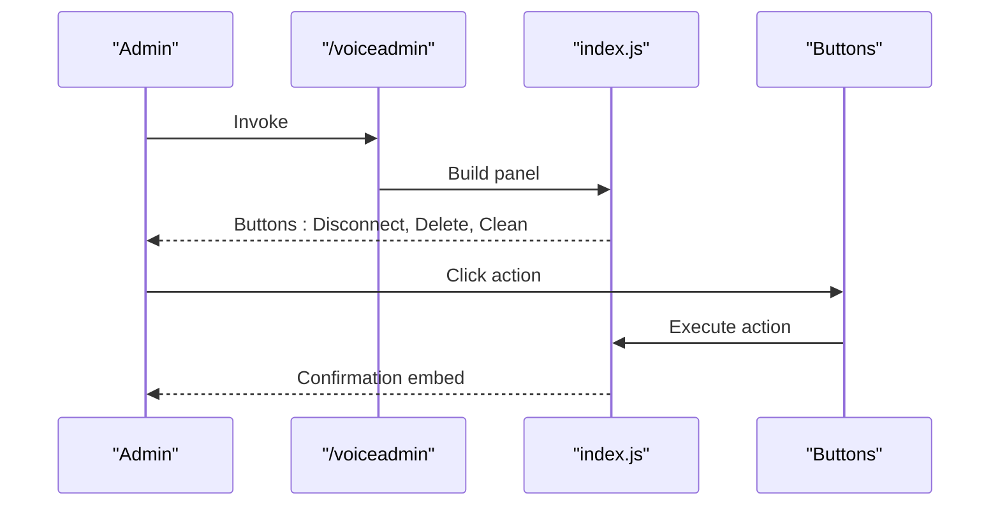
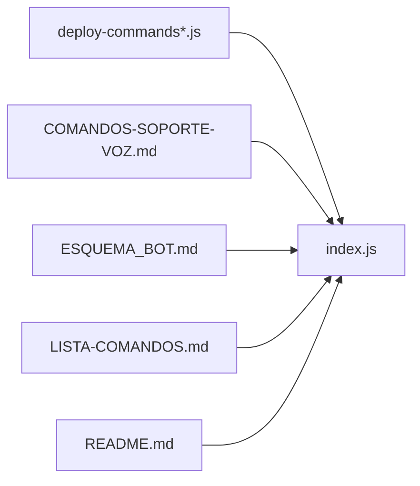

# Voice System Configuration

<cite>
**Referenced Files in This Document**
- [README.md](file://README.md)
- [LISTA-COMANDOS.md](file://LISTA-COMANDOS.md)
- [COMANDOS-SOPORTE-VOZ.md](file://COMANDOS-SOPORTE-VOZ.md)
- [ESQUEMA_BOT.md](file://ESQUEMA_BOT.md)
- [index.js](file://index.js)
- [deploy-commands.js](file://deploy-commands.js)
- [deploy-commands-simple.js](file://deploy-commands-simple.js)
- [deploy-commands-simple-fixed.js](file://deploy-commands-simple-fixed.js)
- [deploy-commands-fixed.js](file://deploy-commands-fixed.js)
</cite>

## Table of Contents
1. [Introduction](#introduction)
2. [Project Structure](#project-structure)
3. [Core Components](#core-components)
4. [Architecture Overview](#architecture-overview)
5. [Detailed Component Analysis](#detailed-component-analysis)
6. [Dependency Analysis](#dependency-analysis)
7. [Performance Considerations](#performance-considerations)
8. [Troubleshooting Guide](#troubleshooting-guide)
9. [Conclusion](#conclusion)
10. [Appendices](#appendices)

## Introduction
This document explains how to configure the voice support system and temporary voice channels in the bot. It covers:
- Creating voice support channels with /createsupportchannels
- Configuring the !nex command role with /voicesupportnextrole
- Setting up sanctioned roles with /voicesanctionedrole
- Creating temporary voice categories with /createcategory
- Using the voice interface (/voiceinterface) to manage private channels
- Bulk management via /voiceadmin
- Automatic creation and deletion of voice channels based on user presence
- Common configuration pitfalls and solutions

## Project Structure
The voice system spans documentation and implementation files:
- Documentation: README.md, LISTA-COMANDOS.md, COMANDOS-SOPORTE-VOZ.md, ESQUEMA_BOT.md
- Command registration: deploy-commands*.js
- Runtime logic: index.js (slash commands, voice events, panels)

**Diagram sources**
- [README.md](file://README.md#L52-L61)
- [LISTA-COMANDOS.md](file://LISTA-COMANDOS.md#L16-L24)
- [COMANDOS-SOPORTE-VOZ.md](file://COMANDOS-SOPORTE-VOZ.md#L1-L30)
- [ESQUEMA_BOT.md](file://ESQUEMA_BOT.md#L43-L47)
- [deploy-commands.js](file://deploy-commands.js#L54-L79)
- [deploy-commands-simple.js](file://deploy-commands-simple.js#L112-L129)
- [deploy-commands-fixed.js](file://deploy-commands-fixed.js#L44-L71)
- [deploy-commands-simple-fixed.js](file://deploy-commands-simple-fixed.js#L32-L71)
- [index.js](file://index.js#L4893-L4988)

**Section sources**
- [README.md](file://README.md#L52-L61)
- [LISTA-COMANDOS.md](file://LISTA-COMANDOS.md#L16-L24)
- [COMANDOS-SOPORTE-VOZ.md](file://COMANDOS-SOPORTE-VOZ.md#L1-L30)
- [ESQUEMA_BOT.md](file://ESQUEMA_BOT.md#L43-L47)
- [deploy-commands.js](file://deploy-commands.js#L54-L79)
- [deploy-commands-simple.js](file://deploy-commands-simple.js#L112-L129)
- [deploy-commands-fixed.js](file://deploy-commands-fixed.js#L44-L71)
- [deploy-commands-simple-fixed.js](file://deploy-commands-simple-fixed.js#L32-L71)
- [index.js](file://index.js#L4893-L4988)

## Core Components
- Voice Support Channels: Created under a dedicated category with waiting room, two support channels, and a logs text channel. Permission overwrites restrict general access to staff-only channels.
- Temporary Voice Rooms: A category with an interface text channel and a “Create Room” voice channel. Entering the lobby triggers automatic room creation and ownership assignment.
- Voice Interface (/voiceinterface): An interactive panel to rename, limit, privacy, invite, kick, claim, transfer, and delete rooms.
- Voice Admin (/voiceadmin): Administrative panel to disconnect all users, delete temporary rooms, and clean voice channels.

**Section sources**
- [COMANDOS-SOPORTE-VOZ.md](file://COMANDOS-SOPORTE-VOZ.md#L1-L30)
- [ESQUEMA_BOT.md](file://ESQUEMA_BOT.md#L43-L54)
- [README.md](file://README.md#L52-L61)
- [index.js](file://index.js#L4893-L4988)
- [index.js](file://index.js#L4992-L5044)
- [index.js](file://index.js#L4831-L4851)
- [index.js](file://index.js#L5325-L5352)

## Architecture Overview
The voice system integrates slash commands, event handlers, and persistent state to automate channel lifecycle and moderation.

**Diagram sources**
- [index.js](file://index.js#L4893-L4988)
- [index.js](file://index.js#L4992-L5044)
- [index.js](file://index.js#L2872-L2900)
- [index.js](file://index.js#L4831-L4851)
- [index.js](file://index.js#L5325-L5352)
- [COMANDOS-SOPORTE-VOZ.md](file://COMANDOS-SOPORTE-VOZ.md#L124-L174)

## Detailed Component Analysis

### Voice Support Channels Setup (/createsupportchannels)
- Creates a category named “🎧 Soporte de Voz” and the following channels:
  - Text: soporte-log-de-voz (logs)
  - Voice: sala-de-espera (waiting room)
  - Voice: soporte-1 (staff-only)
  - Voice: soporte-2 (staff-only)
- Applies permission overwrites so only configured staff roles can connect to support channels.
- Replies with a summary embed listing created channels and configured roles.

**Diagram sources**
- [index.js](file://index.js#L4893-L4988)

**Section sources**
- [COMANDOS-SOPORTE-VOZ.md](file://COMANDOS-SOPORTE-VOZ.md#L1-L30)
- [index.js](file://index.js#L4893-L4988)

### Configure !nex Role (/voicesupportnextrole)
- Sets which role can use the !nex command to move the next waiting user to a support channel.
- Validates permissions and stores the role ID for later use.

**Diagram sources**
- [index.js](file://index.js#L4746-L4774)

**Section sources**
- [COMANDOS-SOPORTE-VOZ.md](file://COMANDOS-SOPORTE-VOZ.md#L48-L63)
- [index.js](file://index.js#L4746-L4774)

### Sanctioned Role Setup (/voicesanctionedrole)
- Configures a role that will be moved automatically to a support channel if they enter the waiting room.
- Updates permission overwrites for existing support channels to allow the sanctioned role to connect and speak.

**Diagram sources**
- [index.js](file://index.js#L4746-L4774)

**Section sources**
- [COMANDOS-SOPORTE-VOZ.md](file://COMANDOS-SOPORTE-VOZ.md#L66-L82)
- [index.js](file://index.js#L4746-L4774)

### Temporary Voice Category (/createcategory)
- Creates a category “🍺 Salas privadas” with:
  - Text: interface
  - Voice: “🔊 Crear sala”
- Publishes a guide embed and the voice interface panel in the interface channel.
- Automatically creates a private room when a user enters the “🔊 Crear sala” voice channel.

**Diagram sources**
- [index.js](file://index.js#L4992-L5044)

**Section sources**
- [README.md](file://README.md#L52-L61)
- [ESQUEMA_BOT.md](file://ESQUEMA_BOT.md#L43-L54)
- [index.js](file://index.js#L4992-L5044)

### Voice Interface (/voiceinterface)
- Builds an interactive panel with actions for managing a private room:
  - Rename
  - Set user limit
  - Toggle privacy
  - Invite users
  - Kick users
  - Claim ownership
  - Transfer ownership
  - Delete room
- Provides ephemeral replies and handles errors gracefully.

**Diagram sources**
- [index.js](file://index.js#L4831-L4851)

**Section sources**
- [ESQUEMA_BOT.md](file://ESQUEMA_BOT.md#L43-L54)
- [index.js](file://index.js#L4831-L4851)

### Automatic Creation and Deletion of Voice Channels
- Temporary rooms:
  - Created automatically when a user joins “🔊 Crear sala”
  - Owned by the creator with manage permissions
  - Deleted automatically when the last user leaves
- Support channels:
  - Created by /createsupportchannels with staff-only permission overwrites
  - Logs are maintained in the text logs channel

**Diagram sources**
- [index.js](file://index.js#L2872-L2900)
- [index.js](file://index.js#L4992-L5044)

**Section sources**
- [ESQUEMA_BOT.md](file://ESQUEMA_BOT.md#L43-L54)
- [index.js](file://index.js#L2872-L2900)
- [index.js](file://index.js#L4992-L5044)

### Administrator Bulk Management (/voiceadmin)
- Opens a panel with:
  - Disconnect all users from voice
  - Delete all temporary rooms
  - Clean voice (disconnect + delete)
- Requires administrator permissions.

**Diagram sources**
- [index.js](file://index.js#L5325-L5352)

**Section sources**
- [README.md](file://README.md#L88-L98)
- [index.js](file://index.js#L5325-L5352)

## Dependency Analysis
- Command registration depends on deploy-commands*.js to define slash commands and their options.
- Runtime logic in index.js implements:
  - Support channel creation and permission overwrites
  - Temporary room creation and deletion
  - Voice interface panel building
  - Voice admin panel and actions
- Documentation files provide usage and configuration guidance.

**Diagram sources**
- [deploy-commands.js](file://deploy-commands.js#L54-L79)
- [deploy-commands-simple.js](file://deploy-commands-simple.js#L112-L129)
- [deploy-commands-fixed.js](file://deploy-commands-fixed.js#L44-L71)
- [deploy-commands-simple-fixed.js](file://deploy-commands-simple-fixed.js#L32-L71)
- [index.js](file://index.js#L4893-L4988)
- [COMANDOS-SOPORTE-VOZ.md](file://COMANDOS-SOPORTE-VOZ.md#L1-L30)
- [ESQUEMA_BOT.md](file://ESQUEMA_BOT.md#L43-L54)
- [LISTA-COMANDOS.md](file://LISTA-COMANDOS.md#L16-L24)
- [README.md](file://README.md#L52-L61)

**Section sources**
- [deploy-commands.js](file://deploy-commands.js#L54-L79)
- [deploy-commands-simple.js](file://deploy-commands-simple.js#L112-L129)
- [deploy-commands-fixed.js](file://deploy-commands-fixed.js#L44-L71)
- [deploy-commands-simple-fixed.js](file://deploy-commands-simple-fixed.js#L32-L71)
- [index.js](file://index.js#L4893-L4988)
- [COMANDOS-SOPORTE-VOZ.md](file://COMANDOS-SOPORTE-VOZ.md#L1-L30)
- [ESQUEMA_BOT.md](file://ESQUEMA_BOT.md#L43-L54)
- [LISTA-COMANDOS.md](file://LISTA-COMANDOS.md#L16-L24)
- [README.md](file://README.md#L52-L61)

## Performance Considerations
- Permission updates on existing support channels occur during /voicesanctionedrole; batch updates are handled with try/catch to avoid partial failures.
- Automatic room creation occurs on voice state change; ensure the bot has sufficient rate limits and minimal latency to handle concurrent joins.
- Voice admin actions iterate over cached channels; large servers should consider pagination or filtering to reduce overhead.

[No sources needed since this section provides general guidance]

## Troubleshooting Guide
Common configuration pitfalls and solutions:
- Missing permissions to create channels or manage roles:
  - Ensure the bot has Administrator and Manage Channels permissions.
  - Verify the bot’s role is above the roles it manages.
- Incorrect role permissions:
  - After setting /voicesanctionedrole, confirm permission overwrites were applied to existing support channels.
  - Use /voiceadmin to verify and clean up if needed.
- Missing channel creation rights:
  - When invoking /createcategory, ensure the bot can create channels in the target server.
  - Confirm the category and “🔊 Crear sala” voice channel were created successfully.
- Staff role not recognized:
  - When using /createsupportchannels, ensure the staff roles are correct and the bot can apply permission overwrites.
  - Re-run the command if permission overwrites failed on some channels.
- Voice interface not showing:
  - The panel is posted in the interface text channel; verify the channel exists and the bot can send messages.
  - Re-invoke /voiceinterface to regenerate the panel.
- Automatic room not created:
  - Ensure “🔊 Crear sala” exists and the bot has permission to create channels.
  - Check that the voice event handler is active and not blocked by rate limits.

**Section sources**
- [README.md](file://README.md#L128-L141)
- [index.js](file://index.js#L4992-L5044)
- [index.js](file://index.js#L4831-L4851)
- [index.js](file://index.js#L4746-L4774)

## Conclusion
The voice system provides a robust framework for support queues and temporary voice rooms. By following the documented steps and verifying permissions, administrators can deploy a scalable, automated voice infrastructure with minimal manual intervention. Use /voiceadmin for bulk cleanup and /voiceinterface for user-friendly room management.

[No sources needed since this section summarizes without analyzing specific files]

## Appendices

### Step-by-Step Configuration Flow (from LISTA-COMANDOS.md)
- Run /setup (recommended initial setup)
- Run /createsupportchannels with your primary staff role
- Run /voicesupportnextrole with the role allowed to use !nex
- Run /voicesanctionedrole with the sanctioned role
- Optionally run /addsupportrole to include additional staff roles
- Run /createcategory to set up temporary voice rooms
- Use /voiceinterface to manage private rooms
- Use /voiceadmin for bulk management

**Section sources**
- [LISTA-COMANDOS.md](file://LISTA-COMANDOS.md#L153-L166)
- [COMANDOS-SOPORTE-VOZ.md](file://COMANDOS-SOPORTE-VOZ.md#L278-L300)