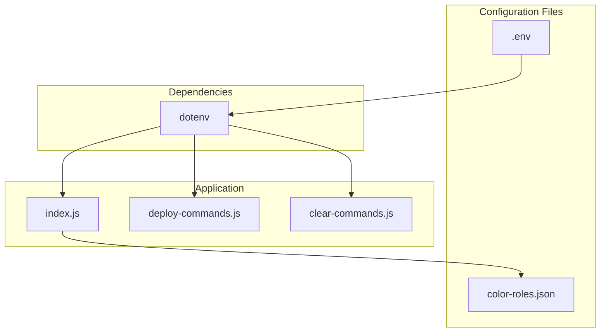
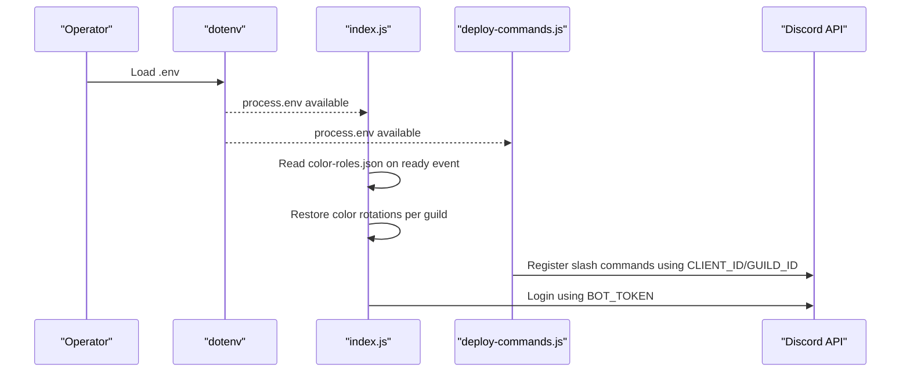
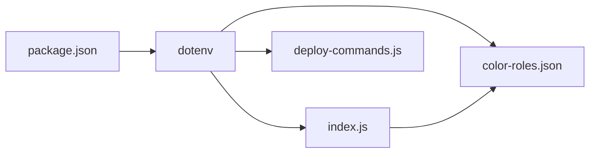

# Configuration

<cite>
**Referenced Files in This Document**
- [index.js](file://index.js)
- [deploy-commands.js](file://deploy-commands.js)
- [clear-commands.js](file://clear-commands.js)
- [color-roles.json](file://color-roles.json)
- [package.json](file://package.json)
- [README.md](file://README.md)
- [ESQUEMA_BOT.md](file://ESQUEMA_BOT.md)
</cite>

## Table of Contents
1. [Introduction](#introduction)
2. [Project Structure](#project-structure)
3. [Core Components](#core-components)
4. [Architecture Overview](#architecture-overview)
5. [Detailed Component Analysis](#detailed-component-analysis)
6. [Dependency Analysis](#dependency-analysis)
7. [Performance Considerations](#performance-considerations)
8. [Troubleshooting Guide](#troubleshooting-guide)
9. [Conclusion](#conclusion)

## Introduction
This section documents the bot’s configuration system, focusing on:
- The .env file for sensitive credentials (BOT_TOKEN, CLIENT_ID, GUILD_ID)
- The color-roles.json file for persistent color role settings across restarts
- How dotenv loads environment variables and how the application uses them
- Security considerations and best practices for managing configuration across environments
- Troubleshooting tips for configuration-related issues

## Project Structure
The configuration system spans a small set of files:
- Environment variables are loaded via dotenv at startup and used by the main application and deployment scripts
- Persistent color role settings are stored in a JSON file that is read on startup and written when color role settings change

**Diagram sources**
- [index.js](file://index.js#L1-L10)
- [deploy-commands.js](file://deploy-commands.js#L1-L10)
- [clear-commands.js](file://clear-commands.js#L1-L10)
- [color-roles.json](file://color-roles.json#L1-L10)
- [package.json](file://package.json#L10-L25)

**Section sources**
- [index.js](file://index.js#L1-L10)
- [deploy-commands.js](file://deploy-commands.js#L1-L10)
- [clear-commands.js](file://clear-commands.js#L1-L10)
- [package.json](file://package.json#L10-L25)

## Core Components
- .env file: Stores sensitive credentials and identifiers used by the bot and deployment scripts
- color-roles.json: Stores per-server color role configuration for persistence across restarts
- dotenv: Loads environment variables into process.env for use by the application and scripts

Key behaviors:
- dotenv is required at the top of the main application and deployment scripts
- The main application reads color-roles.json on startup to restore color rotations
- The main application writes to color-roles.json when color role settings change or are stopped
- Deployment scripts read environment variables to register slash commands

**Section sources**
- [index.js](file://index.js#L1-L10)
- [index.js](file://index.js#L708-L727)
- [index.js](file://index.js#L5143-L5152)
- [index.js](file://index.js#L5190-L5196)
- [deploy-commands.js](file://deploy-commands.js#L1-L10)
- [deploy-commands.js](file://deploy-commands.js#L279-L293)
- [clear-commands.js](file://clear-commands.js#L1-L10)

## Architecture Overview
The configuration architecture is straightforward:
- dotenv loads .env into process.env
- index.js uses process.env for bot token and logs the token presence
- deploy-commands.js uses process.env for CLIENT_ID and GUILD_ID to register commands
- color-roles.json persists color role settings keyed by guild ID

**Diagram sources**
- [index.js](file://index.js#L1-L10)
- [index.js](file://index.js#L708-L727)
- [index.js](file://index.js#L6902-L6903)
- [deploy-commands.js](file://deploy-commands.js#L1-L10)
- [deploy-commands.js](file://deploy-commands.js#L279-L293)

## Detailed Component Analysis

### .env File: Purpose and Format
- Purpose: Store sensitive credentials and identifiers required by the bot and deployment scripts
- Required entries:
  - BOT_TOKEN: The bot’s token used to authenticate with Discord
  - CLIENT_ID: The bot’s application ID used when registering slash commands
  - GUILD_ID: The target guild ID used when registering slash commands
- Format: Key-value pairs separated by equals signs, one per line
- Location: Root of the repository; dotenv loads it automatically at startup

How it is used:
- index.js requires dotenv and later uses process.env.BOT_TOKEN to log in
- deploy-commands.js requires dotenv and uses process.env.CLIENT_ID and process.env.GUILD_ID to register commands
- clear-commands.js also requires dotenv and uses process.env.BOT_TOKEN and process.env.CLIENT_ID/GUILD_ID

Best practices:
- Never commit .env to version control
- Use separate .env files for development and production
- Validate that required keys are present before running the bot or deploying commands

**Section sources**
- [README.md](file://README.md#L111-L116)
- [ESQUEMA_BOT.md](file://ESQUEMA_BOT.md#L170-L175)
- [index.js](file://index.js#L1-L10)
- [index.js](file://index.js#L6902-L6903)
- [deploy-commands.js](file://deploy-commands.js#L1-L10)
- [deploy-commands.js](file://deploy-commands.js#L279-L293)
- [clear-commands.js](file://clear-commands.js#L1-L10)

### color-roles.json: Structure and Persistence
- Purpose: Persist color role settings across bot restarts
- Structure: JSON object keyed by guild ID; each guild entry contains:
  - roleId: The ID of the role whose color rotates
  - speed: Rotation speed in seconds
- Loading on startup:
  - On the bot’s ready event, index.js reads color-roles.json and restores color rotations for each guild
- Writing on changes:
  - When a user sets a color role (/colorrole), index.js updates color-roles.json with the new roleId and speed
  - When a user stops color rotation (/stopcolor), index.js removes the guild entry from color-roles.json

Example structure:
- See [color-roles.json](file://color-roles.json#L1-L10)

Impact on behavior:
- Without color-roles.json, color rotations are not restored after restart
- With color-roles.json, color rotations resume automatically after restart

**Section sources**
- [index.js](file://index.js#L708-L727)
- [index.js](file://index.js#L5143-L5152)
- [index.js](file://index.js#L5190-L5196)
- [color-roles.json](file://color-roles.json#L1-L10)

### How dotenv Loads and Uses Configuration Values
- Loading:
  - dotenv is required at the top of index.js, deploy-commands.js, and clear-commands.js
- Usage:
  - index.js uses process.env.BOT_TOKEN to log in and prints a readiness message
  - deploy-commands.js uses process.env.CLIENT_ID and process.env.GUILD_ID to register slash commands
  - clear-commands.js uses process.env.BOT_TOKEN and process.env.CLIENT_ID/GUILD_ID to clear commands

Operational flow:
- Start the application or deployment script
- dotenv loads .env into process.env
- Scripts read required values and perform their tasks

**Section sources**
- [index.js](file://index.js#L1-L10)
- [index.js](file://index.js#L6902-L6903)
- [deploy-commands.js](file://deploy-commands.js#L1-L10)
- [deploy-commands.js](file://deploy-commands.js#L279-L293)
- [clear-commands.js](file://clear-commands.js#L1-L10)

### Security Considerations and Best Practices
- Protect .env:
  - Add .env to .gitignore to prevent accidental commits
  - Use different .env files for development and production
- Least privilege:
  - Ensure BOT_TOKEN is restricted and rotated periodically
  - Limit CLIENT_ID/GUILD_ID to trusted environments
- Validation:
  - Verify that required environment variables are present before starting the bot or deploying commands
- Separation of concerns:
  - Separate development and production credentials
  - Avoid hardcoding secrets in source files

[No sources needed since this section provides general guidance]

### Examples of Properly Formatted Configuration Files
- .env example:
  - See [README.md](file://README.md#L111-L116)
  - See [ESQUEMA_BOT.md](file://ESQUEMA_BOT.md#L170-L175)
- color-roles.json example:
  - See [color-roles.json](file://color-roles.json#L1-L10)

[No sources needed since this section references existing files]

### How Changes Affect Bot Behavior
- Changing BOT_TOKEN:
  - index.js will attempt to log in with the new token; if invalid, login will fail
- Changing CLIENT_ID/GUILD_ID:
  - deploy-commands.js will register commands under the new application and guild
- Adding/removing entries in color-roles.json:
  - index.js restores or clears color rotations on startup accordingly

**Section sources**
- [index.js](file://index.js#L6902-L6903)
- [index.js](file://index.js#L708-L727)
- [deploy-commands.js](file://deploy-commands.js#L279-L293)

## Dependency Analysis
- dotenv is declared as a dependency and is required by the main application and deployment scripts
- The application depends on environment variables for authentication and command registration
- The persistence mechanism depends on color-roles.json for runtime continuity

**Diagram sources**
- [package.json](file://package.json#L10-L25)
- [index.js](file://index.js#L1-L10)
- [deploy-commands.js](file://deploy-commands.js#L1-L10)
- [clear-commands.js](file://clear-commands.js#L1-L10)
- [color-roles.json](file://color-roles.json#L1-L10)

**Section sources**
- [package.json](file://package.json#L10-L25)
- [index.js](file://index.js#L1-L10)
- [deploy-commands.js](file://deploy-commands.js#L1-L10)
- [clear-commands.js](file://clear-commands.js#L1-L10)

## Performance Considerations
- Environment variable loading occurs at process start; keep .env minimal and only include required values
- Reading/writing color-roles.json is lightweight and happens on startup and on command execution
- Avoid frequent writes by batching configuration changes when possible

[No sources needed since this section provides general guidance]

## Troubleshooting Guide
Common issues and resolutions:
- Missing or invalid BOT_TOKEN:
  - Symptoms: Login fails or immediate disconnect
  - Resolution: Ensure .env contains a valid BOT_TOKEN and restart the bot
- Missing CLIENT_ID or GUILD_ID:
  - Symptoms: Command registration fails
  - Resolution: Ensure .env contains valid CLIENT_ID and GUILD_ID; redeploy commands
- color-roles.json not restored after restart:
  - Symptoms: Color rotations not active after restart
  - Resolution: Confirm color-roles.json exists and contains the correct guild ID entry; verify file permissions
- color-roles.json not updated when stopping color rotation:
  - Symptoms: Entry still present after /stopcolor
  - Resolution: Verify the write operation succeeded; check file permissions and disk availability

**Section sources**
- [index.js](file://index.js#L708-L727)
- [index.js](file://index.js#L5190-L5196)
- [README.md](file://README.md#L111-L116)
- [ESQUEMA_BOT.md](file://ESQUEMA_BOT.md#L170-L175)

## Conclusion
The configuration system relies on dotenv to load environment variables and on a simple JSON file for persistent color role settings. By following the documented structure and best practices, operators can securely manage credentials and ensure the bot behaves consistently across restarts and deployments.