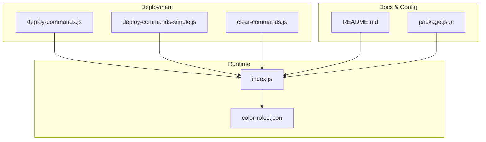
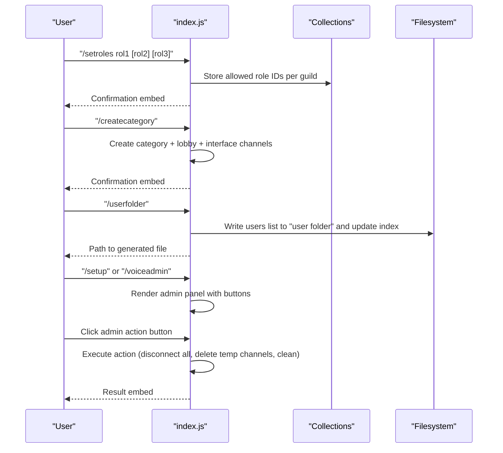
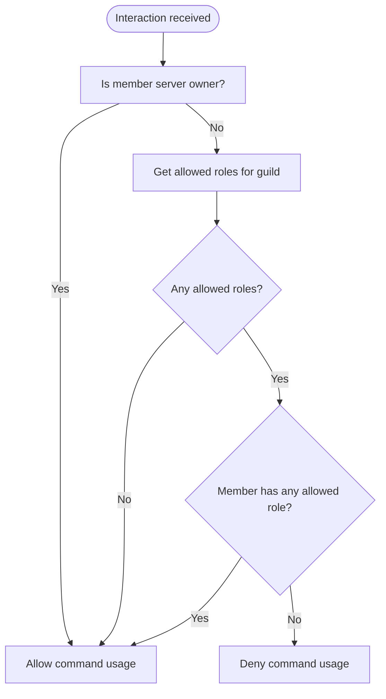
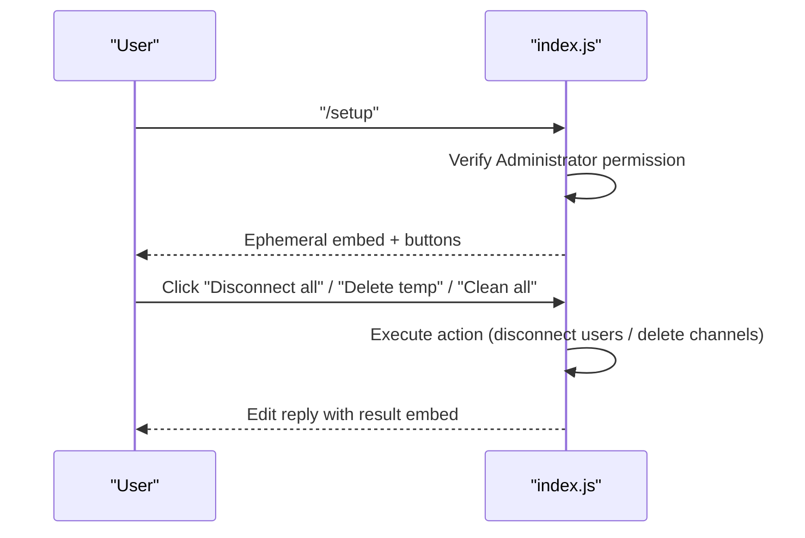
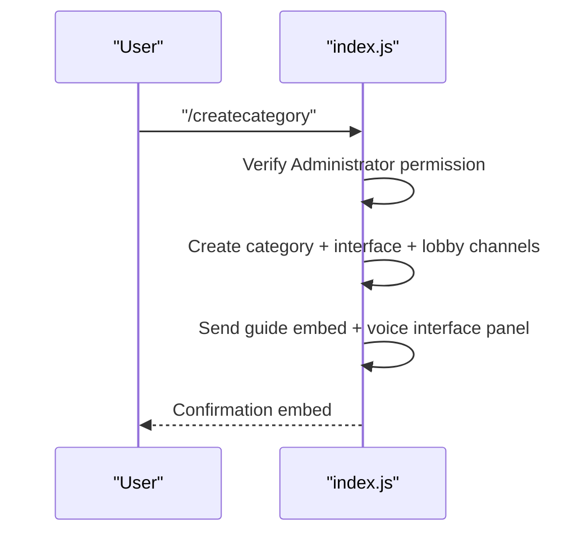
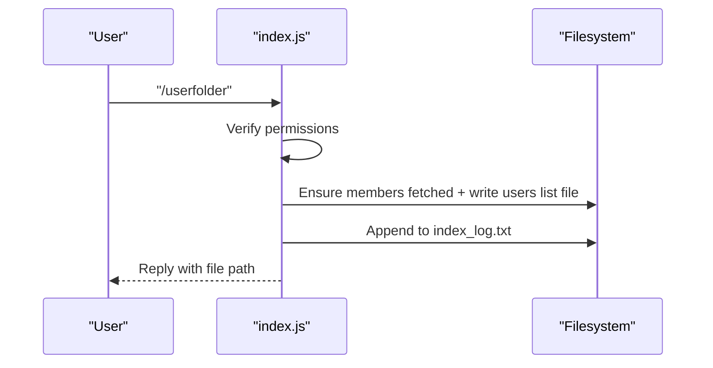
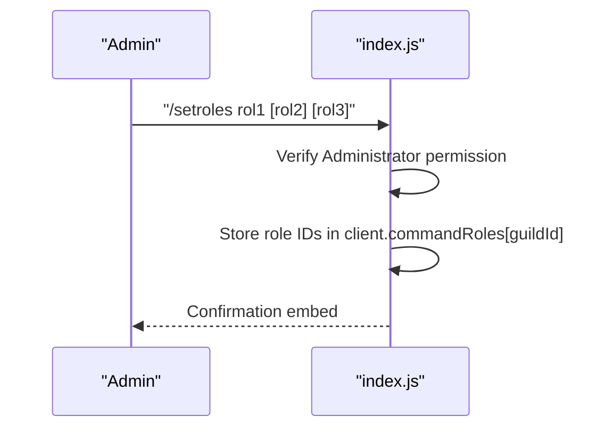
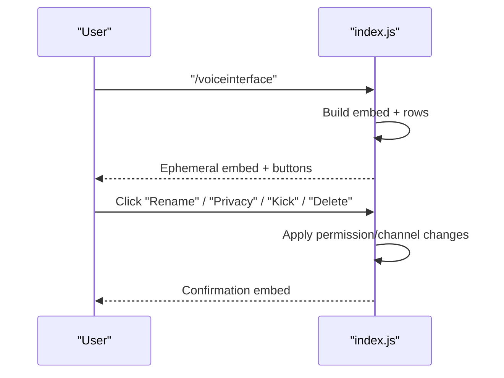
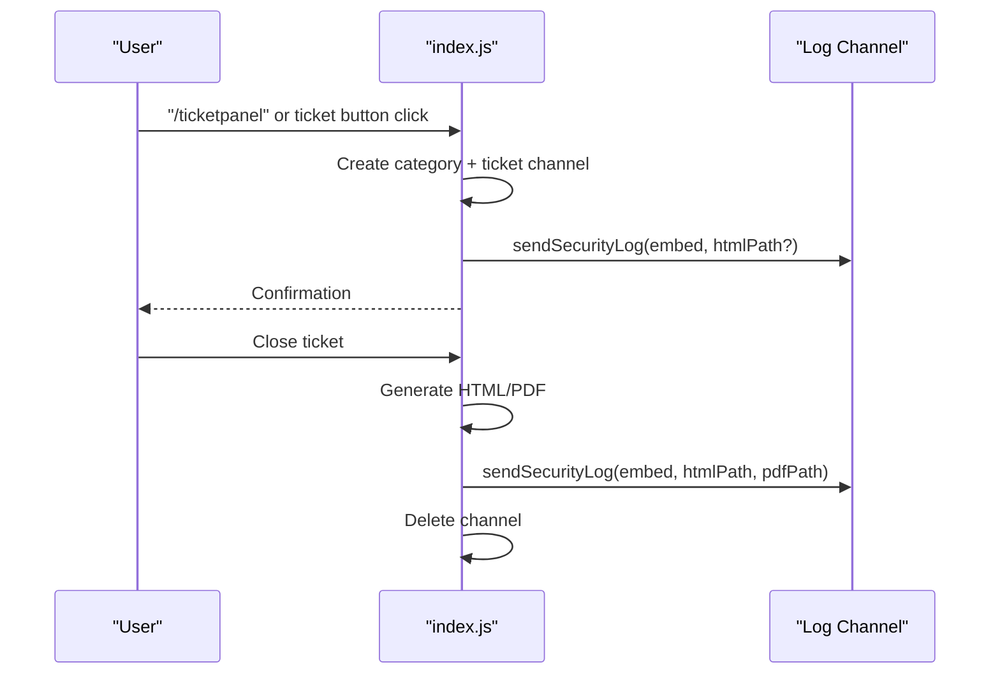
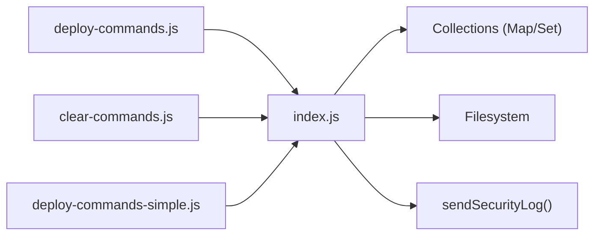

# Administration System

<cite>
**Referenced Files in This Document**
- [index.js](file://index.js)
- [deploy-commands.js](file://deploy-commands.js)
- [deploy-commands-simple.js](file://deploy-commands-simple.js)
- [clear-commands.js](file://clear-commands.js)
- [README.md](file://README.md)
- [package.json](file://package.json)
- [color-roles.json](file://color-roles.json)
</cite>

## Table of Contents
1. [Introduction](#introduction)
2. [Project Structure](#project-structure)
3. [Core Components](#core-components)
4. [Architecture Overview](#architecture-overview)
5. [Detailed Component Analysis](#detailed-component-analysis)
6. [Dependency Analysis](#dependency-analysis)
7. [Performance Considerations](#performance-considerations)
8. [Troubleshooting Guide](#troubleshooting-guide)
9. [Conclusion](#conclusion)
10. [Appendices](#appendices)

## Introduction
This document explains the Administration System of the Discord bot, focusing on server setup, voice administration, role management, and user folder generation. It covers how commands like /setup, /createcategory, /userfolder, and /setroles function within the bot’s administrative framework. It also details how Discord.js Collections are used to store command roles and how enforcement works across guilds, and provides examples from index.js for event handling and command registration logic.

## Project Structure
The Administration System spans several modules:
- Command registration scripts that define and deploy slash commands
- The main bot runtime (index.js) that handles interactions, events, and administrative logic
- Supporting scripts for clearing commands and simplified deployments
- Documentation and configuration files

**Diagram sources**
- [index.js](file://index.js#L1-L120)
- [deploy-commands.js](file://deploy-commands.js#L1-L60)
- [deploy-commands-simple.js](file://deploy-commands-simple.js#L1-L60)
- [clear-commands.js](file://clear-commands.js#L1-L30)
- [README.md](file://README.md#L1-L60)
- [package.json](file://package.json#L1-L27)
- [color-roles.json](file://color-roles.json#L1-L10)

**Section sources**
- [index.js](file://index.js#L1-L120)
- [deploy-commands.js](file://deploy-commands.js#L1-L60)
- [deploy-commands-simple.js](file://deploy-commands-simple.js#L1-L60)
- [clear-commands.js](file://clear-commands.js#L1-L30)
- [README.md](file://README.md#L1-L60)
- [package.json](file://package.json#L1-L27)

## Core Components
- Command Registration and Deployment
  - deploy-commands.js and deploy-commands-simple.js define and register slash commands scoped to a guild.
  - clear-commands.js removes all registered commands from the guild and optionally globally.
- Administrative Commands
  - /setup and /voiceadmin: administrative panels for managing voice channels and roles.
  - /createcategory: creates the “private rooms” category and lobby channel.
  - /userfolder: generates a user list file and logs it to a local index.
  - /setroles: configures which roles can use bot commands.
- Role Management Enforcement
  - A guild-scoped collection stores allowed role IDs per server.
  - A helper function checks whether a member can use bot commands based on configured roles.
- Voice Administration Features
  - Voice interface panel with buttons for renaming, limiting users, privacy, inviting, kicking, claiming, transferring, and deleting channels.
  - Temporary voice channels and cleanup logic.
- Logging and Tickets
  - Security logs to a configured channel with optional HTML/PDF attachments.
  - Ticket creation and closure with automatic file generation and deletion.

**Section sources**
- [deploy-commands.js](file://deploy-commands.js#L1-L120)
- [deploy-commands-simple.js](file://deploy-commands-simple.js#L80-L148)
- [index.js](file://index.js#L4791-L4825)
- [index.js](file://index.js#L4991-L5051)
- [index.js](file://index.js#L823-L934)
- [index.js](file://index.js#L5293-L5352)
- [index.js](file://index.js#L5325-L5351)
- [index.js](file://index.js#L5200-L5290)
- [README.md](file://README.md#L87-L103)

## Architecture Overview
The Administration System is event-driven. The bot listens for interactions (slash commands and button clicks), validates permissions, enforces role restrictions, executes administrative actions, and persists state in memory collections and local files.

**Diagram sources**
- [index.js](file://index.js#L4791-L4825)
- [index.js](file://index.js#L4991-L5051)
- [index.js](file://index.js#L823-L934)
- [index.js](file://index.js#L5293-L5352)
- [index.js](file://index.js#L5325-L5351)

## Detailed Component Analysis

### Command Registration and Enforcement
- Command Registration
  - deploy-commands.js and deploy-commands-simple.js define slash commands including /setup, /createcategory, /userfolder, and /setroles.
  - clear-commands.js clears all commands from the guild and optionally globally.
- Role-Based Access Control
  - A guild-scoped Map stores allowed role IDs per server.
  - A helper function checks if a member can use bot commands by verifying ownership or membership in allowed roles.

**Diagram sources**
- [index.js](file://index.js#L2983-L2997)

**Section sources**
- [deploy-commands.js](file://deploy-commands.js#L1-L120)
- [deploy-commands-simple.js](file://deploy-commands-simple.js#L80-L148)
- [clear-commands.js](file://clear-commands.js#L1-L30)
- [index.js](file://index.js#L2983-L2997)

### Server Setup and Voice Administration (/setup, /voiceadmin)
- /setup
  - Presents an ephemeral admin panel with actions to disconnect all users, delete temporary voice channels, and clean voice channels.
  - Requires Administrator permission.
- /voiceadmin
  - Alias of /setup with a focused voice administration view.

**Diagram sources**
- [index.js](file://index.js#L5293-L5352)
- [index.js](file://index.js#L5325-L5351)
- [index.js](file://index.js#L5895-L5999)

**Section sources**
- [index.js](file://index.js#L5293-L5352)
- [index.js](file://index.js#L5325-L5351)
- [index.js](file://index.js#L5895-L5999)

### Private Rooms Category Creation (/createcategory)
- Creates a “🍺 Salas privadas” category with:
  - An interface text channel
  - A lobby voice channel to trigger room creation
- Publishes a guide embed and the voice interface panel in the interface channel.

**Diagram sources**
- [index.js](file://index.js#L4991-L5051)

**Section sources**
- [index.js](file://index.js#L4991-L5051)

### User Folder Generation (/userfolder and !userfolder)
- Slash command (/userfolder)
  - Generates a user list file under a “user folder” directory with a timestamped filename and appends an entry to an index log.
  - Requires Administrator or Manage Guild permissions.
- Prefix command (!userfolder)
  - Same logic executed via message prefix command with identical permission checks.

**Diagram sources**
- [index.js](file://index.js#L823-L934)
- [index.js](file://index.js#L1026-L1081)

**Section sources**
- [index.js](file://index.js#L823-L934)
- [index.js](file://index.js#L1026-L1081)

### Role Management (/setroles)
- Configures which roles can use bot commands for a given guild.
- Stores allowed role IDs in a guild-scoped Map.
- Enforced by a helper function that allows owners or members with allowed roles.

**Diagram sources**
- [index.js](file://index.js#L4791-L4825)
- [index.js](file://index.js#L2983-L2997)

**Section sources**
- [index.js](file://index.js#L4791-L4825)
- [index.js](file://index.js#L2983-L2997)

### Voice Interface Panel and Channel Management
- Builds a persistent voice interface panel with buttons for:
  - Rename, limit users, privacy, invite, kick, claim, transfer, delete, and info.
- Executes actions against the user’s current voice channel when applicable.

**Diagram sources**
- [index.js](file://index.js#L4827-L4851)
- [index.js](file://index.js#L5552-L5762)

**Section sources**
- [index.js](file://index.js#L4827-L4851)
- [index.js](file://index.js#L5552-L5762)

### Logging and Tickets
- Security logging
  - Sends embeds to a configured log channel, optionally attaching HTML and PDF files.
- Ticket system
  - Creates a private ticket channel with a staff mention and a close button.
  - Generates ICO and HTML files upon creation and HTML/PDF upon closure.

**Diagram sources**
- [index.js](file://index.js#L5210-L5228)
- [index.js](file://index.js#L5764-L5893)
- [index.js](file://index.js#L880-L934)

**Section sources**
- [index.js](file://index.js#L5210-L5228)
- [index.js](file://index.js#L5764-L5893)
- [index.js](file://index.js#L880-L934)

## Dependency Analysis
- Runtime Dependencies
  - discord.js for interactions, collections, builders, and voice utilities.
  - dotenv for environment variables.
  - pdfkit for PDF generation.
- Internal Collections
  - client.commandRoles: allowed role IDs per guild.
  - client.tickets, client.voiceSupport* series, client.userWarnings, etc., for guild-scoped state.
- External Scripts
  - deploy-commands.js registers slash commands.
  - clear-commands.js clears commands.
  - deploy-commands-simple.js registers a minimal set of commands.

**Diagram sources**
- [index.js](file://index.js#L1-L120)
- [index.js](file://index.js#L880-L934)
- [deploy-commands.js](file://deploy-commands.js#L1-L60)
- [clear-commands.js](file://clear-commands.js#L1-L30)
- [deploy-commands-simple.js](file://deploy-commands-simple.js#L1-L60)

**Section sources**
- [index.js](file://index.js#L1-L120)
- [index.js](file://index.js#L880-L934)
- [deploy-commands.js](file://deploy-commands.js#L1-L60)
- [clear-commands.js](file://clear-commands.js#L1-L30)
- [deploy-commands-simple.js](file://deploy-commands-simple.js#L1-L60)

## Performance Considerations
- Command Permission Checks
  - Role checks are O(n) over allowed roles per guild; keep allowed role lists short for performance.
- File Operations
  - Writing user folders and logs is synchronous; avoid frequent bulk writes during peak usage.
- Voice Operations
  - Bulk disconnects and deletions iterate over channels and members; consider batching and rate-limiting.
- Logging Attachments
  - Attaching large HTML/PDF files increases payload size; ensure files are small and necessary.

[No sources needed since this section provides general guidance]

## Troubleshooting Guide
- Permission Denied
  - Many administrative commands require Administrator or Manage Roles/Channels. Verify the bot’s permissions and the user’s role hierarchy.
- Command Not Found
  - Ensure commands are deployed to the guild using the deployment scripts.
- Clearing Commands
  - Use clear-commands.js to remove duplicates or stale commands before redeploying.
- Role Restrictions Not Working
  - Confirm /setroles was executed and the roles are still valid. Check that the user has one of the configured roles.
- User Folder Generation Issues
  - Ensure the bot has permission to create files and directories. Verify Manage Guild/Administrator permissions are granted to the user invoking the command.
- Logging Not Sent
  - Confirm a log channel is configured and the bot can send messages to it.

**Section sources**
- [index.js](file://index.js#L4791-L4825)
- [index.js](file://index.js#L823-L934)
- [index.js](file://index.js#L5293-L5352)
- [index.js](file://index.js#L5325-L5351)
- [clear-commands.js](file://clear-commands.js#L1-L30)

## Conclusion
The Administration System centers around robust command registration, strict permission enforcement via role collections, and practical administrative tools for voice management, user data export, and logging. The design leverages Discord.js collections for state persistence and filesystem operations for audit trails, enabling scalable and secure server administration.

[No sources needed since this section summarizes without analyzing specific files]

## Appendices

### Command Reference and Parameters
- /setup
  - Purpose: Administrative panel for voice and roles.
  - Permissions: Administrator.
  - Behavior: Renders buttons to disconnect all, delete temporary channels, and clean voice channels.
- /voiceadmin
  - Purpose: Voice-focused administrative panel.
  - Permissions: Administrator.
  - Behavior: Same as /setup but streamlined for voice tasks.
- /createcategory
  - Purpose: Create “🍺 Salas privadas” category with lobby and interface channels.
  - Permissions: Administrator.
  - Behavior: Creates channels and publishes a guide embed.
- /userfolder
  - Purpose: Generate a user list file and append to index log.
  - Permissions: Administrator or Manage Guild.
  - Behavior: Writes a timestamped file under “user folder” and updates index.
- /setroles
  - Purpose: Configure allowed roles to use bot commands.
  - Permissions: Administrator.
  - Behavior: Stores role IDs per guild; enforcement occurs via helper function.

**Section sources**
- [index.js](file://index.js#L4991-L5051)
- [index.js](file://index.js#L5293-L5352)
- [index.js](file://index.js#L5325-L5351)
- [index.js](file://index.js#L823-L934)
- [index.js](file://index.js#L4791-L4825)

### Event Handling and Command Registration Logic
- Interaction Handler
  - Listens for chat input commands, verifies permissions, enforces role restrictions, and executes administrative actions.
- Deployment Scripts
  - Register slash commands to the guild and optionally clear existing commands.

**Section sources**
- [index.js](file://index.js#L3078-L3179)
- [index.js](file://index.js#L2983-L2997)
- [deploy-commands.js](file://deploy-commands.js#L1-L60)
- [clear-commands.js](file://clear-commands.js#L1-L30)