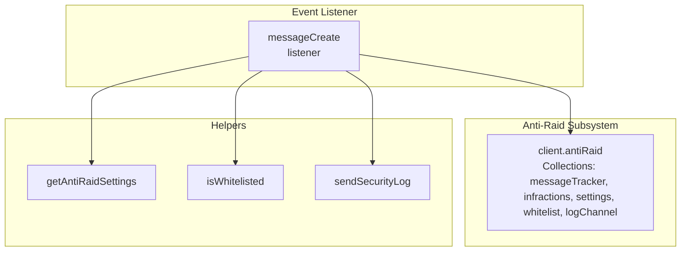
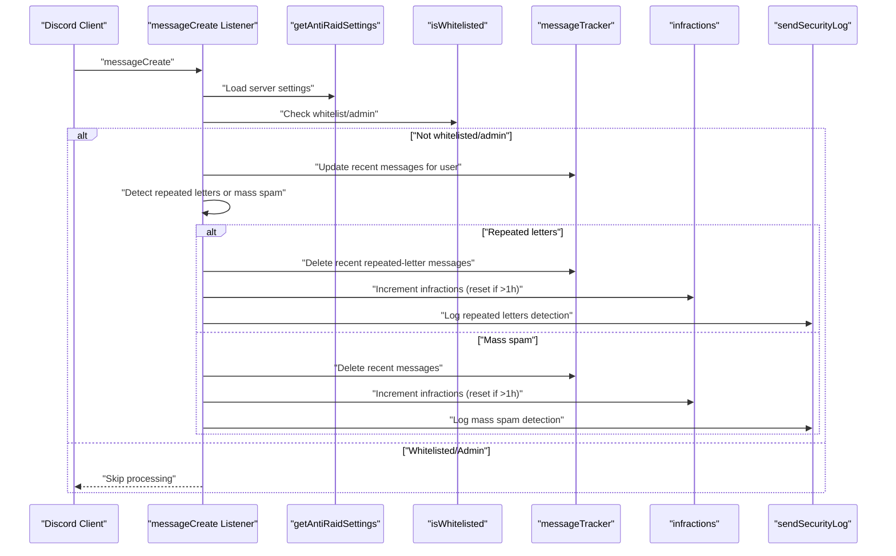
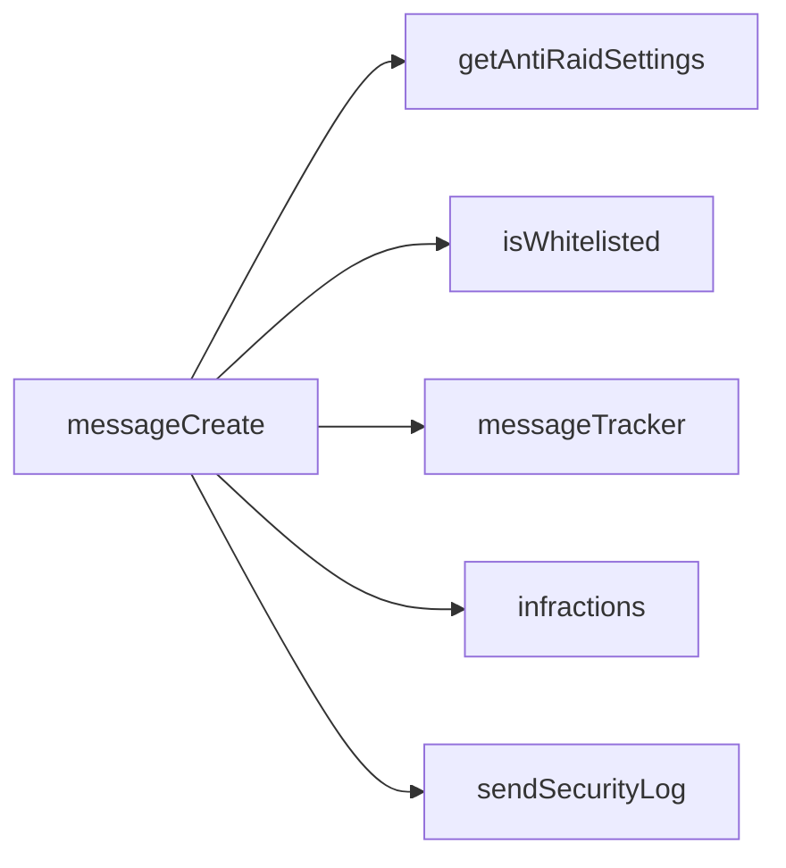

# Anti-Spam Protection

<cite>
**Referenced Files in This Document**
- [index.js](file://index.js)
- [ESQUEMA_BOT.md](file://ESQUEMA_BOT.md)
</cite>

## Table of Contents
1. [Introduction](#introduction)
2. [Project Structure](#project-structure)
3. [Core Components](#core-components)
4. [Architecture Overview](#architecture-overview)
5. [Detailed Component Analysis](#detailed-component-analysis)
6. [Dependency Analysis](#dependency-analysis)
7. [Performance Considerations](#performance-considerations)
8. [Troubleshooting Guide](#troubleshooting-guide)
9. [Conclusion](#conclusion)

## Introduction
This document explains the Anti-Spam Protection subsystem that monitors message frequency per user within a configurable time window. It covers:
- How the messageTracker collection stores recent messages per user
- The event listener for messageCreate that triggers spam detection
- Message deletion behavior during spam detection
- Progressive punishment via infractions and how timeouts are applied based on previous violations
- Interaction with the infractions system and logging
- Configuration defaults and parameters
- Strategies to minimize false positives and handle high-traffic scenarios

## Project Structure
The Anti-Spam logic is implemented in a single event listener for messageCreate and several helper functions. The anti-raid subsystem is initialized at startup and includes collections for message tracking, infractions, and settings.

**Diagram sources**
- [index.js](file://index.js#L520-L528)
- [index.js](file://index.js#L1026-L1027)
- [index.js](file://index.js#L943-L954)
- [index.js](file://index.js#L936-L940)
- [index.js](file://index.js#L880-L934)

**Section sources**
- [index.js](file://index.js#L520-L528)
- [index.js](file://index.js#L1026-L1027)
- [index.js](file://index.js#L943-L954)
- [index.js](file://index.js#L936-L940)
- [index.js](file://index.js#L880-L934)

## Core Components
- messageTracker: A per-guild-per-user collection storing recent messages with timestamps and IDs. Used to compute message frequency within a time window.
- infractions: A per-guild-per-user counter of violations, with a reset mechanism after inactivity.
- settings: Per-server configuration controlling anti-spam thresholds and windows.
- whitelist: Per-server list of exempt users/roles.
- logChannel: Per-server target channel for security logs.

Key behaviors:
- On messageCreate, the system checks server settings, whitelist, and admin permissions.
- If not whitelisted/admin, it updates messageTracker for the user and computes recent messages within the configured time window.
- If repeated letter spam is detected, it deletes recent repeated-letter messages and increments infractions.
- If mass spam is detected (exceeding maxMessages in timeWindow), it deletes recent messages and increments infractions.
- Infractions are logged and stored; progressive punishment logic is present but intentionally disabled in the current implementation to delegate enforcement to another bot.

**Section sources**
- [index.js](file://index.js#L1748-L1766)
- [index.js](file://index.js#L1848-L1863)
- [index.js](file://index.js#L1864-L1971)
- [index.js](file://index.js#L1973-L2068)
- [index.js](file://index.js#L1900-L1969)
- [index.js](file://index.js#L2000-L2068)
- [index.js](file://index.js#L943-L954)
- [index.js](file://index.js#L936-L940)
- [index.js](file://index.js#L880-L934)

## Architecture Overview
The Anti-Spam system is event-driven and modular:
- Event listener: messageCreate
- Data structures: messageTracker and infractions
- Configuration: getAntiRaidSettings
- Exemptions: isWhitelisted
- Logging: sendSecurityLog
- Delegation: progressive punishment logic is commented out to allow another bot to apply timeouts/bans

**Diagram sources**
- [index.js](file://index.js#L1026-L1027)
- [index.js](file://index.js#L1748-L1766)
- [index.js](file://index.js#L1848-L1863)
- [index.js](file://index.js#L1864-L1971)
- [index.js](file://index.js#L1973-L2068)
- [index.js](file://index.js#L943-L954)
- [index.js](file://index.js#L936-L940)
- [index.js](file://index.js#L880-L934)

## Detailed Component Analysis

### Event Listener: messageCreate
- Entry point: client.on("messageCreate", ...)
- Purpose: Monitor incoming messages and apply anti-spam logic.
- Early exits: If the message is from a bot, or if the command is a prefixed command handled elsewhere, the listener returns early to avoid double-processing.
- Anti-spam activation: Only runs when settings.antiSpam is enabled for the server.
- Whitelist/admin bypass: If the user is whitelisted or has Administrator permission, processing is skipped.
- Timeout/a isolation handling: If the user is currently in communicationDisabledUntil, special behavior applies depending on channel context.

Key invocation paths:
- [index.js](file://index.js#L1026-L1027)
- [index.js](file://index.js#L1748-L1766)
- [index.js](file://index.js#L1769-L1846)

**Section sources**
- [index.js](file://index.js#L1026-L1027)
- [index.js](file://index.js#L1748-L1766)
- [index.js](file://index.js#L1769-L1846)

### messageTracker: Frequency Monitoring
- Data structure: Map keyed by "guildId-userId" storing an array of recent messages.
- Each entry includes: timestamp, content, messageId.
- Cleanup: On each new message, entries older than settings.timeWindow are pruned.
- Detection:
  - Repeated letters: Count occurrences of single-letter messages within the window; if ≥ 3, delete recent repeats and increment infractions.
  - Mass spam: If recentMessages.length > settings.maxMessages, delete recent messages and increment infractions.

Important paths:
- [index.js](file://index.js#L1848-L1863)
- [index.js](file://index.js#L1864-L1971)
- [index.js](file://index.js#L1973-L2068)

**Section sources**
- [index.js](file://index.js#L1848-L1863)
- [index.js](file://index.js#L1864-L1971)
- [index.js](file://index.js#L1973-L2068)

### Infractions and Progressive Punishment
- Storage: Map keyed by "guildId-userId" with fields count and lastInfraction.
- Reset policy: If more than 1 hour has elapsed since lastInfraction, counters reset to zero.
- Punishment tiers: 10 progressive levels (1 minute to 1 day, then permanent ban). The actual enforcement is intentionally disabled in code comments to delegate to another bot.

Paths:
- [index.js](file://index.js#L1897-L1969)
- [index.js](file://index.js#L1999-L2068)

**Section sources**
- [index.js](file://index.js#L1897-L1969)
- [index.js](file://index.js#L1999-L2068)

### Configuration and Defaults
- Settings provider: getAntiRaidSettings(guildId)
- Defaults (when not configured):
  - antiSpam: true
  - maxMessages: 5
  - timeWindow: 5000 ms (5 seconds)
  - antiChannelSpam: true
  - maxChannelActions: 3
  - channelTimeWindow: 60000 ms (1 minute)
  - antiLinks: true
  - antiBots: true
- Reference: ESQUEMA_BOT.md lists Anti-Raid protections including 10 progressive punishment levels and anti-spam behavior.

Paths:
- [index.js](file://index.js#L943-L954)
- [ESQUEMA_BOT.md](file://ESQUEMA_BOT.md#L81-L101)

**Section sources**
- [index.js](file://index.js#L943-L954)
- [ESQUEMA_BOT.md](file://ESQUEMA_BOT.md#L81-L101)

### Logging and Security Audits
- sendSecurityLog(guild, embed, htmlPath?, pdfPath?): Sends an embed to the configured log channel, optionally attaching generated HTML/PDF files.
- Anti-Spam logs:
  - Repeated letters detection: Logs the user, violation count, action taken, and whether messages were deleted.
  - Mass spam detection: Logs the user, violation count, spam metrics, action taken, and whether messages were deleted.

Paths:
- [index.js](file://index.js#L880-L934)
- [index.js](file://index.js#L1954-L1962)
- [index.js](file://index.js#L2055-L2063)

**Section sources**
- [index.js](file://index.js#L880-L934)
- [index.js](file://index.js#L1954-L1962)
- [index.js](file://index.js#L2055-L2063)

### Interaction with Other Systems
- Whitelist and Admin bypass: Users on whitelist or with Administrator permission skip anti-spam checks.
- Isolation handling: If a user is in communicationDisabledUntil, the system treats them specially:
  - In their own isolated ticket channel, messages are allowed.
  - In a dedicated "isolated" channel, messages are re-sent as embeds and the original message is optionally deleted (currently disabled).
  - Otherwise, the user is redirected with a message indicating isolation and options to open a ticket.

Paths:
- [index.js](file://index.js#L1769-L1846)

**Section sources**
- [index.js](file://index.js#L1769-L1846)

## Dependency Analysis
- Internal dependencies:
  - messageCreate listener depends on getAntiRaidSettings, isWhitelisted, and sendSecurityLog.
  - messageTracker and infractions are part of client.antiRaid.
- External dependencies:
  - Discord.js client and events.
  - File system for optional HTML/PDF attachments in logs.

**Diagram sources**
- [index.js](file://index.js#L1026-L1027)
- [index.js](file://index.js#L943-L954)
- [index.js](file://index.js#L936-L940)
- [index.js](file://index.js#L880-L934)

**Section sources**
- [index.js](file://index.js#L1026-L1027)
- [index.js](file://index.js#L943-L954)
- [index.js](file://index.js#L936-L940)
- [index.js](file://index.js#L880-L934)

## Performance Considerations
- Time window and maxMessages tuning:
  - Lower timeWindow and higher maxMessages increase sensitivity to bursts but risk false positives.
  - Higher timeWindow and lower maxMessages reduce false positives but may miss rapid spam.
- messageTracker memory:
  - Each user keeps an array of recent messages; on high-traffic servers, consider increasing timeWindow or limiting maxMessages to reduce memory footprint.
- Deletion overhead:
  - Deleting many messages in a loop can be expensive; batching deletions or reducing the number of deletions may help.
- Infractions reset:
  - The 1-hour reset prevents long-term memory growth for infractions; keep this behavior to avoid accumulation.
- Isolation handling:
  - Embed forwarding in isolated channels avoids flooding logs but still incurs message sends; ensure the isolated channel is not overly verbose.

[No sources needed since this section provides general guidance]

## Troubleshooting Guide
Common issues and resolutions:
- Messages not being deleted:
  - Verify antiSpam is enabled and the user is not whitelisted/admin.
  - Ensure the bot has Manage Messages permission.
  - Check that the message is not in an isolated channel where deletion is disabled.
- False positives:
  - Increase timeWindow or decrease maxMessages.
  - Add trusted users/roles to whitelist.
  - Review repeated-letter detection logic if legitimate single-letter messages occur frequently.
- Infractions not counting:
  - Confirm that the user is not already in communicationDisabledUntil before counting.
  - Ensure infractions are not reset due to inactivity exceeding 1 hour.
- Logs not appearing:
  - Confirm a log channel is configured for the server.
  - Verify the bot has Send Messages permission in the log channel.

**Section sources**
- [index.js](file://index.js#L1748-L1766)
- [index.js](file://index.js#L1848-L1863)
- [index.js](file://index.js#L1864-L1971)
- [index.js](file://index.js#L1973-L2068)
- [index.js](file://index.js#L943-L954)
- [index.js](file://index.js#L880-L934)

## Conclusion
The Anti-Spam Protection subsystem uses messageTracker to monitor message frequency per user within a configurable time window. The messageCreate event listener applies checks for repeated letters and mass spam, deletes offending messages, increments infractions with a 1-hour reset policy, and logs detections. Progressive punishment logic is present but intentionally disabled to delegate enforcement to another bot. Proper configuration of settings and whitelist, combined with careful tuning of timeWindow and maxMessages, minimizes false positives while effectively mitigating spam on high-traffic servers.