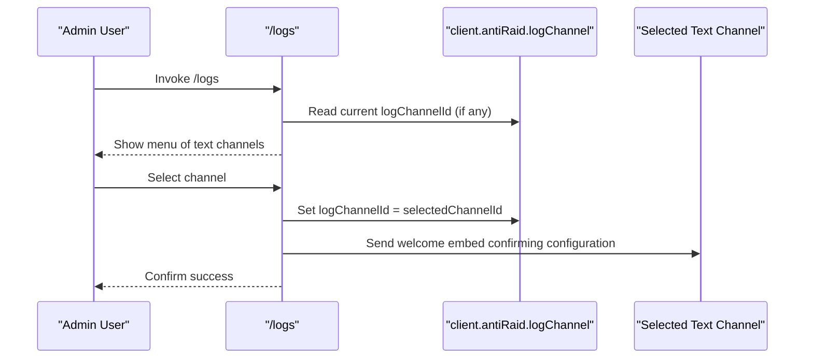
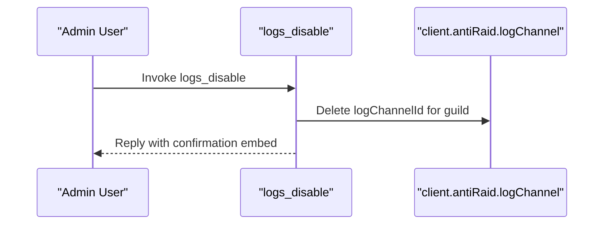
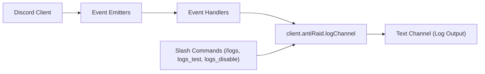

# Log Disabling

<cite>
**Referenced Files in This Document**
- [index.js](file://index.js)
- [README.md](file://README.md)
- [package.json](file://package.json)
</cite>

## Table of Contents
1. [Introduction](#introduction)
2. [Project Structure](#project-structure)
3. [Core Components](#core-components)
4. [Architecture Overview](#architecture-overview)
5. [Detailed Component Analysis](#detailed-component-analysis)
6. [Dependency Analysis](#dependency-analysis)
7. [Performance Considerations](#performance-considerations)
8. [Troubleshooting Guide](#troubleshooting-guide)
9. [Conclusion](#conclusion)

## Introduction
This document explains how logging is disabled in the server, focusing on the global mechanism that prevents logs from being sent when no log channel is configured. It also covers the command-driven interface for enabling/disabling logs, the absence of per-event-type toggles in the codebase, and the user experience when attempting to use logging features without a configured channel. Guidance is included for temporarily disabling logs during maintenance or debugging and for re-enabling them afterward, along with implications for moderation and audit trails.

## Project Structure
The logging system is implemented in a single-file application entry point. The relevant parts include:
- Anti-Raid and logging configuration storage
- Event handlers that conditionally send logs
- A centralized function that checks for a configured log channel before sending
- Slash commands to configure, test, and disable logs

```mermaid
graph TB
subgraph "Server"
Client["Discord Client"]
AntiRaid["Anti-Raid & Logging Config<br/>client.antiRaid.logChannel"]
end
subgraph "Event Handlers"
HandlerMsgDel["messageDelete"]
HandlerMsgEdit["messageUpdate"]
HandlerJoin["guildMemberAdd"]
HandlerLeave["guildMemberRemove"]
HandlerBan["guildBanAdd"]
HandlerUnban["guildBanRemove"]
HandlerRoles["guildMemberUpdate"]
HandlerAntiBot["guildMemberAdd (anti-bot)"]
HandlerAntiChan["channelCreate/Delete (anti-channel spam)"]
end
subgraph "Commands"
CmdLogs["/logs (configure)"]
CmdTest["logs_test (test)"]
CmdDisable["logs_disable (disable)"]
end
Client --> AntiRaid
Client --> HandlerMsgDel
Client --> HandlerMsgEdit
Client --> HandlerJoin
Client --> HandlerLeave
Client --> HandlerBan
Client --> HandlerUnban
Client --> HandlerRoles
Client --> HandlerAntiBot
Client --> HandlerAntiChan
CmdLogs --> AntiRaid
CmdTest --> AntiRaid
CmdDisable --> AntiRaid
```

**Diagram sources**
- [index.js](file://index.js#L520-L530)
- [index.js](file://index.js#L2218-L2439)
- [index.js](file://index.js#L5355-L5407)
- [index.js](file://index.js#L6349-L6374)
- [index.js](file://index.js#L6595-L6619)

**Section sources**
- [index.js](file://index.js#L520-L530)
- [README.md](file://README.md#L74-L86)

## Core Components
- Anti-Raid logging configuration storage: a per-guild map keyed by guild ID storing the log channel ID.
- Centralized logging function: checks for a configured log channel before sending logs.
- Event handlers: each event handler reads the configured log channel and sends logs only if present.
- Command interface: administrators can configure a log channel, send a test log, or disable logging globally.

Key implementation references:
- Anti-Raid logging storage initialization: [index.js](file://index.js#L520-L530)
- Centralized logging function: [index.js](file://index.js#L880-L919)
- Event handlers using the log channel: [index.js](file://index.js#L2218-L2439)
- Command to configure log channel: [index.js](file://index.js#L5355-L5407)
- Command to send test log: [index.js](file://index.js#L6349-L6361)
- Command to disable logs: [index.js](file://index.js#L6363-L6374)
- Command to finalize selection and set channel: [index.js](file://index.js#L6595-L6619)
- Command to select channel and set: [index.js](file://index.js#L6804-L6845)

**Section sources**
- [index.js](file://index.js#L520-L530)
- [index.js](file://index.js#L880-L919)
- [index.js](file://index.js#L2218-L2439)
- [index.js](file://index.js#L5355-L5407)
- [index.js](file://index.js#L6349-L6374)
- [index.js](file://index.js#L6595-L6619)
- [index.js](file://index.js#L6804-L6845)

## Architecture Overview
The logging architecture is event-driven and centralized around a single configuration map. When events occur, handlers check whether a log channel is configured for that guild. If not, the event is ignored for logging purposes. If configured, the handler builds an embed and sends it to the configured channel. Administrators can manage the log channel via slash commands.

**Diagram sources**
- [index.js](file://index.js#L5355-L5407)
- [index.js](file://index.js#L6804-L6845)
- [index.js](file://index.js#L6595-L6619)

## Detailed Component Analysis

### Global Log Disable Mechanism
- Primary disable: If no log channel is configured for a guild, logs are not sent for any event. This is enforced by checking the configured log channel ID before sending any log message.
- Conditional checks: Every event handler and the centralized logging function first retrieve the configured log channel ID and skip sending if absent.

Implementation references:
- Centralized logging function checks for configured channel and returns early if missing: [index.js](file://index.js#L880-L889)
- Event handlers check for configured channel and return early if missing: [index.js](file://index.js#L2218-L2230), [index.js](file://index.js#L2246-L2255), [index.js](file://index.js#L2271-L2280), [index.js](file://index.js#L2299-L2308), [index.js](file://index.js#L2332-L2341), [index.js](file://index.js#L2364-L2372), [index.js](file://index.js#L2394-L2401)

User experience when attempting to use logging features without a configured channel:
- The command to configure logs shows “No configured” and prompts selection of a channel.
- Sending a test log or triggering actions that would normally log will silently do nothing until a channel is configured.

**Section sources**
- [index.js](file://index.js#L880-L889)
- [index.js](file://index.js#L2218-L2230)
- [index.js](file://index.js#L2246-L2255)
- [index.js](file://index.js#L2271-L2280)
- [index.js](file://index.js#L2299-L2308)
- [index.js](file://index.js#L2332-L2341)
- [index.js](file://index.js#L2364-L2372)
- [index.js](file://index.js#L2394-L2401)

### Command Interface for Managing Logs
- Configure log channel: Administrators can open a menu to select a text channel for logs. The selection is stored in the per-guild map.
- Test log: Sends a test embed to the configured channel to verify functionality.
- Disable logs: Removes the configured log channel for the guild, effectively disabling logging globally for that server.

Implementation references:
- Command to open configuration menu: [index.js](file://index.js#L5355-L5407)
- Command to finalize selection and set channel: [index.js](file://index.js#L6595-L6619)
- Command to select channel and set: [index.js](file://index.js#L6804-L6845)
- Command to send test log: [index.js](file://index.js#L6349-L6361)
- Command to disable logs: [index.js](file://index.js#L6363-L6374)

**Diagram sources**
- [index.js](file://index.js#L6363-L6374)

**Section sources**
- [index.js](file://index.js#L5355-L5407)
- [index.js](file://index.js#L6349-L6374)
- [index.js](file://index.js#L6595-L6619)
- [index.js](file://index.js#L6804-L6845)

### Additional Toggles or Filters That Prevent Specific Event Types from Being Logged
- There are no per-event-type toggles in the codebase. The logging system does not expose separate switches for individual event categories (e.g., message edits, joins, bans).
- The only gating mechanism is the presence of a configured log channel. If absent, no logs are sent for any event.

Implications:
- Administrators who want to reduce noise can disable logs globally via the disable command.
- If a subset of events must be filtered out, the current codebase does not provide a built-in mechanism; modifications would be required.

**Section sources**
- [index.js](file://index.js#L2218-L2439)
- [index.js](file://index.js#L6363-L6374)

### User Experience Without a Configured Channel
- The configuration command displays the current state and offers a dropdown of available text channels.
- If no channels exist, the command informs the administrator.
- After disabling logs, the system remains silent for all logging events until re-enabled.

References:
- Configuration command behavior: [index.js](file://index.js#L5355-L5407)
- Channel selection and setting: [index.js](file://index.js#L6804-L6845)
- Disable command: [index.js](file://index.js#L6363-L6374)

**Section sources**
- [index.js](file://index.js#L5355-L5407)
- [index.js](file://index.js#L6804-L6845)
- [index.js](file://index.js#L6363-L6374)

### Temporarily Disabling Logs for Maintenance or Debugging
- Use the disable command to remove the configured log channel for the guild. This immediately stops all logging for that server.
- To re-enable, use the configuration command to select a channel again. The system will resume sending logs automatically.

References:
- Disable command: [index.js](file://index.js#L6363-L6374)
- Configure command: [index.js](file://index.js#L5355-L5407)
- Finalize selection: [index.js](file://index.js#L6595-L6619)

**Section sources**
- [index.js](file://index.js#L6363-L6374)
- [index.js](file://index.js#L5355-L5407)
- [index.js](file://index.js#L6595-L6619)

### Implications of Disabled Logging on Moderation and Audit Trails
- With logging disabled, moderation actions and server events are not recorded in the configured log channel.
- Administrators lose a centralized audit trail for events such as message deletions/edits, member joins/leaves, bans/unbans, role changes, and anti-raid actions.
- During maintenance windows, disabling logs can reduce noise and server load, but it removes visibility for ongoing moderation activities.

References:
- Event handlers that rely on configured channel: [index.js](file://index.js#L2218-L2439)
- Centralized logging function: [index.js](file://index.js#L880-L919)

**Section sources**
- [index.js](file://index.js#L2218-L2439)
- [index.js](file://index.js#L880-L919)

## Dependency Analysis
- The logging system depends on:
  - The Discord client and event emitters for guild and message lifecycle events.
  - The per-guild log channel map for configuration.
  - Slash commands to manage configuration and testing.

**Diagram sources**
- [index.js](file://index.js#L520-L530)
- [index.js](file://index.js#L2218-L2439)
- [index.js](file://index.js#L5355-L5407)
- [index.js](file://index.js#L6349-L6374)
- [index.js](file://index.js#L6595-L6619)

**Section sources**
- [index.js](file://index.js#L520-L530)
- [index.js](file://index.js#L2218-L2439)
- [index.js](file://index.js#L5355-L5407)
- [index.js](file://index.js#L6349-L6374)
- [index.js](file://index.js#L6595-L6619)

## Performance Considerations
- Conditional checks for a configured log channel are O(1) lookups against a per-guild map.
- Event handlers short-circuit when no channel is configured, avoiding unnecessary API calls.
- The centralized logging function avoids redundant channel resolution by using the configured ID.

[No sources needed since this section provides general guidance]

## Troubleshooting Guide
Common issues and resolutions:
- No log channel configured:
  - Symptom: Logs do not appear after actions or test messages.
  - Resolution: Use the configuration command to select a channel; then use the test command to verify.
  - References: [index.js](file://index.js#L5355-L5407), [index.js](file://index.js#L6349-L6361), [index.js](file://index.js#L6595-L6619)

- Channel not found or inaccessible:
  - Symptom: Configuration fails or test fails.
  - Resolution: Ensure the selected channel exists and the bot has permission to send messages; retry configuration.
  - References: [index.js](file://index.js#L6804-L6845)

- Logs still not appearing after re-enabling:
  - Symptom: Logs remain disabled.
  - Resolution: Verify the disable command was executed; re-run configuration to set a new channel.
  - References: [index.js](file://index.js#L6363-L6374), [index.js](file://index.js#L6595-L6619)

**Section sources**
- [index.js](file://index.js#L5355-L5407)
- [index.js](file://index.js#L6349-L6361)
- [index.js](file://index.js#L6595-L6619)
- [index.js](file://index.js#L6804-L6845)
- [index.js](file://index.js#L6363-L6374)

## Conclusion
The logging system disables itself globally when no log channel is configured. There are no per-event-type toggles in the codebase; administrators can manage logging via slash commands to configure, test, and disable logs. Disabling logs removes the audit trail for moderation events, so use the disable command judiciously and re-enable logging promptly after maintenance windows.