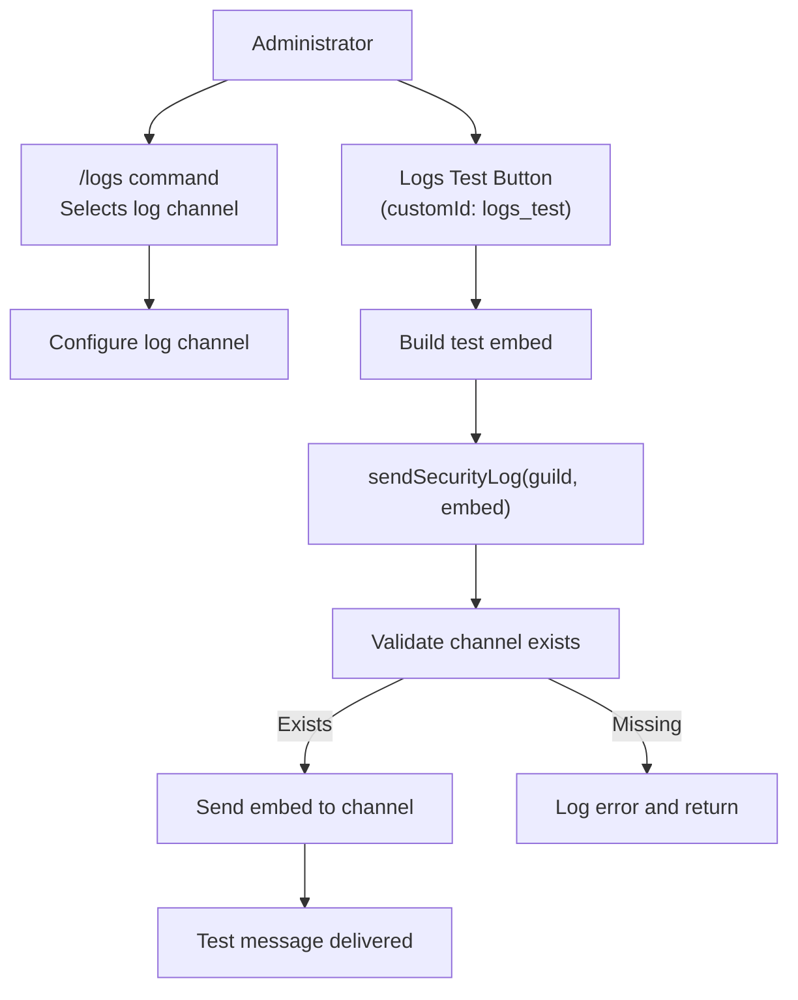
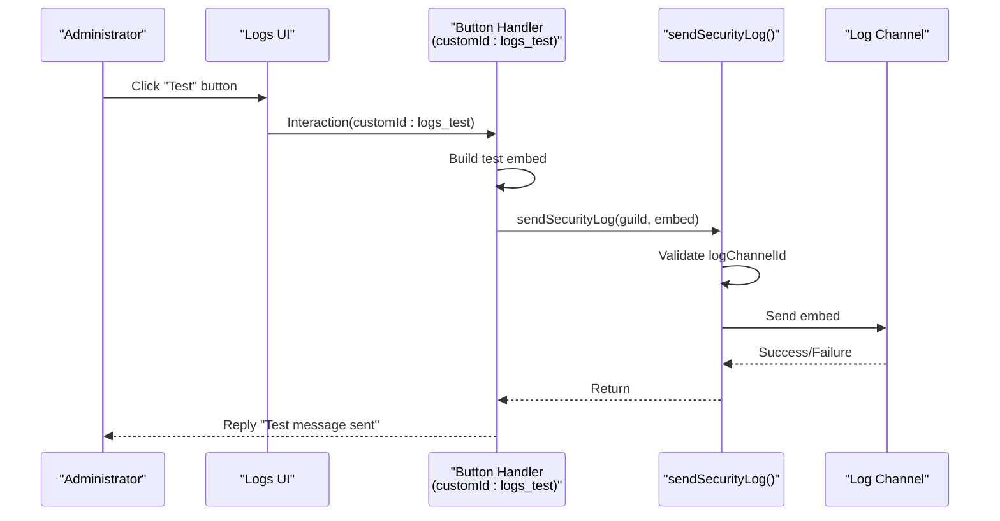
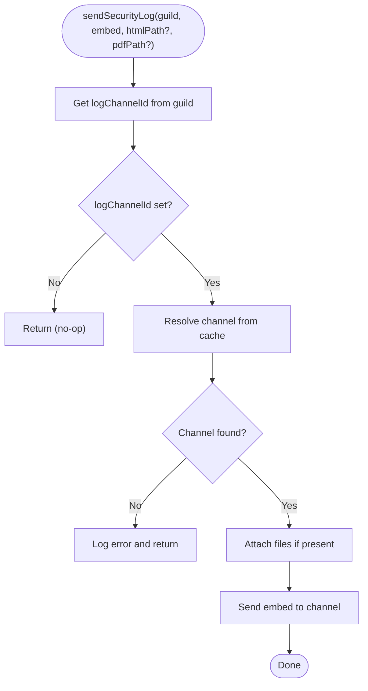
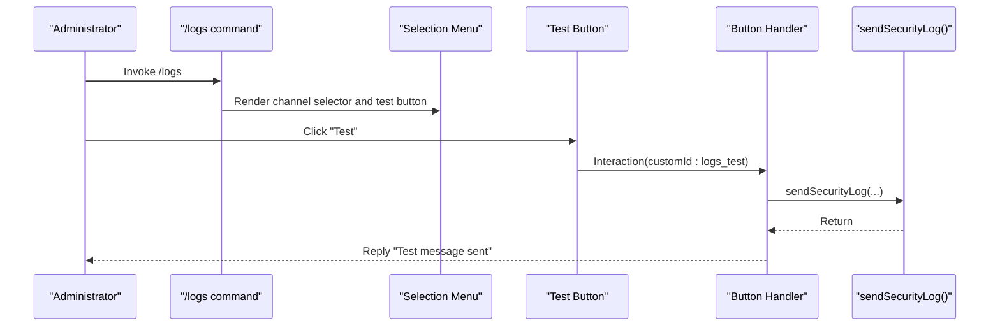

# Log Testing

<cite>
**Referenced Files in This Document**
- [index.js](file://index.js)
- [package.json](file://package.json)
</cite>

## Table of Contents
1. [Introduction](#introduction)
2. [Project Structure](#project-structure)
3. [Core Components](#core-components)
4. [Architecture Overview](#architecture-overview)
5. [Detailed Component Analysis](#detailed-component-analysis)
6. [Dependency Analysis](#dependency-analysis)
7. [Performance Considerations](#performance-considerations)
8. [Troubleshooting Guide](#troubleshooting-guide)
9. [Conclusion](#conclusion)

## Introduction
This document explains the Log Testing feature that enables administrators to verify their log channel configuration before real events occur. It covers how test log messages are generated and formatted using the same embed structure as real events, how test events are triggered and routed through the normal logging pipeline, and how administrators can validate permissions, channel accessibility, and embed rendering. It also documents the available test message types, how they simulate different event categories, and provides troubleshooting guidance for common failure scenarios such as missing permissions, deleted channels, or rate limiting.

## Project Structure
The Log Testing feature is implemented entirely within the main application file and relies on Discord.js builders and the logging pipeline. The relevant parts include:
- A dedicated handler for the test action that constructs an embed and sends it through the logging pipeline
- The logging pipeline that validates configuration and sends messages to the configured channel
- Supporting UI components that allow administrators to configure the log channel and trigger tests

**Diagram sources**
- [index.js](file://index.js#L5355-L5406)
- [index.js](file://index.js#L6350-L6361)
- [index.js](file://index.js#L880-L934)

**Section sources**
- [index.js](file://index.js#L5355-L5406)
- [index.js](file://index.js#L6350-L6361)
- [index.js](file://index.js#L880-L934)

## Core Components
- Logs Test Button Handler: Responds to a button click with a specific custom identifier to build and send a test embed.
- Logging Pipeline: Validates the configured log channel and sends the embed, optionally with attached files.
- UI Integration: The /logs command presents a selection menu and a test button to administrators.

Key responsibilities:
- Build a standardized embed for testing
- Route the embed through the logging pipeline
- Provide immediate feedback to the administrator
- Validate configuration and handle errors gracefully

**Section sources**
- [index.js](file://index.js#L6350-L6361)
- [index.js](file://index.js#L880-L934)
- [index.js](file://index.js#L5355-L5406)

## Architecture Overview
The Log Testing feature follows a simple, predictable flow:
1. Administrator triggers the test via a button in the logs UI.
2. The handler constructs a test embed with metadata (sender, timestamp).
3. The embed is passed to the logging pipeline.
4. The pipeline verifies the configured channel and sends the message.
5. The handler replies to the administrator with a success message.

**Diagram sources**
- [index.js](file://index.js#L6350-L6361)
- [index.js](file://index.js#L880-L934)

## Detailed Component Analysis

### Logs Test Button Handler
- Trigger: Button with custom identifier used in the logs UI.
- Behavior:
  - Creates a test embed with title, description, sender tag, and timestamp.
  - Calls the logging pipeline to deliver the embed to the configured channel.
  - Replies to the interaction with a success message.

Implementation highlights:
- Embed construction uses the same builder APIs as real events.
- Uses the current user’s avatar and tag for attribution.
- Sends the embed through the logging pipeline to reuse validation and error handling.

**Section sources**
- [index.js](file://index.js#L6350-L6361)

### Logging Pipeline (sendSecurityLog)
- Purpose: Centralized function to validate and send logs to the configured channel.
- Validation:
  - Retrieves the configured log channel ID from the guild collection.
  - Resolves the channel from the guild cache.
- Delivery:
  - Sends the embed to the channel.
  - Optionally attaches HTML/PDF files if provided and present on disk.
- Error handling:
  - Logs errors during send attempts.
  - Returns early if no channel is configured or the channel is not found.

**Diagram sources**
- [index.js](file://index.js#L880-L934)

**Section sources**
- [index.js](file://index.js#L880-L934)

### UI Integration: /logs Command and Buttons
- The /logs command builds a selection menu of available text channels and displays the current configuration.
- The UI includes a test button that triggers the test handler.
- Selecting a channel persists the configuration and optionally sends a welcome embed to the chosen channel.

**Diagram sources**
- [index.js](file://index.js#L5355-L5406)
- [index.js](file://index.js#L6350-L6361)
- [index.js](file://index.js#L880-L934)

**Section sources**
- [index.js](file://index.js#L5355-L5406)
- [index.js](file://index.js#L6350-L6361)
- [index.js](file://index.js#L880-L934)

## Dependency Analysis
- Discord.js builders and utilities are used to construct embeds and UI components.
- The logging pipeline depends on the guild’s stored log channel ID and the channel cache.
- File attachments (HTML/PDF) are optional and only included if present on disk.

External dependencies relevant to logging:
- discord.js: EmbedBuilder, ActionRowBuilder, ButtonBuilder, ChannelType, PermissionsBitField
- File system: Used for optional attachments and local file handling

**Section sources**
- [index.js](file://index.js#L1-L40)
- [index.js](file://index.js#L880-L934)
- [package.json](file://package.json#L1-L27)

## Performance Considerations
- The test handler performs minimal work: constructing an embed and invoking the logging pipeline.
- The logging pipeline resolves the channel from cache and sends a single embed, avoiding heavy computation.
- Optional file attachments are only added if files exist, preventing unnecessary I/O.

## Troubleshooting Guide
Common issues and resolutions when test messages fail to send:

- Missing or invalid log channel configuration
  - Symptom: Test handler returns immediately without sending.
  - Cause: No log channel configured for the guild.
  - Resolution: Use the /logs command to select a valid text channel and re-run the test.

- Deleted or inaccessible channel
  - Symptom: Error logged during send attempt.
  - Cause: Channel removed or permissions changed.
  - Resolution: Reconfigure the log channel via /logs and ensure the bot has permission to send messages.

- Rate limiting or API errors
  - Symptom: Error logged during send; message not delivered.
  - Cause: Discord API rate limits or transient failures.
  - Resolution: Retry after a short delay; monitor logs for repeated failures.

- Insufficient permissions
  - Symptom: Message fails to send; error indicates lack of permissions.
  - Cause: Bot lacks permission to send messages in the configured channel.
  - Resolution: Grant the bot appropriate permissions for the channel.

- File attachment issues (if using HTML/PDF)
  - Symptom: Attachment not included; logs indicate missing file.
  - Cause: File path does not exist or is inaccessible.
  - Resolution: Ensure files exist and are readable; note that the test handler does not attach files by default.

Administrators can validate:
- Channel accessibility: Confirm the bot can send messages in the selected channel.
- Embed rendering: Verify the embed appears correctly in the channel.
- Permissions: Ensure the bot has the required permissions for the channel.

**Section sources**
- [index.js](file://index.js#L880-L934)
- [index.js](file://index.js#L6350-L6361)

## Conclusion
The Log Testing feature provides administrators with a reliable way to validate their log channel configuration before real events occur. By generating a test embed through the same logging pipeline used for real events, administrators can verify channel accessibility, permissions, and embed rendering. The feature is intentionally lightweight, leveraging the existing logging infrastructure and UI components to minimize complexity while maximizing confidence in the configuration.