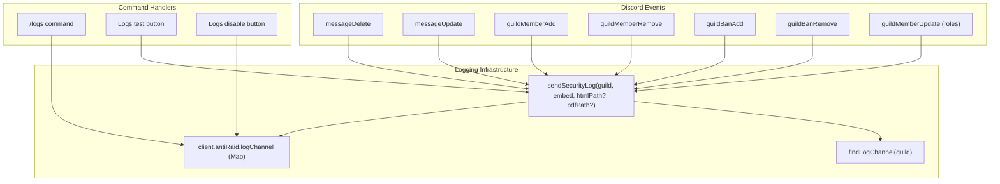
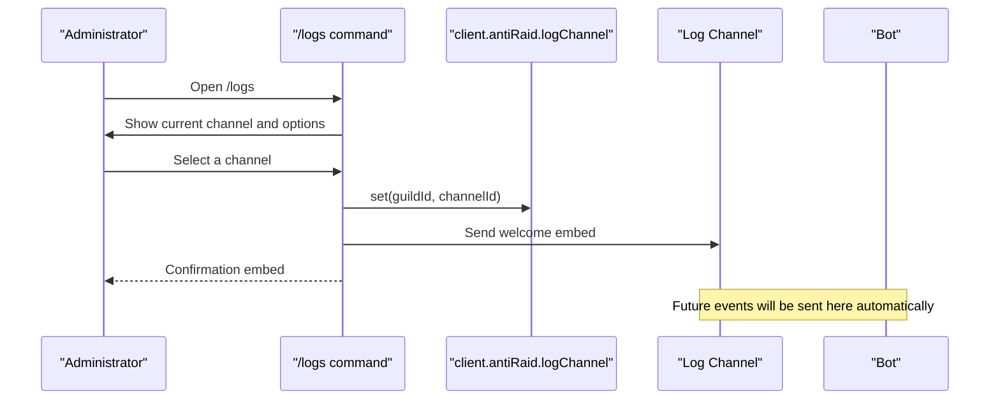
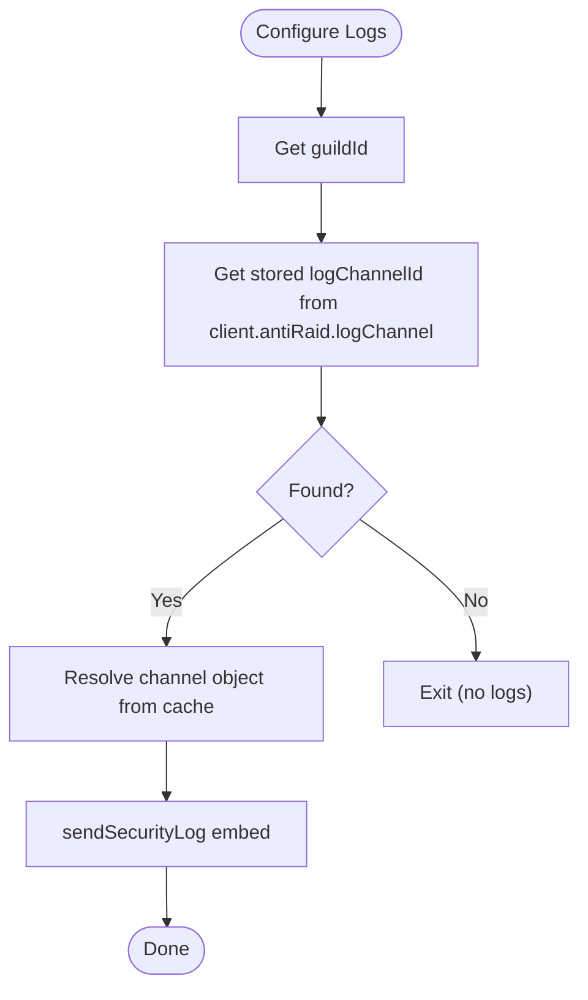
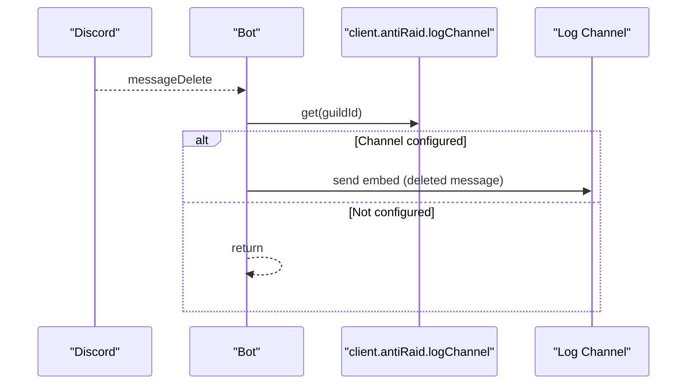
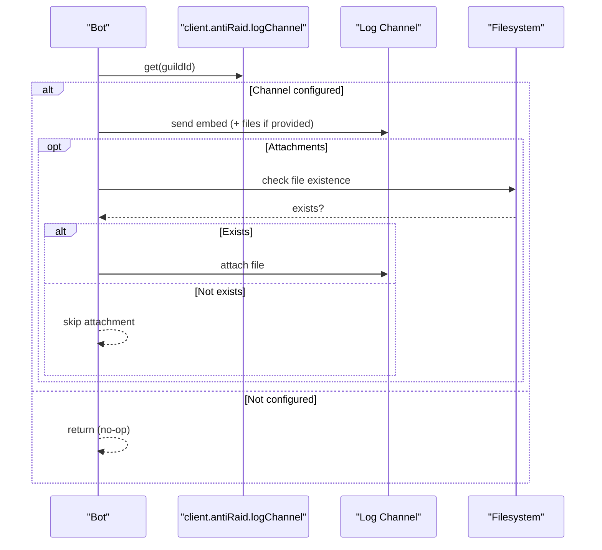
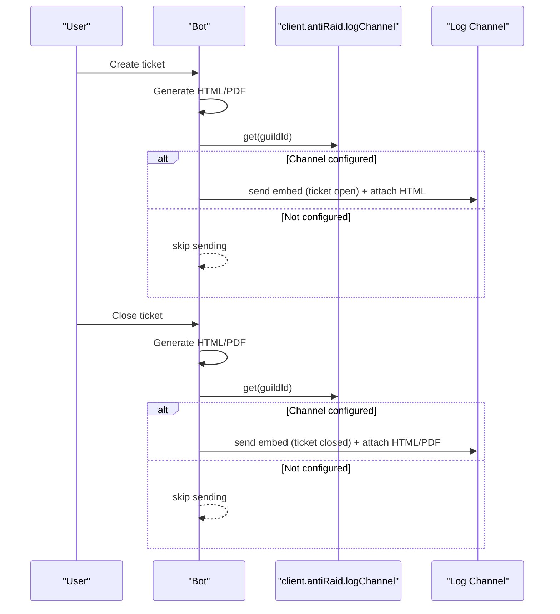
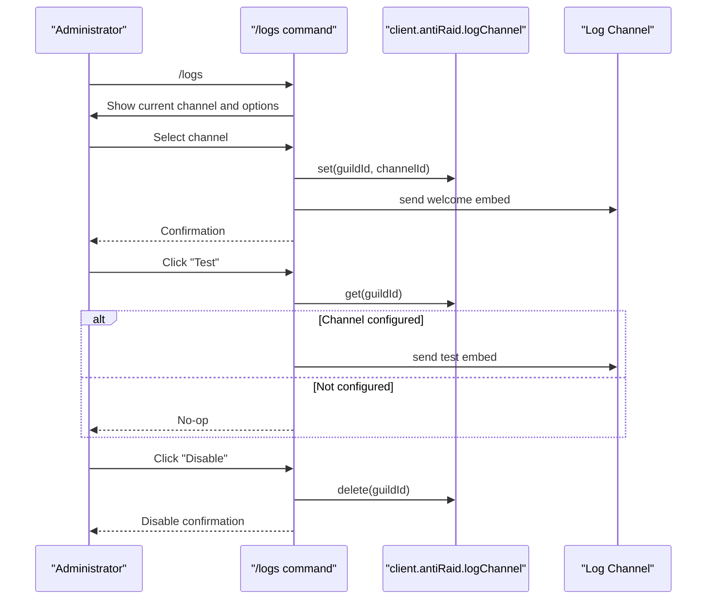
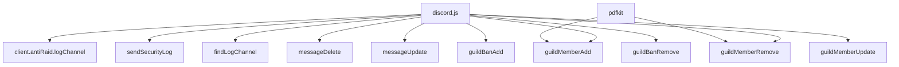

# Logs System

<cite>
**Referenced Files in This Document**
- [index.js](file://index.js)
- [package.json](file://package.json)
</cite>

## Table of Contents
1. [Introduction](#introduction)
2. [Project Structure](#project-structure)
3. [Core Components](#core-components)
4. [Architecture Overview](#architecture-overview)
5. [Detailed Component Analysis](#detailed-component-analysis)
6. [Dependency Analysis](#dependency-analysis)
7. [Performance Considerations](#performance-considerations)
8. [Troubleshooting Guide](#troubleshooting-guide)
9. [Conclusion](#conclusion)
10. [Appendices](#appendices)

## Introduction
This document explains the Logs System implemented in the project, focusing on event logging, log channel configuration, log testing, and log disabling functionality. It covers how the /logs command works, how various server events (message edits/deletions, user joins/leaves, bans/unbans, role changes, ticket actions, and anti-raid events) are captured and logged, and how the client.antiRaid.logChannel collection stores per-guild log channel configurations. It also provides examples from index.js showing embed formatting for different log types and error handling when the log channel is deleted or inaccessible.

## Project Structure
The Logs System is implemented primarily in index.js. It integrates with Discord’s event lifecycle and uses a per-guild configuration stored in client.antiRaid.logChannel. The system sends embeds to the configured log channel for multiple server events and also supports sending test logs and disabling logs.

**Diagram sources**
- [index.js](file://index.js#L2216-L2439)
- [index.js](file://index.js#L5386-L5406)
- [index.js](file://index.js#L6350-L6374)
- [index.js](file://index.js#L6595-L6619)
- [index.js](file://index.js#L6803-L6845)
- [index.js](file://index.js#L880-L977)

**Section sources**
- [index.js](file://index.js#L502-L528)
- [index.js](file://index.js#L880-L977)

## Core Components
- Per-guild log channel storage: client.antiRaid.logChannel is a Map keyed by guildId with the log channel id as the value.
- Logging infrastructure:
  - sendSecurityLog(guild, embed, htmlPath?, pdfPath?): Sends an embed to the configured log channel and optionally attaches generated HTML/PDF files.
  - findLogChannel(guild): Scans the guild channels to find a suitable log channel by name heuristics.
- Event handlers: Dedicated listeners for message deletions, message edits, user joins/leaves, bans/unbans, and role changes.
- Command handlers: /logs command with selection, test, and disable interactions.

Key responsibilities:
- Store and retrieve log channel per guild.
- Build embeds for different event types.
- Send logs to the configured channel with robust error handling.
- Provide administrative controls to configure, test, and disable logs.

**Section sources**
- [index.js](file://index.js#L502-L528)
- [index.js](file://index.js#L880-L977)
- [index.js](file://index.js#L2216-L2439)
- [index.js](file://index.js#L5386-L5406)
- [index.js](file://index.js#L6350-L6374)
- [index.js](file://index.js#L6595-L6619)
- [index.js](file://index.js#L6803-L6845)

## Architecture Overview
The Logs System is event-driven and command-driven:
- Event-driven: Listeners react to Discord gateway events and build embeds, then send them via sendSecurityLog.
- Command-driven: Administrators configure the log channel via /logs, trigger a test log, or disable logs.

**Diagram sources**
- [index.js](file://index.js#L5386-L5406)
- [index.js](file://index.js#L6595-L6619)
- [index.js](file://index.js#L6803-L6845)

## Detailed Component Analysis

### Log Channel Configuration and Storage
- Storage: client.antiRaid.logChannel is a Map keyed by guildId storing the log channel id.
- Retrieval: sendSecurityLog reads the guild’s log channel id from the map and resolves the channel object.
- Selection: The /logs command builds a dropdown menu of text channels and writes the selected channel id into the map.

**Diagram sources**
- [index.js](file://index.js#L502-L528)
- [index.js](file://index.js#L880-L977)
- [index.js](file://index.js#L5386-L5406)
- [index.js](file://index.js#L6595-L6619)
- [index.js](file://index.js#L6803-L6845)

**Section sources**
- [index.js](file://index.js#L502-L528)
- [index.js](file://index.js#L5386-L5406)
- [index.js](file://index.js#L6595-L6619)
- [index.js](file://index.js#L6803-L6845)

### Event Logging: Message Deletion
- Trigger: messageDelete event.
- Behavior:
  - Skips bot messages and non-guild messages.
  - Retrieves log channel id from client.antiRaid.logChannel.
  - Builds an embed with author, channel, and content.
  - Adds attached files if present.
  - Sends to the log channel; logs errors silently.

**Diagram sources**
- [index.js](file://index.js#L2216-L2243)

**Section sources**
- [index.js](file://index.js#L2216-L2243)

### Event Logging: Message Edit
- Trigger: messageUpdate event.
- Behavior:
  - Skips bot messages and unchanged content.
  - Retrieves log channel id from client.antiRaid.logChannel.
  - Builds an embed with author, channel, and links to before/after content.
  - Sends to the log channel; logs errors silently.

**Section sources**
- [index.js](file://index.js#L2245-L2269)

### Event Logging: User Join
- Trigger: guildMemberAdd event.
- Behavior:
  - Retrieves log channel id from client.antiRaid.logChannel.
  - Computes account age in days.
  - Builds an embed with user tag/id, mention, account age, avatar thumbnail, member count footer, and bot flag if applicable.
  - Sends to the log channel; logs errors silently.

**Section sources**
- [index.js](file://index.js#L2271-L2297)

### Event Logging: User Leave
- Trigger: guildMemberRemove event.
- Behavior:
  - Retrieves log channel id from client.antiRaid.logChannel.
  - Attempts to fetch recent kick audit log to determine reason and executor.
  - Builds an embed with user tag/id, reason, executor, roles, avatar thumbnail, member count footer.
  - Sends to the log channel; logs errors silently.

**Section sources**
- [index.js](file://index.js#L2299-L2330)

### Event Logging: Ban
- Trigger: guildBanAdd event.
- Behavior:
  - Retrieves log channel id from client.antiRaid.logChannel.
  - Attempts to fetch recent ban audit log to determine executor and reason.
  - Builds an embed with user tag/id, executor, reason, avatar thumbnail.
  - Sends to the log channel; logs errors silently.

**Section sources**
- [index.js](file://index.js#L2332-L2362)

### Event Logging: Unban
- Trigger: guildBanRemove event.
- Behavior:
  - Retrieves log channel id from client.antiRaid.logChannel.
  - Attempts to fetch recent unban audit log to determine executor.
  - Builds an embed with user tag/id, executor, avatar thumbnail.
  - Sends to the log channel; logs errors silently.

**Section sources**
- [index.js](file://index.js#L2364-L2392)

### Event Logging: Role Changes
- Trigger: guildMemberUpdate event.
- Behavior:
  - Compares old and new roles to compute added and removed roles.
  - Attempts to fetch recent role update audit log to determine executor.
  - Sends separate embeds for added roles and removed roles.
  - Skips if no changes detected.
  - Sends to the log channel; logs errors silently.

**Section sources**
- [index.js](file://index.js#L2394-L2439)

### Anti-Raid Security Logs
- sendSecurityLog(guild, embed, htmlPath?, pdfPath?): Centralized function to send logs to the configured channel.
  - Reads log channel id from client.antiRaid.logChannel.
  - Resolves channel from cache.
  - Optionally attaches HTML and/or PDF files if paths exist and files are readable.
  - Sends embed and files; logs debug information and errors.

- findLogChannel(guild): Utility to locate a log channel by scanning guild channels with name heuristics (support-log, soporte-log, log-de-voz).

**Diagram sources**
- [index.js](file://index.js#L880-L977)

**Section sources**
- [index.js](file://index.js#L880-L977)

### Ticket Actions Logging
- Ticket creation:
  - Generates an ICO, HTML, and optionally a PDF.
  - Sends a security log embed with HTML availability and attaches HTML if present.
- Ticket closure:
  - Generates HTML and PDF.
  - Sends a security log embed indicating HTML/PDF availability and attaches both if present.
  - Deletes the ticket channel shortly after.

**Diagram sources**
- [index.js](file://index.js#L5818-L5835)
- [index.js](file://index.js#L5868-L5878)

**Section sources**
- [index.js](file://index.js#L5818-L5835)
- [index.js](file://index.js#L5868-L5878)

### /logs Command: Configuration, Testing, and Disabling
- Configuration:
  - Builds a dropdown of text channels and sets client.antiRaid.logChannel[guildId] to the selected channel id.
  - Sends a welcome embed to the newly configured channel.
- Testing:
  - Sends a test embed via sendSecurityLog to verify the configuration.
- Disabling:
  - Deletes the guild’s log channel id from client.antiRaid.logChannel, effectively disabling logs for that guild.

**Diagram sources**
- [index.js](file://index.js#L5386-L5406)
- [index.js](file://index.js#L6350-L6374)
- [index.js](file://index.js#L6595-L6619)
- [index.js](file://index.js#L6803-L6845)

**Section sources**
- [index.js](file://index.js#L5386-L5406)
- [index.js](file://index.js#L6350-L6374)
- [index.js](file://index.js#L6595-L6619)
- [index.js](file://index.js#L6803-L6845)

### Embed Formatting Examples
- Deleted message embed: Title, author, channel, content, and attachments.
- Edited message embed: Title, author, channel, before/after content, and link to message.
- User join embed: Title, user info, account age, avatar thumbnail, member count footer, bot flag.
- User leave embed: Title, user info, reason, executor, roles, avatar thumbnail, member count footer.
- Ban embed: Title, user info, executor, reason, avatar thumbnail.
- Unban embed: Title, user info, executor, avatar thumbnail.
- Role change embeds: Separate added and removed roles with executor.
- Ticket open/close embeds: Ticket info, HTML/PDF availability, timestamps.
- Security logs: Anti-raid and support logs with titles, descriptions, and timestamps.

These embeds are built using EmbedBuilder and sent via sendSecurityLog or direct channel sends.

**Section sources**
- [index.js](file://index.js#L2216-L2243)
- [index.js](file://index.js#L2245-L2269)
- [index.js](file://index.js#L2271-L2297)
- [index.js](file://index.js#L2299-L2330)
- [index.js](file://index.js#L2332-L2362)
- [index.js](file://index.js#L2364-L2392)
- [index.js](file://index.js#L2394-L2439)
- [index.js](file://index.js#L5818-L5835)
- [index.js](file://index.js#L5868-L5878)

### Error Handling and Edge Cases
- Missing log channel:
  - sendSecurityLog returns early if no log channel id is configured for the guild.
  - Event handlers return early if the log channel id is missing or the channel object is not found.
- Deleted/inaccessible channel:
  - Event handlers catch and ignore errors when sending embeds.
  - sendSecurityLog logs debug information and skips attachments if files are missing.
- Audit log fallbacks:
  - For leave/ban/unban/role changes, the system attempts to fetch recent audit logs to enrich the embed with executor and reason.

**Section sources**
- [index.js](file://index.js#L880-L977)
- [index.js](file://index.js#L2216-L2243)
- [index.js](file://index.js#L2245-L2269)
- [index.js](file://index.js#L2299-L2330)
- [index.js](file://index.js#L2332-L2362)
- [index.js](file://index.js#L2364-L2392)
- [index.js](file://index.js#L2394-L2439)

## Dependency Analysis
- External libraries:
  - discord.js: Provides Client, EmbedBuilder, channel types, collections, and event handling.
  - pdfkit: Used for generating PDFs during ticket actions.
- Internal dependencies:
  - client.antiRaid.logChannel: Stores per-guild log channel ids.
  - sendSecurityLog: Centralized logging function.
  - findLogChannel: Utility to locate a log channel by name heuristics.
  - Event handlers: React to Discord events and send embeds.
  - Command handlers: Manage configuration, testing, and disabling.

**Diagram sources**
- [index.js](file://index.js#L1-L40)
- [index.js](file://index.js#L880-L977)
- [index.js](file://index.js#L2216-L2439)
- [package.json](file://package.json#L1-L27)

**Section sources**
- [index.js](file://index.js#L1-L40)
- [package.json](file://package.json#L1-L27)

## Performance Considerations
- Event handlers short-circuit when the log channel is not configured or the channel object is missing, avoiding unnecessary work.
- sendSecurityLog checks file existence before attaching to reduce overhead.
- Embed building is lightweight; avoid sending large attachments unless necessary.
- Consider batching logs or rate-limiting in high-traffic servers to prevent flooding the log channel.

## Troubleshooting Guide
Common issues and resolutions:
- Logs not appearing:
  - Verify the /logs command was used to configure a channel for the guild.
  - Ensure the configured channel still exists and is accessible.
- Channel deleted or moved:
  - Re-run /logs to select a new channel.
  - sendSecurityLog will return early if the stored channel id is invalid.
- Audit log enrichment not showing executor/reason:
  - Some actions may not have recent audit logs; the system falls back to defaults.
- Test logs fail:
  - Confirm the log channel is configured and the bot has permission to send messages and attach files.
- Ticket logs missing attachments:
  - Ensure HTML/PDF generation succeeds; sendSecurityLog will skip missing files.

**Section sources**
- [index.js](file://index.js#L880-L977)
- [index.js](file://index.js#L5818-L5835)
- [index.js](file://index.js#L5868-L5878)
- [index.js](file://index.js#L6350-L6374)

## Conclusion
The Logs System provides a robust, configurable mechanism for capturing and reporting server events. Administrators can easily configure a log channel, test the setup, and disable logs when needed. The system centralizes logging via sendSecurityLog, supports per-guild configuration, and gracefully handles missing channels and audit log limitations. Ticket actions integrate seamlessly with the logging pipeline, attaching generated artifacts for transparency.

## Appendices

### Configuration Options and Parameters
- client.antiRaid.logChannel: Map keyed by guildId storing the log channel id.
- sendSecurityLog(guild, embed, htmlPath?, pdfPath?): Sends embeds and optional attachments to the configured channel.
- findLogChannel(guild): Heuristic-based channel discovery by name.

**Section sources**
- [index.js](file://index.js#L502-L528)
- [index.js](file://index.js#L880-L977)
- [index.js](file://index.js#L978-L985)