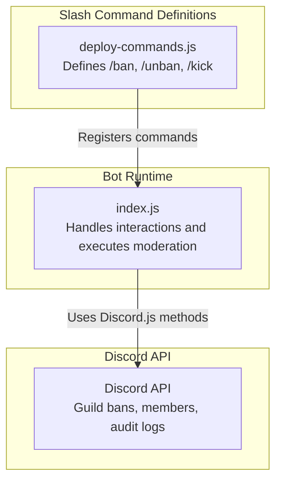
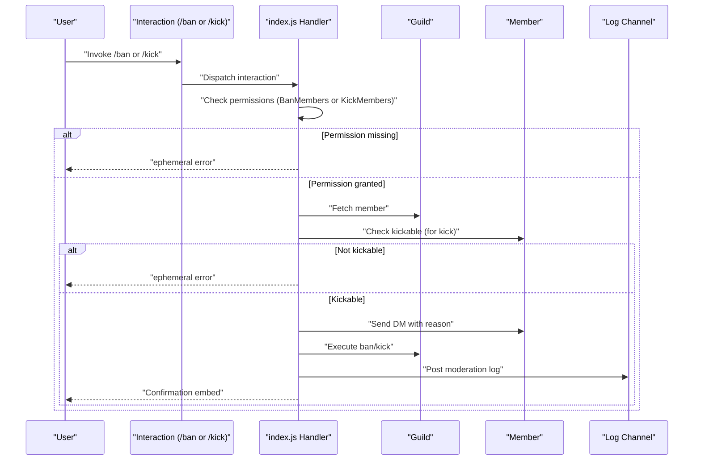
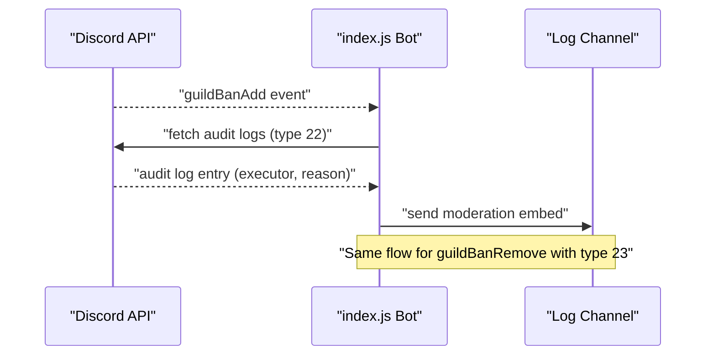
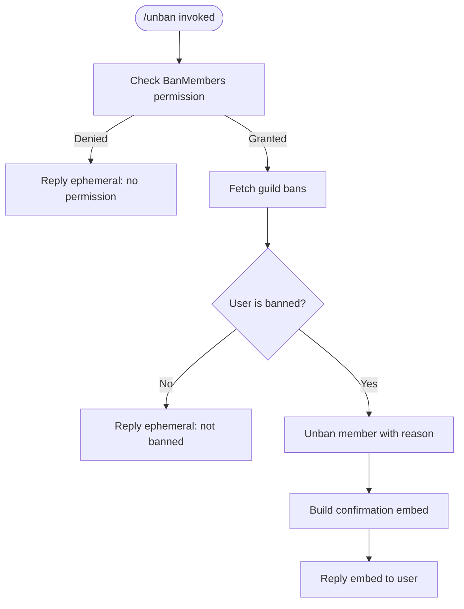
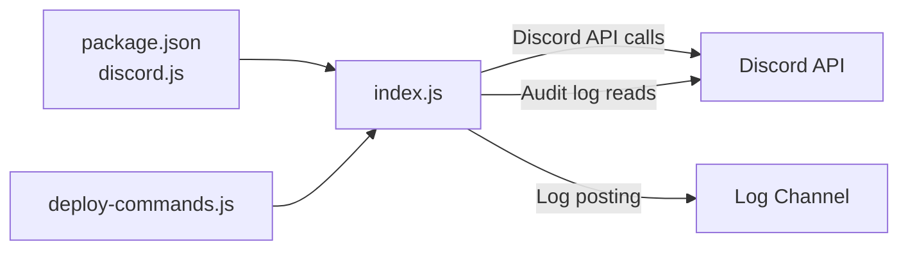

# Ban and Kick Commands

<cite>
**Referenced Files in This Document**
- [deploy-commands.js](file://deploy-commands.js)
- [index.js](file://index.js)
- [README.md](file://README.md)
- [package.json](file://package.json)
</cite>

## Table of Contents
1. [Introduction](#introduction)
2. [Project Structure](#project-structure)
3. [Core Components](#core-components)
4. [Architecture Overview](#architecture-overview)
5. [Detailed Component Analysis](#detailed-component-analysis)
6. [Dependency Analysis](#dependency-analysis)
7. [Performance Considerations](#performance-considerations)
8. [Troubleshooting Guide](#troubleshooting-guide)
9. [Conclusion](#conclusion)

## Introduction
This document explains the ban and kick moderation functionality implemented in the bot’s moderation system. It covers:
- Command definitions and parameters
- Permission checks and validation
- Execution flow and user feedback
- Edge cases such as role hierarchy and permission failures
- Audit log integration and logging to the configured log channel
- Code-level references to Discord.js methods used for enforcement

## Project Structure
The moderation commands are defined as slash commands and handled in the main bot script. The deployment script registers the commands with Discord, while the runtime script executes them and records events.

**Diagram sources**
- [deploy-commands.js](file://deploy-commands.js#L31-L42)
- [deploy-commands.js](file://deploy-commands.js#L176-L181)
- [index.js](file://index.js#L3614-L3641)
- [index.js](file://index.js#L3695-L3743)

**Section sources**
- [deploy-commands.js](file://deploy-commands.js#L31-L42)
- [deploy-commands.js](file://deploy-commands.js#L176-L181)
- [index.js](file://index.js#L3614-L3641)
- [index.js](file://index.js#L3695-L3743)

## Core Components
- Command registration: The deployment script defines the three moderation commands with required parameters.
- Command handler: The runtime script validates permissions, performs actions, and sends user feedback.
- Audit log integration: Events are captured via Discord’s audit logs and posted to the configured log channel.

Key responsibilities:
- Validate executor permissions
- Fetch target member and enforce role hierarchy rules
- Send pre-action DM to the user
- Execute ban/kick via Discord.js
- Record actions in the configured log channel

**Section sources**
- [deploy-commands.js](file://deploy-commands.js#L31-L42)
- [deploy-commands.js](file://deploy-commands.js#L176-L181)
- [index.js](file://index.js#L3614-L3641)
- [index.js](file://index.js#L3695-L3743)
- [README.md](file://README.md#L128-L141)

## Architecture Overview
The moderation commands follow a consistent flow: validate permissions, prepare user feedback, execute the action, and log the event.

**Diagram sources**
- [index.js](file://index.js#L3614-L3641)
- [index.js](file://index.js#L3695-L3743)
- [index.js](file://index.js#L2333-L2361)
- [index.js](file://index.js#L2365-L2392)

## Detailed Component Analysis

### Command Registration: /ban, /unban, /kick
- /ban: Requires a user option and an optional reason. Defined in the deployment script.
- /unban: Requires a user option and an optional reason. Defined in the deployment script.
- /kick: Requires a user option and an optional reason. Defined in the deployment script.

These definitions are used to register the commands with Discord.

**Section sources**
- [deploy-commands.js](file://deploy-commands.js#L31-L42)
- [deploy-commands.js](file://deploy-commands.js#L176-L181)

### Permission Model
- /ban: Requires BanMembers.
- /kick: Requires KickMembers.
- /unban: Requires BanMembers.

The runtime handler checks these permissions before proceeding. If the executor lacks permission, the bot replies with an ephemeral message.

**Section sources**
- [index.js](file://index.js#L3614-L3620)
- [index.js](file://index.js#L3663-L3665)
- [index.js](file://index.js#L3696-L3702)

### Parameter Validation and User Feedback
- Both /ban and /kick accept a user and an optional reason. If no reason is provided, the handler defaults to a placeholder.
- The handler attempts to send a direct message to the user before executing the action, informing them of the server action and reason. Failures are logged and do not block execution.

**Section sources**
- [index.js](file://index.js#L3614-L3620)
- [index.js](file://index.js#L3623-L3641)
- [index.js](file://index.js#L3696-L3702)
- [index.js](file://index.js#L3711-L3729)

### Role Hierarchy and Edge Cases
- For /kick, the handler checks if the target member is kickable. If the target has a role equal to or higher than the bot’s highest role, the action fails with an ephemeral message.
- For /ban, the handler does not explicitly check kickability; however, Discord’s enforcement applies when attempting to ban a user whose role is higher than the bot’s.

**Section sources**
- [index.js](file://index.js#L3704-L3710)
- [index.js](file://index.js#L3639-L3641)

### Discord.js Method Usage
- Ban: The handler calls the guild member ban method with a reason.
- Kick: The handler calls the member kick method with a reason.

These methods are part of Discord.js and enforce platform-level restrictions (e.g., role hierarchy).

**Section sources**
- [index.js](file://index.js#L3639-L3641)
- [index.js](file://index.js#L3727-L3729)

### Audit Log Integration and Logging
- The bot listens for Discord’s guild ban/unban events and posts a log embed to the configured log channel.
- The bot also fetches audit logs to identify the executor and reason for ban/unban events.

**Diagram sources**
- [index.js](file://index.js#L2333-L2361)
- [index.js](file://index.js#L2365-L2392)

**Section sources**
- [index.js](file://index.js#L2333-L2361)
- [index.js](file://index.js#L2365-L2392)

### /unban Flow
- Validates permissions (BanMembers).
- Checks if the user is currently banned via guild bans.
- Executes unban with a reason.
- Sends a confirmation embed with details.

**Diagram sources**
- [index.js](file://index.js#L3659-L3692)

**Section sources**
- [index.js](file://index.js#L3659-L3692)

## Dependency Analysis
- External library: discord.js is used for command handling, permissions, and guild/member operations.
- Environment: The bot relies on environment variables for token, client ID, and guild ID during command deployment.
- Event-driven logging: The bot subscribes to Discord events and uses audit logs to enrich moderation logs.

**Diagram sources**
- [package.json](file://package.json#L10-L25)
- [deploy-commands.js](file://deploy-commands.js#L280-L293)
- [index.js](file://index.js#L2333-L2361)
- [index.js](file://index.js#L2365-L2392)

**Section sources**
- [package.json](file://package.json#L10-L25)
- [deploy-commands.js](file://deploy-commands.js#L280-L293)
- [index.js](file://index.js#L2333-L2361)
- [index.js](file://index.js#L2365-L2392)

## Performance Considerations
- Fetching members and bans is O(1) per interaction; however, repeated moderation actions can trigger multiple API calls.
- Sending DMs is best-effort; failures are logged and do not block execution.
- Logging embeds are small and lightweight; avoid attaching large files unless necessary.

## Troubleshooting Guide
Common issues and resolutions:
- Permission errors:
  - /ban requires BanMembers; /kick requires KickMembers; /unban requires BanMembers.
  - If the executor lacks permission, the bot replies with an ephemeral message.
- Target not kickable:
  - The bot checks kickability before kicking. If the target has a higher role than the bot, the action fails with an ephemeral message.
- User not banned:
  - Attempting to unban a user who is not banned results in an ephemeral message indicating the user is not banned.
- DM delivery failures:
  - The bot attempts to send a DM before ban/kick. Failures are logged and do not prevent the action.
- Audit log not showing executor/reason:
  - The bot fetches audit logs to populate executor and reason. If unavailable, placeholders are used.

**Section sources**
- [index.js](file://index.js#L3614-L3620)
- [index.js](file://index.js#L3696-L3710)
- [index.js](file://index.js#L3663-L3674)
- [index.js](file://index.js#L3623-L3641)
- [index.js](file://index.js#L3711-L3729)
- [index.js](file://index.js#L2333-L2361)
- [index.js](file://index.js#L2365-L2392)

## Conclusion
The moderation system provides robust enforcement of ban, unban, and kick commands with:
- Clear permission requirements
- Pre-action user communication
- Role hierarchy-aware enforcement
- Automatic audit log capture and posting to the configured log channel

This ensures transparency, compliance with Discord’s rules, and a smooth moderation experience.