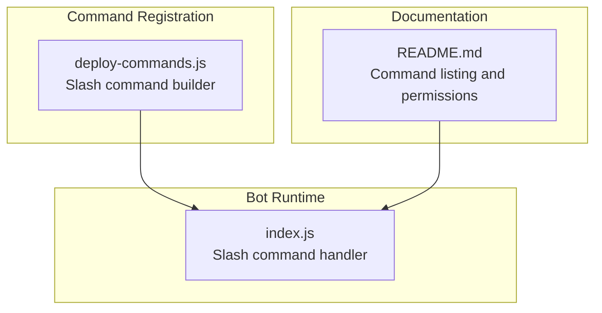
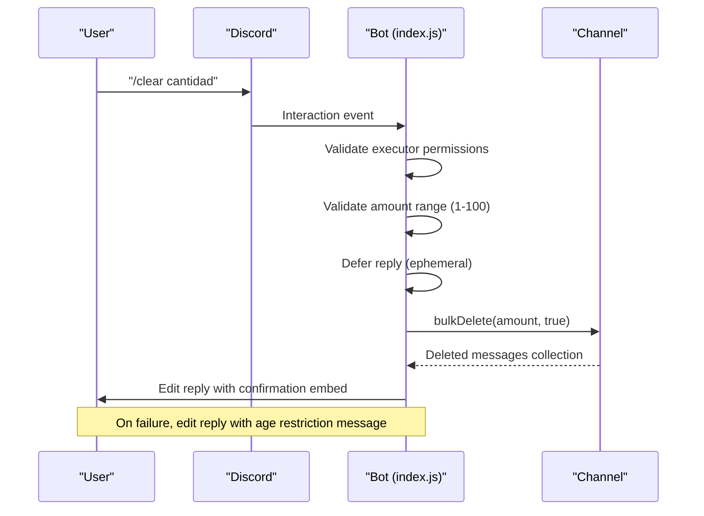
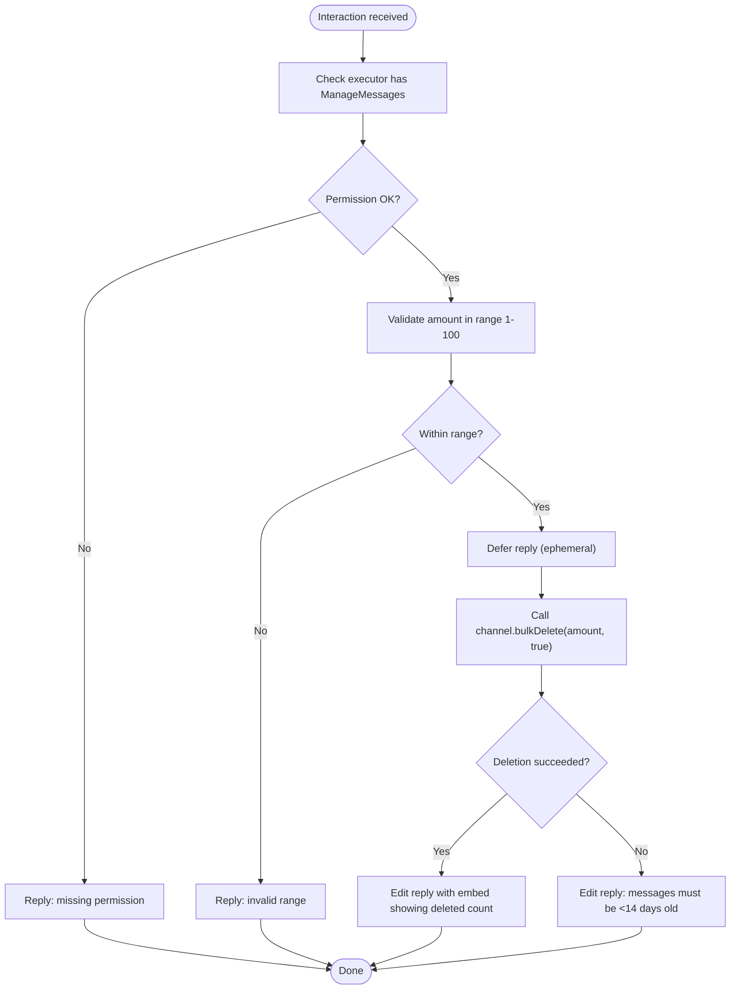
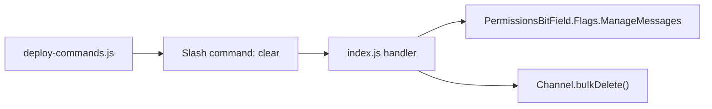

# Message Cleanup

<cite>
**Referenced Files in This Document**
- [index.js](file://index.js)
- [deploy-commands.js](file://deploy-commands.js)
- [README.md](file://README.md)
</cite>

## Table of Contents
1. [Introduction](#introduction)
2. [Project Structure](#project-structure)
3. [Core Components](#core-components)
4. [Architecture Overview](#architecture-overview)
5. [Detailed Component Analysis](#detailed-component-analysis)
6. [Dependency Analysis](#dependency-analysis)
7. [Performance Considerations](#performance-considerations)
8. [Troubleshooting Guide](#troubleshooting-guide)
9. [Conclusion](#conclusion)

## Introduction
This document explains the message cleanup functionality centered on the /clear command. It covers how the command deletes a specified number of recent messages (1–100) from the current channel using channel.bulkDelete(), the permission requirements for both the executor and the bot, robust error handling for age-related failures, and the user feedback mechanism. It also highlights the moderation benefits and the two-week limitation for message deletion.

## Project Structure
The message cleanup feature is implemented in the main bot file and registered via the command deployment script. The README lists the command and its capabilities.

**Diagram sources**
- [index.js](file://index.js#L3794-L3823)
- [deploy-commands.js](file://deploy-commands.js#L190-L193)
- [README.md](file://README.md#L13-L21)

**Section sources**
- [index.js](file://index.js#L3794-L3823)
- [deploy-commands.js](file://deploy-commands.js#L190-L193)
- [README.md](file://README.md#L13-L21)

## Core Components
- Slash command definition: The /clear command is defined with an integer option for quantity (1–100).
- Command handler: Validates permissions, defers the reply, performs bulk deletion, and responds with a confirmation embed.
- Error handling: Catches failures caused by Discord’s 14-day message age restriction and informs the user accordingly.
- Feedback: Confirms the number of messages actually deleted and attributes the action to the executor.

Key implementation references:
- Command registration: [deploy-commands.js](file://deploy-commands.js#L190-L193)
- Handler and logic: [index.js](file://index.js#L3794-L3823)

**Section sources**
- [deploy-commands.js](file://deploy-commands.js#L190-L193)
- [index.js](file://index.js#L3794-L3823)

## Architecture Overview
The /clear command follows a standard slash command flow: Discord invokes the interaction, the bot validates permissions and input, executes the deletion, and replies with a confirmation.

**Diagram sources**
- [index.js](file://index.js#L3794-L3823)

## Detailed Component Analysis

### Slash Command Definition (/clear)
- Name: clear
- Option: cantidad (integer, required, range 1–100)
- Purpose: Delete recent messages in the current channel

Registration ensures the command appears in the guild and accepts the integer argument.

**Section sources**
- [deploy-commands.js](file://deploy-commands.js#L190-L193)

### Command Handler Logic
- Executor permission check: Requires ManageMessages.
- Input validation: Ensures amount is within 1–100.
- Execution: Defers reply, calls channel.bulkDelete(amount, true), and edits the reply with a confirmation embed.
- Error handling: Catches exceptions and informs the user that messages must be less than 14 days old.

**Diagram sources**
- [index.js](file://index.js#L3794-L3823)

**Section sources**
- [index.js](file://index.js#L3794-L3823)

### Permission Requirements
- Executor requirement: ManageMessages (validated before deletion).
- Bot requirement: ManageMessages (needed to delete messages in the channel).
- The README explicitly lists ManageMessages among the bot’s required permissions.

References:
- Executor permission check: [index.js](file://index.js#L3798-L3800)
- Bot permission requirement: [README.md](file://README.md#L139-L139)

**Section sources**
- [index.js](file://index.js#L3798-L3800)
- [README.md](file://README.md#L139-L139)

### Error Handling and Partial Deletions
- Age restriction: Discord’s 14-day limit causes bulkDelete to fail; the handler catches the error and informs the user.
- Partial deletions: The handler reports the number of messages actually deleted via the returned collection size.

References:
- Error handling and user message: [index.js](file://index.js#L3819-L3822)
- Confirmation embed with deleted count: [index.js](file://index.js#L3811-L3818)

**Section sources**
- [index.js](file://index.js#L3811-L3822)

### User Feedback Mechanism
- Ephemeral defer reply: The bot acknowledges receipt of the command immediately.
- Confirmation embed: Shows the number of messages deleted and attributes the action to the executor.
- Age-related error: Provides a clear explanation when deletion fails due to message age.

References:
- Defer and edit reply: [index.js](file://index.js#L3807-L3818)
- Age error message: [index.js](file://index.js#L3819-L3822)

**Section sources**
- [index.js](file://index.js#L3807-L3822)

### Moderation Benefits and Limitations
- Benefits:
  - Rapid removal of spam or off-topic messages.
  - Maintains channel cleanliness and readability.
  - Reduces clutter during events or testing.
- Limitations:
  - Cannot delete messages older than two weeks due to platform constraints.
  - Requires appropriate permissions for both executor and bot.

References:
- Command listing and capability: [README.md](file://README.md#L13-L21)
- Age restriction note: [index.js](file://index.js#L3819-L3822)

**Section sources**
- [README.md](file://README.md#L13-L21)
- [index.js](file://index.js#L3819-L3822)

## Dependency Analysis
- Command registration depends on the SlashCommandBuilder and REST API routes to register guild commands.
- The handler depends on Discord.js channel.bulkDelete and permission flags.
- Documentation references clarify required permissions.

**Diagram sources**
- [deploy-commands.js](file://deploy-commands.js#L190-L193)
- [index.js](file://index.js#L3794-L3823)

**Section sources**
- [deploy-commands.js](file://deploy-commands.js#L190-L193)
- [index.js](file://index.js#L3794-L3823)

## Performance Considerations
- Bulk deletion is efficient for removing many messages quickly.
- The handler defers the reply to prevent timeouts and then edits it with the result.
- The 14-day age limit prevents unnecessary attempts on older messages.

[No sources needed since this section provides general guidance]

## Troubleshooting Guide
- Missing permission:
  - Symptom: Immediate denial reply.
  - Cause: Executor lacks ManageMessages.
  - Resolution: Grant ManageMessages to the user or role.
  - Reference: [index.js](file://index.js#L3798-L3800)
- Invalid amount:
  - Symptom: Immediate denial reply for out-of-range values.
  - Cause: Amount outside 1–100.
  - Resolution: Use a value within the allowed range.
  - Reference: [index.js](file://index.js#L3802-L3804)
- Age restriction failure:
  - Symptom: Failure message indicating messages must be less than 14 days old.
  - Cause: Attempting to delete messages older than 14 days.
  - Resolution: Delete more recent messages or adjust expectations.
  - Reference: [index.js](file://index.js#L3819-L3822)
- Bot permission missing:
  - Symptom: Deletion fails even with valid inputs.
  - Cause: Bot lacks ManageMessages in the channel.
  - Resolution: Ensure the bot has ManageMessages in the target channel.
  - Reference: [README.md](file://README.md#L139-L139)

**Section sources**
- [index.js](file://index.js#L3798-L3804)
- [index.js](file://index.js#L3819-L3822)
- [README.md](file://README.md#L139-L139)

## Conclusion
The /clear command provides a fast, user-friendly way to remove recent messages from a channel. It enforces strict permission checks, validates input, and offers clear feedback. While powerful, it respects Discord’s 14-day deletion window and requires ManageMessages for both the executor and the bot. This makes it a practical moderation tool for keeping channels clean and organized.