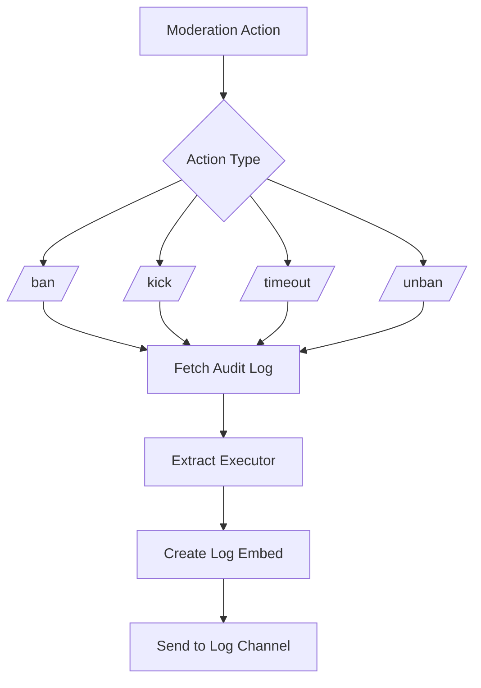

# Moderation System

<cite>
**Referenced Files in This Document**   
- [index.js](file://index.js)
- [README.md](file://README.md)
- [deploy-commands-fixed.js](file://deploy-commands-fixed.js)
</cite>

## Table of Contents
1. [Introduction](#introduction)
2. [Command Implementation and Invocation](#command-implementation-and-invocation)
3. [Data Structures and Persistence](#data-structures-and-persistence)
4. [Permission System and Audit Logs](#permission-system-and-audit-logs)
5. [Error Handling and Edge Cases](#error-handling-and-edge-cases)
6. [Usage Patterns and Examples](#usage-patterns-and-examples)

## Introduction
The moderation system in this Discord bot provides comprehensive tools for server management, including user bans, kicks, timeouts, warnings, message cleanup, and slowmode controls. The system is implemented through slash commands that offer a user-friendly interface for moderators to maintain order in their servers. All moderation actions include proper permission checks, audit logging, and user notifications to ensure transparency and accountability. The system also includes a persistent warning system that tracks user infractions across bot restarts.

## Command Implementation and Invocation

The moderation commands are implemented as slash commands in the Discord bot, providing a structured interface for server moderation. Each command follows a consistent pattern of permission verification, action execution, user notification, and audit logging.

### Ban and Unban Commands
The `/ban` and `/unban` commands allow moderators to permanently remove users from the server or restore their access. The ban command first attempts to notify the user via direct message before executing the ban, providing transparency about the action. The unban command verifies that the user was previously banned before restoring their access.

### Kick and Timeout Commands
The `/kick` command removes a user from the server temporarily, while the `/timeout` command restricts a user's ability to send messages for a specified duration. Both commands include permission checks to ensure the moderator has the appropriate rights and verify that the target user can be moderated based on role hierarchy.

### Warning System
The `/warn` command adds a warning to a user's record, which is stored in memory and persists across bot restarts. Each warning includes the reason, moderator information, and timestamp. The `/warnings` command allows moderators to view a user's complete warning history.

### Message Cleanup and Slowmode
The `/clear` command removes a specified number of messages from a channel, helping moderators clean up spam or inappropriate content. The `/slowmode` command controls the rate at which users can send messages in a channel, helping to manage conversation flow during busy periods.

**Section sources**
- [index.js](file://index.js#L3612-L3942)
- [README.md](file://README.md#L14-L21)

## Data Structures and Persistence

### User Warnings Storage
The bot uses a hierarchical Map structure to store user warnings, organized by server and then by user. The data structure is defined as `client.userWarnings = new Map()` where each server ID maps to another Map containing user IDs as keys and arrays of warning objects as values.

```javascript
// Data structure: {guildId: {userId: [{reason, moderator, timestamp}]}}
client.userWarnings = new Map();
```

Each warning object contains three properties:
- `reason`: The reason for the warning (string)
- `moderator`: The tag of the moderator who issued the warning (string)
- `timestamp`: The Unix timestamp when the warning was issued (number)

### Persistence Mechanism
The warning system maintains persistence across bot restarts through in-memory storage that is preserved as long as the bot process is running. When the bot starts, it initializes the userWarnings collection, and as warnings are issued, they are stored in this collection. The data remains available until the bot is stopped or crashes.

The system follows a hierarchical initialization pattern:
1. Check if warnings exist for the current server
2. If not, create a new Map for that server
3. Check if the target user has existing warnings
4. If not, create a new array for that user
5. Add the new warning to the user's warning array

This approach ensures that the data structure is properly initialized before use and prevents errors from accessing undefined properties.

**Section sources**
- [index.js](file://index.js#L518)
- [index.js](file://index.js#L3857-L3875)

## Permission System and Audit Logs

### Permission Checks
The moderation system implements a comprehensive permission verification system for each command. Different commands require different permission levels based on their impact:

- `/ban`, `/unban`: Require `BanMembers` permission
- `/kick`: Require `KickMembers` permission
- `/timeout`, `/warn`: Require `ModerateMembers` permission
- `/clear`: Require `ManageMessages` permission
- `/slowmode`: Require `ManageChannels` permission

Each command performs these checks before executing the moderation action, ensuring that only authorized users can perform these sensitive operations.

### Audit Logging
The system automatically logs moderation actions through Discord's audit log system. When a moderation action occurs, the bot listens for relevant events and creates corresponding log entries:



The bot listens for events like `guildBanAdd`, `guildBanRemove`, and `guildMemberRemove` to capture moderation actions and extract the executor from Discord's audit logs. This information is then formatted into embed messages and sent to the configured log channel.

**Diagram sources**
- [index.js](file://index.js#L2332-L2392)

**Section sources**
- [index.js](file://index.js#L3617-L3618)
- [index.js](file://index.js#L2332-L2392)

## Error Handling and Edge Cases

### Permission Hierarchy Validation
The system includes safeguards to prevent moderators from targeting users with higher permissions. For kick and timeout commands, the bot checks the `kickable` and `moderatable` properties of the target member:

```javascript
if (!member.kickable) {
  return interaction.reply({ content: '❌ No puedo expulsar a este usuario (puede tener un rol superior al mío).', ephemeral: true });
}
```

This prevents situations where a moderator attempts to remove a user with a higher role position, which would fail due to Discord's permission hierarchy.

### Direct Message Failures
When notifying users of moderation actions via direct messages, the system includes error handling for cases where DMs are disabled:

```javascript
try {
  await user.send({ embeds: [dmEmbed] });
  console.log(`✅ MD enviado a ${user.tag} antes del ban`);
} catch (dmError) {
  console.log(`⚠️ No se pudo enviar MD a ${user.tag}:`, dmError.message);
}
```

This ensures that the moderation action proceeds even if the notification fails, while logging the failure for administrative review.

### Rate Limiting and Validation
The system implements input validation to prevent abuse:
- Clear command limits message deletion to 1-100 messages
- Timeout duration is restricted to 1-40320 minutes (4 weeks)
- All commands validate input parameters before execution

These constraints prevent accidental or malicious use of moderation commands that could disrupt server operations.

**Section sources**
- [index.js](file://index.js#L3707-L3708)
- [index.js](file://index.js#L3759-L3760)
- [index.js](file://index.js#L3802-L3803)

## Usage Patterns and Examples

### Typical Moderation Workflow
A typical moderation scenario follows this pattern:
1. Moderator identifies inappropriate behavior
2. Uses `/warn` to issue a warning with a specific reason
3. If behavior continues, applies `/timeout` with increasing duration
4. For severe violations, uses `/kick` or `/ban` as appropriate
5. Uses `/clear` to remove offending messages
6. Adjusts `/slowmode` to manage conversation flow if needed

### Command Syntax Examples
- `/ban @user Spoofing staff members`
- `/kick @user Advertising in general chat`
- `/timeout @user 30 Repeated rule violations`
- `/warn @user Using offensive language`
- `/clear 50 Remove spam messages`
- `/slowmode 10 Set 10-second delay between messages`

### Integration with Other Systems
The moderation commands integrate with the bot's logging system, ensuring all actions are recorded in the designated log channel. They also work in conjunction with the anti-raid system, which can automatically apply moderation actions based on predefined thresholds for spam or other disruptive behaviors.

The warning system provides a persistent record of user behavior, allowing moderators to make informed decisions based on a user's history rather than isolated incidents.

**Section sources**
- [README.md](file://README.md#L14-L21)
- [index.js](file://index.js#L3612-L3942)