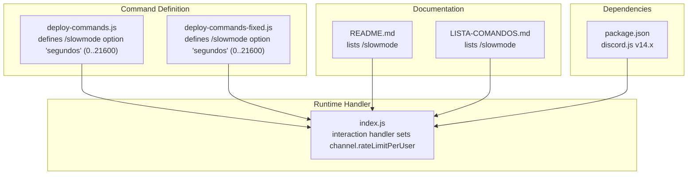
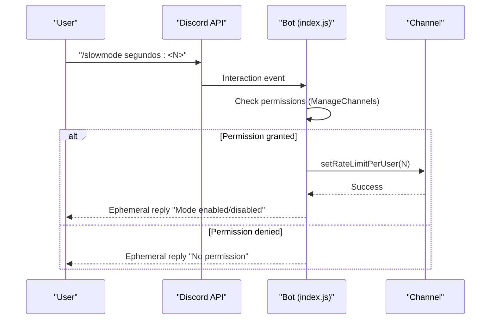
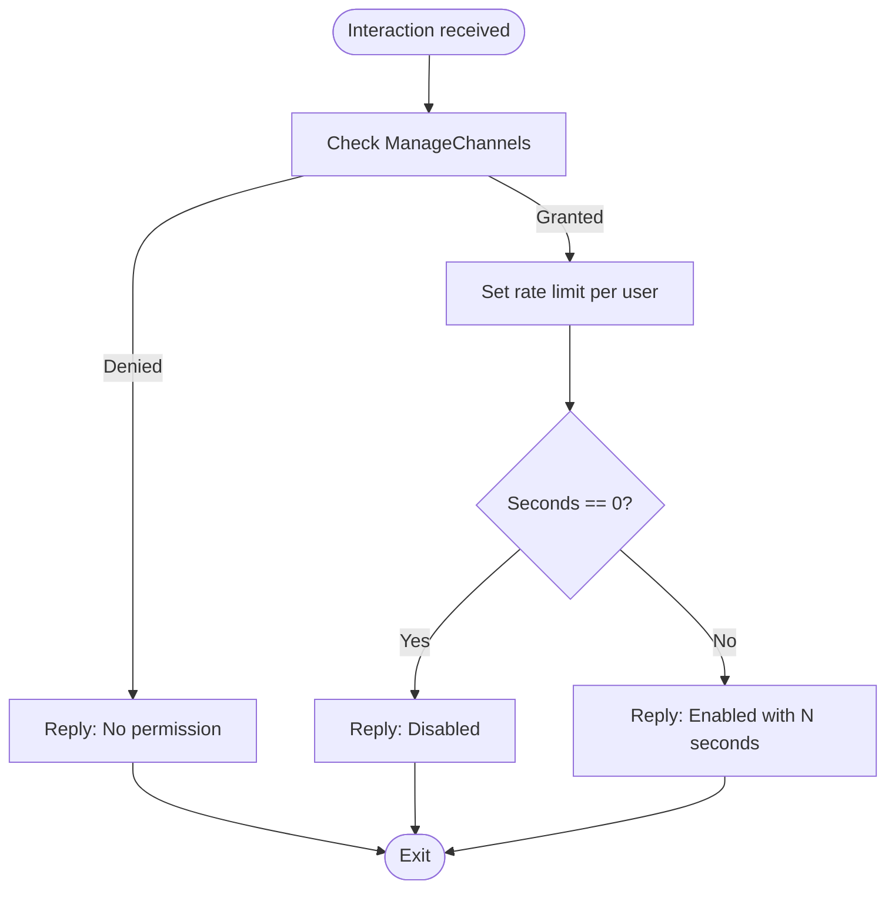
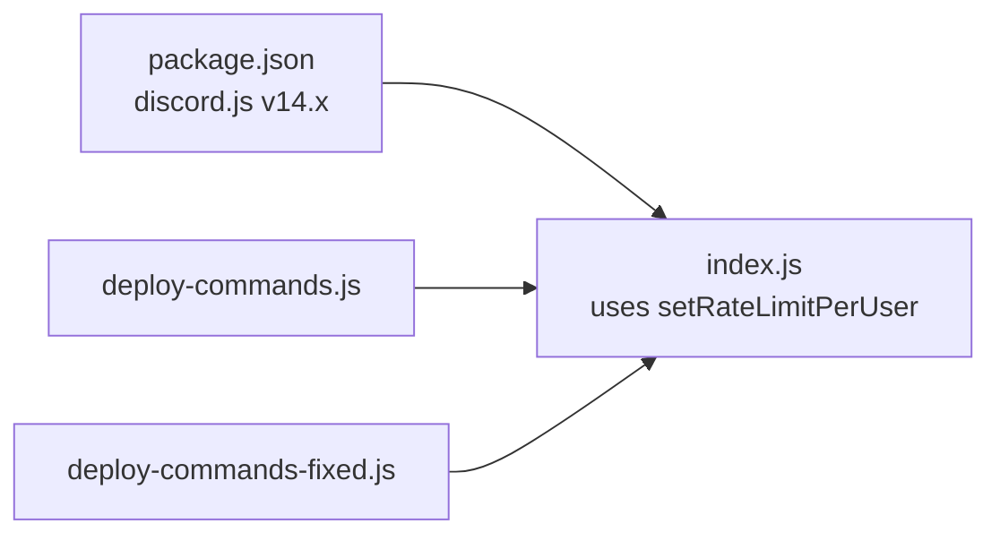

# Slowmode Control

<cite>
**Referenced Files in This Document**
- [index.js](file://index.js)
- [deploy-commands.js](file://deploy-commands.js)
- [deploy-commands-fixed.js](file://deploy-commands-fixed.js)
- [README.md](file://README.md)
- [LISTA-COMANDOS.md](file://LISTA-COMANDOS.md)
- [package.json](file://package.json)
</cite>

## Table of Contents
1. [Introduction](#introduction)
2. [Project Structure](#project-structure)
3. [Core Components](#core-components)
4. [Architecture Overview](#architecture-overview)
5. [Detailed Component Analysis](#detailed-component-analysis)
6. [Dependency Analysis](#dependency-analysis)
7. [Performance Considerations](#performance-considerations)
8. [Troubleshooting Guide](#troubleshooting-guide)
9. [Conclusion](#conclusion)
10. [Appendices](#appendices)

## Introduction
This document explains the slowmode control functionality implemented by the /slowmode command. It covers how the command sets the delay between messages in a channel (0–21600 seconds), how it modifies the channel.rateLimitPerUser property, the permission requirement ManageChannels, the user experience in the channel interface, and the implementation details in index.js. It also provides practical use cases and notes on exemptions.

## Project Structure
The slowmode control is implemented as a slash command. The relevant pieces are:
- Command definition and registration in deploy-commands.js and deploy-commands-fixed.js
- Runtime handling in index.js
- Documentation references in README.md and LISTA-COMANDOS.md
- Dependencies in package.json

**Diagram sources**
- [deploy-commands.js](file://deploy-commands.js#L195-L209)
- [deploy-commands-fixed.js](file://deploy-commands-fixed.js#L195-L200)
- [index.js](file://index.js#L3825-L3845)
- [README.md](file://README.md#L18-L24)
- [LISTA-COMANDOS.md](file://LISTA-COMANDOS.md#L40-L50)
- [package.json](file://package.json#L10-L25)

**Section sources**
- [deploy-commands.js](file://deploy-commands.js#L195-L209)
- [deploy-commands-fixed.js](file://deploy-commands-fixed.js#L195-L200)
- [index.js](file://index.js#L3825-L3845)
- [README.md](file://README.md#L18-L24)
- [LISTA-COMANDOS.md](file://LISTA-COMANDOS.md#L40-L50)
- [package.json](file://package.json#L10-L25)

## Core Components
- Slash command definition: /slowmode with integer option segundos (range 0–21600)
- Runtime handler: Validates permissions, updates channel.rateLimitPerUser, and replies with ephemeral feedback
- Error handling: Catches exceptions and informs the user

Key implementation references:
- Command registration and option bounds: [deploy-commands.js](file://deploy-commands.js#L195-L209), [deploy-commands-fixed.js](file://deploy-commands-fixed.js#L195-L200)
- Runtime handler and permission check: [index.js](file://index.js#L3825-L3845)
- Documentation references: [README.md](file://README.md#L18-L24), [LISTA-COMANDOS.md](file://LISTA-COMANDOS.md#L40-L50)

**Section sources**
- [deploy-commands.js](file://deploy-commands.js#L195-L209)
- [deploy-commands-fixed.js](file://deploy-commands-fixed.js#L195-L200)
- [index.js](file://index.js#L3825-L3845)
- [README.md](file://README.md#L18-L24)
- [LISTA-COMANDOS.md](file://LISTA-COMANDOS.md#L40-L50)

## Architecture Overview
The slowmode command follows a standard slash command flow:
- Discord dispatches the interaction to the bot
- The bot checks permissions
- The bot updates the channel’s rate limit per user
- The bot responds with an ephemeral message

**Diagram sources**
- [index.js](file://index.js#L3825-L3845)
- [deploy-commands.js](file://deploy-commands.js#L195-L209)

## Detailed Component Analysis

### Command Definition and Registration
- The command is named slowmode and exposes an integer option segundos with a minimum of 0 and maximum of 21600.
- The command is registered in both deploy scripts for convenience.

Implementation references:
- Option definition and bounds: [deploy-commands.js](file://deploy-commands.js#L195-L209), [deploy-commands-fixed.js](file://deploy-commands-fixed.js#L195-L200)

**Section sources**
- [deploy-commands.js](file://deploy-commands.js#L195-L209)
- [deploy-commands-fixed.js](file://deploy-commands-fixed.js#L195-L200)

### Runtime Handler and Permission Requirement
- The handler validates that the invoking member has ManageChannels.
- It updates the channel’s rate limit per user using the interaction’s channel object.
- It replies with an ephemeral message indicating whether slowmode was enabled or disabled.

Implementation references:
- Permission check and update: [index.js](file://index.js#L3825-L3845)

**Diagram sources**
- [index.js](file://index.js#L3825-L3845)

**Section sources**
- [index.js](file://index.js#L3825-L3845)

### User Experience and Visual Indicators
- When slowmode is enabled, users attempting to send messages will see a cooldown timer in the channel interface until the delay expires.
- Setting the delay to 0 disables slowmode for the channel.
- Users with ManageMessages permission are exempt from the cooldown.

Notes:
- The cooldown timer appears in the client UI when rateLimitPerUser is set.
- Exemption for ManageMessages is a Discord platform behavior; the bot does not implement a separate exemption logic.

**Section sources**
- [index.js](file://index.js#L3825-L3845)

### Implementation Notes and Best Practices
- The handler uses interaction.channel.setRateLimitPerUser to modify channel.rateLimitPerUser.
- The handler replies with ephemeral messages to avoid cluttering the channel.
- The handler includes a try/catch block to handle potential errors when updating the channel.

References:
- Channel update call: [index.js](file://index.js#L3833-L3834)
- Ephemeral replies: [index.js](file://index.js#L3829-L3844)

**Section sources**
- [index.js](file://index.js#L3825-L3845)

### Use Cases
Common scenarios for using slowmode:
- Preventing spam during live events or announcements
- Calming heated discussions to reduce flood and chaos
- Managing Q&A sessions to ensure orderly participation

References:
- Example usage in documentation: [LISTA-COMANDOS.md](file://LISTA-COMANDOS.md#L212-L223)

**Section sources**
- [LISTA-COMANDOS.md](file://LISTA-COMANDOS.md#L212-L223)

## Dependency Analysis
- The bot depends on discord.js v14.x, which provides the setRateLimitPerUser method and interaction handling.
- The command is registered via the deploy scripts and exposed to users as a slash command.

**Diagram sources**
- [package.json](file://package.json#L10-L25)
- [index.js](file://index.js#L3825-L3845)
- [deploy-commands.js](file://deploy-commands.js#L195-L209)
- [deploy-commands-fixed.js](file://deploy-commands-fixed.js#L195-L200)

**Section sources**
- [package.json](file://package.json#L10-L25)
- [index.js](file://index.js#L3825-L3845)
- [deploy-commands.js](file://deploy-commands.js#L195-L209)
- [deploy-commands-fixed.js](file://deploy-commands-fixed.js#L195-L200)

## Performance Considerations
- The handler performs a single API call to set the rate limit per user and responds immediately with an ephemeral message.
- There are no loops or heavy computations involved in the slowmode command itself.

[No sources needed since this section provides general guidance]

## Troubleshooting Guide
- Permission denied: Ensure the user invoking the command has ManageChannels in the server.
- Operation failed: The handler catches errors and replies with a failure message. Check the console logs for the underlying error.
- Channel type limitations: setRateLimitPerUser applies to text and thread channels; it does not apply to DM or group DM channels.

References:
- Permission check and reply: [index.js](file://index.js#L3829-L3831)
- Error handling and reply: [index.js](file://index.js#L3841-L3844)
- Channel applicability: [index.js](file://index.js#L3833-L3834)

**Section sources**
- [index.js](file://index.js#L3825-L3845)

## Conclusion
The /slowmode command provides a straightforward way to control message frequency in a channel by adjusting rateLimitPerUser. It requires ManageChannels, updates the channel instantly, and informs users via ephemeral replies. Users with ManageMessages are exempt from the cooldown. The implementation is robust, with explicit permission checks and error handling.

[No sources needed since this section summarizes without analyzing specific files]

## Appendices

### API Reference Summary
- Command: /slowmode
- Option: segundos (integer, 0–21600)
- Behavior:
  - Sets channel.rateLimitPerUser to segundos
  - 0 disables slowmode
  - Users with ManageMessages are exempt from cooldown
- Permission: ManageChannels required

References:
- Option definition: [deploy-commands.js](file://deploy-commands.js#L195-L209), [deploy-commands-fixed.js](file://deploy-commands-fixed.js#L195-L200)
- Runtime behavior: [index.js](file://index.js#L3825-L3845)
- Documentation: [README.md](file://README.md#L18-L24), [LISTA-COMANDOS.md](file://LISTA-COMANDOS.md#L40-L50)

**Section sources**
- [deploy-commands.js](file://deploy-commands.js#L195-L209)
- [deploy-commands-fixed.js](file://deploy-commands-fixed.js#L195-L200)
- [index.js](file://index.js#L3825-L3845)
- [README.md](file://README.md#L18-L24)
- [LISTA-COMANDOS.md](file://LISTA-COMANDOS.md#L40-L50)