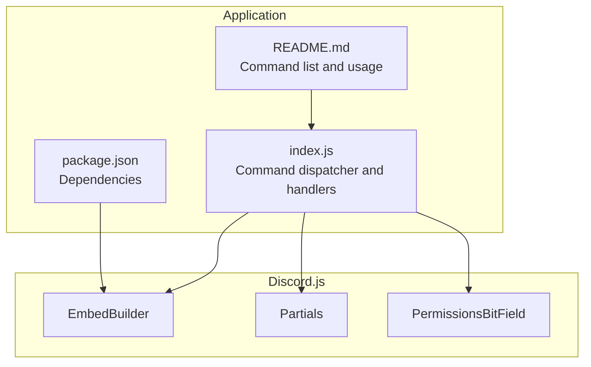
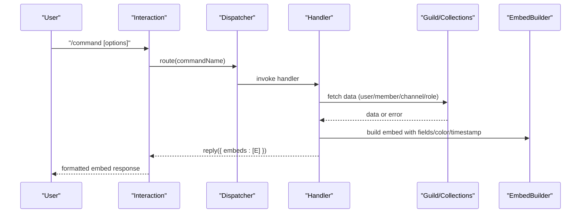
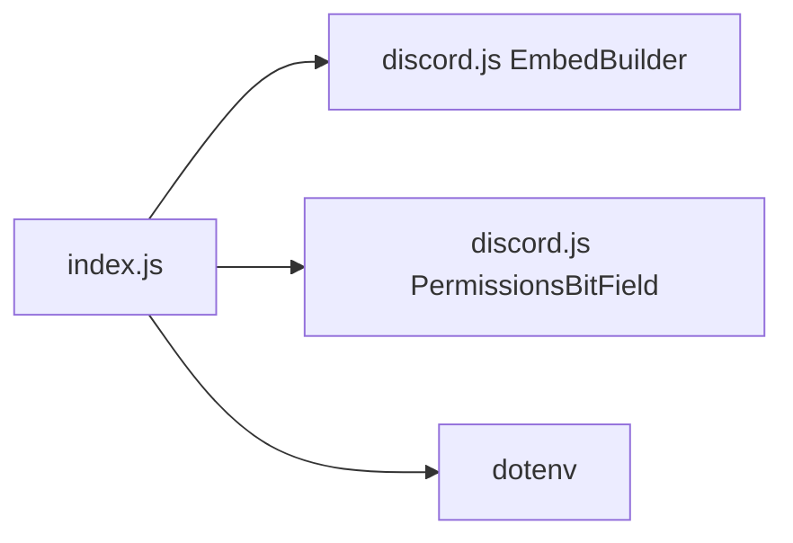

# Information Commands

<cite>
**Referenced Files in This Document**
- [index.js](file://index.js)
- [README.md](file://README.md)
- [package.json](file://package.json)
</cite>

## Table of Contents
1. [Introduction](#introduction)
2. [Project Structure](#project-structure)
3. [Core Components](#core-components)
4. [Architecture Overview](#architecture-overview)
5. [Detailed Component Analysis](#detailed-component-analysis)
6. [Dependency Analysis](#dependency-analysis)
7. [Performance Considerations](#performance-considerations)
8. [Troubleshooting Guide](#troubleshooting-guide)
9. [Conclusion](#conclusion)

## Introduction
This document explains the Information Commands subsystem that provides detailed insights into users, servers, channels, roles, avatars, and membership counts. It focuses on the commands:
- /userinfo
- /serverinfo
- /avatar
- /membercount
- /channelinfo
- /serverrole

These commands use EmbedBuilder to produce rich, formatted responses with fields, colors, timestamps, and thumbnails. The document also covers how user and channel data is safely fetched and displayed, error handling for failed lookups, and common issues such as missing permissions and rate limiting considerations.

## Project Structure
The Information Commands are implemented in the main application file alongside other command handlers. The relevant parts of the codebase include:
- Command dispatch logic that routes interactions to specific handlers
- Individual handlers for each information command
- EmbedBuilder usage for rich responses
- Permission checks and error handling patterns

**Diagram sources**
- [index.js](file://index.js#L1-L40)
- [package.json](file://package.json#L1-L27)
- [README.md](file://README.md#L38-L46)

**Section sources**
- [index.js](file://index.js#L1-L40)
- [README.md](file://README.md#L38-L46)
- [package.json](file://package.json#L1-L27)

## Core Components
- Command dispatcher: Routes incoming interactions to the appropriate handler based on command name.
- Information command handlers: Implement each command’s logic, fetch data, build EmbedBuilder instances, and handle errors.
- EmbedBuilder: Used to construct rich embeds with fields, color, thumbnail, footer, and timestamp.
- Data fetching: Guild, member, channel, and role data are accessed via cached collections and API calls where necessary.
- Error handling: Ephemeral replies and logging for failures such as missing permissions, unavailable data, or API errors.

Key implementation references:
- Command routing and handlers for /userinfo, /serverinfo, /avatar, /membercount, /channelinfo, and /serverrole
- EmbedBuilder usage patterns and field construction
- Permission checks and fallbacks for missing data

**Section sources**
- [index.js](file://index.js#L3206-L3433)
- [index.js](file://index.js#L4059-L4101)
- [index.js](file://index.js#L3402-L3424)
- [index.js](file://index.js#L3426-L3494)

## Architecture Overview
The Information Commands follow a consistent flow:
- Receive interaction
- Validate context (e.g., server-only commands)
- Fetch required data (user/member/channel/role)
- Build an EmbedBuilder with fields and metadata
- Reply with the embed (and ephemeral where appropriate)

**Diagram sources**
- [index.js](file://index.js#L3206-L3433)
- [index.js](file://index.js#L4059-L4101)
- [index.js](file://index.js#L3402-L3424)
- [index.js](file://index.js#L3426-L3494)

## Detailed Component Analysis

### /avatar
Purpose: Display a user’s avatar in high resolution.

Implementation highlights:
- Uses interaction options to select a target user or defaults to the invoking user.
- Builds an EmbedBuilder with a large avatar image URL and sets a color and timestamp.
- Replies with the embed.

Common usage patterns:
- Without arguments: shows the invoker’s avatar.
- With a user argument: shows the specified user’s avatar.

Error handling:
- Catches exceptions during embed creation and responds with an ephemeral error message.

**Section sources**
- [index.js](file://index.js#L3206-L3232)

### /userinfo
Purpose: Provide detailed information about a user and their server membership.

Implementation highlights:
- Validates that the command runs in a guild context.
- Resolves target user and attempts to fetch the member object.
- Builds a multi-field embed including:
  - User account details (username, ID, bot flag, creation date)
  - Server-specific details (joined date, nickname, booster status, display color)
  - Member status (communication disabled, activity level)
  - Presence and device information
  - Roles and key permissions
  - Discord badges
- Sets thumbnail to the user’s avatar, color to the member’s display color, footer, and timestamp.

Data safety:
- Attempts to fetch the member object; on failure, replies with an ephemeral message indicating the user was not found in the server.

**Section sources**
- [index.js](file://index.js#L3234-L3400)

### /serverinfo
Purpose: Summarize server-level statistics and properties.

Implementation highlights:
- Retrieves guild properties and constructs an embed with fields for:
  - ID, owner, creation date, member count, channel count, role count, emoji count, and boost tier/subscriptions
- Sets thumbnail to the guild icon, color, and timestamp.

Error handling:
- Wraps the operation in a try/catch; on error, replies with an ephemeral message.

**Section sources**
- [index.js](file://index.js#L4059-L4086)

### /membercount
Purpose: Show total, human, and bot member counts.

Implementation highlights:
- Computes counts from the guild members cache.
- Builds a simple embed with a description containing the counts and a timestamp.

**Section sources**
- [index.js](file://index.js#L4087-L4101)

### /channelinfo
Purpose: Display channel metadata.

Implementation highlights:
- Resolves the target channel from options or falls back to the current channel.
- Builds an embed with fields for:
  - Channel ID, type, creation date, NSFW flag, and topic
- Sets color, thumbnail, footer, and timestamp.

Note: The handler replies with an ephemeral embed to keep the channel clean.

**Section sources**
- [index.js](file://index.js#L3402-L3424)

### /serverrole
Purpose: Show detailed information about a server role.

Implementation highlights:
- Resolves the target role from options.
- Attempts to find the role creator by inspecting recent audit logs for role creation events.
- Falls back to approximate age if audit logs are not available.
- Builds an embed with fields for:
  - Role ID, name, creator, creation date, color (numeric and hex), position, and mentionable status
- Sets color, thumbnail, footer, and timestamp.

Error handling:
- Catches errors during execution and replies with an ephemeral error message.

**Section sources**
- [index.js](file://index.js#L3426-L3494)

### EmbedBuilder Patterns Across Commands
All information commands use EmbedBuilder consistently:
- Fields: organized into logical groups (e.g., “User Account Details”, “Server Membership”, “Channel Metadata”, “Role Details”)
- Color: chosen per command or derived from member/role display colors
- Thumbnail: set to relevant entity (user avatar, guild icon, or channel guild icon)
- Footer: includes the requester’s tag
- Timestamp: included for context

Examples from the codebase:
- serverInfoEmbed construction and field population
- userinfo embed with multiple field groups
- channelinfo and serverrole embeds with structured fields

**Section sources**
- [index.js](file://index.js#L4065-L4079)
- [index.js](file://index.js#L3360-L3397)
- [index.js](file://index.js#L3408-L3421)
- [index.js](file://index.js#L3477-L3491)

### Invocation Relationship and Interfaces
- Command registration: Commands are registered via the deployment scripts; the runtime dispatcher reads the interaction command name and routes accordingly.
- Interaction options: Each command reads options (user, channel, role) and validates presence.
- Data access: Guild, member, channel, and role data are accessed via cached collections and API fetches where necessary.
- Response interface: Handlers reply with embeds; some commands use ephemeral responses to avoid cluttering public channels.

**Section sources**
- [index.js](file://index.js#L3206-L3433)
- [index.js](file://index.js#L4059-L4101)
- [index.js](file://index.js#L3402-L3424)
- [index.js](file://index.js#L3426-L3494)

## Dependency Analysis
External dependencies relevant to information commands:
- discord.js: Provides EmbedBuilder, PermissionsBitField, and interaction handling.
- dotenv: Loads environment variables (token, client ID, guild ID) used during startup and deployment.

Internal dependencies:
- Command dispatcher in index.js routes interactions to handlers.
- Handlers rely on guild caches and API fetches for data.

**Diagram sources**
- [index.js](file://index.js#L1-L40)
- [package.json](file://package.json#L1-L27)

**Section sources**
- [package.json](file://package.json#L1-L27)
- [index.js](file://index.js#L1-L40)

## Performance Considerations
- Data caching: Many properties (e.g., guild member counts, channel counts, role counts) are accessed from cached collections, reducing API overhead.
- Field construction: EmbedBuilder field arrays are constructed once and appended to the embed; avoid repeated fetches within loops.
- Ephemeral responses: Using ephemeral for channelinfo reduces noise and potential rate-limit impacts on public channels.
- Error short-circuit: Early validation and error replies prevent unnecessary processing.

[No sources needed since this section provides general guidance]

## Troubleshooting Guide
Common issues and resolutions:
- Missing permissions
  - Symptom: Command fails with a permission-related message.
  - Resolution: Ensure the bot has the required permissions and that the command is executed by a user with sufficient privileges.
  - Example patterns: Permission checks and ephemeral denial messages appear across moderation and administrative commands.

- User not found in server
  - Symptom: /userinfo replies that the user was not found in the server.
  - Resolution: Confirm the user is a member of the guild; note that /userinfo requires a guild context.

- Audit log access for role creators
  - Symptom: /serverrole may fall back to approximate role age if audit logs are not available.
  - Resolution: Verify the bot has View Audit Log permission; otherwise, expect approximate creator information.

- Rate limiting and API errors
  - Symptom: Embed creation or data fetch fails.
  - Resolution: Wrap operations in try/catch blocks and return ephemeral error messages. Retry after cooldown if applicable.

- Ephemeral vs public responses
  - Symptom: Channel floods with embeds.
  - Resolution: Use ephemeral responses for channelinfo and serverrole to keep channels clean.

**Section sources**
- [index.js](file://index.js#L3238-L3255)
- [index.js](file://index.js#L3453-L3475)
- [index.js](file://index.js#L3494-L3500)
- [index.js](file://index.js#L3402-L3424)

## Conclusion
The Information Commands subsystem delivers consistent, rich embed responses for users, servers, channels, roles, avatars, and membership counts. Handlers follow a uniform pattern: validate context, fetch data, build an embed with fields and metadata, and reply with appropriate visibility. Robust error handling ensures graceful degradation when permissions or data are unavailable. By leveraging cached collections and careful embed construction, the commands remain performant and user-friendly.