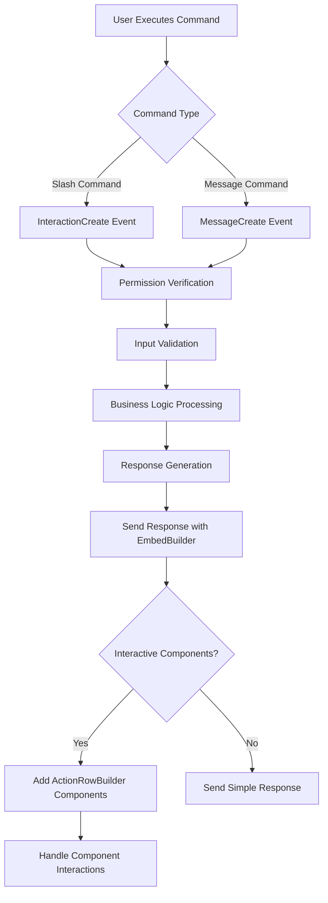
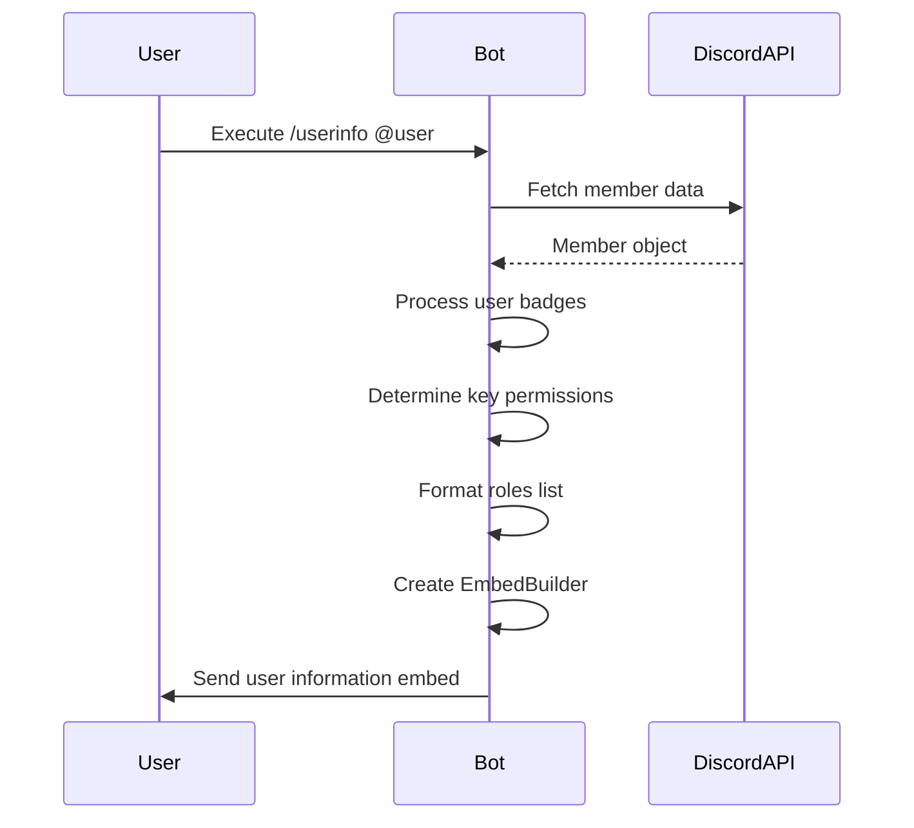
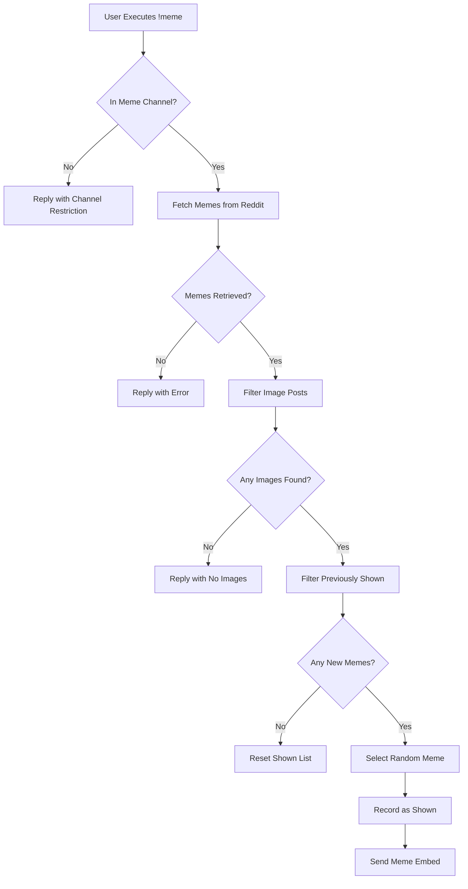
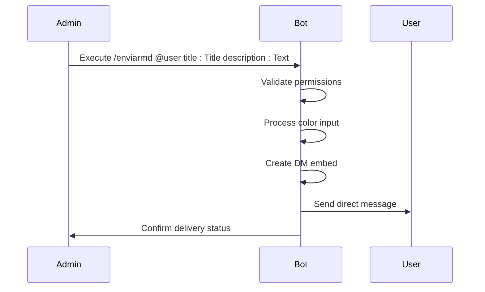
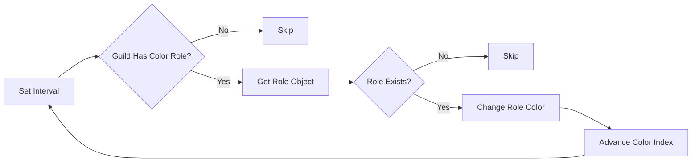
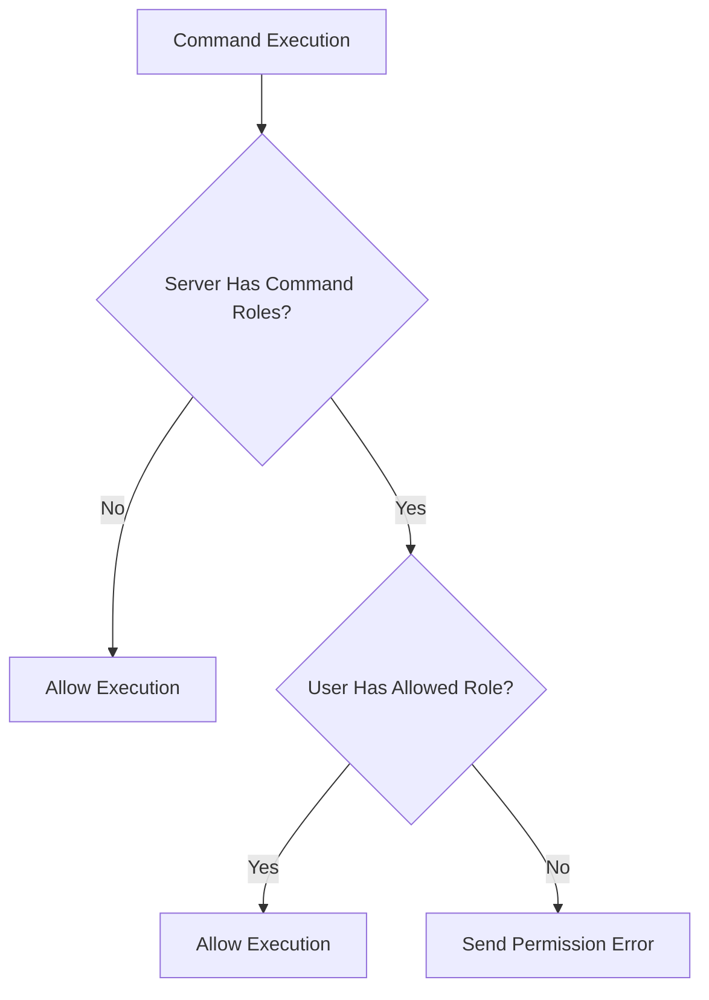
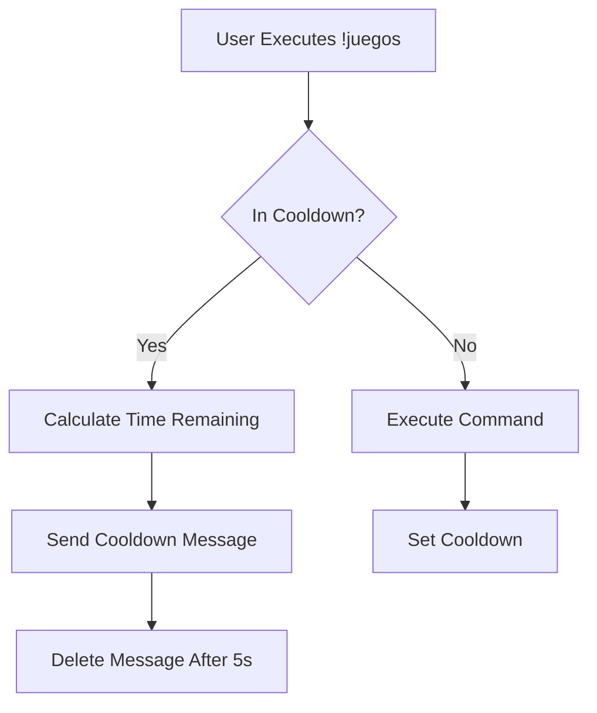

# Utility Systems

<cite>
**Referenced Files in This Document**   
- [index.js](file://index.js)
- [color-roles.json](file://color-roles.json)
- [package.json](file://package.json)
</cite>

## Table of Contents
1. [Introduction](#introduction)
2. [Command System Overview](#command-system-overview)
3. [Information Commands](#information-commands)
4. [Fun Commands](#fun-commands)
5. [Communication Tools](#communication-tools)
6. [Color Roles System](#color-roles-system)
7. [Command Roles System](#command-roles-system)
8. [Common Issues and Solutions](#common-issues-and-solutions)

## Introduction
The Utility Systems component of the Discord bot provides a comprehensive suite of commands and features designed to enhance server functionality, improve user experience, and streamline administrative tasks. This documentation details the implementation of various command categories including information retrieval, entertainment, communication tools, and role management systems. The bot leverages Discord.js v14 features such as slash commands, message components, and rich embeds to deliver interactive and visually appealing responses. Special focus is given to the color role rotation system, command role permissions, and various utility commands that facilitate server management.

**Section sources**
- [index.js](file://index.js#L1-L6903)

## Command System Overview
The bot implements a robust command system using Discord's slash commands and message-based interactions. Commands are categorized into information, moderation, roles, voice management, tickets, and utilities. The system includes permission checks, rate limiting, and error handling to ensure reliable operation. Commands are registered through the Discord API and can be deployed using the deploy-commands.js script. The bot supports both slash commands and legacy message-based commands (prefixed with !), providing flexibility for users.

The command execution flow follows a consistent pattern: permission verification, input validation, business logic processing, and response generation using EmbedBuilder for rich formatting. ActionRowBuilder and associated component builders are used to create interactive elements such as buttons and select menus that enhance user engagement.



**Diagram sources**
- [index.js](file://index.js#L823-L6903)

**Section sources**
- [index.js](file://index.js#L823-L6903)
- [package.json](file://package.json#L1-L27)

## Information Commands
The information command suite provides users with detailed insights about server members, channels, roles, and server statistics. These commands utilize Discord.js's EmbedBuilder to present information in a structured and visually appealing format with appropriate colors, thumbnails, and field organization.

### /userinfo Command
The `/userinfo` command retrieves comprehensive information about a specified user or the command executor if no user is specified. It displays user profile details, server-specific information, role data, and Discord badges. The command implements proper error handling for users not found in the server and provides contextual information about user status and activity.



**Diagram sources**
- [index.js](file://index.js#L3234-L3399)

### /serverinfo Command
The `/serverinfo` command provides an overview of server statistics including member count, channel count, role count, and boost status. It presents this information in a clean embed format with server icon as thumbnail and properly formatted timestamps.

**Section sources**
- [index.js](file://index.js#L4060-L4085)

### /avatar Command
The `/avatar` command displays a user's avatar in high resolution. It supports both slash command invocation and can be used to view any user's avatar by mentioning them or defaults to the executor's avatar.

**Section sources**
- [index.js](file://index.js#L3206-L3225)

## Fun Commands
The bot includes a variety of entertainment-focused commands designed to engage users and add fun elements to server interactions.

### /poll Command
The `/poll` command creates interactive polls with up to 10 options. It uses message reactions to collect votes and displays results in a formatted embed. The command requires ManageMessages permission to prevent abuse.

**Section sources**
- [index.js](file://index.js#L3982-L4024)

### /meme Command
The `/meme` command fetches random memes from r/MemesESP subreddit and displays them in the channel. It implements a tracking system to avoid repeating recently shown memes and includes rate limiting to prevent spam.



**Diagram sources**
- [index.js](file://index.js#L1515-L1589)

### Game Commands
The bot implements several game commands including:
- **/8ball**: Magic 8-ball fortune telling with random responses
- **/coinflip**: Simulates flipping a coin with visual indicators
- **/dado**: Rolls dice with configurable sides (2-100)
- **/rps**: Rock-paper-scissors game against the bot
- **/roll**: Dice rolling in D&D format (e.g., 2d6)
- **/ship**: Compatibility calculator between two users
- **/trivia**: Interactive trivia game with multiple categories

These commands use consistent formatting with appropriate emojis and colors to enhance the gaming experience.

**Section sources**
- [index.js](file://index.js#L4103-L4317)

## Communication Tools
The bot provides several tools to facilitate communication within the server, including announcement systems and direct messaging capabilities.

### /anuncio Command
The `/anuncio` command creates formatted announcements in specified channels. It supports custom titles, descriptions, colors, and images, allowing administrators to create visually appealing announcements.

**Section sources**
- [index.js](file://index.js#L3944-L3979)

### /enviarmd Command
The `/enviarmd` command enables administrators to send direct messages to users from the bot. This is useful for sending official notifications, warnings, or welcome messages.



**Diagram sources**
- [index.js](file://index.js#L3084-L3199)

## Color Roles System
The color role system allows servers to create automatically rotating color roles that change at configurable intervals. This feature enhances visual appeal and provides a dynamic element to server roles.

### Implementation Details
The color role system is implemented using JavaScript's setInterval function to periodically change the color of a designated role. The rotation speed is configurable per server, with a default of 5 seconds. The system persists configuration across bot restarts by saving data to color-roles.json.

```mermaid
classDiagram
class ColorRoleSystem {
+Map colorRoles
+Map colorIntervals
+startColorRotation(guild, speed)
+createColorRole(guild, color)
}
class RoleData {
+string roleId
+number speed
}
ColorRoleSystem --> RoleData : stores
ColorRoleSystem --> "Discord Guild" : modifies
```

**Diagram sources**
- [index.js](file://index.js#L3046-L3076)

### /colorrole Command
The `/colorrole` command configures a role to automatically change colors. It accepts a role mention and rotation speed (1-60 seconds). The command validates permissions and role hierarchy before activation.

**Section sources**
- [index.js](file://index.js#L5107-L5162)

### /stopcolor Command
The `/stopcolor` command stops the color rotation for the currently configured role. It removes the interval timer and clears the configuration from memory and persistent storage.

**Section sources**
- [index.js](file://index.js#L5164-L5208)

### Color Rotation Mechanism
The color rotation uses a predefined array of hexadecimal colors that cycle sequentially. The system tracks active intervals in a Map collection, allowing multiple servers to have independent color rotation settings.



**Diagram sources**
- [index.js](file://index.js#L3048-L3076)

## Command Roles System
The command roles system implements a permission framework that restricts command usage to users with specific roles. This provides granular control over who can use the bot's features.

### Permission Architecture
The system uses a Map collection to store allowed roles per server. When a command is executed, the bot checks if the user has any of the permitted roles. If no roles are configured for a server, all users can use commands by default.



**Diagram sources**
- [index.js](file://index.js#L2983-L2997)

### /setroles Command
The `/setroles` command configures which roles can use the bot's commands. Only administrators can execute this command, ensuring proper permission management. It accepts up to three role mentions and stores them in the commandRoles collection.

**Section sources**
- [index.js](file://index.js#L4792-L4824)

### Role Inheritance and Permissions
The system respects Discord's role hierarchy and permission inheritance. When checking permissions, it verifies that the bot's highest role is above the target role in the hierarchy to prevent permission errors during role modifications.

**Section sources**
- [index.js](file://index.js#L5073-L5085)

## Common Issues and Solutions
This section addresses frequently encountered issues and their solutions related to the utility systems.

### Rate Limiting
The bot implements rate limiting for certain commands like `!juegos` to prevent spam. The system uses a cooldown mechanism with a 30-second interval, tracking user-server combinations to enforce limits.



**Diagram sources**
- [index.js](file://index.js#L1084-L1105)

### Permission Inheritance in Role Management
When assigning or removing roles, the system checks both the executor's permissions and the bot's role position relative to the target role. This prevents errors when attempting to modify roles that are higher in the hierarchy than the bot's highest role.

**Section sources**
- [index.js](file://index.js#L5078-L5085)

### Color Role Persistence
Color role configurations are persisted across bot restarts by saving to color-roles.json. The bot restores these configurations in the ready event, ensuring continuity of the color rotation feature.

**Section sources**
- [index.js](file://index.js#L713-L727)

### Error Handling Best Practices
The bot implements comprehensive error handling with try-catch blocks around critical operations. Errors are logged to the console with detailed context, and user-friendly messages are sent to inform users of issues without exposing sensitive information.

**Section sources**
- [index.js](file://index.js#L3-L9)