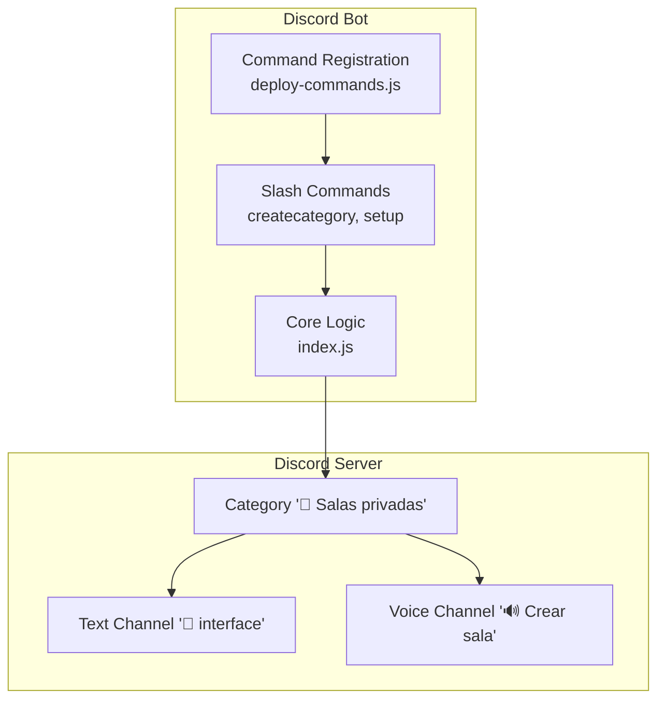
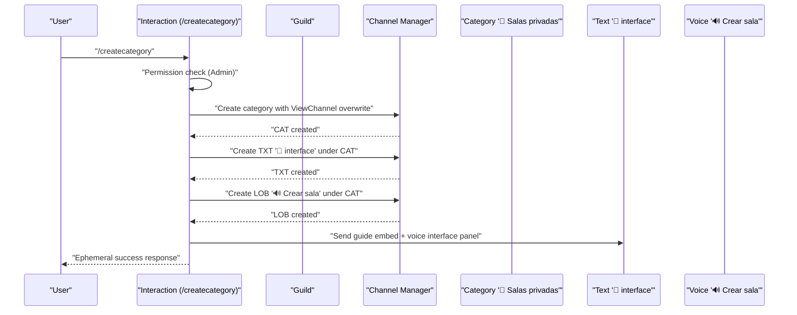
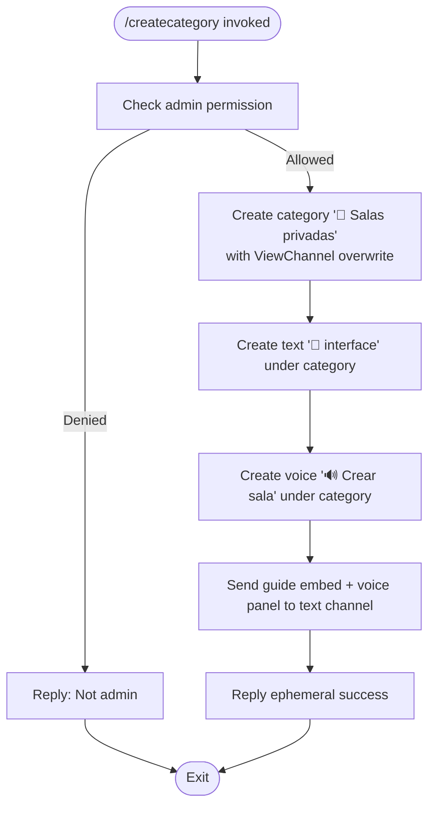
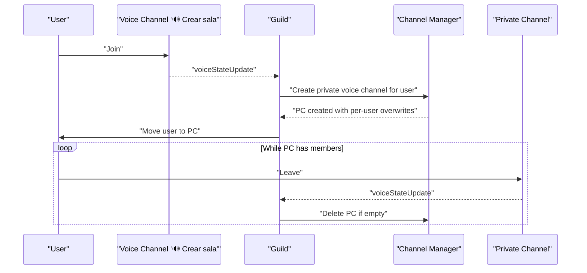
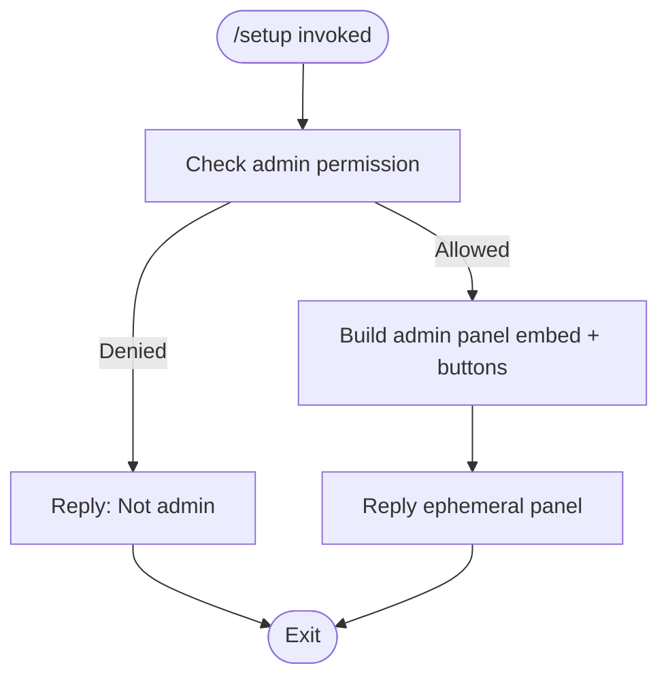
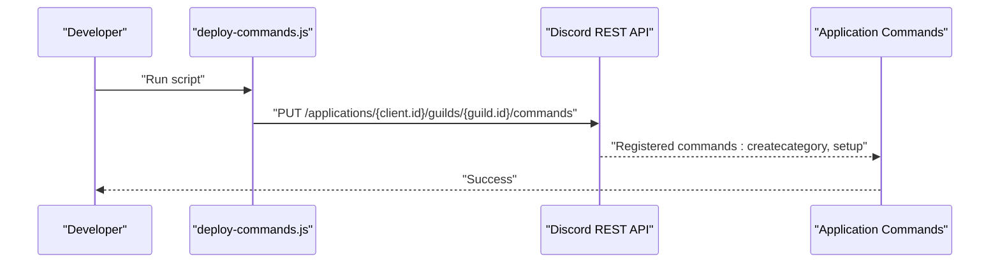
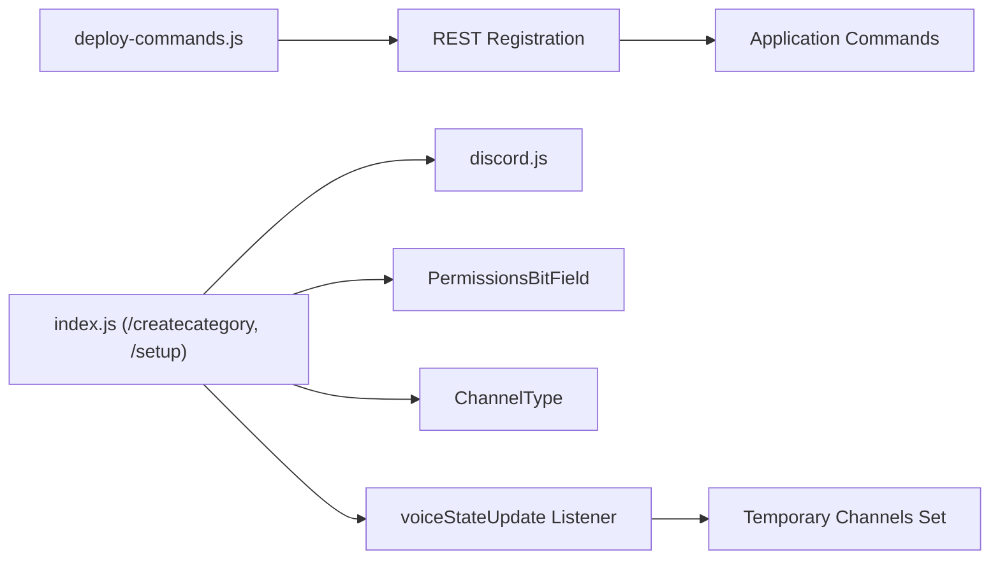

# Category Creation

<cite>
**Referenced Files in This Document**
- [index.js](file://index.js)
- [deploy-commands.js](file://deploy-commands.js)
- [README.md](file://README.md)
</cite>

## Table of Contents
1. [Introduction](#introduction)
2. [Project Structure](#project-structure)
3. [Core Components](#core-components)
4. [Architecture Overview](#architecture-overview)
5. [Detailed Component Analysis](#detailed-component-analysis)
6. [Dependency Analysis](#dependency-analysis)
7. [Performance Considerations](#performance-considerations)
8. [Troubleshooting Guide](#troubleshooting-guide)
9. [Conclusion](#conclusion)

## Introduction
This document explains the “Category Creation” sub-feature that builds the “🍺 Salas privadas” category and its subchannels. It focuses on:
- How the /createcategory command creates the category and subchannels
- How the /setup command provides administrative control over voice rooms
- Permission setup for the category and channels
- Error handling and common issues
- Command registration via deploy-commands.js
- Domain model and usage patterns

## Project Structure
The feature spans two primary areas:
- Command registration: deploy-commands.js defines the /createcategory and /setup slash commands
- Implementation: index.js contains the command handlers and voice room automation logic

**Diagram sources**
- [deploy-commands.js](file://deploy-commands.js#L10-L23)
- [index.js](file://index.js#L4991-L5051)
- [index.js](file://index.js#L2872-L2908)

**Section sources**
- [deploy-commands.js](file://deploy-commands.js#L10-L23)
- [README.md](file://README.md#L52-L61)

## Core Components
- /createcategory command handler: Creates the category and subchannels, publishes a guide, and sends an ephemeral success response.
- Voice room automation: On joining the “🔊 Crear sala” voice channel, a temporary private voice channel is created for the user, and the channel is automatically deleted when empty.
- /setup command handler: Provides an administrative panel for voice management (disconnect all, delete temp rooms, clean voice).

Key implementation references:
- Category creation and subchannels: [index.js](file://index.js#L4991-L5051)
- Voice room automation: [index.js](file://index.js#L2872-L2908)
- Setup command panel: [index.js](file://index.js#L5293-L5323)

**Section sources**
- [index.js](file://index.js#L4991-L5051)
- [index.js](file://index.js#L2872-L2908)
- [index.js](file://index.js#L5293-L5323)

## Architecture Overview
The category creation workflow integrates command handling, channel creation, and voice room automation.

**Diagram sources**
- [index.js](file://index.js#L4991-L5051)

## Detailed Component Analysis

### /createcategory Command Handler
Purpose:
- Create the “🍺 Salas privadas” category with:
  - Category with ViewChannel overwrite for @everyone
  - Text channel “🧮 interface”
  - Voice channel “🔊 Crear sala”
- Publish a guide embed and a voice interface panel in the text channel
- Reply with an ephemeral success embed

Key behaviors:
- Permission enforcement: only administrators can run the command
- Error handling: catches exceptions and replies with a user-friendly message
- Subchannel creation order: category first, then text, then voice
- Sends a guide embed and a voice interface panel to the text channel

Implementation references:
- Command handler: [index.js](file://index.js#L4991-L5051)
- Voice interface panel builder: [index.js](file://index.js#L2999-L3029)

**Diagram sources**
- [index.js](file://index.js#L4991-L5051)
- [index.js](file://index.js#L2999-L3029)

**Section sources**
- [index.js](file://index.js#L4991-L5051)
- [index.js](file://index.js#L2999-L3029)

### Voice Room Automation (Temporary Private Rooms)
Purpose:
- When a user joins the “🔊 Crear sala” voice channel, a temporary private voice channel is created for them
- The user is moved into their new channel
- When the channel becomes empty, it is deleted automatically

Key behaviors:
- Channel creation uses permission overwrites to grant Connect, Speak, and ManageChannels to the creator
- Stores the channel ID in a set to track temporary channels
- Deletes the channel when it becomes empty

Implementation references:
- VoiceStateUpdate listener and room creation: [index.js](file://index.js#L2872-L2908)
- Temporary channel deletion logic: [index.js](file://index.js#L2910-L2950)

**Diagram sources**
- [index.js](file://index.js#L2872-L2908)
- [index.js](file://index.js#L2910-L2950)

**Section sources**
- [index.js](file://index.js#L2872-L2908)
- [index.js](file://index.js#L2910-L2950)

### /setup Command Handler
Purpose:
- Provide an administrative panel for voice room management:
  - Disconnect all users from voice channels
  - Delete temporary voice rooms
  - Clean voice (disconnect + delete temp rooms)

Key behaviors:
- Permission enforcement: only administrators can use the command
- Renders an interactive panel with buttons for actions

Implementation references:
- Setup command handler: [index.js](file://index.js#L5293-L5323)

**Diagram sources**
- [index.js](file://index.js#L5293-L5323)

**Section sources**
- [index.js](file://index.js#L5293-L5323)

### Command Registration
Purpose:
- Register slash commands including /createcategory and /setup with the Discord API

Key behaviors:
- Defines command builders for createcategory and setup
- Uses REST API to register commands for a specific guild

Implementation references:
- Command builders and registration: [deploy-commands.js](file://deploy-commands.js#L10-L23)
- REST registration call: [deploy-commands.js](file://deploy-commands.js#L282-L293)

**Diagram sources**
- [deploy-commands.js](file://deploy-commands.js#L10-L23)
- [deploy-commands.js](file://deploy-commands.js#L282-L293)

**Section sources**
- [deploy-commands.js](file://deploy-commands.js#L10-L23)
- [deploy-commands.js](file://deploy-commands.js#L282-L293)

## Dependency Analysis
- Command registration depends on environment variables CLIENT_ID and GUILD_ID
- Command handlers depend on discord.js client, permissions, and channel types
- Voice room automation depends on voice state updates and channel management

**Diagram sources**
- [deploy-commands.js](file://deploy-commands.js#L10-L23)
- [index.js](file://index.js#L4991-L5051)
- [index.js](file://index.js#L2872-L2908)

**Section sources**
- [deploy-commands.js](file://deploy-commands.js#L10-L23)
- [index.js](file://index.js#L4991-L5051)
- [index.js](file://index.js#L2872-L2908)

## Performance Considerations
- Bulk channel creation: Creating multiple channels in quick succession can trigger rate limits. Consider staggering creations or batching with delays if extending the feature.
- VoiceStateUpdate events: The automation runs on every voice state change; keep logic efficient and avoid unnecessary API calls.
- Ephemeral replies: Using ephemeral responses reduces noise in public channels.

## Troubleshooting Guide
Common issues and resolutions:
- Permission errors when creating channels
  - Ensure the bot has Administrator or Manage Channels permissions.
  - Verify the bot’s role position is higher than the category/channel overwrite targets.
  - Reference: [index.js](file://index.js#L4991-L5051)
- Rate limiting during bulk channel creation
  - Introduce small delays between creations or reduce concurrent operations.
  - Reference: [index.js](file://index.js#L4991-L5051)
- Existing category with the same name
  - The current implementation does not check for pre-existing categories. Extend with a lookup before creation to avoid duplicates.
  - Reference: [index.js](file://index.js#L4991-L5051)
- Missing “🔊 Crear sala” voice channel
  - Ensure the category “🍺 Salas privadas” was created and the voice channel exists.
  - Reference: [index.js](file://index.js#L2872-L2908)
- Voice room not deleting when empty
  - Confirm the channel is tracked in the temporary channels set and that the voiceStateUpdate event fires when the last user leaves.
  - Reference: [index.js](file://index.js#L2910-L2950)

**Section sources**
- [index.js](file://index.js#L4991-L5051)
- [index.js](file://index.js#L2872-L2908)
- [index.js](file://index.js#L2910-L2950)

## Conclusion
The “Category Creation” feature provides a streamlined way to set up the “🍺 Salas privadas” category with subchannels and integrates with voice room automation. The /createcategory command handles setup, while /setup offers administrative controls. Proper permissions, error handling, and awareness of rate limits are essential for reliable operation. Extending the implementation to handle pre-existing categories and adding safeguards against rate limits would improve robustness.