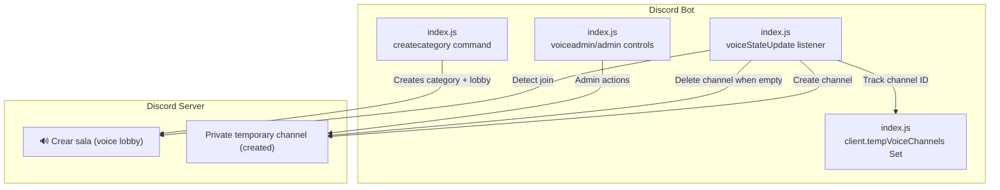
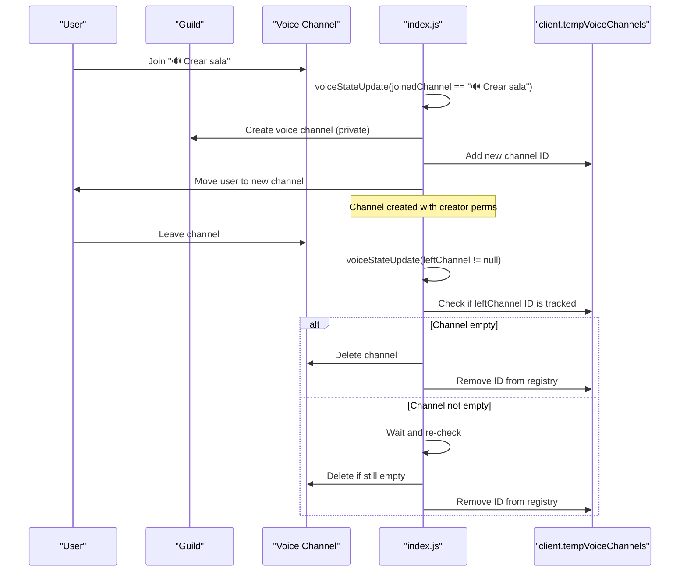
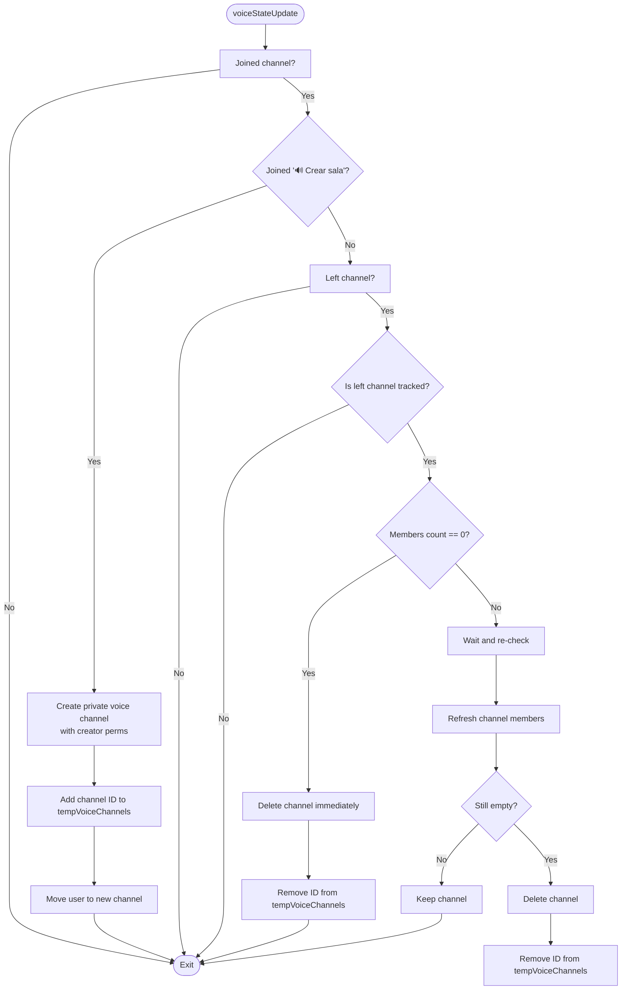
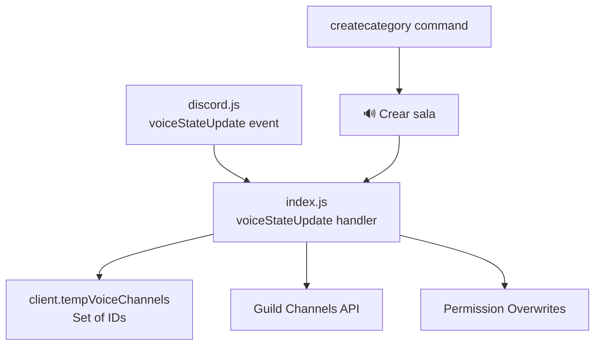

# Temporary Voice Channels

<cite>
**Referenced Files in This Document**
- [index.js](file://index.js)
- [README.md](file://README.md)
- [deploy-commands.js](file://deploy-commands.js)
- [deploy-commands-simple.js](file://deploy-commands-simple.js)
- [deploy-commands-fixed.js](file://deploy-commands-fixed.js)
</cite>

## Table of Contents
1. [Introduction](#introduction)
2. [Project Structure](#project-structure)
3. [Core Components](#core-components)
4. [Architecture Overview](#architecture-overview)
5. [Detailed Component Analysis](#detailed-component-analysis)
6. [Dependency Analysis](#dependency-analysis)
7. [Performance Considerations](#performance-considerations)
8. [Troubleshooting Guide](#troubleshooting-guide)
9. [Conclusion](#conclusion)
10. [Appendices](#appendices)

## Introduction
This document explains the automatic temporary voice channel feature: when a user joins the “🔊 Crear sala” voice channel, the bot creates a private voice channel under the same category, grants the creator manage permissions, moves the user into the new channel, and deletes the channel automatically when it becomes empty. It also documents the client-side collection used to track temporary channels, the event-driven logic in the voiceStateUpdate listener, and the administrative commands that support the feature.

## Project Structure
The feature spans several parts of the codebase:
- Event listener for voice state changes
- Voice channel creation logic
- Collection to track temporary channels
- Command to set up the category and lobby channel
- Administrative commands to manage voice channels

**Diagram sources**
- [index.js](file://index.js#L2442-L2981)
- [index.js](file://index.js#L4991-L5044)
- [index.js](file://index.js#L5293-L6022)

**Section sources**
- [index.js](file://index.js#L2442-L2981)
- [index.js](file://index.js#L4991-L5044)
- [index.js](file://index.js#L5293-L6022)

## Core Components
- Voice state change listener: Detects when a user joins the lobby channel and triggers channel creation; detects when a user leaves a tracked temporary channel and cleans it up.
- Temporary channel registry: A Set storing the IDs of temporary channels to ensure deletion logic can identify which channels to remove.
- Voice lobby setup: A command that creates the “🍺 Salas privadas” category and the “🔊 Crear sala” lobby channel.
- Administrative controls: Buttons and commands to disconnect users, delete temporary channels, and clean up voice channels.

Key implementation references:
- Voice state update listener and temporary channel logic: [index.js](file://index.js#L2442-L2981)
- Temporary channel registry initialization: [index.js](file://index.js#L516-L516)
- Voice lobby creation command: [index.js](file://index.js#L4991-L5044)
- Voice admin panel and actions: [index.js](file://index.js#L5293-L6022)

**Section sources**
- [index.js](file://index.js#L2442-L2981)
- [index.js](file://index.js#L516-L516)
- [index.js](file://index.js#L4991-L5044)
- [index.js](file://index.js#L5293-L6022)

## Architecture Overview
The system is event-driven. When a user joins the lobby, the bot creates a private channel with appropriate permissions and moves the user. When the last user leaves, the bot deletes the channel and removes its ID from the registry.

**Diagram sources**
- [index.js](file://index.js#L2442-L2981)

## Detailed Component Analysis

### Voice State Update Listener (Temporary Channels)
The listener reacts to voiceStateUpdate events and performs two primary tasks:
- On join to the lobby: create a new private voice channel, grant the creator manage permissions, move the user, and register the channel ID.
- On leave from a tracked channel: if the channel is empty, delete it and unregister it.

Implementation highlights:
- Detection of the lobby channel by name and type.
- Creation of a new voice channel under the same category as the lobby.
- Permission overwrites granting Connect, Speak, and ManageChannels to the creator.
- Registration of the new channel ID in the Set.
- Cleanup logic with immediate deletion if empty, and a delayed verification to handle race conditions.

References:
- [index.js](file://index.js#L2442-L2981)

**Diagram sources**
- [index.js](file://index.js#L2442-L2981)

**Section sources**
- [index.js](file://index.js#L2442-L2981)

### Temporary Channel Registry (client.tempVoiceChannels)
The bot maintains a Set of temporary channel IDs to:
- Quickly determine whether a channel was created by the bot.
- Ensure cleanup logic targets only temporary channels.
- Prevent accidental deletion of permanent channels.

Initialization and usage:
- Initialization: [index.js](file://index.js#L516-L516)
- Adding IDs on creation: [index.js](file://index.js#L2896-L2896)
- Removing IDs on deletion: [index.js](file://index.js#L2929-L2929), [index.js](file://index.js#L2954-L2954), [index.js](file://index.js#L2967-L2967), [index.js](file://index.js#L2972-L2972)
- Administrative deletion uses the same registry: [index.js](file://index.js#L5942-L5951), [index.js](file://index.js#L5949-L5951)

**Section sources**
- [index.js](file://index.js#L516-L516)
- [index.js](file://index.js#L2896-L2896)
- [index.js](file://index.js#L2929-L2929)
- [index.js](file://index.js#L2954-L2954)
- [index.js](file://index.js#L2967-L2967)
- [index.js](file://index.js#L2972-L2972)
- [index.js](file://index.js#L5942-L5951)
- [index.js](file://index.js#L5949-L5951)

### Voice Lobby Setup Command
The command creates the “🍺 Salas privadas” category and the “🔊 Crear sala” lobby channel, along with an informational interface channel and a guide embed. This sets up the environment for the automatic temporary channel feature.

References:
- [index.js](file://index.js#L4991-L5044)

**Section sources**
- [index.js](file://index.js#L4991-L5044)

### Administrative Controls for Voice Channels
Administrators can:
- Disconnect all users from voice channels.
- Delete all temporary channels.
- Perform a full cleanup (disconnect + delete).

These actions rely on the temporary channel registry to identify which channels to delete.

References:
- [index.js](file://index.js#L5293-L6022)

**Section sources**
- [index.js](file://index.js#L5293-L6022)

## Dependency Analysis
The temporary voice channel feature depends on:
- Discord.js voice state events and channel management APIs.
- The client-side Set to track temporary channels.
- The lobby channel name and category structure created by the setup command.

**Diagram sources**
- [index.js](file://index.js#L2442-L2981)
- [index.js](file://index.js#L4991-L5044)

**Section sources**
- [index.js](file://index.js#L2442-L2981)
- [index.js](file://index.js#L4991-L5044)

## Performance Considerations
- Event frequency: voiceStateUpdate fires frequently; keep logic minimal and avoid heavy synchronous operations inside the handler.
- Race conditions: When multiple users join simultaneously, the bot creates multiple channels. The cleanup logic includes a short delay to confirm emptiness, reducing the chance of deleting a channel before another user joins.
- Memory footprint: The Set grows with active temporary channels; administrative commands can clear stale entries if needed.

[No sources needed since this section provides general guidance]

## Troubleshooting Guide
Common issues and resolutions:
- Permission conflicts
  - Symptom: Channel creation fails or user cannot connect.
  - Resolution: Ensure the bot has Manage Channels and View Channel permissions. Verify the lobby channel’s category allows the bot to create channels. See [index.js](file://index.js#L4991-L5044) for setup and [index.js](file://index.js#L2882-L2893) for creation logic.
- Channel creation failures
  - Symptom: New channel not created or not moved.
  - Resolution: Check server limits (maximum channels), category permissions, and bot permissions. Review the creation block in [index.js](file://index.js#L2882-L2893).
- Race conditions with simultaneous joins
  - Symptom: Multiple channels created rapidly; occasional duplicate IDs in registry.
  - Resolution: The cleanup logic includes a delay and refresh to confirm emptiness before deletion. See [index.js](file://index.js#L2940-L2974).
- Empty channel not deleted
  - Symptom: Channel remains after the last user leaves.
  - Resolution: The cleanup checks membership twice (immediate and delayed). If the channel was already deleted externally, the handler removes the ID from the registry. See [index.js](file://index.js#L2924-L2974).
- Registry inconsistencies
  - Symptom: Channel not recognized as temporary.
  - Resolution: Administrative deletion uses the registry to target only temporary channels. See [index.js](file://index.js#L5942-L5951).

**Section sources**
- [index.js](file://index.js#L2882-L2893)
- [index.js](file://index.js#L2924-L2974)
- [index.js](file://index.js#L5942-L5951)

## Conclusion
The temporary voice channel feature is implemented with a robust event-driven listener, a simple registry for tracking channels, and complementary commands and administrative controls. It reliably creates private channels on demand and cleans them up when empty, providing a seamless user experience for dynamic voice rooms.

[No sources needed since this section summarizes without analyzing specific files]

## Appendices

### Usage Patterns and Examples
- Automatic creation: Join “🔊 Crear sala” to receive a private channel named after your username. See [index.js](file://index.js#L2872-L2908).
- Automatic cleanup: Leave the private channel; if empty, it is deleted. See [index.js](file://index.js#L2910-L2974).
- Setup: Run the setup command to create the category and lobby. See [index.js](file://index.js#L4991-L5044).
- Administration: Use the voice admin panel to disconnect users, delete temporary channels, or clean up voice channels. See [index.js](file://index.js#L5293-L6022).

**Section sources**
- [index.js](file://index.js#L2872-L2908)
- [index.js](file://index.js#L2910-L2974)
- [index.js](file://index.js#L4991-L5044)
- [index.js](file://index.js#L5293-L6022)

### Configuration Options and Parameters
- Voice lobby channel name: “🔊 Crear sala”
- Category name: “🍺 Salas privadas”
- Channel creation parameters:
  - Name: derived from the user’s username
  - Type: voice channel
  - Parent: same category as the lobby
  - Permission overwrites: Connect, Speak, ManageChannels granted to the creator
- Administrative controls:
  - Disconnect all users
  - Delete temporary channels
  - Clean all (disconnect + delete)

**Section sources**
- [index.js](file://index.js#L2882-L2893)
- [index.js](file://index.js#L4991-L5044)
- [index.js](file://index.js#L5293-L6022)

### Related Commands and Deployment
- Command registration for voice interface and category creation:
  - [deploy-commands.js](file://deploy-commands.js#L11-L19)
  - [deploy-commands-simple.js](file://deploy-commands-simple.js#L43-L43)
  - [deploy-commands-simple.js](file://deploy-commands-simple.js#L85-L85)
  - [deploy-commands-fixed.js](file://deploy-commands-fixed.js#L5-L5)
  - [deploy-commands-fixed.js](file://deploy-commands-fixed.js#L13-L13)
- Feature overview in README:
  - [README.md](file://README.md#L52-L61)

**Section sources**
- [deploy-commands.js](file://deploy-commands.js#L11-L19)
- [deploy-commands-simple.js](file://deploy-commands-simple.js#L43-L43)
- [deploy-commands-simple.js](file://deploy-commands-simple.js#L85-L85)
- [deploy-commands-fixed.js](file://deploy-commands-fixed.js#L5-L5)
- [deploy-commands-fixed.js](file://deploy-commands-fixed.js#L13-L13)
- [README.md](file://README.md#L52-L61)