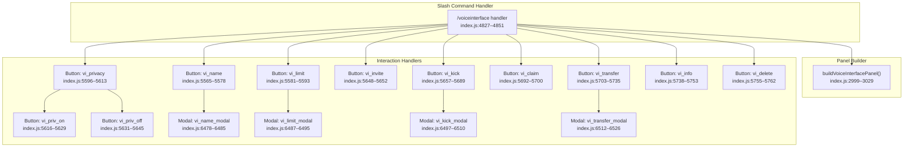
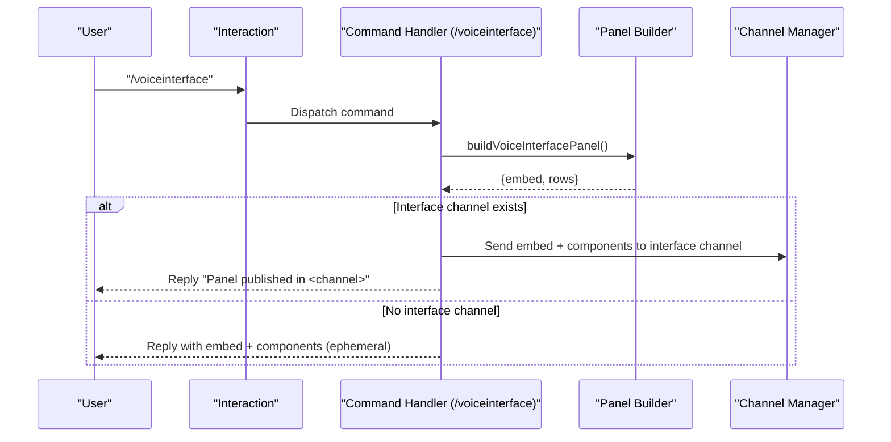
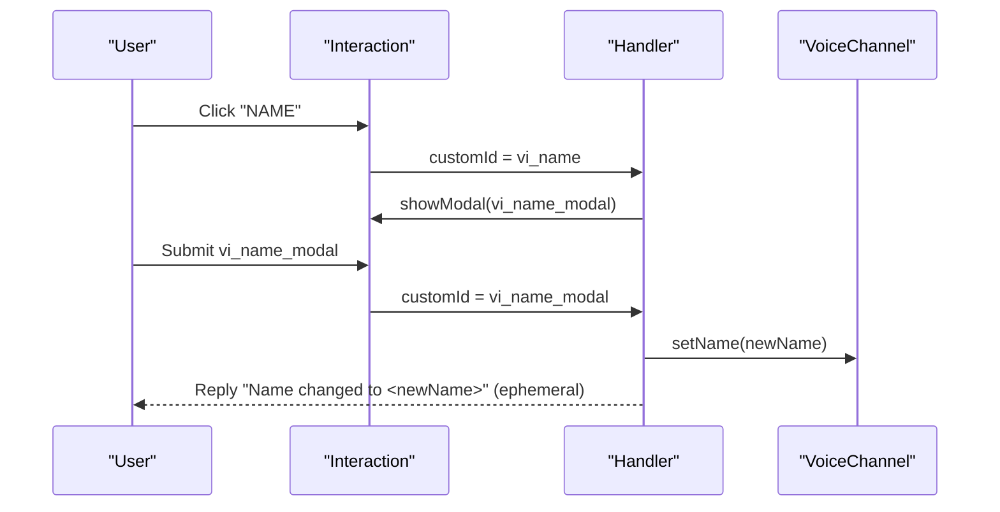
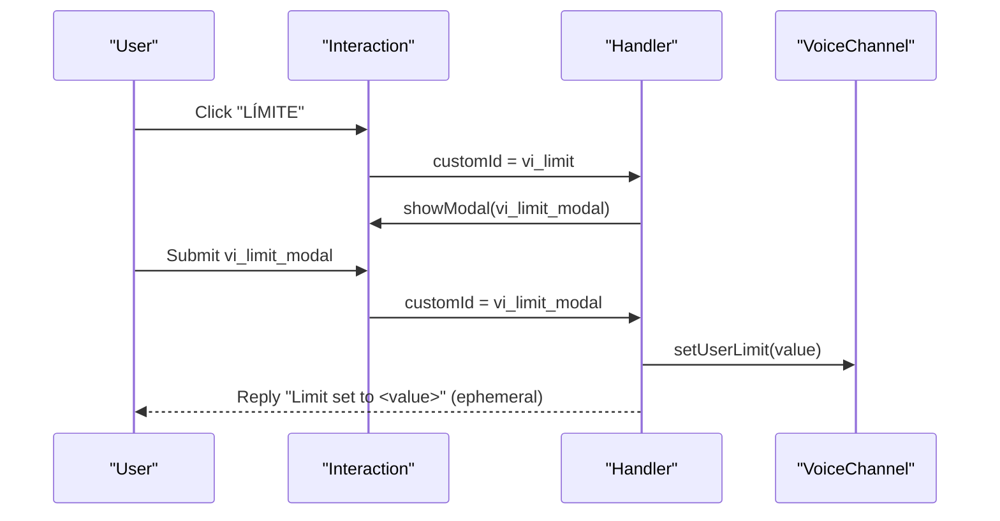
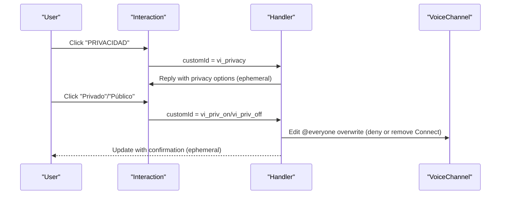
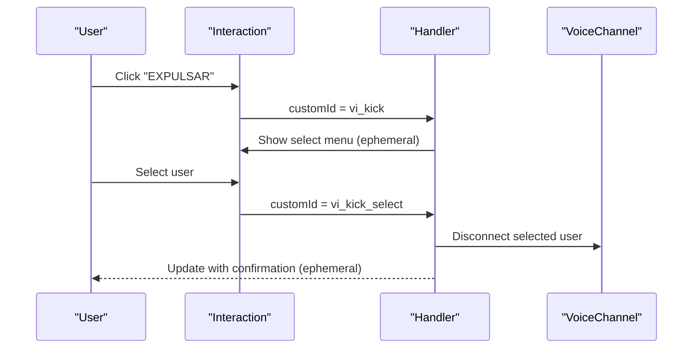
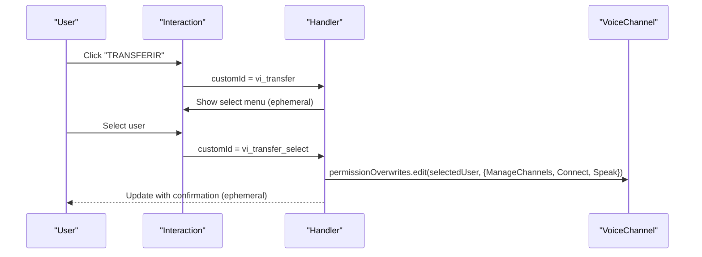
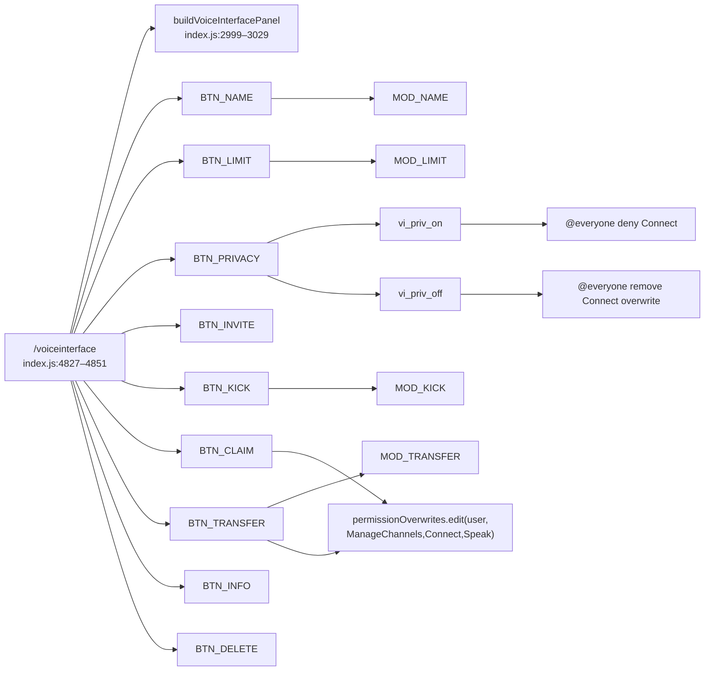

# Voice Interface

<cite>
**Referenced Files in This Document**
- [index.js](file://index.js)
- [README.md](file://README.md)
- [COMANDOS-SOPORTE-VOZ.md](file://COMANDOS-SOPORTE-VOZ.md)
</cite>

## Table of Contents
1. [Introduction](#introduction)
2. [Project Structure](#project-structure)
3. [Core Components](#core-components)
4. [Architecture Overview](#architecture-overview)
5. [Detailed Component Analysis](#detailed-component-analysis)
6. [Dependency Analysis](#dependency-analysis)
7. [Performance Considerations](#performance-considerations)
8. [Troubleshooting Guide](#troubleshooting-guide)
9. [Conclusion](#conclusion)
10. [Appendices](#appendices)

## Introduction
This document explains the Voice Interface sub-feature that powers the /voiceinterface command. It enables users to manage their temporary voice channels with a contextual menu of actions: change name, set user limit, toggle privacy, invite users, kick users, claim ownership, transfer ownership, and delete the channel. The implementation centers around a slash command handler that builds a persistent panel and a series of interaction handlers that process button clicks and modals. It also documents how the command integrates with voice channel permission overwrites and how it interacts with the broader voice ecosystem.

## Project Structure
The Voice Interface is implemented in a single module with a clear separation of concerns:
- Command handler for /voiceinterface
- Panel builder that constructs the embed and action rows
- Interaction handlers for button clicks and modals
- Utility to ensure the user is in a voice channel
- Permission overwrite management for ownership and privacy

**Diagram sources**
- [index.js](file://index.js#L2999-L3029)
- [index.js](file://index.js#L4827-L4851)
- [index.js](file://index.js#L5565-L5762)
- [index.js](file://index.js#L6478-L6526)

**Section sources**
- [index.js](file://index.js#L2999-L3029)
- [index.js](file://index.js#L4827-L4851)

## Core Components
- Slash command: /voiceinterface
  - Purpose: Publishes a voice management panel in a server “interface” channel or replies to the user with ephemeral components.
  - Behavior: Builds a panel via buildVoiceInterfacePanel and attempts to post it in a channel whose name contains “interface”. If not found, it still returns the panel to the user.
  - Permissions: Uses a general permission check before other commands; the Voice Interface itself does not restrict who can use the panel.

- Panel builder: buildVoiceInterfacePanel
  - Produces an embed with a list of available actions and three rows of buttons:
    - Row 1: NAME, LIMIT, PRIVACY, INVITE
    - Row 2: KICK, CLAIM, TRANSFER, DELETE
    - Row 3: INFO
  - Buttons are labeled with emojis and custom IDs mapped to handlers.

- Interaction handlers
  - NAME: Opens a modal to change the channel name.
  - LIMIT: Opens a modal to set the user limit (0 = unlimited).
  - PRIVACY: Shows a privacy toggle panel (Private vs Public) and applies permission overwrites accordingly.
  - INVITE: Creates a temporary invite link to the voice channel.
  - KICK: Presents a select menu to choose a user to kick from the voice channel.
  - CLAIM: Grants ManageChannels, Connect, and Speak permissions to the current user.
  - TRANSFER: Presents a select menu to transfer ownership to another user.
  - INFO: Displays metadata about the voice channel (ID, region, user limit, privacy, members).
  - DELETE: Deletes the voice channel and removes it from the temporary voice registry.

- Utilities
  - ensureInVoice: Validates that the user is in a voice channel before performing actions.

- Permission overwrites
  - Ownership transfer and claiming grant ManageChannels, Connect, and Speak to the target user.
  - Privacy toggling edits the @everyone overwrite to deny or remove the Connect permission.

**Section sources**
- [index.js](file://index.js#L2999-L3029)
- [index.js](file://index.js#L4827-L4851)
- [index.js](file://index.js#L5555-L5762)
- [index.js](file://index.js#L6478-L6526)

## Architecture Overview
The Voice Interface follows a command-driven architecture:
- The slash command triggers a panel creation routine.
- The panel displays actionable buttons.
- Each button triggers either a modal or a select menu, or directly performs an action.
- Modals and select menus update the voice channel’s properties or overwrites.

**Diagram sources**
- [index.js](file://index.js#L4827-L4851)
- [index.js](file://index.js#L2999-L3029)

## Detailed Component Analysis

### Command Handler: /voiceinterface
- Responsibilities:
  - Defer reply to prevent “not responding” errors.
  - Build the panel.
  - Attempt to publish the panel in a server channel named “interface”.
  - Fall back to an ephemeral reply if no interface channel exists.
- Error handling:
  - Catches exceptions and ensures a safe reply is sent.

**Section sources**
- [index.js](file://index.js#L4827-L4851)

### Panel Builder: buildVoiceInterfacePanel
- Produces:
  - An embed with a description and a field enumerating available actions.
  - Three ActionRows containing buttons with custom IDs and emojis.
- Output:
  - Returns an object with embed and rows for immediate use in a reply or channel send.

**Section sources**
- [index.js](file://index.js#L2999-L3029)

### Button Handlers and Modals

#### Name Change (vi_name -> vi_name_modal)
- Flow:
  - Button opens a modal with a short text input.
  - Modal validates non-empty input and renames the voice channel.
- Validation:
  - Rejects empty names.
- Effects:
  - Updates the voice channel’s name.

**Diagram sources**
- [index.js](file://index.js#L5565-L5578)
- [index.js](file://index.js#L6478-L6485)

**Section sources**
- [index.js](file://index.js#L5565-L5578)
- [index.js](file://index.js#L6478-L6485)

#### User Limit (vi_limit -> vi_limit_modal)
- Flow:
  - Button opens a modal with a numeric input.
  - Modal validates integer in [0, 99] and sets the user limit.
- Validation:
  - Rejects invalid, out-of-range, or non-numeric values.
- Effects:
  - Sets the voice channel’s userLimit; 0 means unlimited.

**Diagram sources**
- [index.js](file://index.js#L5581-L5593)
- [index.js](file://index.js#L6487-L6495)

**Section sources**
- [index.js](file://index.js#L5581-L5593)
- [index.js](file://index.js#L6487-L6495)

#### Privacy Toggle (vi_privacy -> vi_priv_on/vi_priv_off)
- Flow:
  - Button opens an ephemeral panel showing current privacy state.
  - Private: denies @everyone Connect.
  - Public: removes @everyone Connect overwrite.
- Effects:
  - Updates permission overwrites for the @everyone role.

**Diagram sources**
- [index.js](file://index.js#L5596-L5645)

**Section sources**
- [index.js](file://index.js#L5596-L5645)

#### Invite (vi_invite)
- Flow:
  - Button creates a temporary invite to the voice channel.
- Effects:
  - Sends the invite URL to the user (ephemeral).

**Section sources**
- [index.js](file://index.js#L5648-L5652)

#### Kick (vi_kick -> vi_kick_modal)
- Flow:
  - Button opens a select menu with users currently in the voice channel (excluding the bot and the requester).
  - Selecting a user kicks them from the voice channel.
- Validation:
  - Ensures the user is still in the channel when confirming.
- Effects:
  - Disconnects the selected user from the voice channel.

**Diagram sources**
- [index.js](file://index.js#L5657-L5689)
- [index.js](file://index.js#L6623-L6655)

**Section sources**
- [index.js](file://index.js#L5657-L5689)
- [index.js](file://index.js#L6623-L6655)

#### Claim Ownership (vi_claim)
- Flow:
  - Button grants ManageChannels, Connect, and Speak to the current user.
- Effects:
  - Allows the user to manage the channel (rename, limit, privacy, kick, transfer, delete).

**Section sources**
- [index.js](file://index.js#L5692-L5700)

#### Transfer Ownership (vi_transfer -> vi_transfer_modal)
- Flow:
  - Button opens a select menu with users currently in the voice channel (excluding the bot and the requester).
  - Selecting a user transfers ownership by granting them ManageChannels, Connect, and Speak.
- Effects:
  - Updates permission overwrites for the new owner.

**Diagram sources**
- [index.js](file://index.js#L5703-L5735)
- [index.js](file://index.js#L6657-L6685)

**Section sources**
- [index.js](file://index.js#L5703-L5735)
- [index.js](file://index.js#L6657-L6685)

#### Info (vi_info)
- Flow:
  - Button displays an ephemeral embed with channel metadata: ID, region, user limit, privacy, and members.
- Effects:
  - No modifications; only informational.

**Section sources**
- [index.js](file://index.js#L5738-L5753)

#### Delete (vi_delete)
- Flow:
  - Button deletes the voice channel and removes it from the temporary voice registry.
- Effects:
  - Channel deletion and cleanup.

**Section sources**
- [index.js](file://index.js#L5755-L5762)

### Relationship to Voice Channel Permissions Management
- Ownership:
  - Claiming and transferring ownership rely on editing permission overwrites for the target user to grant ManageChannels, Connect, and Speak.
- Privacy:
  - Privacy toggling edits the @everyone overwrite to deny or remove Connect, controlling who can enter the channel.
- Kick:
  - Kicking a user disconnects them from the voice channel; it does not modify permission overwrites.

**Section sources**
- [index.js](file://index.js#L5692-L5700)
- [index.js](file://index.js#L5616-L5645)
- [index.js](file://index.js#L6657-L6685)

### Usage Patterns and Examples
- Typical usage:
  - Run /voiceinterface to publish the panel in a server “interface” channel or receive an ephemeral panel.
  - Use buttons to manage the voice channel you are currently in.
  - Transfer ownership to another user when leaving the channel.
  - Toggle privacy to control who can join.
- Example flows:
  - Rename a channel: NAME -> Enter new name -> Confirm.
  - Set a user limit: LIMIT -> Enter number -> Confirm.
  - Make a channel private: PRIVACY -> Privado -> Confirm.
  - Invite users: INVITE -> Copy link.
  - Kick a user: KICK -> Select user -> Confirm.
  - Claim ownership: CLAIM -> Confirm.
  - Transfer ownership: TRANSFER -> Select user -> Confirm.
  - View info: INFO -> See metadata.
  - Delete channel: DELETE -> Confirm.

**Section sources**
- [index.js](file://index.js#L2999-L3029)
- [index.js](file://index.js#L4827-L4851)
- [index.js](file://index.js#L5555-L5762)
- [index.js](file://index.js#L6478-L6526)

## Dependency Analysis
- Internal dependencies:
  - The command handler depends on the panel builder to construct the UI.
  - Button handlers depend on ensureInVoice to validate the user’s presence in a voice channel.
  - Modal handlers depend on the voice channel instance associated with the user.
  - Ownership transfer and claiming edit permission overwrites for the target user.
- External dependencies:
  - Discord.js components (ActionRowBuilder, ButtonBuilder, ModalBuilder, TextInputBuilder, StringSelectMenuBuilder).
  - PermissionsBitField for managing overwrites.
  - ChannelType for identifying channel types.

**Diagram sources**
- [index.js](file://index.js#L2999-L3029)
- [index.js](file://index.js#L4827-L4851)
- [index.js](file://index.js#L5565-L5762)
- [index.js](file://index.js#L6478-L6526)

**Section sources**
- [index.js](file://index.js#L2999-L3029)
- [index.js](file://index.js#L4827-L4851)
- [index.js](file://index.js#L5565-L5762)
- [index.js](file://index.js#L6478-L6526)

## Performance Considerations
- Interaction handling is lightweight and operates on local state and a small number of API calls per action.
- Creating invites and editing permission overwrites are efficient operations.
- Avoid excessive polling; the handlers respond to user interactions rather than periodic checks.

[No sources needed since this section provides general guidance]

## Troubleshooting Guide
- User not in a voice channel:
  - Symptom: Buttons prompt “You must be in a voice channel.”
  - Cause: ensureInVoice validation fails.
  - Fix: Join a voice channel and retry the action.

- Name change rejected:
  - Symptom: “Name cannot be empty.”
  - Cause: Modal validation rejects blank input.
  - Fix: Enter a non-empty name.

- Limit rejected:
  - Symptom: “Enter a valid number between 0 and 99.”
  - Cause: Non-numeric or out-of-range input.
  - Fix: Enter a number in the allowed range.

- Privacy toggle not applying:
  - Symptom: Channel remains public/private after toggle.
  - Cause: Missing permissions to edit overwrites.
  - Fix: Ensure the bot has permission to manage channels and that the user has ownership or appropriate permissions.

- Kick fails:
  - Symptom: “That user is no longer in your room.”
  - Cause: Target left the channel before confirmation.
  - Fix: Re-run the action and select the user again.

- Transfer ownership fails:
  - Symptom: “Could not identify user. Use a mention or valid ID.”
  - Cause: Invalid user reference.
  - Fix: Use a valid mention or user ID.

- Delete channel fails:
  - Symptom: “Channel not found” or permission denied.
  - Cause: Channel was deleted externally or bot lacks permissions.
  - Fix: Verify the channel exists and the bot has Manage Channels.

**Section sources**
- [index.js](file://index.js#L5555-L5762)
- [index.js](file://index.js#L6478-L6526)
- [index.js](file://index.js#L6623-L6685)

## Conclusion
The Voice Interface provides a comprehensive, user-friendly way to manage temporary voice channels. It combines a slash command with a contextual panel and a suite of interactive handlers to change names, limits, privacy, invite users, kick users, claim ownership, transfer ownership, and delete channels. Its design emphasizes safety (validations, ephemeral replies), clarity (consistent button semantics), and robustness (error handling and fallbacks). Integrations with permission overwrites enable secure ownership management and privacy controls.

[No sources needed since this section summarizes without analyzing specific files]

## Appendices

### Configuration Options and Parameters
- /voiceinterface
  - Purpose: Publish the voice management panel.
  - Behavior: Attempts to post in a server channel named “interface”; otherwise returns an ephemeral panel.
  - Return: Confirmation message indicating where the panel was posted or ephemeral reply.

- NAME (vi_name)
  - Parameter: New channel name (modal input).
  - Constraints: Non-empty, up to 100 characters.
  - Return: Confirmation that the name was changed.

- LIMIT (vi_limit)
  - Parameter: User limit (modal input).
  - Constraints: Integer between 0 and 99; 0 means unlimited.
  - Return: Confirmation that the limit was set.

- PRIVACY (vi_privacy)
  - Options: Private (deny @everyone Connect) or Public (remove @everyone Connect overwrite).
  - Return: Confirmation of privacy state change.

- INVITE (vi_invite)
  - Parameter: None.
  - Return: Temporary invite URL.

- KICK (vi_kick)
  - Parameter: User selection from a list of users currently in the voice channel.
  - Return: Confirmation that the user was kicked.

- CLAIM (vi_claim)
  - Parameter: None.
  - Return: Confirmation that ownership was claimed.

- TRANSFER (vi_transfer)
  - Parameter: User selection from a list of users currently in the voice channel.
  - Return: Confirmation that ownership was transferred.

- INFO (vi_info)
  - Parameter: None.
  - Return: Ephemeral embed with channel metadata.

- DELETE (vi_delete)
  - Parameter: None.
  - Return: Confirmation that the channel was deleted.

**Section sources**
- [index.js](file://index.js#L2999-L3029)
- [index.js](file://index.js#L4827-L4851)
- [index.js](file://index.js#L5555-L5762)
- [index.js](file://index.js#L6478-L6526)

### Domain Model and Usage Patterns
- Domain model:
  - VoiceChannel: Represents a temporary voice channel with properties (name, userLimit, region, privacy, members).
  - PermissionOverwrite: Manages who can connect, speak, and manage channels.
  - Interaction: Encapsulates button clicks, modal submissions, and select menu selections.

- Usage patterns:
  - Ownership: Claim or transfer ownership to manage the channel.
  - Privacy: Toggle between private and public to control access.
  - Capacity: Set limits to manage capacity.
  - Access: Invite users or kick users as needed.
  - Information: Inspect channel metadata for diagnostics.

**Section sources**
- [index.js](file://index.js#L5555-L5762)
- [index.js](file://index.js#L6478-L6526)

### Integration Notes
- The Voice Interface complements the broader voice ecosystem documented in the project’s documentation. It focuses on temporary voice channels and ownership management, while other voice-related systems (e.g., waiting rooms, staff roles, sanctions) are covered in separate documentation.

**Section sources**
- [README.md](file://README.md#L52-L61)
- [COMANDOS-SOPORTE-VOZ.md](file://COMANDOS-SOPORTE-VOZ.md#L1-L347)