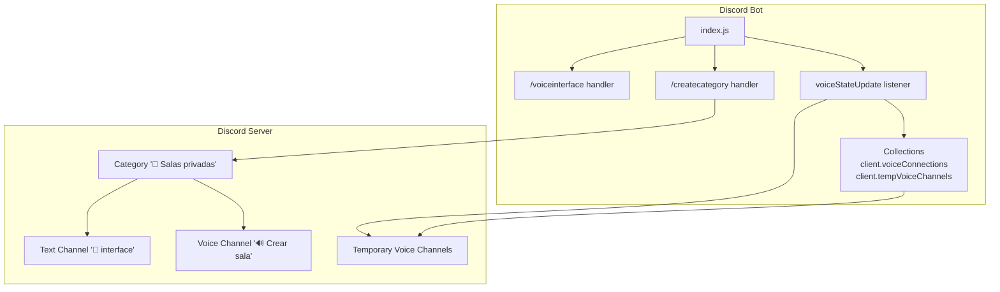
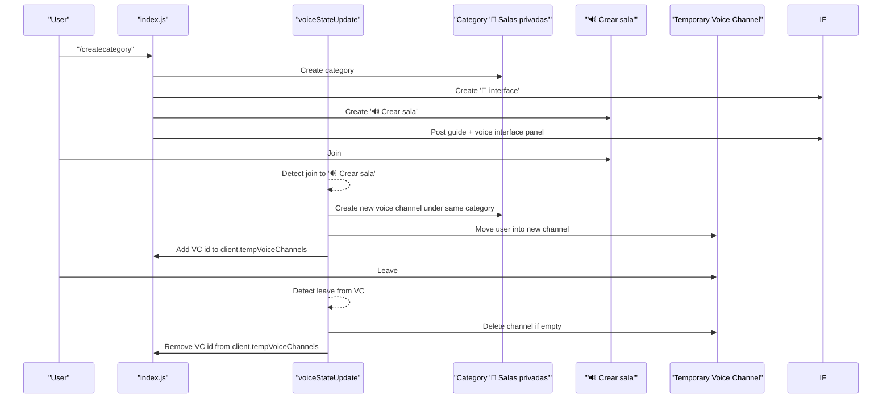
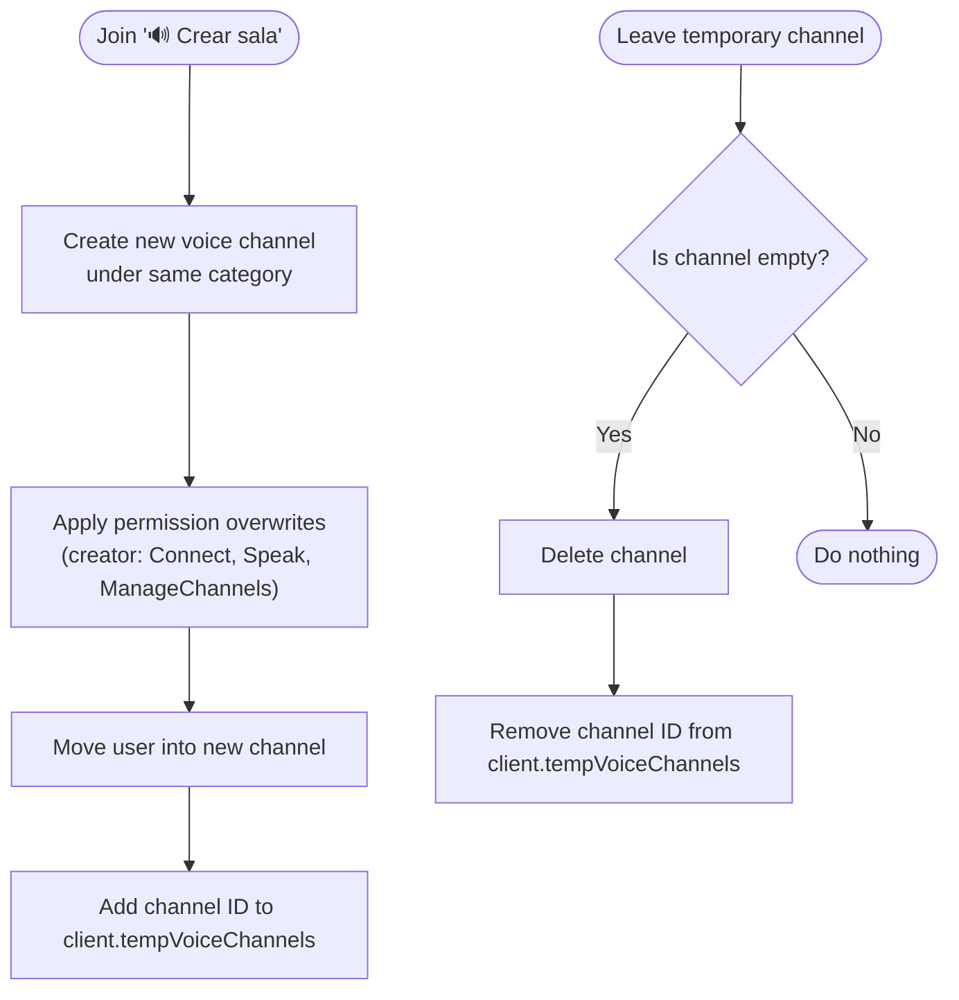
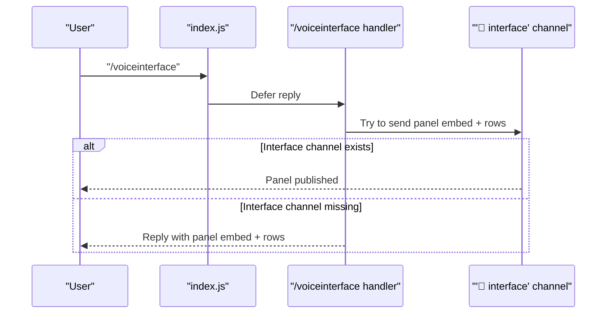
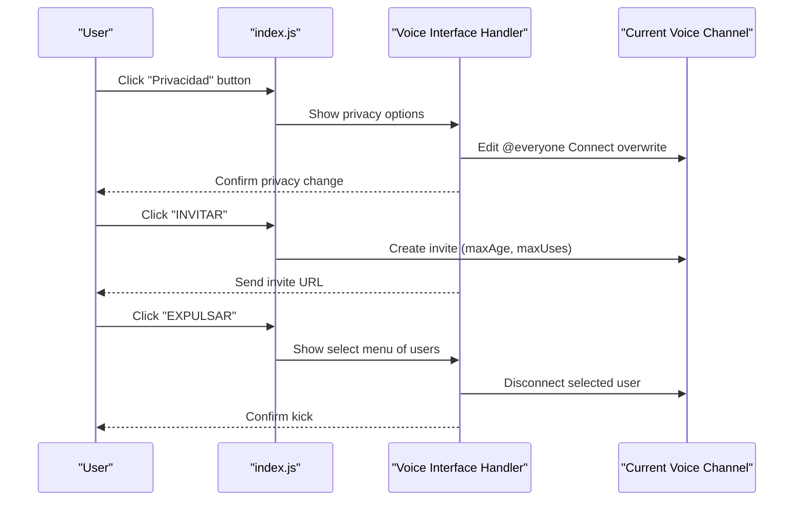
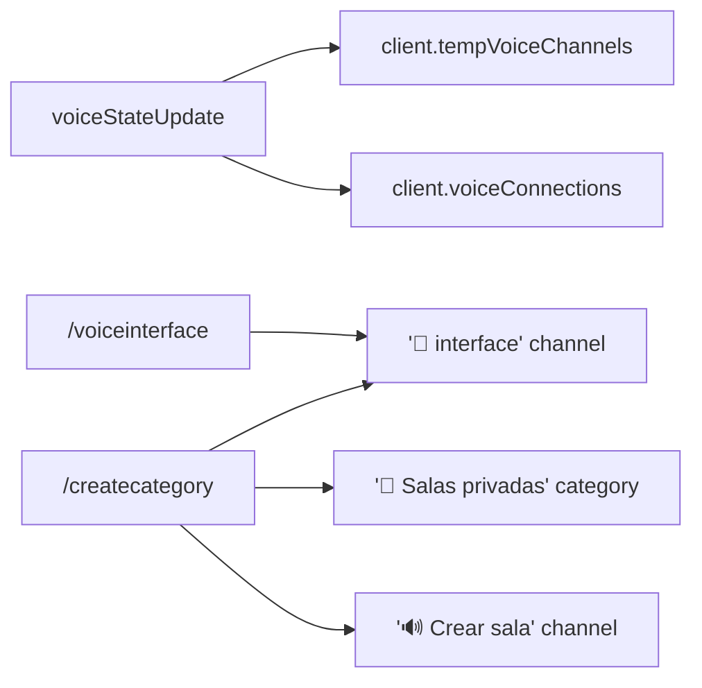

# Voice Management System

<cite>
**Referenced Files in This Document**
- [index.js](file://index.js)
- [README.md](file://README.md)
- [COMANDOS-SOPORTE-VOZ.md](file://COMANDOS-SOPORTE-VOZ.md)
</cite>

## Table of Contents
1. [Introduction](#introduction)
2. [Project Structure](#project-structure)
3. [Core Components](#core-components)
4. [Architecture Overview](#architecture-overview)
5. [Detailed Component Analysis](#detailed-component-analysis)
6. [Dependency Analysis](#dependency-analysis)
7. [Performance Considerations](#performance-considerations)
8. [Troubleshooting Guide](#troubleshooting-guide)
9. [Conclusion](#conclusion)

## Introduction
This document explains the Voice Management System implemented in the project, focusing on:
- Temporary voice channels: automatic creation when users join the “🔊 Crear sala” channel and automatic deletion when empty.
- Voice interface: the /voiceinterface command and the interactive panel for managing temporary voice channels.
- Category creation: the /createcategory command sets up a dedicated category with an interface channel and the lobby channel.
- Voice support system: related voice support channels and commands (not the focus here, but documented for context).
- Domain model: collections used to track voice connections and temporary channels.
- Usage patterns, configuration options, and common issues.

## Project Structure
The voice management logic is implemented primarily in index.js. It integrates with:
- Command handlers for /voiceinterface and /createcategory.
- Voice state update event handling to create/delete temporary channels.
- Collections to track voice connections and temporary channels.

**Diagram sources**
- [index.js](file://index.js#L4827-L4851)
- [index.js](file://index.js#L4992-L5044)
- [index.js](file://index.js#L2443-L2971)
- [index.js](file://index.js#L502-L518)

**Section sources**
- [index.js](file://index.js#L4827-L4851)
- [index.js](file://index.js#L4992-L5044)
- [index.js](file://index.js#L2443-L2971)
- [index.js](file://index.js#L502-L518)

## Core Components
- Temporary voice channels lifecycle:
  - Creation: When a user joins the “🔊 Crear sala” voice channel, a new private voice channel is created under the same category and the user is moved into it. The new channel’s ID is added to client.tempVoiceChannels.
  - Deletion: When the user leaves the temporary channel, the system checks if the channel is empty and deletes it, removing its ID from client.tempVoiceChannels.
- Voice interface:
  - /voiceinterface publishes an interactive panel in the “🧮 interface” text channel (if present) or replies to the user with the panel. The panel exposes actions like renaming, setting limits, privacy, inviting, kicking, claiming, transferring, and deleting the current voice channel.
- Category creation:
  - /createcategory creates the “🍺 Salas privadas” category, the “🧮 interface” text channel, and the “🔊 Crear sala” voice channel, and posts a guide embed and the voice interface panel.

Key runtime collections:
- client.voiceConnections: Tracks voice connections (Collection).
- client.tempVoiceChannels: Tracks IDs of temporary voice channels (Set).

**Section sources**
- [index.js](file://index.js#L2443-L2971)
- [index.js](file://index.js#L4827-L4851)
- [index.js](file://index.js#L4992-L5044)
- [index.js](file://index.js#L502-L518)

## Architecture Overview
The voice management system is event-driven and command-driven:
- Event-driven: voiceStateUpdate detects joins/leaves and manages temporary channels.
- Command-driven: /voiceinterface and /createcategory orchestrate setup and management.
- Collections: client.voiceConnections and client.tempVoiceChannels provide persistent state across events and commands.

**Diagram sources**
- [index.js](file://index.js#L4992-L5044)
- [index.js](file://index.js#L2443-L2971)
- [index.js](file://index.js#L502-L518)

## Detailed Component Analysis

### Temporary Voice Channels Lifecycle
Behavior:
- On join to “🔊 Crear sala”:
  - Creates a new voice channel under the same category.
  - Applies permission overwrites granting the creator Connect, Speak, and ManageChannels.
  - Moves the user into the new channel.
  - Adds the new channel’s ID to client.tempVoiceChannels.
- On leave from a temporary channel:
  - Checks if the channel is empty.
  - Deletes the channel and removes its ID from client.tempVoiceChannels.

**Diagram sources**
- [index.js](file://index.js#L2872-L2971)
- [index.js](file://index.js#L502-L518)

**Section sources**
- [index.js](file://index.js#L2872-L2971)
- [index.js](file://index.js#L502-L518)

### Voice Interface (/voiceinterface)
Purpose:
- Publishes an interactive panel in the “🧮 interface” text channel if it exists; otherwise, replies to the user with the panel.
- Provides quick actions for the current voice channel (if the user is in one).

Key behaviors:
- Defers reply, builds a panel embed and rows, attempts to send to the interface channel, falls back to replying to the user.
- The panel includes actions like:
  - Rename, set limit, privacy toggle, invite, kick, claim, transfer, info, delete.

**Diagram sources**
- [index.js](file://index.js#L4827-L4851)

**Section sources**
- [index.js](file://index.js#L4827-L4851)

### Category and Interface Setup (/createcategory)
Purpose:
- Creates the “🍺 Salas privadas” category.
- Creates the “🧮 interface” text channel and the “🔊 Crear sala” voice channel.
- Posts a guide embed and the voice interface panel in the interface channel.

Configuration:
- Requires Administrator permissions.
- Uses permission overwrites to allow ViewChannel for @everyone in the category.

**Section sources**
- [index.js](file://index.js#L4992-L5044)

### Domain Model and Collections
Runtime state:
- client.voiceConnections: Collection used to track voice connections.
- client.tempVoiceChannels: Set storing IDs of temporary voice channels.

These collections are used across:
- Voice state updates to manage temporary channels.
- Administrative commands to clean up temporary channels.

**Section sources**
- [index.js](file://index.js#L502-L518)
- [index.js](file://index.js#L5931-L5967)

### Voice Interface Actions (Button/Modal/Select Handlers)
The voice interface panel triggers button interactions and modals/select menus. Typical flows:
- Privacy toggle: switches @everyone’s Connect permission (private/public).
- Invite: creates a temporary invite for the current voice channel.
- Kick: selects a user in the channel and disconnects them.
- Claim/Transfer: grants/reassigns ManageChannels to the current user or another user.
- Info: displays channel metadata (ID, region, userLimit, privacy, members).
- Delete: deletes the current voice channel and removes it from client.tempVoiceChannels.

**Diagram sources**
- [index.js](file://index.js#L5595-L5645)
- [index.js](file://index.js#L5647-L5690)
- [index.js](file://index.js#L5691-L5735)
- [index.js](file://index.js#L5737-L5762)

**Section sources**
- [index.js](file://index.js#L5595-L5645)
- [index.js](file://index.js#L5647-L5690)
- [index.js](file://index.js#L5691-L5735)
- [index.js](file://index.js#L5737-L5762)

## Dependency Analysis
- Voice state update depends on:
  - Channel name and type checks.
  - Permission overwrites for new channels.
  - Collections client.tempVoiceChannels and client.voiceConnections.
- /voiceinterface depends on:
  - Finding the “🧮 interface” channel by name.
  - Building and sending the panel embed and rows.
- /createcategory depends on:
  - Creating category, text, and voice channels.
  - Publishing guide and panel.

**Diagram sources**
- [index.js](file://index.js#L2443-L2971)
- [index.js](file://index.js#L4827-L4851)
- [index.js](file://index.js#L4992-L5044)
- [index.js](file://index.js#L502-L518)

**Section sources**
- [index.js](file://index.js#L2443-L2971)
- [index.js](file://index.js#L4827-L4851)
- [index.js](file://index.js#L4992-L5044)
- [index.js](file://index.js#L502-L518)

## Performance Considerations
- Event frequency: voiceStateUpdate fires frequently; keep channel checks minimal (name/type) and avoid heavy operations inside the event handler.
- Bulk cleanup: administrative commands iterate over voice channels; consider batching and error isolation to prevent partial failures.
- Collection sizes: client.tempVoiceChannels grows with active temporary channels; ensure cleanup paths remove IDs promptly to avoid stale entries.

[No sources needed since this section provides general guidance]

## Troubleshooting Guide
Common issues and resolutions:
- Permission conflicts when creating channels:
  - Ensure the bot has Manage Channels and View Channel permissions in the target category.
  - Verify the bot’s role position is higher than the roles it needs to manage.
  - Check that the category allows ViewChannel for @everyone if needed.
- Channel cleanup failures:
  - If a temporary channel does not delete, verify that the user left and the channel became empty.
  - Use the admin voice panel to force-delete temporary channels.
- Missing “🧮 interface” channel:
  - The /voiceinterface command tries to publish the panel in the interface channel; if it does not exist, the bot replies to the user with the panel. Run /createcategory to set up the category and interface channel.
- Voice connection tracking:
  - client.voiceConnections is a Collection; ensure it is initialized and used consistently across the codebase. Temporary channels are tracked via client.tempVoiceChannels (Set of IDs).

**Section sources**
- [index.js](file://index.js#L4992-L5044)
- [index.js](file://index.js#L4827-L4851)
- [index.js](file://index.js#L5931-L5967)
- [index.js](file://index.js#L502-L518)

## Conclusion
The Voice Management System provides a robust framework for temporary voice channels and an intuitive voice interface:
- Automatic creation and deletion of temporary channels when users join/leave the lobby.
- A comprehensive voice interface panel for renaming, limiting, privacy control, inviting, kicking, claiming, transferring, and deleting channels.
- A setup command to create the category and interface channel for consistent user experience.
- Clear separation of concerns via event-driven and command-driven handlers, supported by lightweight collections for state tracking.

[No sources needed since this section summarizes without analyzing specific files]