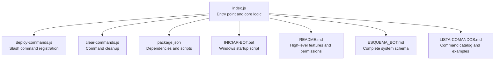
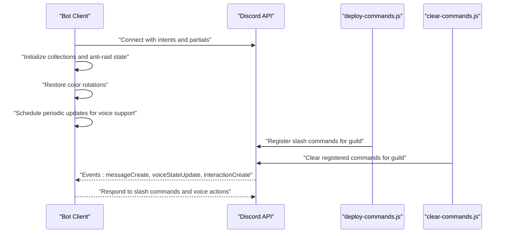
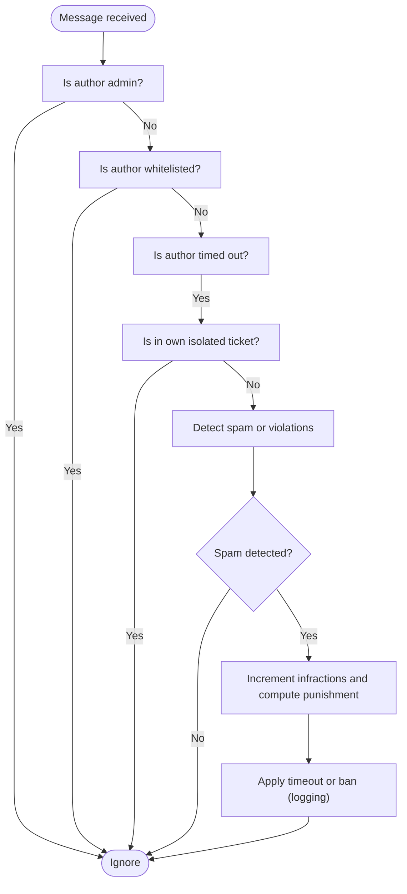
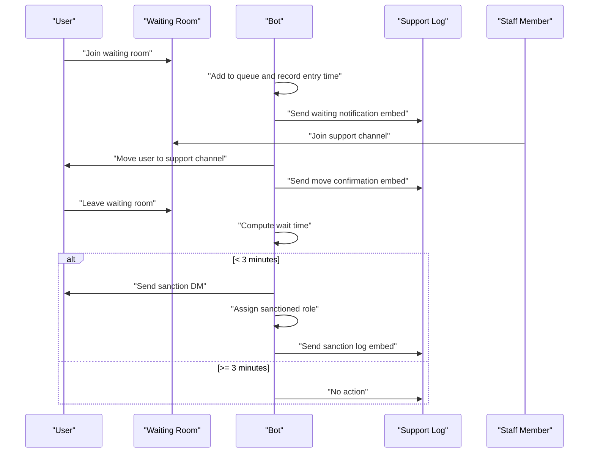
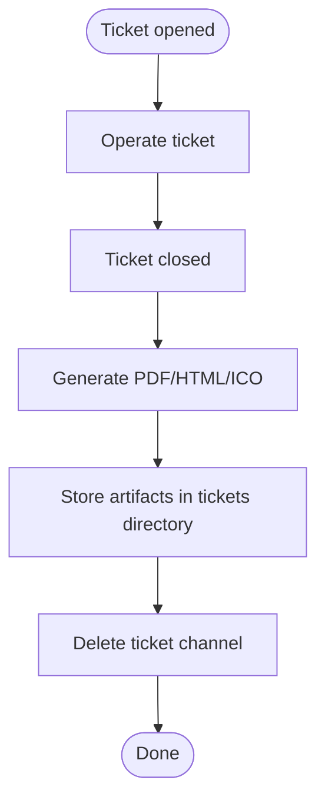
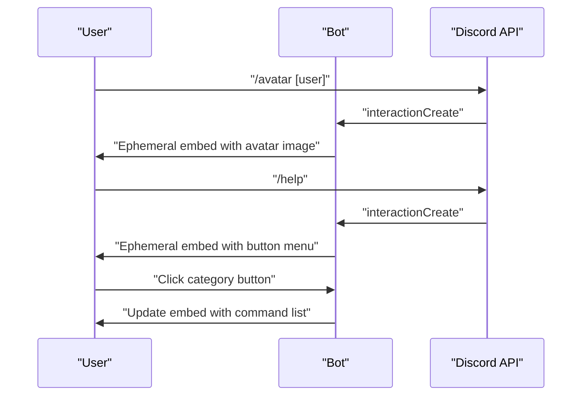
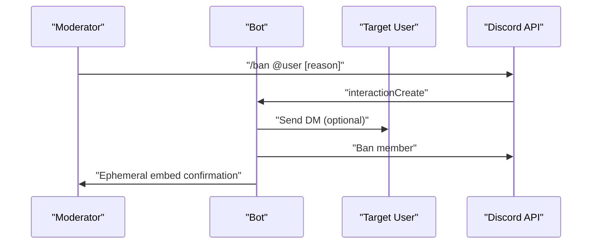
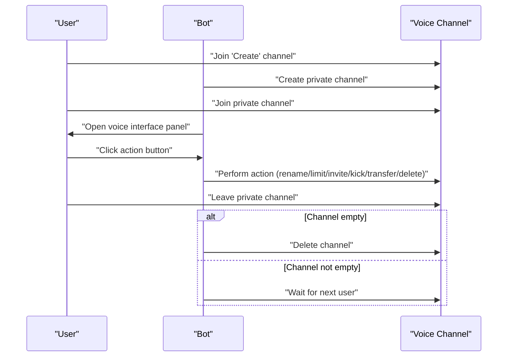
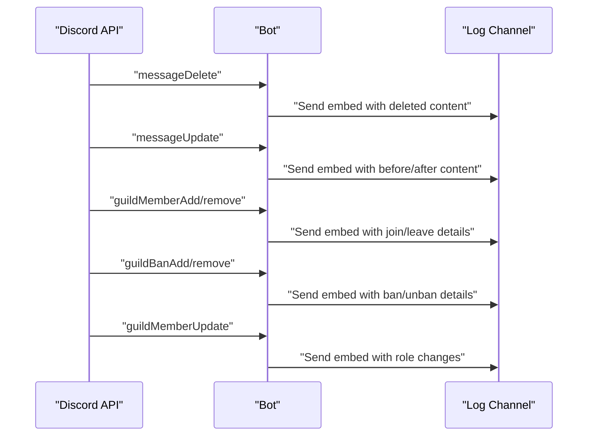
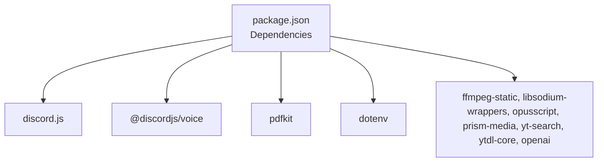

# Project Overview

<cite>
**Referenced Files in This Document**
- [index.js](file://index.js)
- [package.json](file://package.json)
- [deploy-commands.js](file://deploy-commands.js)
- [clear-commands.js](file://clear-commands.js)
- [README.md](file://README.md)
- [ESQUEMA_BOT.md](file://ESQUEMA_BOT.md)
- [LISTA-COMANDOS.md](file://LISTA-COMANDOS.md)
- [INICIAR-BOT.bat](file://INICIAR-BOT.bat)
</cite>

## Table of Contents
1. [Introduction](#introduction)
2. [Project Structure](#project-structure)
3. [Core Components](#core-components)
4. [Architecture Overview](#architecture-overview)
5. [Detailed Component Analysis](#detailed-component-analysis)
6. [Dependency Analysis](#dependency-analysis)
7. [Performance Considerations](#performance-considerations)
8. [Troubleshooting Guide](#troubleshooting-guide)
9. [Conclusion](#conclusion)
10. [Appendices](#appendices)

## Introduction
This Discord bot project is a multifunctional server administration, moderation, and user engagement tool built on Node.js with discord.js. It implements an event-driven architecture centered around slash commands and voice state transitions, integrating robust security protections (anti-raid), automated voice channel management, ticketing workflows, and utility commands. The bot emphasizes automation, logging, and user-friendly interactions through buttons, modals, and embeds.

## Project Structure
The repository organizes the application into a single entry point (index.js) and supporting scripts for command registration and cleanup. Documentation and deployment helpers clarify installation, configuration, and usage.

**Diagram sources**
- [index.js](file://index.js#L1-L120)
- [deploy-commands.js](file://deploy-commands.js#L1-L60)
- [clear-commands.js](file://clear-commands.js#L1-L35)
- [package.json](file://package.json#L1-L27)
- [INICIAR-BOT.bat](file://INICIAR-BOT.bat#L1-L23)
- [README.md](file://README.md#L1-L60)
- [ESQUEMA_BOT.md](file://ESQUEMA_BOT.md#L1-L40)
- [LISTA-COMANDOS.md](file://LISTA-COMANDOS.md#L1-L40)

**Section sources**
- [index.js](file://index.js#L1-L120)
- [package.json](file://package.json#L1-L27)
- [README.md](file://README.md#L1-L60)
- [ESQUEMA_BOT.md](file://ESQUEMA_BOT.md#L1-L40)
- [LISTA-COMANDOS.md](file://LISTA-COMANDOS.md#L1-L40)
- [INICIAR-BOT.bat](file://INICIAR-BOT.bat#L1-L23)

## Core Components
- Event-driven client with intents and partials configured for guilds, members, voice states, messages, and message content.
- Collections and maps for runtime state (voice connections, audio players, color roles, tickets, command roles, voice support queues, warnings, temp channels, and infractions).
- Anti-raid system with message tracking, channel action monitoring, whitelist, log channel, settings, and progressive infractions.
- Voice support system with waiting rooms, support channels, next-role movement, sanctions, and automatic enforcement.
- Ticketing system with generation of PDF/HTML/ICO artifacts and automatic cleanup.
- Logging system capturing message edits/deletes, joins/leaves, bans/unbans, role changes, and anti-raid actions.
- Utility commands and informational commands (avatar, userinfo, channelinfo, serverrole, help, commands).
- Moderation commands (ban, unban, kick, timeout, warn, warnings, clear, slowmode, rol, rename, setroles).
- Voice interface and temporary voice channels management.
- Color role rotation automation.

**Section sources**
- [index.js](file://index.js#L491-L519)
- [index.js](file://index.js#L520-L529)
- [index.js](file://index.js#L530-L706)
- [index.js](file://index.js#L823-L876)
- [index.js](file://index.js#L878-L934)
- [index.js](file://index.js#L936-L1012)
- [index.js](file://index.js#L1014-L1081)
- [index.js](file://index.js#L2441-L2799)
- [index.js](file://index.js#L2799-L3000)
- [index.js](file://index.js#L3000-L3076)
- [index.js](file://index.js#L3078-L3792)

## Architecture Overview
The bot follows an event-driven model:
- On startup, it initializes collections and anti-raid state, restores color rotations, and schedules periodic updates for voice support queues.
- It listens to message creation events for prefix commands, games menu, and anti-raid detection.
- It listens to voice state updates to manage voice support queues, enforce sanctions, and move users automatically.
- It listens to interactionCreate for slash commands, routing to specific handlers.
- It listens to messageDelete/messageUpdate and guild member events to log activities.
- Command registration is performed via deploy-commands.js, and cleanup via clear-commands.js.

**Diagram sources**
- [index.js](file://index.js#L491-L519)
- [index.js](file://index.js#L708-L730)
- [deploy-commands.js](file://deploy-commands.js#L1-L60)
- [clear-commands.js](file://clear-commands.js#L1-L35)

**Section sources**
- [index.js](file://index.js#L491-L519)
- [index.js](file://index.js#L708-L730)
- [deploy-commands.js](file://deploy-commands.js#L1-L60)
- [clear-commands.js](file://clear-commands.js#L1-L35)

## Detailed Component Analysis

### Anti-Raid System
- Tracks recent messages per user and applies progressive infractions (up to ten levels) with timeouts and a permanent ban threshold.
- Detects spam, repeated characters, unauthorized links, unauthorized bots, and channel spam (creation/deletion bursts).
- Maintains a whitelist and respects administrator exemptions.
- Sends security logs to a configured channel with optional attachments.

**Diagram sources**
- [index.js](file://index.js#L1748-L1799)
- [index.js](file://index.js#L2000-L2068)
- [index.js](file://index.js#L2070-L2093)
- [index.js](file://index.js#L2095-L2119)
- [index.js](file://index.js#L2121-L2214)
- [index.js](file://index.js#L2216-L2299)

**Section sources**
- [index.js](file://index.js#L1748-L1799)
- [index.js](file://index.js#L2000-L2068)
- [index.js](file://index.js#L2070-L2093)
- [index.js](file://index.js#L2095-L2119)
- [index.js](file://index.js#L2121-L2214)
- [index.js](file://index.js#L2216-L2299)

### Voice Support Automation
- Detects users entering waiting rooms and adds them to a queue with timestamps.
- Automatically moves staff or users with next-role to support channels.
- Enforces a three-minute rule: exiting the waiting room before three minutes triggers an automatic sanction (role assignment) and a direct message notification.
- Periodically updates waiting-room notifications with elapsed time.

**Diagram sources**
- [index.js](file://index.js#L2441-L2799)
- [index.js](file://index.js#L2799-L3000)

**Section sources**
- [index.js](file://index.js#L2441-L2799)
- [index.js](file://index.js#L2799-L3000)

### Ticket Management
- Generates PDF/HTML/ICO artifacts for closed tickets and stores them under a tickets directory.
- Supports special handling for isolated users and mentions staff roles when configured.
- Automatically cleans up channels after tickets close.

**Diagram sources**
- [index.js](file://index.js#L43-L110)
- [index.js](file://index.js#L110-L274)
- [index.js](file://index.js#L276-L489)

**Section sources**
- [index.js](file://index.js#L43-L110)
- [index.js](file://index.js#L110-L274)
- [index.js](file://index.js#L276-L489)

### Utility and Information Commands
- Provides avatar, userinfo, channelinfo, serverrole, help, and commands menus with interactive buttons and ephemeral replies.
- Implements permission checks and ephemeral responses for privacy.

**Diagram sources**
- [index.js](file://index.js#L3206-L3401)
- [index.js](file://index.js#L3402-L3501)
- [index.js](file://index.js#L3503-L3610)

**Section sources**
- [index.js](file://index.js#L3206-L3401)
- [index.js](file://index.js#L3402-L3501)
- [index.js](file://index.js#L3503-L3610)

### Moderation Commands
- Implements ban, unban, kick, timeout, warn, warnings, clear, slowmode, rol, rename, setroles with DM notifications and embed confirmations.
- Uses permission checks and ephemeral replies for sensitive operations.

**Diagram sources**
- [index.js](file://index.js#L3613-L3656)
- [index.js](file://index.js#L3658-L3693)
- [index.js](file://index.js#L3695-L3744)
- [index.js](file://index.js#L3746-L3792)

**Section sources**
- [index.js](file://index.js#L3613-L3656)
- [index.js](file://index.js#L3658-L3693)
- [index.js](file://index.js#L3695-L3744)
- [index.js](file://index.js#L3746-L3792)

### Voice Interface and Temporary Channels
- Provides a voice interface panel with buttons for managing temporary channels (rename, limit, privacy, invite, kick, claim, transfer, delete).
- Creates private channels when users join a designated “create” channel and deletes channels when empty.

**Diagram sources**
- [index.js](file://index.js#L3000-L3076)
- [index.js](file://index.js#L2441-L2460)

**Section sources**
- [index.js](file://index.js#L3000-L3076)
- [index.js](file://index.js#L2441-L2460)

### Logging System
- Logs message deletions, edits, member joins/leaves, bans/unbans, role changes, and anti-raid actions to a configured channel.
- Uses embeds with contextual information and timestamps.

**Diagram sources**
- [index.js](file://index.js#L2218-L2440)

**Section sources**
- [index.js](file://index.js#L2218-L2440)

## Dependency Analysis
The project relies on discord.js v14.x for bot framework and voice integration, plus additional libraries for voice processing, PDF generation, and environment configuration.

**Diagram sources**
- [package.json](file://package.json#L1-L27)

**Section sources**
- [package.json](file://package.json#L1-L27)

## Performance Considerations
- Anti-raid uses in-memory tracking with time-windowed windows and periodic resets to prevent memory growth.
- Voice support maintains per-guild maps and sets for queues and waiting times; periodic updates occur at 1-second intervals.
- Logging avoids blocking operations by sending messages asynchronously and skipping when log channels are missing.
- Voice channel automation minimizes redundant operations by checking presence and permissions before moving users.

[No sources needed since this section provides general guidance]

## Troubleshooting Guide
- Command registration issues: Use the deploy script to register commands for the configured guild and CLIENT_ID/GUILD_ID. Use the clear script to remove duplicates before redeploying.
- Startup failures: Verify environment variables (BOT_TOKEN, CLIENT_ID, GUILD_ID) and ensure intents/partials are correctly configured.
- Voice support errors: Confirm staff roles, next-role, and sanctioned roles are configured; verify channel names and permissions.
- Logging not appearing: Ensure a log channel is configured and the bot has permission to send messages in that channel.
- DM failures: Some users may have DMs disabled or blocked; the bot handles error codes and provides informative messages.

**Section sources**
- [deploy-commands.js](file://deploy-commands.js#L1-L60)
- [clear-commands.js](file://clear-commands.js#L1-L35)
- [README.md](file://README.md#L104-L141)
- [ESQUEMA_BOT.md](file://ESQUEMA_BOT.md#L168-L196)

## Conclusion
This Discord bot delivers a comprehensive suite of administrative, moderation, and engagement tools. Its event-driven design, modular components, and extensive logging provide a secure and automated foundation for server management. The anti-raid system, voice support automation, ticketing pipeline, and utility commands collectively offer a robust platform adaptable to diverse community needs.

[No sources needed since this section summarizes without analyzing specific files]

## Appendices

### Beginner-Friendly Interaction Examples
- Slash commands:
  - Use /help to explore categories and commands.
  - Use /avatar [user] to view high-resolution avatars.
  - Use /userinfo [user] to inspect user and member details.
  - Use /ticketpanel to publish a ticket panel (moderators).
  - Use /createsupportchannels and /voicesupportnextrole to configure voice support.
  - Use /enviarmd to send personalized direct messages to users.
- Prefix commands:
  - Use !juegos to open an interactive games menu with buttons.
  - Use !8ball, !coinflip, !dado, !rps, !roll, and !meme for fun interactions.
  - Use !nex to move the next user from the waiting room to a support channel (with appropriate roles).

**Section sources**
- [README.md](file://README.md#L1-L60)
- [ESQUEMA_BOT.md](file://ESQUEMA_BOT.md#L1-L40)
- [LISTA-COMANDOS.md](file://LISTA-COMANDOS.md#L1-L40)

### Advanced Technical Insights
- Modular structure:
  - Anti-raid logic centralized with settings, trackers, and logging helpers.
  - Voice support logic encapsulated with waiting room detection, staff movement, and sanction enforcement.
  - Ticketing logic separated into artifact generation and cleanup.
  - Logging subsystem decoupled from command handlers.
- Security features:
  - Progressive infractions with configurable thresholds and reset windows.
  - Whitelist and administrator exemptions.
  - Automatic role assignments for sanctions and staff movement.
- Integration points:
  - Discord API via discord.js for slash commands, voice state updates, and audit logs.
  - File system for storing generated artifacts (PDF/HTML/ICO).
  - Environment variables for credentials and identifiers.

**Section sources**
- [index.js](file://index.js#L878-L934)
- [index.js](file://index.js#L936-L1012)
- [index.js](file://index.js#L1014-L1799)
- [index.js](file://index.js#L1799-L2440)
- [index.js](file://index.js#L2441-L3000)
- [index.js](file://index.js#L3000-L3792)