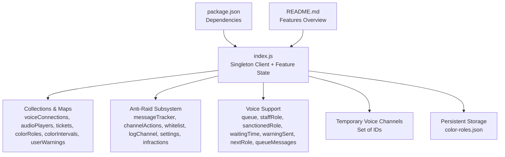
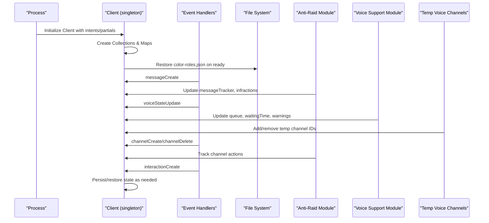
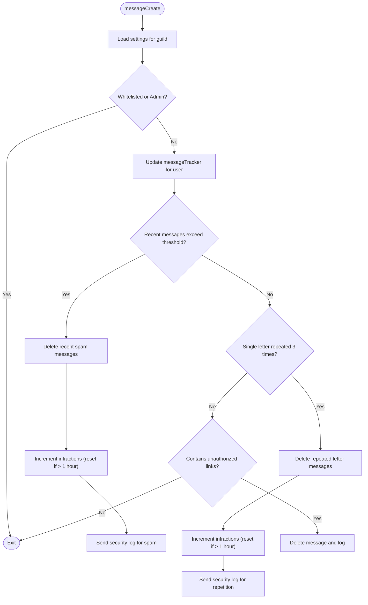
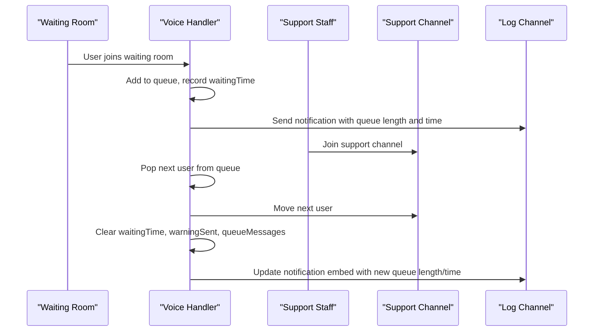
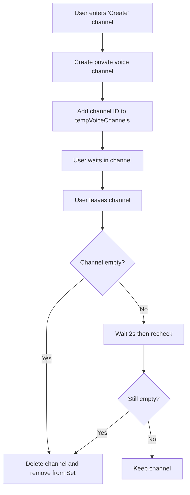
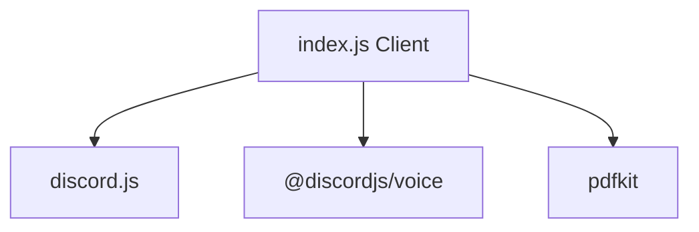

# Client State Management

<cite>
**Referenced Files in This Document**
- [index.js](file://index.js)
- [package.json](file://package.json)
- [README.md](file://README.md)
</cite>

## Table of Contents
1. [Introduction](#introduction)
2. [Project Structure](#project-structure)
3. [Core Components](#core-components)
4. [Architecture Overview](#architecture-overview)
5. [Detailed Component Analysis](#detailed-component-analysis)
6. [Dependency Analysis](#dependency-analysis)
7. [Performance Considerations](#performance-considerations)
8. [Troubleshooting Guide](#troubleshooting-guide)
9. [Conclusion](#conclusion)

## Introduction
This document explains the client state management architecture of the bot. The singleton Client instance acts as the central state container, attaching feature-specific collections and maps to manage data across features such as voice support queues, anti-raid tracking, tickets, color roles, and temporary voice channels. It covers initialization in index.js where state structures are created and restored from persistent storage, runtime updates via event handlers and command executions, synchronization considerations for multi-server environments, lifecycle management of temporary states, and memory management best practices.

## Project Structure
The bot is a single-file application centered around index.js, with supporting configuration and documentation files. The Client singleton holds all runtime state and is extended with feature-specific maps and collections.

**Diagram sources**
- [index.js](file://index.js#L491-L528)
- [index.js](file://index.js#L708-L740)
- [package.json](file://package.json#L1-L27)
- [README.md](file://README.md#L1-L188)

**Section sources**
- [index.js](file://index.js#L491-L528)
- [package.json](file://package.json#L1-L27)
- [README.md](file://README.md#L1-L188)

## Core Components
- Singleton Client: Created with required intents and partials, serving as the central state container.
- Feature-specific state containers:
  - Collections: voiceConnections, audioPlayers
  - Maps: tickets, commandRoles, ticketStaffRole, voiceSupportQueue, voiceSupportStaffRole, voiceSupportSanctionedRole, voiceSupportWaitingTime, voiceSupportWarningSent, voiceSupportNextRole, voiceSupportQueueMessages, userWarnings
  - Anti-Raid: messageTracker, channelActions, whitelist, logChannel, settings, infractions
  - Temporary voice channels: Set of IDs for automatic cleanup

Initialization and restoration:
- On ready, the bot restores color rotation configurations from persistent storage (color-roles.json) into client.colorRoles and client.colorIntervals.

Runtime updates:
- Event handlers update state on messageCreate, guildMemberAdd, channelCreate, channelDelete, messageDelete, messageUpdate, guildMemberAdd, voiceStateUpdate, and interactionCreate.
- Command executions update state (e.g., anti-raid settings, logs configuration, voice support queue, temp voice channels).

Lifecycle management:
- Temporary voice channels are removed when empty.
- Anti-raid infractions reset after inactivity windows.
- Voice support queue entries are cleaned up when users leave the waiting room or are moved.

**Section sources**
- [index.js](file://index.js#L491-L528)
- [index.js](file://index.js#L708-L740)
- [index.js](file://index.js#L2441-L2981)
- [index.js](file://index.js#L2121-L2214)
- [index.js](file://index.js#L2216-L2299)

## Architecture Overview
The Client singleton orchestrates all stateful features. Event-driven handlers and command handlers mutate state consistently, using maps and sets keyed by guildId and userId where appropriate. Persistent storage is used for long-lived configurations (e.g., color roles).

**Diagram sources**
- [index.js](file://index.js#L491-L528)
- [index.js](file://index.js#L708-L740)
- [index.js](file://index.js#L1014-L1100)
- [index.js](file://index.js#L2441-L2981)
- [index.js](file://index.js#L2121-L2214)

## Detailed Component Analysis

### Anti-Raid System State
The anti-raid subsystem maintains:
- messageTracker: per-guild-per-user list of recent messages with timestamps and IDs for spam detection.
- channelActions: per-executor lists of recent channel create/delete actions for anti-channel spam.
- whitelist: per-guild set of whitelisted user IDs.
- logChannel: per-guild configured log channel ID.
- settings: per-guild configuration for anti-spam thresholds and windows.
- infractions: per-user progressive infraction counters with reset window.

Runtime behavior:
- messageCreate triggers spam checks, letter repetition checks, link filtering, and bot-kick logic.
- channelCreate/channelDelete track rapid channel actions and apply role removal penalties.
- infractions are incremented per violation and reset after inactivity windows.

**Diagram sources**
- [index.js](file://index.js#L1748-L2093)
- [index.js](file://index.js#L2121-L2214)

**Section sources**
- [index.js](file://index.js#L520-L528)
- [index.js](file://index.js#L936-L954)
- [index.js](file://index.js#L1014-L1100)
- [index.js](file://index.js#L1748-L2093)
- [index.js](file://index.js#L2121-L2214)

### Voice Support Queue Management
The voice support module manages:
- queue: ordered list of user IDs waiting for staff.
- waitingTime: per-user timestamp when they entered the waiting room.
- warningSent: per-guild set of users who received a 1-minute warning.
- queueMessages: per-user message ID for live countdown updates.
- staffRole, sanctionedRole, nextRole: per-guild role identifiers for permissions and enforcement.

Runtime behavior:
- On joining the waiting room, the user is added to the queue and their entry time is recorded.
- On leaving the waiting room, the queue entry is removed and a 3-minute rule is enforced.
- When staff join a support channel, the next user is moved automatically; queue messages are updated and cleaned up.
- A periodic interval updates waiting-time messages and resets warnings for users no longer in the waiting room.

**Diagram sources**
- [index.js](file://index.js#L2441-L2750)
- [index.js](file://index.js#L2621-L2704)
- [index.js](file://index.js#L730-L821)

**Section sources**
- [index.js](file://index.js#L2441-L2750)
- [index.js](file://index.js#L2621-L2704)
- [index.js](file://index.js#L730-L821)

### Temporary Voice Channels Lifecycle
Temporary voice channels are created when users enter a designated “create” channel and are automatically deleted when they become empty. The system tracks channel IDs in a Set and performs immediate deletion or delayed verification to handle race conditions.

**Diagram sources**
- [index.js](file://index.js#L2872-L2977)
- [index.js](file://index.js#L2910-L2977)

**Section sources**
- [index.js](file://index.js#L2872-L2977)
- [index.js](file://index.js#L2910-L2977)

### Persistent Storage Restoration
On startup, the bot restores color rotation configurations from color-roles.json into client.colorRoles and starts rotation intervals. This demonstrates the pattern of restoring state from disk-backed JSON.

**Section sources**
- [index.js](file://index.js#L708-L740)

### Multi-Server Synchronization Considerations
- All state maps and sets are keyed by guildId (and sometimes userId) to isolate data per server.
- Periodic tasks iterate over per-guild maps to update queue messages and manage waiting times.
- Anti-raid infractions are tracked per guild and user, with reset windows to prevent accumulation across servers.

**Section sources**
- [index.js](file://index.js#L502-L528)
- [index.js](file://index.js#L730-L821)
- [index.js](file://index.js#L1900-L1970)

## Dependency Analysis
External dependencies relevant to state management:
- discord.js: Provides Client, Collection, EmbedBuilder, ButtonBuilder, ModalBuilder, and voice utilities.
- @discordjs/voice: Provides voice connection and player APIs used by the bot’s voice features.
- pdfkit: Used for generating PDFs for tickets and logs.

**Diagram sources**
- [index.js](file://index.js#L1-L40)
- [package.json](file://package.json#L1-L27)

**Section sources**
- [index.js](file://index.js#L1-L40)
- [package.json](file://package.json#L1-L27)

## Performance Considerations
- Memory footprint:
  - messageTracker stores recent messages per user; recentMessages are pruned by time window. Consider limiting stored message count per user to cap memory usage.
  - channelActions stores recent channel actions per executor; prune by time window to keep memory bounded.
  - waitingTime and warningSent are per-guild maps; ensure cleanup paths remove entries when users leave waiting rooms.
  - queueMessages stores notification message IDs; clean up when users are moved or leave waiting rooms.
- CPU usage:
  - The 1-second interval for updating waiting-room messages is efficient but ensure it does not overwhelm small servers.
  - Anti-raid checks run on messageCreate; keep thresholds reasonable to avoid excessive deletions.
- Disk I/O:
  - color-roles.json is read/written on startup and when stopping color rotation; batch writes and avoid frequent toggling.
- Scalability:
  - For large guilds, consider pagination or lazy loading for administrative interfaces.
  - Use guild cache efficiently; avoid unnecessary fetches by leveraging cached data.

[No sources needed since this section provides general guidance]

## Troubleshooting Guide
Common issues and remedies:
- Anti-raid not triggering:
  - Verify anti-raid settings are enabled per guild and not whitelisted.
  - Check that logChannel is configured for the guild.
- Spam detection false positives:
  - Adjust maxMessages and timeWindow settings per guild.
  - Ensure legitimate single-letter messages are not flagged unintentionally.
- Voice support queue not updating:
  - Confirm waiting room and support channels exist and are named correctly.
  - Ensure staff role is configured and users have the role.
- Temporary voice channels not deleting:
  - Verify the bot has permission to delete channels.
  - Check tempVoiceChannels Set membership and that the channel becomes empty.

**Section sources**
- [index.js](file://index.js#L936-L954)
- [index.js](file://index.js#L2441-L2981)
- [index.js](file://index.js#L2872-L2977)

## Conclusion
The bot’s Client singleton centralizes state for all features, using typed collections and maps to maintain isolation across guilds. Event handlers and command handlers consistently update state, with periodic tasks ensuring synchronization and cleanup. Anti-raid infractions reset after inactivity windows, and temporary voice channels are automatically managed. For large-scale deployments, monitor memory growth in trackers and optimize thresholds and intervals to balance responsiveness and resource usage.