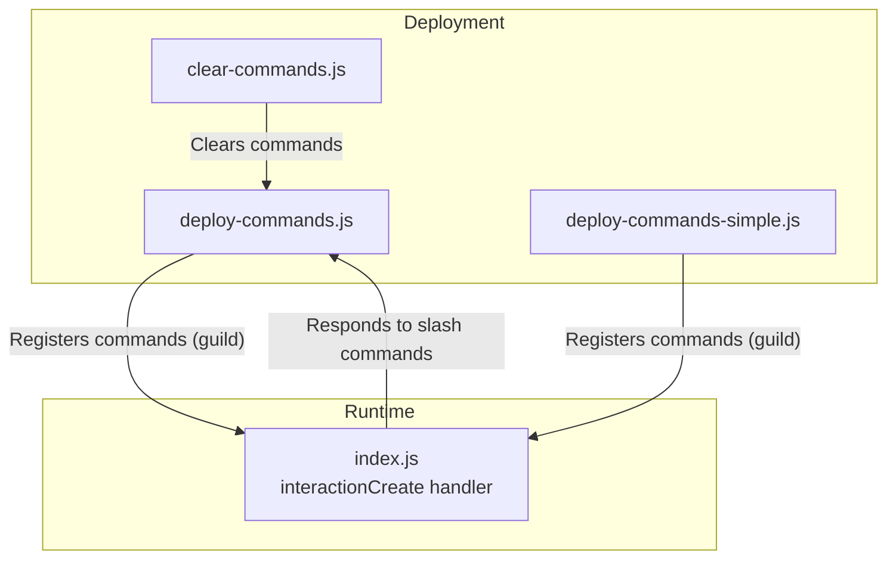
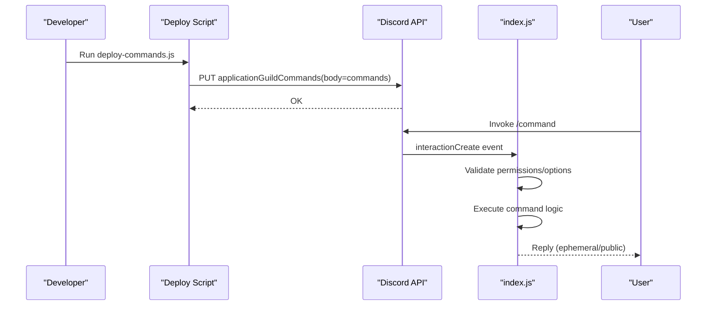
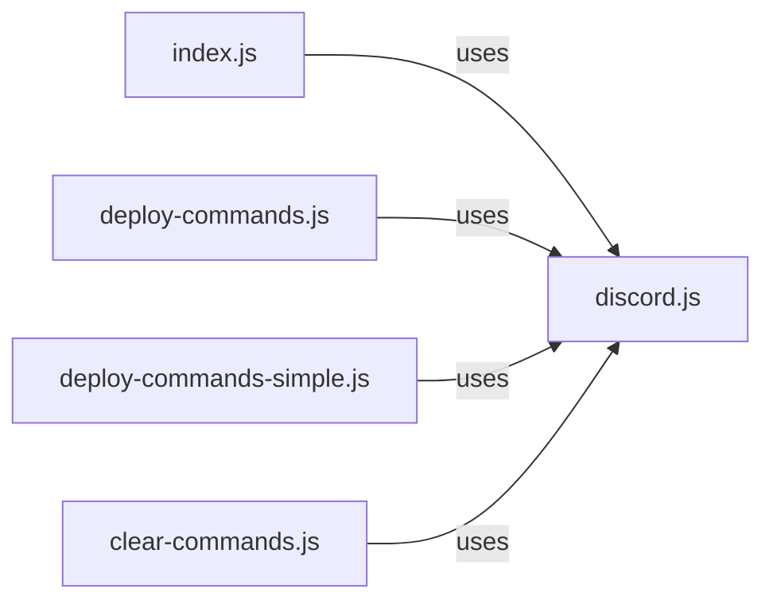

# Command Handling System

<cite>
**Referenced Files in This Document**
- [deploy-commands.js](file://deploy-commands.js)
- [deploy-commands-simple.js](file://deploy-commands-simple.js)
- [clear-commands.js](file://clear-commands.js)
- [index.js](file://index.js)
- [README.md](file://README.md)
- [ESQUEMA_BOT.md](file://ESQUEMA_BOT.md)
- [LISTA-COMANDOS.md](file://LISTA-COMANDOS.md)
</cite>

## Table of Contents
1. [Introduction](#introduction)
2. [Project Structure](#project-structure)
3. [Core Components](#core-components)
4. [Architecture Overview](#architecture-overview)
5. [Detailed Component Analysis](#detailed-component-analysis)
6. [Dependency Analysis](#dependency-analysis)
7. [Performance Considerations](#performance-considerations)
8. [Troubleshooting Guide](#troubleshooting-guide)
9. [Conclusion](#conclusion)
10. [Appendices](#appendices)

## Introduction
This document explains the slash command handling system for the Discord bot. It covers how commands are registered via the deployment scripts, how the runtime handles interactions, and how permissions, validation, and responses are managed. Concrete examples are drawn from commands such as /ban, /ticketpanel, and /voiceinterface, and the document highlights the use of Collection and Map structures for command metadata and state.

## Project Structure
The command handling system spans two primary areas:
- Deployment scripts that register slash commands with Discord’s Application Command API
- The runtime event handler that processes interactions, validates permissions, executes logic, and sends responses

**Diagram sources**
- [deploy-commands.js](file://deploy-commands.js#L1-L293)
- [deploy-commands-simple.js](file://deploy-commands-simple.js#L1-L164)
- [clear-commands.js](file://clear-commands.js#L1-L54)
- [index.js](file://index.js#L823-L1200)

**Section sources**
- [deploy-commands.js](file://deploy-commands.js#L1-L293)
- [deploy-commands-simple.js](file://deploy-commands-simple.js#L1-L164)
- [clear-commands.js](file://clear-commands.js#L1-L54)
- [index.js](file://index.js#L823-L1200)

## Core Components
- Command definitions: Built with the SlashCommandBuilder and exported as JSON arrays for deployment
- Deployment scripts: Register commands globally or per-guild using Routes.applicationGuildCommands
- Runtime interaction handler: Validates permissions, extracts options, executes command logic, and replies with ephemeral or public responses
- State storage: Uses Collection and Map structures to persist command metadata and runtime state

Key runtime structures initialized in index.js:
- Collections for voice/audio state and tickets
- Maps for moderation warnings, voice support queues and roles, logs, and anti-raid settings

These structures enable efficient lookups and updates during command execution and event-driven flows.

**Section sources**
- [index.js](file://index.js#L491-L520)
- [index.js](file://index.js#L823-L1200)

## Architecture Overview
The slash command lifecycle:
1. Developer runs a deployment script to register commands with Discord
2. User invokes a slash command in Discord
3. The bot receives an interaction event and routes it to the handler
4. The handler validates permissions and arguments
5. The handler executes the command logic and sends a response (ephemeral or public)

**Diagram sources**
- [deploy-commands.js](file://deploy-commands.js#L280-L293)
- [index.js](file://index.js#L823-L1200)

## Detailed Component Analysis

### Command Registration and Deployment
- deploy-commands.js builds a comprehensive list of SlashCommandBuilder instances, defines options (user, role, integer, string, channel, choices), and registers them via Routes.applicationGuildCommands using the configured CLIENT_ID and GUILD_ID. This ensures commands are deployed to a specific guild.
- deploy-commands-simple.js demonstrates a simpler set of commands registered similarly for quick testing.
- clear-commands.js removes all commands from the guild and optionally from global scope, useful for clean re-registrations.

Global vs guild-specific deployment:
- The current scripts use Routes.applicationGuildCommands, which registers commands only for the specified guild. Global registration would use Routes.applicationCommands and is not present in the provided scripts.

Command definition structure:
- Each command uses setName and setDescription, and may include addXOption for parameters such as addUserOption, addRoleOption, addIntegerOption, addStringOption, addChannelOption, and addStringOption with addChoices for predefined selections.

**Section sources**
- [deploy-commands.js](file://deploy-commands.js#L1-L293)
- [deploy-commands-simple.js](file://deploy-commands-simple.js#L1-L164)
- [clear-commands.js](file://clear-commands.js#L1-L54)

### Interaction Flow: Permission Checks, Validation, and Responses
The runtime interaction handler in index.js:
- Filters to chat input commands
- For each command, checks permissions using member.permissions.has and Flags
- Extracts options via interaction.options.get*
- Executes command logic (e.g., moderation actions, voice management, ticket creation)
- Sends responses using interaction.reply or interaction.editReply, supporting ephemeral responses for privacy

Examples from index.js:
- /ban: Validates permissions, fetches the target member, attempts to send a DM notice, bans the user, and replies with a formatted embed
- /ticketpanel: Not shown in the excerpted handler, but the handler structure follows the same pattern of permission checks, option extraction, and response generation
- /voiceinterface: Not shown in the excerpted handler, but the handler structure follows the same pattern

Ephemeral vs persistent responses:
- Many moderation commands reply with ephemeral: true to keep sensitive actions private
- Some commands reply publicly to inform the channel

Modal and button interactions:
- The handler includes a pattern for responding to button interactions (e.g., the help menu buttons) and deferring replies when needed
- While the provided handler excerpts do not show modals, the framework for deferred replies and component interactions is present

**Section sources**
- [index.js](file://index.js#L823-L1200)
- [index.js](file://index.js#L3500-L4299)

### Command Definitions and Handler Mapping
The handler routes interactions by commandName and reads options accordingly. For example:
- /ban reads user and reason options, checks permissions, performs ban, and responds with an embed
- /unban reads user and reason, verifies the user is banned, performs unban, and responds with an embed
- /kick, /timeout, /clear, /slowmode, /warn, /warnings, /anuncio, /poll, /say, /ping, /serverinfo, /membercount, and others follow the same pattern

This mapping is implemented by checking interaction.commandName and extracting options via interaction.options.get* methods.

**Section sources**
- [index.js](file://index.js#L3500-L4299)

### State Management with Collections and Maps
The runtime initializes several collections and maps to manage state:
- Collections for voice connections and audio players
- Maps for color roles, intervals, tickets, command roles, staff roles, voice support queues, sanctions, waiting times, warnings, next roles, queue messages, and temp channels
- Anti-raid structures including message trackers, channel actions, whitelist, log channel, settings, and infractions

These structures enable:
- Fast lookups and updates during command execution
- Persistent state across events and interactions
- Efficient management of voice support queues and moderation warnings

**Section sources**
- [index.js](file://index.js#L491-L520)

### Error Handling Strategies
Common error handling patterns:
- Permission failures: Reply with ephemeral messages indicating lack of permissions
- Argument validation errors: Reply with ephemeral messages guiding correct usage
- Execution errors: Try to edit replies with error messages or fall back to immediate replies
- DM sending failures: Catch and log errors when attempting to notify users privately

These patterns ensure robustness and user-friendly feedback.

**Section sources**
- [index.js](file://index.js#L3500-L4299)

### Optimization Techniques
- Use ephemeral responses for sensitive actions to reduce noise in channels
- Defer replies when long-running tasks are needed (e.g., bulk deletes)
- Validate early: Check permissions and argument ranges before performing heavy operations
- Leverage Maps/Collections for O(1) lookups and updates during command execution

**Section sources**
- [index.js](file://index.js#L3500-L4299)

## Dependency Analysis
The deployment scripts depend on discord.js REST and Routes to communicate with Discord. The runtime depends on discord.js Client, PermissionsBitField, EmbedBuilder, ActionRowBuilder, ButtonBuilder, and other builders to construct responses and interactions.

**Diagram sources**
- [index.js](file://index.js#L1-L40)
- [deploy-commands.js](file://deploy-commands.js#L1-L10)
- [deploy-commands-simple.js](file://deploy-commands-simple.js#L1-L10)
- [clear-commands.js](file://clear-commands.js#L1-L10)

**Section sources**
- [index.js](file://index.js#L1-L40)
- [deploy-commands.js](file://deploy-commands.js#L1-L10)
- [deploy-commands-simple.js](file://deploy-commands-simple.js#L1-L10)
- [clear-commands.js](file://clear-commands.js#L1-L10)

## Performance Considerations
- Minimize repeated API calls by caching guild members and channels when feasible
- Use bulk delete operations efficiently and defer replies to avoid blocking
- Prefer ephemeral responses for private actions to reduce channel clutter
- Keep command option validation tight to fail fast and reduce unnecessary processing

[No sources needed since this section provides general guidance]

## Troubleshooting Guide
Common issues and resolutions:
- Commands not appearing: Ensure the deployment script ran successfully and the correct CLIENT_ID/GUILD_ID are configured
- Permission errors: Verify the invoking user has the required permissions and the bot has appropriate role hierarchy
- Argument errors: Confirm option types and ranges match the command definitions
- DM failures: Some users may have DMs disabled; the handler catches and logs these errors

**Section sources**
- [deploy-commands.js](file://deploy-commands.js#L280-L293)
- [index.js](file://index.js#L3500-L4299)

## Conclusion
The slash command handling system combines a declarative command registration pipeline with a robust runtime handler. Commands are defined with precise option schemas, validated against permissions and arguments, and executed with clear responses. State is managed efficiently using Collections and Maps, enabling scalable and maintainable command logic. The provided scripts and handler demonstrate best practices for deployment, interaction routing, and error handling.

[No sources needed since this section summarizes without analyzing specific files]

## Appendices

### Example Commands and Their Options
- /ban: user option (required), reason option (optional)
- /ticketpanel: no options (public panel creation)
- /voiceinterface: no options (opens voice interface)
- /unban: user option (required), reason option (optional)
- /kick: user option (required), reason option (optional)
- /timeout: user option (required), duration integer (required), reason option (optional)
- /clear: amount integer (required, 1–100)
- /slowmode: seconds integer (required, 0–21600)
- /warn: user option (required), reason option (optional)
- /warnings: user option (required)
- /anuncio: title and description (required), channel (required), color and image (optional)
- /poll: question and options (required)
- /say: message (required), channel (optional)
- /ping: no options
- /serverinfo: no options
- /membercount: no options

**Section sources**
- [deploy-commands.js](file://deploy-commands.js#L1-L293)
- [index.js](file://index.js#L3500-L4299)

### References and Further Reading
- README provides installation steps and command lists
- ESQUEMA_BOT.md outlines the bot’s systems and flows
- LISTA-COMANDOS.md enumerates commands and categories

**Section sources**
- [README.md](file://README.md#L1-L188)
- [ESQUEMA_BOT.md](file://ESQUEMA_BOT.md#L1-L306)
- [LISTA-COMANDOS.md](file://LISTA-COMANDOS.md#L1-L303)