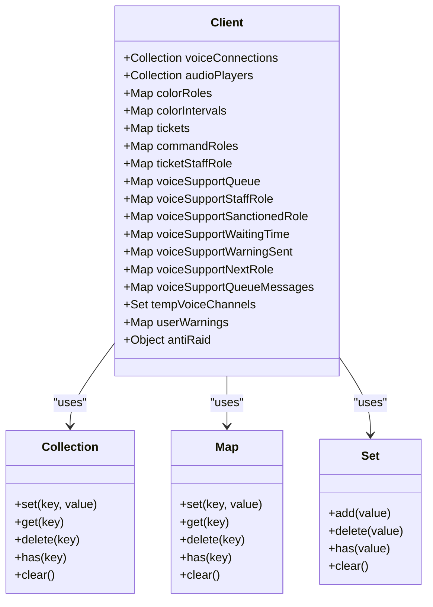
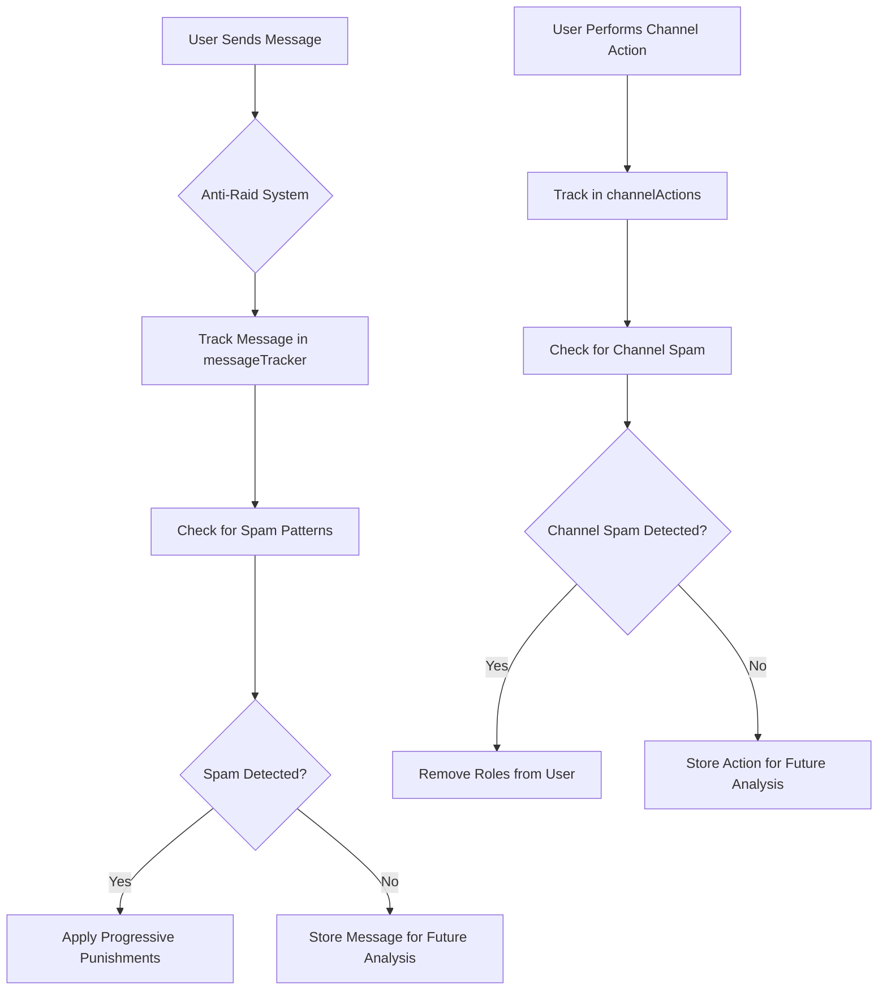
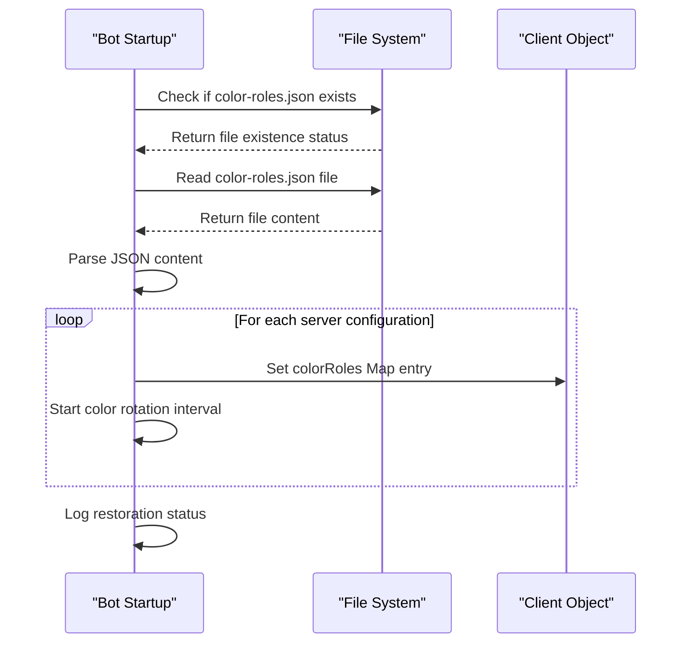
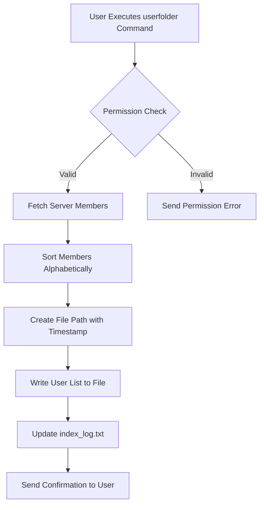
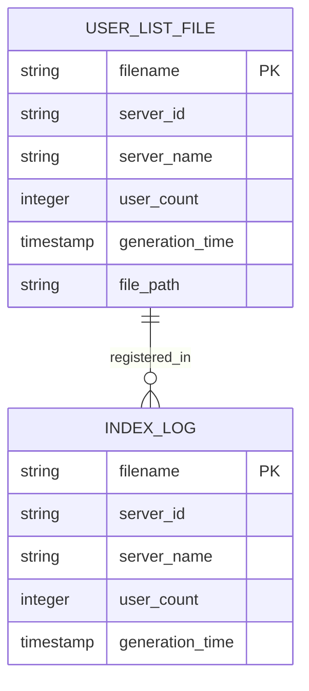
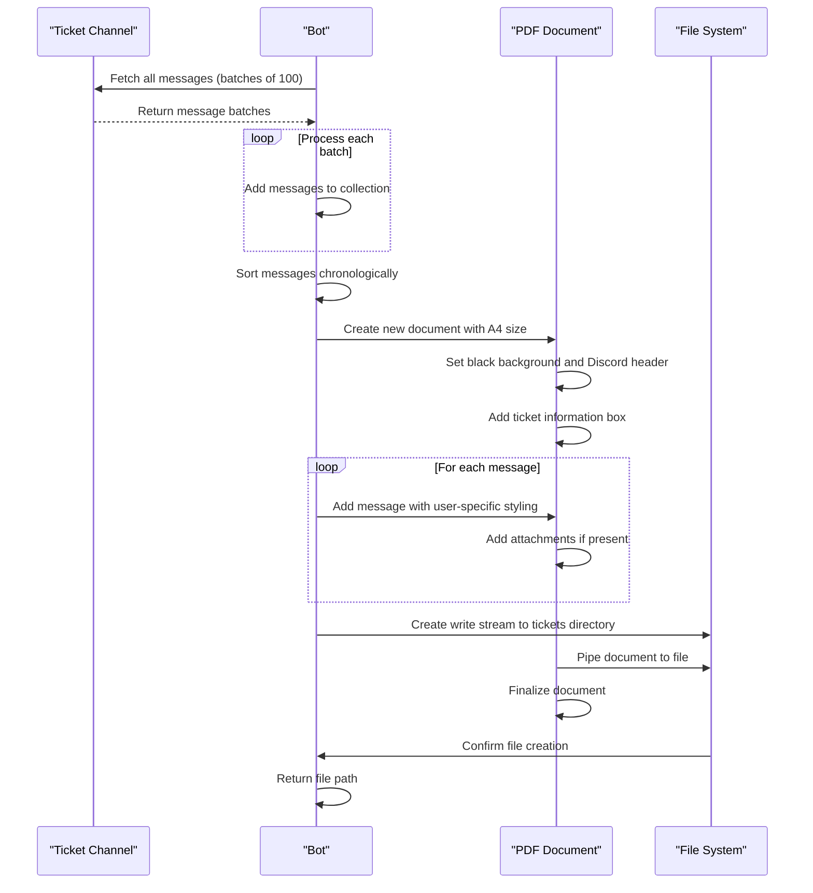
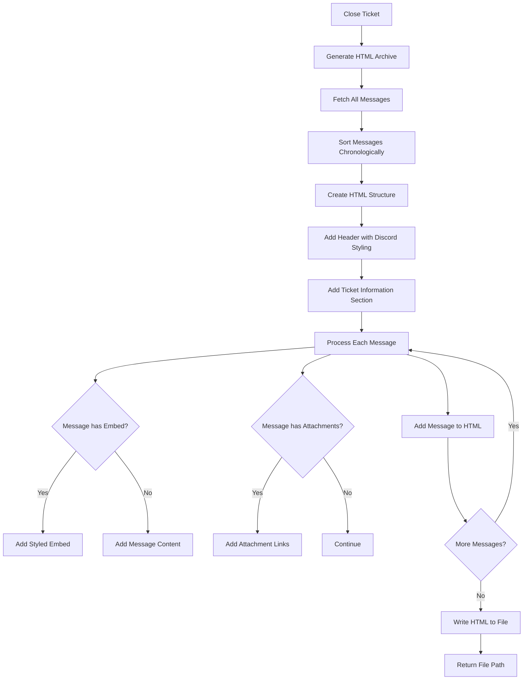
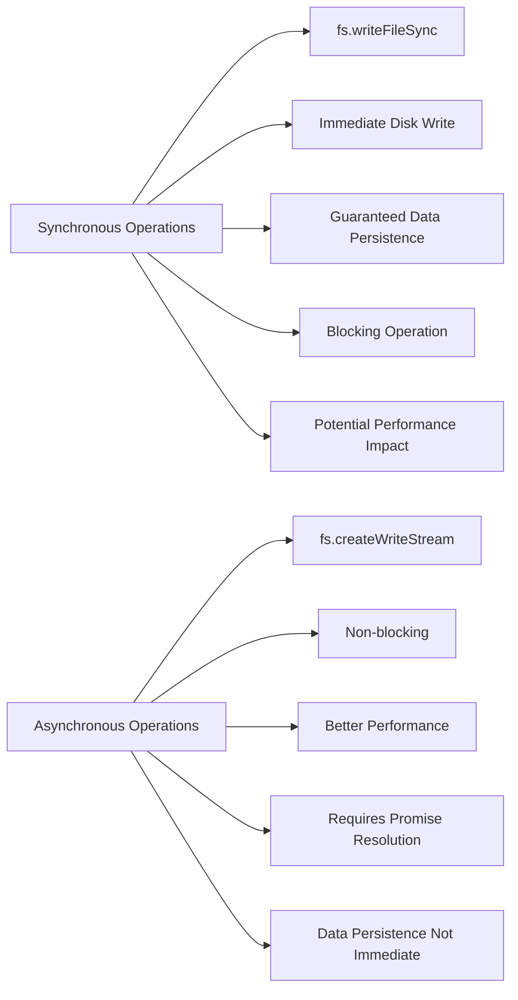
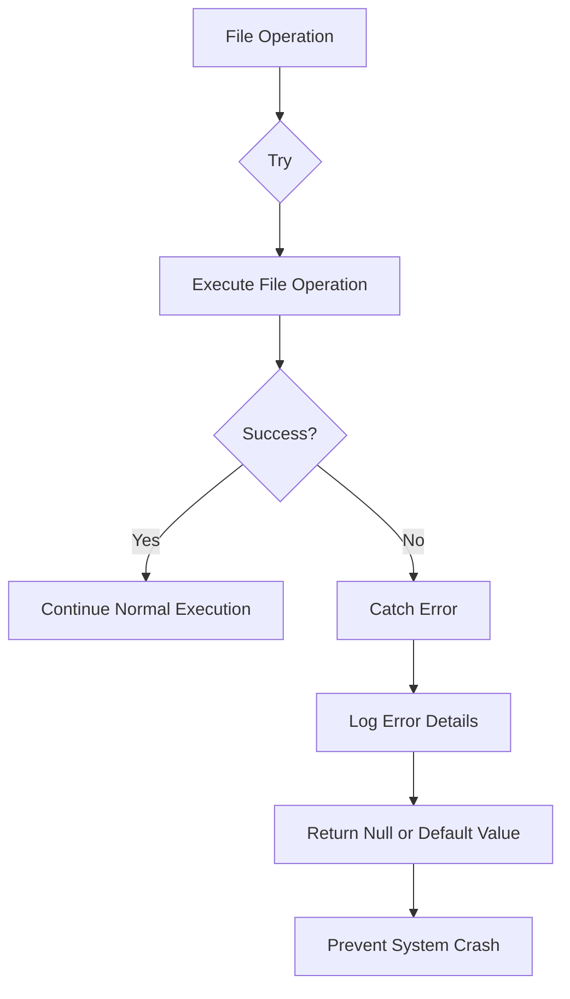

# Data Persistence Mechanisms

<cite>
**Referenced Files in This Document**   
- [index.js](file://index.js)
- [color-roles.json](file://color-roles.json)
- [user folder/index_log.txt](file://user folder/index_log.txt)
- [user folder/users_1375598652055224420_10122025-180445.txt](file://user folder/users_1375598652055224420_10122025-180445.txt)
- [user folder/users_1375598652055224420_10122025-181244.txt](file://user folder/users_1375598652055224420_10122025-181244.txt)
- [TICKET_PDF_FEATURE.md](file://TICKET_PDF_FEATURE.md)
</cite>

## Table of Contents
1. [Introduction](#introduction)
2. [In-Memory Data Structures](#in-memory-data-structures)
3. [Persistent Configuration Storage](#persistent-configuration-storage)
4. [File-Based Logging System](#file-based-logging-system)
5. [Ticket Archiving Workflows](#ticket-archiving-workflows)
6. [Data Integrity and Performance](#data-integrity-and-performance)
7. [Conclusion](#conclusion)

## Introduction
The bot implements a comprehensive data persistence strategy combining in-memory data structures for transient state management with file-based storage for persistent configuration and logging. This documentation details the mechanisms used to maintain state across restarts, store configuration data, generate archival records, and ensure data integrity. The system uses Discord.js Collections and Maps for real-time state tracking, JSON files for persistent configuration, and a file-based logging system for user activity and ticket records.

## In-Memory Data Structures
The bot utilizes in-memory data structures to manage transient state that needs to persist during the bot's runtime but doesn't require storage across restarts. These structures are implemented as properties on the client object, allowing global access throughout the application.

### Voice Connection Management
The bot tracks voice connections and audio players using Discord.js Collections, which are enhanced Maps with additional utility methods. These collections store active voice connections and audio players, enabling the bot to manage multiple voice sessions simultaneously.



**Diagram sources**
- [index.js](file://index.js#L503-L518)

**Section sources**
- [index.js](file://index.js#L503-L518)

### Ticket Session Management
Ticket sessions are managed using a Map structure that associates ticket channels with their respective session data. This allows the bot to track active tickets, their participants, and associated metadata throughout the ticket lifecycle.

### Anti-Raid Tracking System
The anti-raid system employs a sophisticated in-memory tracking mechanism using nested Maps within the client.antiRaid object. This system monitors user behavior patterns to detect and prevent raid activities by tracking message frequency, channel actions, and user infractions.



**Diagram sources**
- [index.js](file://index.js#L521-L528)

**Section sources**
- [index.js](file://index.js#L521-L528)

## Persistent Configuration Storage
The bot uses JSON files to store configuration data that must persist across restarts. This approach provides a simple, human-readable format for configuration storage that can be easily modified and version-controlled.

### Color Roles Configuration
The color-roles.json file stores configuration for automatic color rotation roles across different Discord servers. This JSON structure contains server-specific configurations including the role ID and rotation speed.

```json
{
  "1403464701349990430": {
    "roleId": "1404534694468391078",
    "speed": 1
  },
  "1436731120719888448": {
    "roleId": "1436732806012338207",
    "speed": 1
  }
}
```

### Configuration Restoration Logic
When the bot starts, it restores the color role configurations from the JSON file. This process involves reading the file, parsing the JSON, and reinitializing the in-memory state to match the persisted configuration.



**Diagram sources**
- [index.js](file://index.js#L714-L724)

**Section sources**
- [index.js](file://index.js#L714-L724)

## File-Based Logging System
The bot implements a comprehensive file-based logging system that stores user activity logs and ticket records in the 'user folder/' directory. This system provides a permanent record of user interactions and administrative actions.

### User Activity Logging
The bot generates timestamped text files containing user lists from specific servers. These files are stored in the 'user folder/' directory with a naming convention that includes the server ID and timestamp.



**Diagram sources**
- [index.js](file://index.js#L828-L872)

**Section sources**
- [index.js](file://index.js#L828-L872)

### Log File Structure
The logging system creates two types of files: individual user list files and a master index log. The individual files contain detailed user information including usernames and IDs, while the index log maintains a registry of all generated files with metadata.



**Section sources**
- [index.js](file://index.js#L853-L862)

## Ticket Archiving Workflows
The bot implements automated workflows for archiving closed tickets using PDF and HTML formats. These workflows capture the complete history of a ticket, including messages, attachments, and metadata, creating permanent records for administrative review.

### PDF Generation Workflow
The generateTicketPDF() function creates professional PDF documents from closed ticket channels. This process involves fetching all messages from the channel, organizing them chronologically, and rendering them in a styled document format.



**Diagram sources**
- [index.js](file://index.js#L75-L274)

**Section sources**
- [index.js](file://index.js#L75-L274)

### HTML Generation Workflow
The generateTicketHTML() function creates HTML archives of closed tickets. This format provides a web-friendly representation of the ticket history that can be easily viewed and shared.



**Section sources**
- [index.js](file://index.js#L276-L489)

## Data Integrity and Performance
The bot's data persistence mechanisms incorporate several strategies to ensure data integrity and optimize performance, balancing the need for reliability with efficient resource utilization.

### Synchronous vs Asynchronous Operations
The bot primarily uses synchronous file operations for critical configuration writes, ensuring that data is immediately persisted to disk. This approach prioritizes data integrity over performance, preventing potential data loss in case of unexpected shutdowns.



**Section sources**
- [index.js](file://index.js#L64-L65)
- [index.js](file://index.js#L116-L117)

### Error Handling and Recovery
The bot implements comprehensive error handling for all file operations, with try-catch blocks surrounding critical file system interactions. This ensures that failures in one component do not compromise the entire system.



**Section sources**
- [index.js](file://index.js#L68-L71)
- [index.js](file://index.js#L270-L273)

## Conclusion
The bot's data persistence strategy effectively combines in-memory data structures for transient state management with file-based storage for persistent configuration and logging. By using Discord.js Collections and Maps for real-time state tracking, JSON files for configuration storage, and a comprehensive file-based logging system, the bot maintains both performance and data integrity. The ticket archiving workflows provide valuable administrative tools for reviewing past interactions, while the error handling and synchronous file operations ensure data reliability across restarts and potential failures.