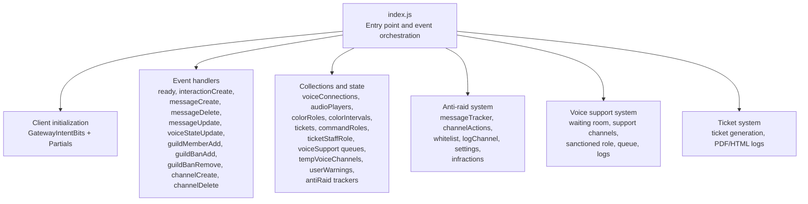
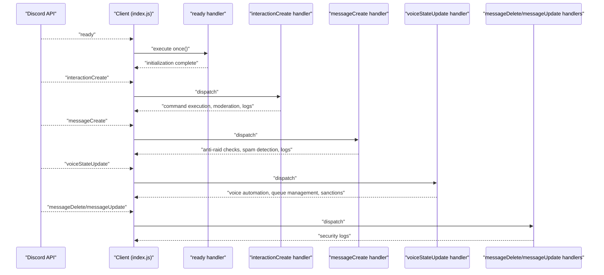
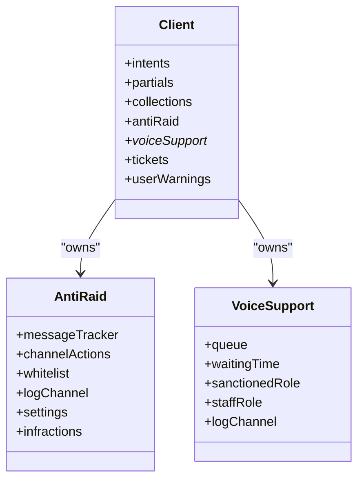
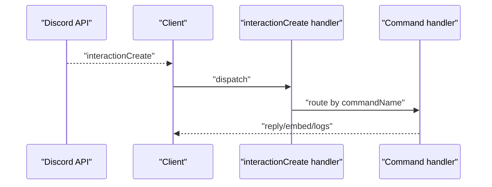
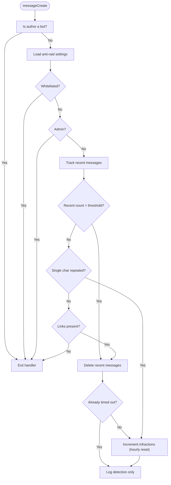
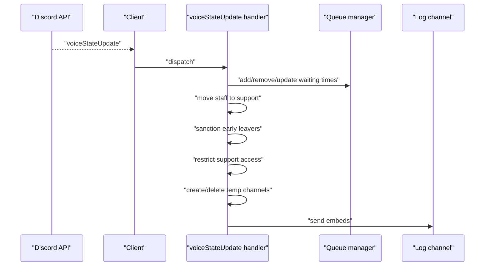
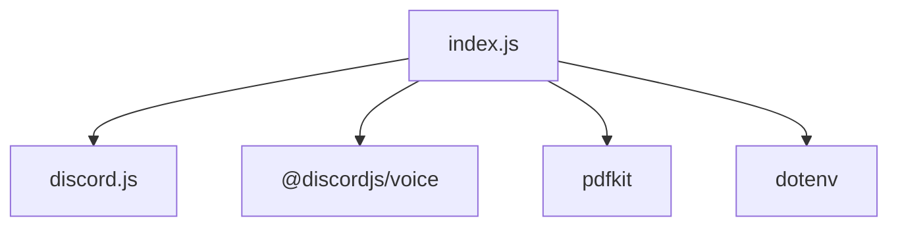

# Event-Driven Architecture

<cite>
**Referenced Files in This Document**
- [index.js](file://index.js)
- [package.json](file://package.json)
- [README.md](file://README.md)
</cite>

## Table of Contents
1. [Introduction](#introduction)
2. [Project Structure](#project-structure)
3. [Core Components](#core-components)
4. [Architecture Overview](#architecture-overview)
5. [Detailed Component Analysis](#detailed-component-analysis)
6. [Dependency Analysis](#dependency-analysis)
7. [Performance Considerations](#performance-considerations)
8. [Troubleshooting Guide](#troubleshooting-guide)
9. [Conclusion](#conclusion)

## Introduction
This document explains the event-driven architecture of the Discord bot implemented in index.js. It focuses on how the bot uses Discord.js event listeners to respond to real-time events from the Discord API, including ready, interactionCreate, messageDelete, messageUpdate, and voiceStateUpdate. It details the flow from event emission to handler execution, covering command execution, moderation actions, ticket management, and voice channel automation. It also covers the Client instance’s event system, the role of GatewayIntentBits in enabling specific event types, and how partials support data availability. Finally, it addresses performance considerations for high-frequency events like message spam detection in the anti-raid system and best practices for error handling within event listeners.

## Project Structure
The repository centers around a single entry point that initializes the Client, registers event listeners, and orchestrates bot behavior. Key elements:
- index.js: Initializes the Client, sets intents and partials, defines collections, and registers event handlers for ready, interactionCreate, messageCreate, messageDelete, messageUpdate, voiceStateUpdate, and several guild-level events.
- package.json: Declares discord.js and related dependencies.
- README.md: Provides functional summaries of bot capabilities, including anti-raid, voice support, tickets, and moderation.

**Diagram sources**
- [index.js](file://index.js#L491-L518)
- [index.js](file://index.js#L520-L528)
- [index.js](file://index.js#L2442-L2981)
- [index.js](file://index.js#L2218-L2297)
- [index.js](file://index.js#L2299-L2392)
- [index.js](file://index.js#L2121-L2214)
- [index.js](file://index.js#L936-L954)

**Section sources**
- [index.js](file://index.js#L491-L518)
- [package.json](file://package.json#L1-L27)
- [README.md](file://README.md#L1-L188)

## Core Components
- Client instance: Created with specific intents and partials to enable targeted event streams and partial data availability.
- Collections and state: Used to track runtime state for voice support, tickets, moderation warnings, and anti-raid metrics.
- Event handlers: Registered for ready, interactionCreate, messageCreate, messageDelete, messageUpdate, voiceStateUpdate, and guild-level events to drive bot behavior.
- Anti-raid system: Tracks message bursts, repeated characters, channel creation/deletion spikes, links, unauthorized bots, and whitelists, with configurable thresholds and logging.
- Voice support system: Manages waiting rooms, support channels, queueing, sanctions, and temporary voice channels.
- Ticket system: Generates PDF/HTML logs for tickets and manages ticket lifecycle.

**Section sources**
- [index.js](file://index.js#L491-L518)
- [index.js](file://index.js#L520-L528)
- [index.js](file://index.js#L2442-L2981)
- [index.js](file://index.js#L2218-L2297)
- [index.js](file://index.js#L2299-L2392)
- [index.js](file://index.js#L2121-L2214)
- [index.js](file://index.js#L936-L954)

## Architecture Overview
The bot’s event-driven architecture revolves around the Client’s event system. Handlers are registered at startup and executed upon receiving events from Discord. The flow is:
- Discord emits an event (e.g., voiceStateUpdate, interactionCreate).
- The Client invokes the corresponding handler registered via client.on(...) or client.once(...).
- The handler performs checks (permissions, whitelists, timeouts), updates internal state, and executes actions (moderation, voice automation, ticket logging, anti-raid enforcement).
- Side effects include sending logs, updating UI (buttons, messages), and managing voice channels.

**Diagram sources**
- [index.js](file://index.js#L707-L710)
- [index.js](file://index.js#L823-L876)
- [index.js](file://index.js#L1026-L2095)
- [index.js](file://index.js#L2442-L2981)
- [index.js](file://index.js#L2218-L2297)

## Detailed Component Analysis

### Client Initialization and Event System
- Client creation: The Client is instantiated with intents enabling Guilds, GuildMembers, GuildVoiceStates, GuildMessages, and MessageContent. Partials include GuildMember to support partial data availability.
- Collections and state: The Client holds several collections and maps for runtime state (voice connections, audio players, color roles, tickets, command roles, voice support queues, temp voice channels, user warnings, anti-raid trackers).
- Global error handling: Uncaught exceptions and unhandled rejections are captured globally to prevent process crashes.

**Diagram sources**
- [index.js](file://index.js#L491-L518)
- [index.js](file://index.js#L520-L528)

**Section sources**
- [index.js](file://index.js#L491-L518)
- [index.js](file://index.js#L1-L10)

### Ready Event
- Purpose: Executes once when the bot becomes ready. It restores color role rotations, starts periodic maintenance tasks, and initializes voice support monitoring.
- Behavior: Restores color rotation state from persisted storage, schedules periodic updates for voice support queue messages, and logs readiness.

**Section sources**
- [index.js](file://index.js#L707-L710)
- [index.js](file://index.js#L729-L821)

### InteractionCreate Event
- Purpose: Handles slash commands and button interactions.
- Pattern: Uses client.on('interactionCreate', ...) to capture chat input commands. Handlers branch by commandName, perform permission checks, and execute command logic. Some commands defer replies to avoid “app did not respond” errors.
- Examples: Command handlers include moderation commands (/ban, /kick, /timeout), informational commands (/userinfo, /serverinfo), fun commands (/8ball, /rps), and utility commands (/ping, /clear, /slowmode).

**Diagram sources**
- [index.js](file://index.js#L823-L876)
- [index.js](file://index.js#L3077-L3199)

**Section sources**
- [index.js](file://index.js#L823-L876)
- [index.js](file://index.js#L3077-L3199)

### MessageCreate Event (Anti-Raid)
- Purpose: Implements anti-raid protections against spam, repeated characters, links, and unauthorized bots.
- Pattern: Uses client.on('messageCreate', ...) to intercept messages. It maintains a per-guild/per-user message tracker within a time window and applies configurable thresholds. It also tracks repeated single-character messages and deletes recent messages when spam is detected. It logs detections and does not apply timeouts in this implementation.
- Key mechanisms:
  - Whitelist checks and admin bypass.
  - Timeout (communicationDisabledUntil) detection to avoid double-punishing.
  - Infraction counters with hourly reset.
  - Logging via sendSecurityLog.

**Diagram sources**
- [index.js](file://index.js#L1026-L2095)
- [index.js](file://index.js#L936-L954)

**Section sources**
- [index.js](file://index.js#L1026-L2095)
- [index.js](file://index.js#L936-L954)

### MessageDelete and MessageUpdate Events
- Purpose: Logs deleted and edited messages to a configured log channel.
- Pattern: Uses client.on('messageDelete', ...) and client.on('messageUpdate', ...) to capture changes and send embeds to the log channel.

**Section sources**
- [index.js](file://index.js#L2218-L2297)
- [index.js](file://index.js#L2245-L2269)

### VoiceStateUpdate Event (Voice Support Automation)
- Purpose: Orchestrates voice support automation, including waiting room management, queueing, staff movement, sanctions for early exits, and temporary voice channel lifecycle.
- Pattern: Uses client.on('voiceStateUpdate', ...) to react to voice state transitions. It:
  - Adds users to the waiting room queue and logs requests.
  - Moves staff to support channels automatically.
  - Sanctions users who leave the waiting room before a minimum time threshold.
  - Restricts access to support channels to authorized roles.
  - Creates temporary voice channels when users enter a designated “create” channel and deletes them when empty.

**Diagram sources**
- [index.js](file://index.js#L2442-L2981)

**Section sources**
- [index.js](file://index.js#L2442-L2981)

### Anti-Bot, Anti-Channel Spam, and Audit-Based Protection
- Anti-Bots: On guildMemberAdd, kicks unauthorized bots if enabled and not whitelisted.
- Anti-Channel Spam: On channelCreate and channelDelete, tracks recent actions and removes executor roles if exceeding thresholds.
- Audit logs: Used to attribute actions to executors for logging and protection.

**Section sources**
- [index.js](file://index.js#L2096-L2119)
- [index.js](file://index.js#L2121-L2214)

### Ticket Management and Logs
- Ticket generation: Generates PDF and HTML logs for tickets, including message history and metadata.
- Ticket lifecycle: Manages ticket creation, updates, and cleanup.

**Section sources**
- [index.js](file://index.js#L43-L274)
- [index.js](file://index.js#L276-L489)

## Dependency Analysis
- discord.js: Provides Client, GatewayIntentBits, Partials, PermissionsBitField, EmbedBuilder, and voice utilities.
- @discordjs/voice: Enables voice player and connection management.
- pdfkit: Generates PDFs for ticket logs.
- dotenv: Loads environment variables (e.g., BOT_TOKEN).

**Diagram sources**
- [package.json](file://package.json#L1-L27)
- [index.js](file://index.js#L1-L40)

**Section sources**
- [package.json](file://package.json#L1-L27)

## Performance Considerations
- High-frequency events: messageCreate triggers frequently during spam or mass messaging. The handler:
  - Maintains a time-windowed message tracker per user/guild.
  - Deletes recent messages in bulk when spam is detected.
  - Uses per-user keys to avoid cross-user interference.
  - Applies whitelists and admin bypass to reduce unnecessary processing.
- Memory footprint: Anti-raid trackers (messageTracker, channelActions, infractions) are maps keyed by guild and user identifiers. Periodic resets occur after one hour without infractions.
- I/O and network costs:
  - Fetching audit logs for channelCreate/channelDelete adds latency; ensure minimal fetches and cache where appropriate.
  - Sending logs to channels and generating PDFs/HTML are asynchronous and should be handled with care to avoid blocking.
- Recommendations:
  - Use efficient data structures (Maps/Sets) for trackers.
  - Batch operations (bulkDelete) to minimize API calls.
  - Debounce or throttle frequent UI updates (e.g., waiting room timers).
  - Avoid synchronous filesystem writes in hot paths; consider streaming or offloading heavy I/O.

[No sources needed since this section provides general guidance]

## Troubleshooting Guide
- Missing events:
  - Verify intents and partials are set correctly in Client initialization.
  - Ensure the bot has required permissions in servers.
- Anti-raid not triggering:
  - Confirm anti-raid settings are enabled and log channel is configured.
  - Check whitelist entries and admin bypass conditions.
- Voice automation issues:
  - Verify waiting room and support channel names match expected patterns.
  - Ensure staff roles and sanctioned roles are configured.
- Logging failures:
  - Confirm log channel IDs exist and the bot can send messages.
  - Review error logs for permission or rate-limit issues.
- Error handling:
  - Global uncaughtException and unhandledRejection handlers prevent crashes.
  - Handlers wrap operations in try/catch and log errors.

**Section sources**
- [index.js](file://index.js#L1-L10)
- [index.js](file://index.js#L2218-L2297)
- [index.js](file://index.js#L2299-L2392)
- [index.js](file://index.js#L2121-L2214)

## Conclusion
The bot’s event-driven architecture leverages Discord.js Client event listeners to implement a robust, real-time system. From ready initialization to anti-raid enforcement, voice automation, and ticket logging, handlers are organized around clear patterns: register listeners, validate context, update state, and execute actions with logging. Intents and partials enable targeted data access, while global error handling improves resilience. For high-frequency events like spam detection, careful use of time-windowed trackers and bulk operations ensures performance remains acceptable.