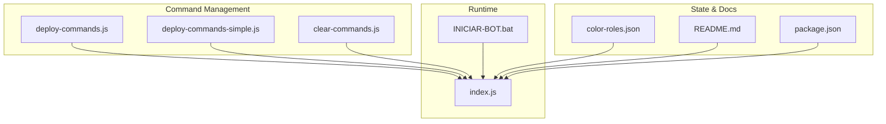
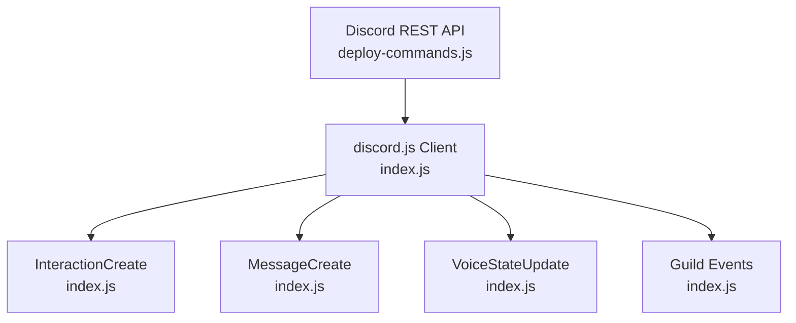
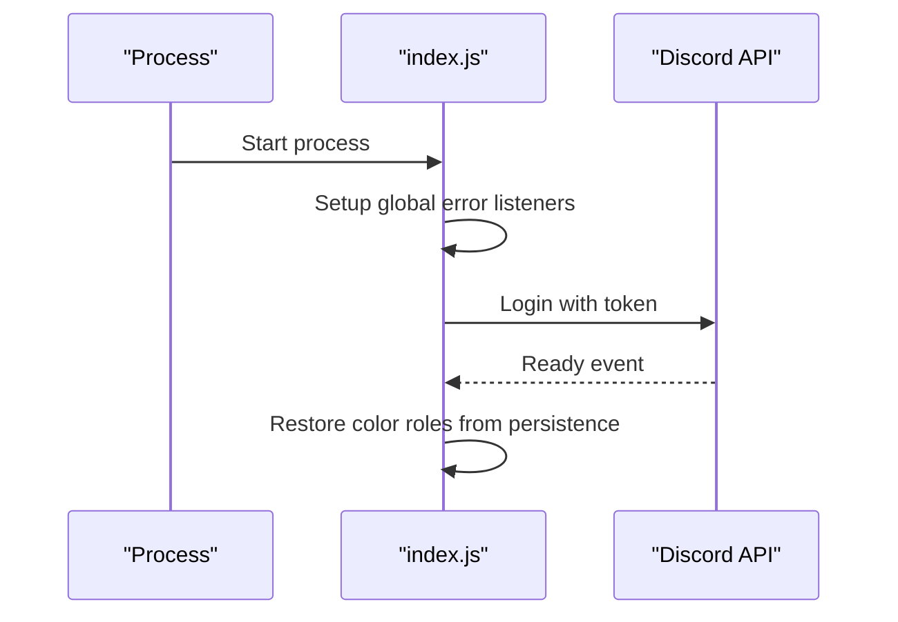
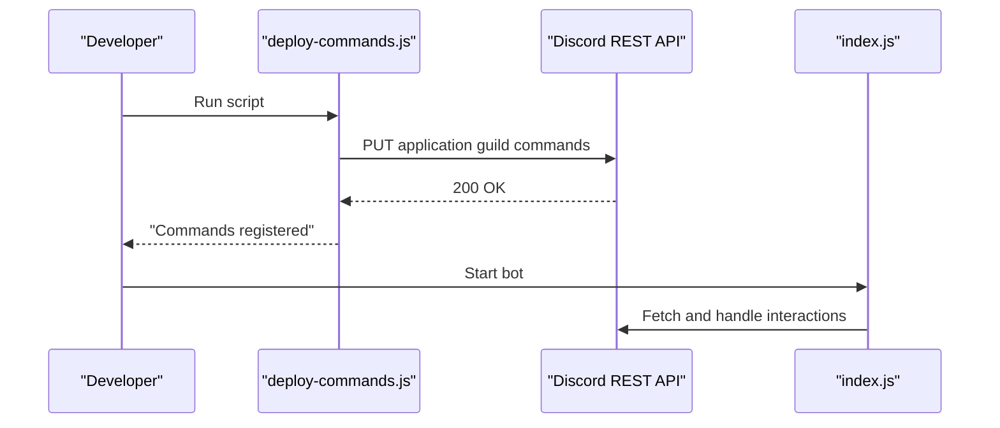
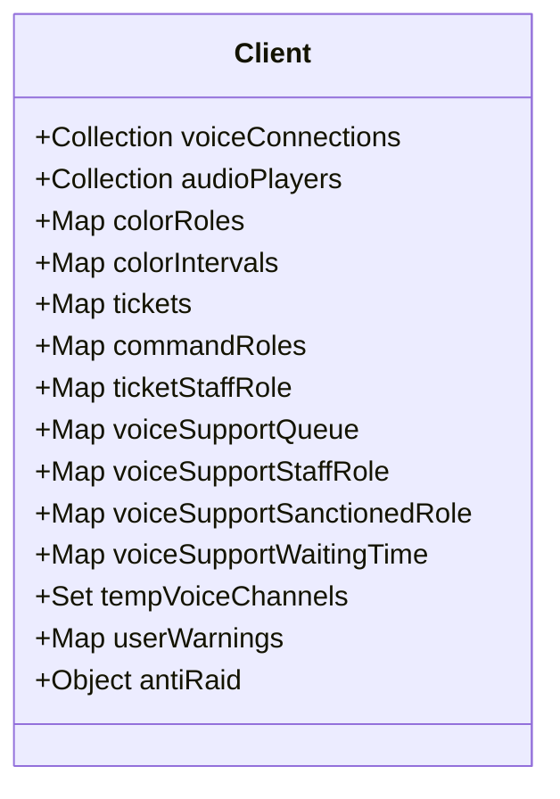
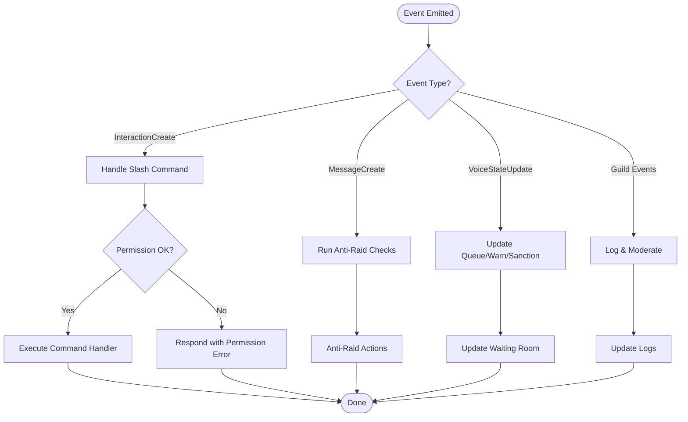
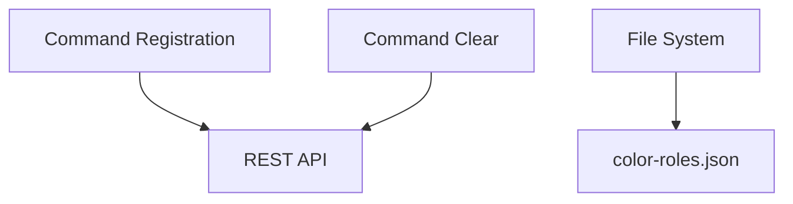
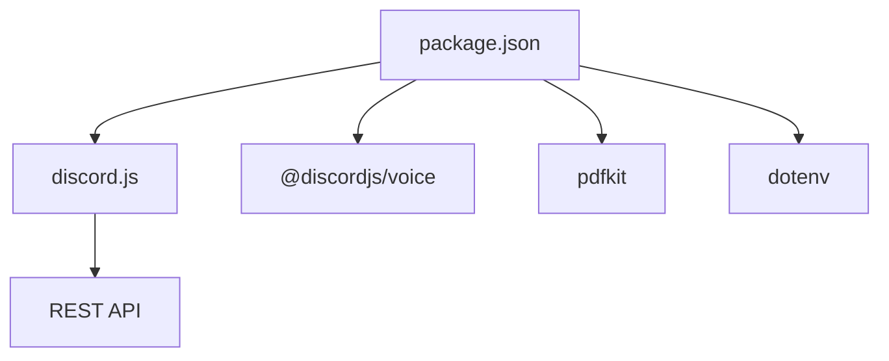
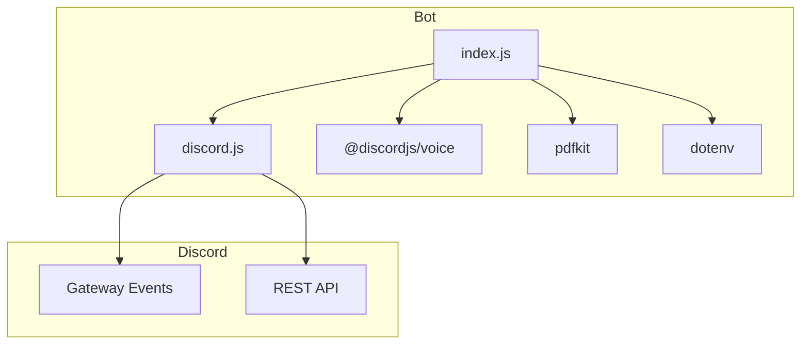

# Technical Architecture

<cite>
**Referenced Files in This Document**
- [index.js](file://index.js)
- [package.json](file://package.json)
- [README.md](file://README.md)
- [deploy-commands.js](file://deploy-commands.js)
- [deploy-commands-simple.js](file://deploy-commands-simple.js)
- [clear-commands.js](file://clear-commands.js)
- [INICIAR-BOT.bat](file://INICIAR-BOT.bat)
- [color-roles.json](file://color-roles.json)
</cite>

## Table of Contents
1. [Introduction](#introduction)
2. [Project Structure](#project-structure)
3. [Core Components](#core-components)
4. [Architecture Overview](#architecture-overview)
5. [Detailed Component Analysis](#detailed-component-analysis)
6. [Dependency Analysis](#dependency-analysis)
7. [Performance Considerations](#performance-considerations)
8. [Troubleshooting Guide](#troubleshooting-guide)
9. [Conclusion](#conclusion)
10. [Appendices](#appendices)

## Introduction
This document describes the technical architecture of a Discord bot built with Node.js and discord.js. The system follows an event-driven architecture centered around the Client instance, with event listeners for interactions, messages, guild events, and voice state updates. It integrates command registration scripts, persistent state storage, and external API calls to Discord’s REST endpoints. Cross-cutting concerns include error handling via global process listeners, security through environment variables, and scalability considerations for multi-server deployments.

## Project Structure
The repository is organized around a single entry point and supporting scripts:
- Application entry and runtime: index.js
- Command deployment and cleanup: deploy-commands.js, deploy-commands-simple.js, clear-commands.js
- Runtime launcher: INICIAR-BOT.bat
- Persistent configuration: color-roles.json
- Documentation and metadata: README.md, package.json

**Diagram sources**
- [index.js](file://index.js#L1-L20)
- [deploy-commands.js](file://deploy-commands.js#L1-L20)
- [deploy-commands-simple.js](file://deploy-commands-simple.js#L1-L20)
- [clear-commands.js](file://clear-commands.js#L1-L20)
- [INICIAR-BOT.bat](file://INICIAR-BOT.bat#L1-L23)
- [color-roles.json](file://color-roles.json#L1-L10)
- [README.md](file://README.md#L1-L40)
- [package.json](file://package.json#L1-L27)

**Section sources**
- [index.js](file://index.js#L1-L20)
- [README.md](file://README.md#L104-L127)
- [package.json](file://package.json#L1-L27)

## Core Components
- Client instance: Creates a discord.js Client configured with required intents and partials for guild members.
- Event listeners: Handles slash command interactions, message lifecycle, guild membership changes, channel lifecycle, message edits/deletes, role updates, and voice state transitions.
- Command registration: Scripts register slash commands to a specific guild using the REST API.
- State management: Uses collections and maps attached to the client for voice connections, audio players, color roles, tickets, command roles, voice support queues, warnings, temp voice channels, and anti-raid tracking.
- Persistence: Stores color role configurations in a JSON file for restoration on restart.
- External APIs: Calls Discord REST endpoints for command registration and interacts with Discord gateway events.

Key implementation references:
- Client creation and intents: [index.js](file://index.js#L491-L500)
- Global error listeners: [index.js](file://index.js#L1-L10)
- Command registration scripts: [deploy-commands.js](file://deploy-commands.js#L280-L293), [deploy-commands-simple.js](file://deploy-commands-simple.js#L150-L164)
- State collections: [index.js](file://index.js#L502-L519)
- Color roles persistence: [index.js](file://index.js#L708-L728), [color-roles.json](file://color-roles.json#L1-L10)

**Section sources**
- [index.js](file://index.js#L1-L10)
- [index.js](file://index.js#L491-L519)
- [index.js](file://index.js#L708-L728)
- [deploy-commands.js](file://deploy-commands.js#L280-L293)
- [deploy-commands-simple.js](file://deploy-commands-simple.js#L150-L164)
- [color-roles.json](file://color-roles.json#L1-L10)

## Architecture Overview
The system is event-driven. The Client instance emits events that trigger handler functions. Handlers orchestrate Discord API calls, manage internal state, and persist data. Command interactions are handled via slash command events, while message and voice events drive automation and moderation features.

**Diagram sources**
- [index.js](file://index.js#L823-L830)
- [index.js](file://index.js#L1026-L1030)
- [index.js](file://index.js#L2442-L2450)
- [index.js](file://index.js#L2095-L2100)
- [deploy-commands.js](file://deploy-commands.js#L280-L293)

## Detailed Component Analysis

### Client and Event-Driven Runtime
- Client initialization sets up intents and partials for efficient memory usage and required capabilities.
- Global process listeners capture uncaught exceptions and unhandled rejections to prevent crashes and log errors.
- On ready, the bot restores color role rotations from persisted state.

**Diagram sources**
- [index.js](file://index.js#L1-L10)
- [index.js](file://index.js#L6902-L6905)
- [index.js](file://index.js#L708-L728)

**Section sources**
- [index.js](file://index.js#L1-L10)
- [index.js](file://index.js#L491-L500)
- [index.js](file://index.js#L708-L728)
- [index.js](file://index.js#L6902-L6905)

### Command Registration and Deployment
- Two scripts register slash commands to a specific guild. They read credentials from environment variables and use the REST API to PUT command definitions.
- A third script clears all registered commands for a guild and globally.

**Diagram sources**
- [deploy-commands.js](file://deploy-commands.js#L280-L293)
- [index.js](file://index.js#L823-L830)

**Section sources**
- [deploy-commands.js](file://deploy-commands.js#L1-L293)
- [deploy-commands-simple.js](file://deploy-commands-simple.js#L1-L164)
- [clear-commands.js](file://clear-commands.js#L1-L54)

### State Management and Collections
- The Client instance carries several collections and maps for:
  - Voice connections and audio players
  - Color roles and rotation intervals
  - Ticket tracking
  - Command role permissions
  - Voice support queue, staff roles, sanctions, waiting times, warnings, next-role, queue messages
  - Temporary voice channels
  - User warnings
  - Anti-raid trackers (message tracker, channel actions, whitelist, log channel, settings, infractions)

**Diagram sources**
- [index.js](file://index.js#L502-L519)

**Section sources**
- [index.js](file://index.js#L502-L519)

### Event Handlers and Data Flows
- InteractionCreate: Processes slash command interactions, validates permissions, and executes command logic.
- MessageCreate: Triggers anti-raid checks and other message-based automations.
- VoiceStateUpdate: Manages voice support queue, warnings, sanctions, and temporary channel cleanup.
- Guild events: Track joins, leaves, bans, role updates, and channel lifecycle for logging and moderation.

**Diagram sources**
- [index.js](file://index.js#L823-L830)
- [index.js](file://index.js#L1026-L1030)
- [index.js](file://index.js#L2442-L2450)
- [index.js](file://index.js#L2095-L2100)

**Section sources**
- [index.js](file://index.js#L823-L830)
- [index.js](file://index.js#L1026-L1030)
- [index.js](file://index.js#L2442-L2450)
- [index.js](file://index.js#L2095-L2100)

### External API Integrations
- REST API for command registration and clearing.
- Discord gateway events for real-time updates.
- File system for persistence of color roles.

**Diagram sources**
- [deploy-commands.js](file://deploy-commands.js#L280-L293)
- [clear-commands.js](file://clear-commands.js#L1-L54)
- [color-roles.json](file://color-roles.json#L1-L10)

**Section sources**
- [deploy-commands.js](file://deploy-commands.js#L280-L293)
- [clear-commands.js](file://clear-commands.js#L1-L54)
- [color-roles.json](file://color-roles.json#L1-L10)

## Dependency Analysis
- Runtime dependencies include discord.js, @discordjs/voice, pdfkit, dotenv, and others for media, voice, and utilities.
- Scripts depend on discord.js builders and REST routes to manage commands.
- Environment variables are used for BOT_TOKEN, CLIENT_ID, and GUILD_ID.

**Diagram sources**
- [package.json](file://package.json#L10-L25)
- [deploy-commands.js](file://deploy-commands.js#L280-L293)

**Section sources**
- [package.json](file://package.json#L10-L25)
- [deploy-commands.js](file://deploy-commands.js#L280-L293)

## Performance Considerations
- Event-driven design minimizes blocking operations; handlers should remain asynchronous and avoid heavy CPU tasks on the main thread.
- Voice support queue and waiting time tracking use in-memory maps; consider persistence or Redis for multi-instance deployments.
- Anti-raid systems rely on in-memory tracking; rate-limit and deduplicate checks to reduce redundant API calls.
- Batch operations (e.g., fetching messages) should respect pagination limits and backoff strategies to avoid rate limits.

[No sources needed since this section provides general guidance]

## Troubleshooting Guide
- Global error listeners: The process captures uncaught exceptions and unhandled rejections to prevent crashes and log errors.
- Environment variables: Ensure BOT_TOKEN, CLIENT_ID, and GUILD_ID are set in the environment before running scripts or the bot.
- Command registration: Use the provided scripts to register or clear commands; verify token and IDs are correct.
- Startup script: The batch file launches the bot; if it exits immediately, check the console output for errors.

**Section sources**
- [index.js](file://index.js#L1-L10)
- [README.md](file://README.md#L111-L127)
- [INICIAR-BOT.bat](file://INICIAR-BOT.bat#L1-L23)

## Conclusion
The Discord bot employs a robust event-driven architecture using discord.js. Its design cleanly separates concerns: the Client manages state and events, scripts handle command registration, and handlers implement business logic for moderation, voice management, and logging. Security is enforced through environment variables and permission checks, while global error listeners improve resilience. For multi-server scalability, consider externalizing state and adding rate-limiting and caching layers.

[No sources needed since this section summarizes without analyzing specific files]

## Appendices

### Infrastructure Requirements
- Node.js runtime and npm dependencies as defined in package.json.
- A Discord bot application with appropriate permissions and intents enabled.
- Environment variables for BOT_TOKEN, CLIENT_ID, and GUILD_ID.

**Section sources**
- [package.json](file://package.json#L1-L27)
- [README.md](file://README.md#L104-L127)

### System Context Diagram: Bot and Discord API

**Diagram sources**
- [index.js](file://index.js#L1-L30)
- [package.json](file://package.json#L10-L25)