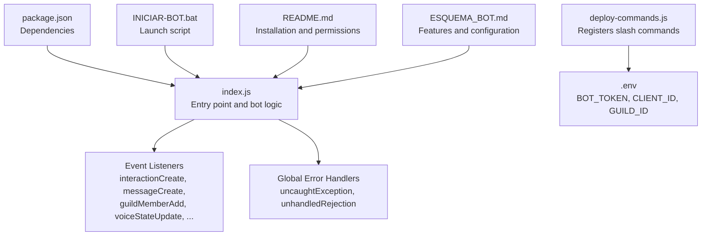
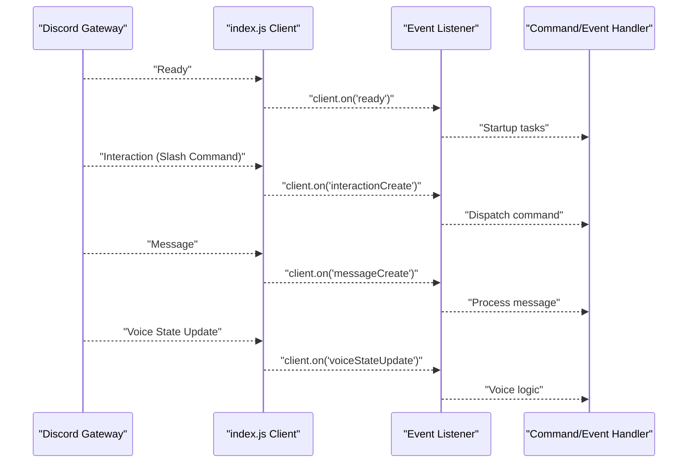
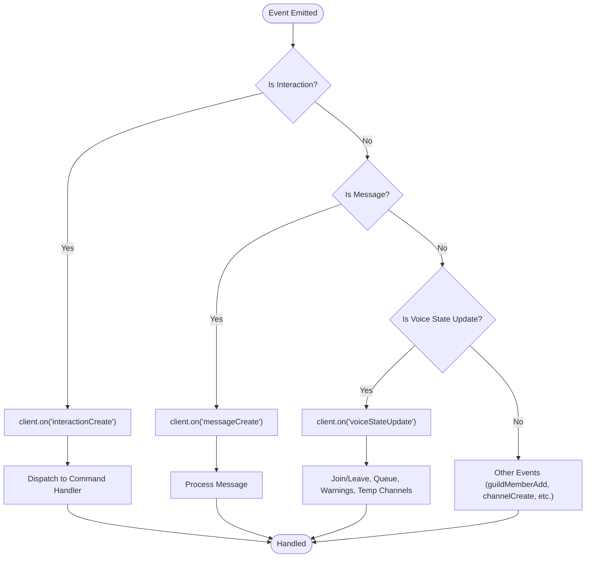
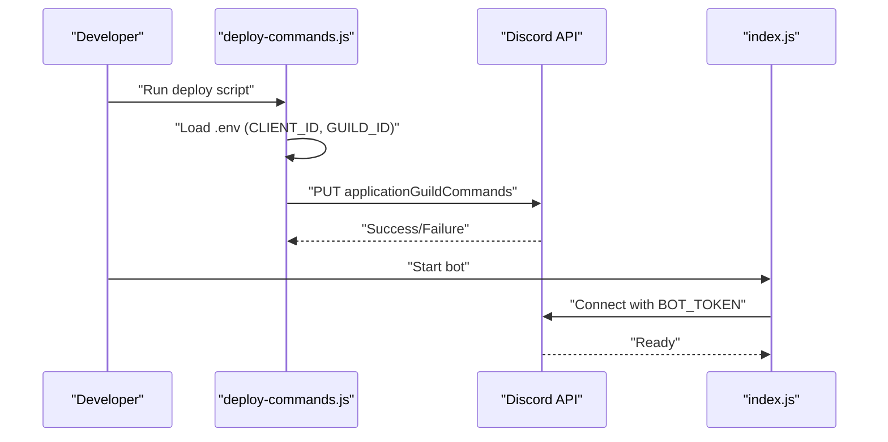
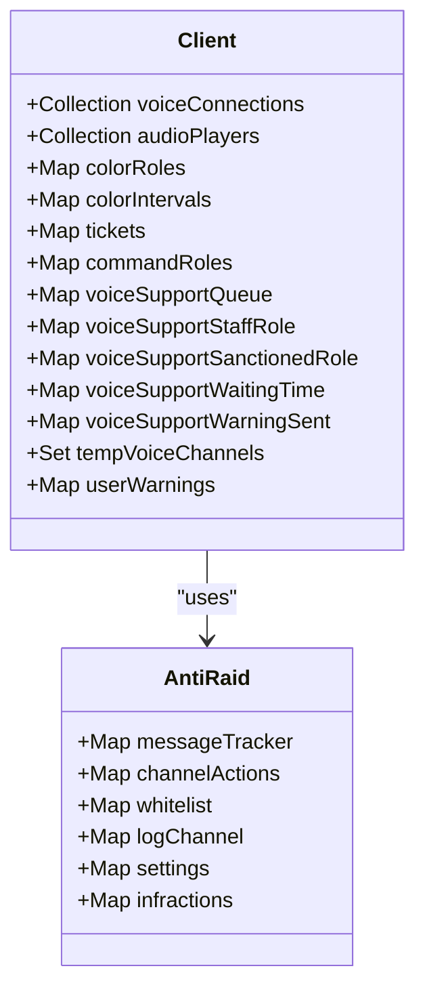
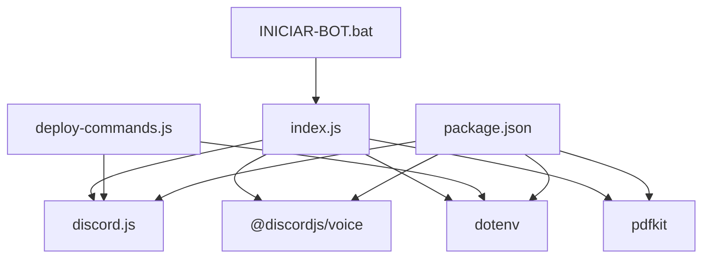

# Bot Not Responding Issues

<cite>
**Referenced Files in This Document**
- [index.js](file://index.js)
- [deploy-commands.js](file://deploy-commands.js)
- [package.json](file://package.json)
- [README.md](file://README.md)
- [INICIAR-BOT.bat](file://INICIAR-BOT.bat)
- [ESQUEMA_BOT.md](file://ESQUEMA_BOT.md)
</cite>

## Table of Contents
1. [Introduction](#introduction)
2. [Project Structure](#project-structure)
3. [Core Components](#core-components)
4. [Architecture Overview](#architecture-overview)
5. [Detailed Component Analysis](#detailed-component-analysis)
6. [Dependency Analysis](#dependency-analysis)
7. [Performance Considerations](#performance-considerations)
8. [Troubleshooting Guide](#troubleshooting-guide)
9. [Conclusion](#conclusion)

## Introduction
This document focuses on diagnosing and resolving scenarios where the bot does not respond to commands or events. It explains how the bot connects to Discord, how event listeners are registered, and how to verify readiness, permissions, and configuration. It also covers debugging steps such as validating the bot token, checking for rate limits, and ensuring the correct guild ID is configured. Error handling patterns from the codebase, including global uncaught exception and unhandled rejection handlers, are documented to help stabilize runtime behavior.

## Project Structure
The repository centers around a single entry point that initializes the Discord client, registers event listeners, and exposes slash commands. Supporting scripts handle command registration and environment configuration.

**Diagram sources**
- [index.js](file://index.js#L1-L20)
- [deploy-commands.js](file://deploy-commands.js#L1-L20)
- [package.json](file://package.json#L1-L27)
- [README.md](file://README.md#L104-L132)
- [INICIAR-BOT.bat](file://INICIAR-BOT.bat#L1-L23)
- [ESQUEMA_BOT.md](file://ESQUEMA_BOT.md#L168-L196)

**Section sources**
- [index.js](file://index.js#L1-L20)
- [deploy-commands.js](file://deploy-commands.js#L1-L20)
- [package.json](file://package.json#L1-L27)
- [README.md](file://README.md#L104-L132)
- [INICIAR-BOT.bat](file://INICIAR-BOT.bat#L1-L23)
- [ESQUEMA_BOT.md](file://ESQUEMA_BOT.md#L168-L196)

## Core Components
- Client initialization and intents: The bot creates a Client with specific gateway intents and partials required for voice, message content, and guild members.
- Event listeners: The bot registers listeners for interactions, messages, member updates, channel changes, voice state updates, and guild events.
- Command registration: Slash commands are registered via a dedicated script using environment variables for client and guild identifiers.
- Global error handling: Uncaught exceptions and unhandled rejections are logged globally to prevent silent crashes.

Key implementation references:
- Client creation and collections: [index.js](file://index.js#L491-L520)
- Ready event and startup tasks: [index.js](file://index.js#L708-L728)
- Interaction listener: [index.js](file://index.js#L823-L876)
- Message listener: [index.js](file://index.js#L1026-L1040)
- Voice state update listener: [index.js](file://index.js#L2442-L2460)
- Command registration script: [deploy-commands.js](file://deploy-commands.js#L1-L20)
- Global error handlers: [index.js](file://index.js#L1-L10)

**Section sources**
- [index.js](file://index.js#L491-L520)
- [index.js](file://index.js#L708-L728)
- [index.js](file://index.js#L823-L876)
- [index.js](file://index.js#L1026-L1040)
- [index.js](file://index.js#L2442-L2460)
- [deploy-commands.js](file://deploy-commands.js#L1-L20)
- [index.js](file://index.js#L1-L10)

## Architecture Overview
The bot’s runtime architecture relies on Discord’s event-driven model. The client emits events that the bot listens to. Commands are handled via interactionCreate, while message-based events are handled via messageCreate. Voice state changes trigger specialized logic for voice channels and queues.

**Diagram sources**
- [index.js](file://index.js#L708-L728)
- [index.js](file://index.js#L823-L876)
- [index.js](file://index.js#L1026-L1040)
- [index.js](file://index.js#L2442-L2460)

**Section sources**
- [index.js](file://index.js#L708-L728)
- [index.js](file://index.js#L823-L876)
- [index.js](file://index.js#L1026-L1040)
- [index.js](file://index.js#L2442-L2460)

## Detailed Component Analysis

### Event Listener Registration and Invocation
- interactionCreate: Handles slash commands and validates permissions before executing logic.
- messageCreate: Processes message events (e.g., legacy commands or message-based triggers).
- voiceStateUpdate: Manages voice channel joins/leaves, queue updates, warnings, and temporary channel lifecycle.
- Ready: Initializes bot state and restores color rotations.

**Diagram sources**
- [index.js](file://index.js#L823-L876)
- [index.js](file://index.js#L1026-L1040)
- [index.js](file://index.js#L2442-L2460)

**Section sources**
- [index.js](file://index.js#L823-L876)
- [index.js](file://index.js#L1026-L1040)
- [index.js](file://index.js#L2442-L2460)

### Command Registration and Environment Configuration
- The command registration script reads environment variables for CLIENT_ID and GUILD_ID and registers slash commands for the specified guild.
- The README and ESQUEMA_BOT documents outline required environment variables and installation steps.

**Diagram sources**
- [deploy-commands.js](file://deploy-commands.js#L1-L20)
- [README.md](file://README.md#L104-L132)
- [ESQUEMA_BOT.md](file://ESQUEMA_BOT.md#L168-L176)

**Section sources**
- [deploy-commands.js](file://deploy-commands.js#L1-L20)
- [README.md](file://README.md#L104-L132)
- [ESQUEMA_BOT.md](file://ESQUEMA_BOT.md#L168-L176)

### Domain Model and Usage Patterns
- Collections and state: The client maintains several collections for voice connections, audio players, color roles, tickets, command roles, and voice support queues.
- Anti-raid and logging: Security logs are sent to configured channels, and anti-raid settings are stored per guild.
- Voice support: Waiting rooms, support channels, and sanctions are managed with role checks and time-based warnings.

**Diagram sources**
- [index.js](file://index.js#L503-L528)

**Section sources**
- [index.js](file://index.js#L503-L528)

## Dependency Analysis
- Runtime dependencies include discord.js, @discordjs/voice, dotenv, pdfkit, and others.
- The bot expects environment variables for BOT_TOKEN, CLIENT_ID, and GUILD_ID.
- The launch script runs the bot using Node.js.

**Diagram sources**
- [package.json](file://package.json#L1-L27)
- [index.js](file://index.js#L1-L20)
- [deploy-commands.js](file://deploy-commands.js#L1-L20)
- [INICIAR-BOT.bat](file://INICIAR-BOT.bat#L1-L23)

**Section sources**
- [package.json](file://package.json#L1-L27)
- [index.js](file://index.js#L1-L20)
- [deploy-commands.js](file://deploy-commands.js#L1-L20)
- [INICIAR-BOT.bat](file://INICIAR-BOT.bat#L1-L23)

## Performance Considerations
- Event loops and intervals: The bot uses periodic intervals for voice support queue updates and waiting room checks. Ensure intervals are tuned to avoid excessive CPU usage.
- Logging and file I/O: Ticket generation writes files to disk; ensure disk I/O does not block event loops.
- Network reliability: The bot depends on Discord’s API; implement retry/backoff strategies for transient failures.

[No sources needed since this section provides general guidance]

## Troubleshooting Guide

### 1) Verify Bot Is Connected to Discord (client.ready status)
- Confirm the ready event fires and logs the bot’s tag.
- Look for the “Connected as” message during startup.

Checklist:
- Start the bot using the provided script or npm start.
- Review console output for the ready event and “Connected as” message.

**Section sources**
- [index.js](file://index.js#L708-L728)
- [INICIAR-BOT.bat](file://INICIAR-BOT.bat#L1-L23)
- [README.md](file://README.md#L104-L132)

### 2) Check Internet Connectivity
- Ensure the host machine has outbound network access to Discord’s endpoints.
- Test DNS resolution and firewall rules if the bot fails to connect.

[No sources needed since this section provides general guidance]

### 3) Examine Console Logs for Error Messages
- The bot installs global handlers for uncaught exceptions and unhandled rejections.
- Review logs for stack traces and error messages emitted by the bot.

Common areas to inspect:
- Ready event initialization and color rotation restoration.
- Interaction and message handlers for permission checks and command dispatch.
- Voice state update logic for queue and waiting room management.

**Section sources**
- [index.js](file://index.js#L1-L10)
- [index.js](file://index.js#L708-L728)
- [index.js](file://index.js#L823-L876)
- [index.js](file://index.js#L1026-L1040)
- [index.js](file://index.js#L2442-L2460)

### 4) Ensure the Bot Has Sufficient Permissions in the Server
- The bot requires specific permissions for commands and features (e.g., Manage Roles, Ban Members, Manage Channels, Connect, Speak, Send Messages, Use Slash Commands, Manage Messages, View Audit Log, Timeout Members).
- Verify the bot’s role position is higher than roles it manages.

References:
- Permissions list: [README.md](file://README.md#L129-L141)
- Role hierarchy enforcement in command handlers: [index.js](file://index.js#L823-L876)

**Section sources**
- [README.md](file://README.md#L129-L141)
- [index.js](file://index.js#L823-L876)

### 5) Confirm Event Listeners Are Properly Registered
- The bot registers listeners for interactions, messages, voice state updates, and guild events.
- If commands do not respond, verify the interactionCreate listener is present and not blocked by early returns.

References:
- Interaction listener: [index.js](file://index.js#L823-L876)
- Message listener: [index.js](file://index.js#L1026-L1040)
- Voice state listener: [index.js](file://index.js#L2442-L2460)

**Section sources**
- [index.js](file://index.js#L823-L876)
- [index.js](file://index.js#L1026-L1040)
- [index.js](file://index.js#L2442-L2460)

### 6) Validate Bot Token Validity
- The deploy script reads CLIENT_ID and GUILD_ID from environment variables.
- Ensure BOT_TOKEN is set and valid in the environment.

References:
- Environment variables and installation steps: [README.md](file://README.md#L104-L132)
- Deploy script environment loading: [deploy-commands.js](file://deploy-commands.js#L1-L20)

**Section sources**
- [README.md](file://README.md#L104-L132)
- [deploy-commands.js](file://deploy-commands.js#L1-L20)

### 7) Check for Rate Limiting by Discord API
- The bot performs frequent operations (fetching members, sending messages, editing logs). Monitor for rate limit errors and implement backoff/retry.
- Use ephemeral replies and defer replies where appropriate to reduce response latency.

References:
- Ephemeral replies and deferrals in handlers: [index.js](file://index.js#L823-L876), [index.js](file://index.js#L5895-L5929)

**Section sources**
- [index.js](file://index.js#L823-L876)
- [index.js](file://index.js#L5895-L5929)

### 8) Validate Correct Guild ID Is Configured
- The deploy script extracts a clean GUILD_ID from environment variables.
- Ensure the GUILD_ID matches the target server.

References:
- GUILD_ID extraction and usage: [deploy-commands.js](file://deploy-commands.js#L1-L20)
- Installation steps requiring GUILD_ID: [README.md](file://README.md#L104-L132)

**Section sources**
- [deploy-commands.js](file://deploy-commands.js#L1-L20)
- [README.md](file://README.md#L104-L132)

### 9) Error Handling Patterns from index.js
- Global handlers:
  - uncaughtException: Logs uncaught exceptions.
  - unhandledRejection: Logs unhandled promise rejections.
- Local handlers:
  - interactionCreate: Validates command type and permissions, then dispatches to command logic.
  - messageCreate: Processes message events.
  - voiceStateUpdate: Manages voice queues, warnings, and temporary channels.

References:
- Global handlers: [index.js](file://index.js#L1-L10)
- Interaction handler: [index.js](file://index.js#L823-L876)
- Message handler: [index.js](file://index.js#L1026-L1040)
- Voice state handler: [index.js](file://index.js#L2442-L2460)

**Section sources**
- [index.js](file://index.js#L1-L10)
- [index.js](file://index.js#L823-L876)
- [index.js](file://index.js#L1026-L1040)
- [index.js](file://index.js#L2442-L2460)

### 10) Additional Checks
- Command registration: Ensure commands were registered for the correct guild using the deploy script.
- Launch method: Use the provided batch script or npm start to ensure environment variables are loaded.

References:
- Command registration: [deploy-commands.js](file://deploy-commands.js#L1-L20)
- Launch script: [INICIAR-BOT.bat](file://INICIAR-BOT.bat#L1-L23)

**Section sources**
- [deploy-commands.js](file://deploy-commands.js#L1-L20)
- [INICIAR-BOT.bat](file://INICIAR-BOT.bat#L1-L23)

## Conclusion
When the bot does not respond to commands or events, systematically verify:
- Client readiness and connection status.
- Internet connectivity and DNS resolution.
- Console logs for exceptions and rejections.
- Bot permissions and role hierarchy.
- Event listener registration and command dispatch logic.
- Bot token and guild ID configuration.
- Rate limiting and retry strategies.
- Command registration for the correct guild.

Using the references and steps above, you can isolate whether the issue lies in configuration, permissions, event handling, or external API constraints.