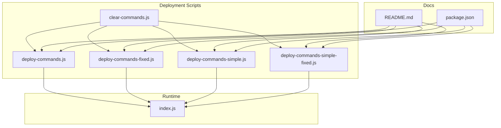
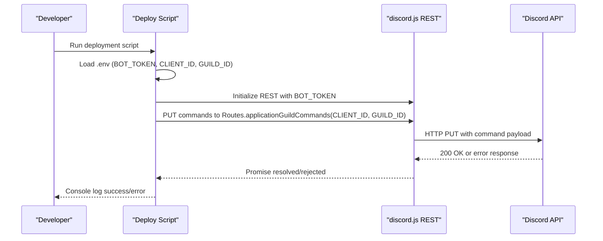
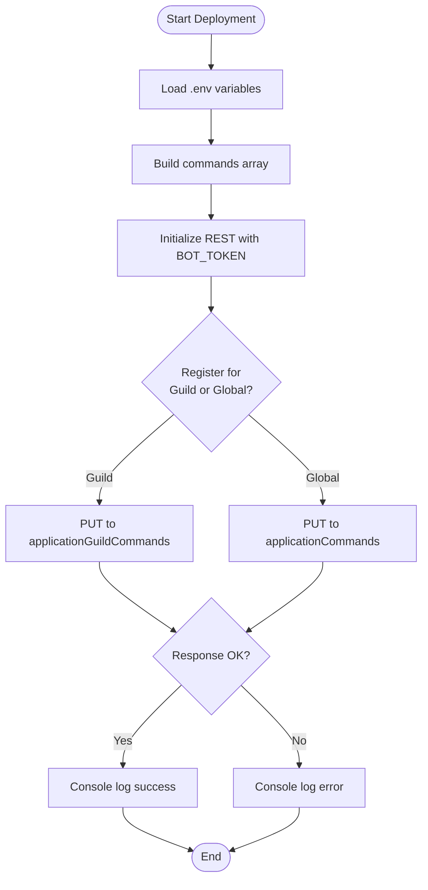
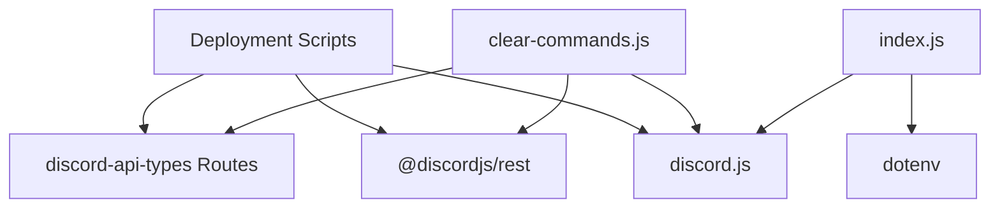

# Command Registration Failures

<cite>
**Referenced Files in This Document**
- [deploy-commands.js](file://deploy-commands.js)
- [deploy-commands-fixed.js](file://deploy-commands-fixed.js)
- [deploy-commands-simple.js](file://deploy-commands-simple.js)
- [deploy-commands-simple-fixed.js](file://deploy-commands-simple-fixed.js)
- [clear-commands.js](file://clear-commands.js)
- [index.js](file://index.js)
- [README.md](file://README.md)
- [package.json](file://package.json)
</cite>

## Table of Contents
1. [Introduction](#introduction)
2. [Project Structure](#project-structure)
3. [Core Components](#core-components)
4. [Architecture Overview](#architecture-overview)
5. [Detailed Component Analysis](#detailed-component-analysis)
6. [Dependency Analysis](#dependency-analysis)
7. [Performance Considerations](#performance-considerations)
8. [Troubleshooting Guide](#troubleshooting-guide)
9. [Conclusion](#conclusion)
10. [Appendices](#appendices)

## Introduction
This document focuses on the sub-feature of command registration failures, specifically the “Error registrando comandos” error observed during deployment. It explains the implementation details, invocation relationships, interfaces, domain model, and usage patterns for registering slash commands. It also covers prerequisites for successful deployment, differences between global and guild-specific registrations, and practical steps to diagnose and resolve common issues such as invalid application IDs, missing permissions, network connectivity, and rate limiting. Verification steps to confirm successful registration are included, along with references to the deploy scripts and their dependency on the discord.js REST API.

## Project Structure
The repository contains several deployment scripts for registering slash commands, a cleanup script, and the main bot entrypoint. The deployment scripts differ in scope and robustness, with some performing extra validation and others focusing on simplicity.

**Diagram sources**
- [deploy-commands.js](file://deploy-commands.js#L1-L293)
- [deploy-commands-fixed.js](file://deploy-commands-fixed.js#L1-L280)
- [deploy-commands-simple.js](file://deploy-commands-simple.js#L1-L164)
- [deploy-commands-simple-fixed.js](file://deploy-commands-simple-fixed.js#L1-L164)
- [clear-commands.js](file://clear-commands.js#L1-L54)
- [index.js](file://index.js#L6902-L6903)
- [README.md](file://README.md#L104-L127)
- [package.json](file://package.json#L1-L27)

**Section sources**
- [deploy-commands.js](file://deploy-commands.js#L1-L293)
- [deploy-commands-fixed.js](file://deploy-commands-fixed.js#L1-L280)
- [deploy-commands-simple.js](file://deploy-commands-simple.js#L1-L164)
- [deploy-commands-simple-fixed.js](file://deploy-commands-simple-fixed.js#L1-L164)
- [clear-commands.js](file://clear-commands.js#L1-L54)
- [index.js](file://index.js#L6902-L6903)
- [README.md](file://README.md#L104-L127)
- [package.json](file://package.json#L1-L27)

## Core Components
- Deployment scripts:
  - deploy-commands.js: Registers a comprehensive set of slash commands for a specific guild, with robust CLIENT_ID/GUILD_ID extraction and logging.
  - deploy-commands-fixed.js: Similar to the above but uses environment variables directly without extra parsing.
  - deploy-commands-simple.js: Minimal set of commands for a guild, simpler configuration.
  - deploy-commands-simple-fixed.js: Minimal set with environment configuration and logging.
- Cleanup script:
  - clear-commands.js: Clears both guild-specific and global commands for a given application.
- Runtime:
  - index.js: Bot runtime that logs in using the BOT_TOKEN from environment variables.

Key interfaces and dependencies:
- discord.js REST API: Used to PUT command definitions to Discord’s API.
- Routes: applicationGuildCommands for guild-specific registration; applicationCommands for global registration.
- dotenv: Loads environment variables from .env.

**Section sources**
- [deploy-commands.js](file://deploy-commands.js#L1-L293)
- [deploy-commands-fixed.js](file://deploy-commands-fixed.js#L1-L280)
- [deploy-commands-simple.js](file://deploy-commands-simple.js#L1-L164)
- [deploy-commands-simple-fixed.js](file://deploy-commands-simple-fixed.js#L1-L164)
- [clear-commands.js](file://clear-commands.js#L1-L54)
- [index.js](file://index.js#L6902-L6903)

## Architecture Overview
The deployment pipeline follows a simple flow: load environment variables, build command payloads, and send a REST PUT request to Discord’s API. The runtime loads environment variables and logs in.

**Diagram sources**
- [deploy-commands.js](file://deploy-commands.js#L1-L293)
- [deploy-commands-fixed.js](file://deploy-commands-fixed.js#L1-L280)
- [deploy-commands-simple.js](file://deploy-commands-simple.js#L1-L164)
- [deploy-commands-simple-fixed.js](file://deploy-commands-simple-fixed.js#L1-L164)
- [clear-commands.js](file://clear-commands.js#L1-L54)

## Detailed Component Analysis

### Global vs Guild-Specific Command Registration
- Guild-specific registration:
  - Uses Routes.applicationGuildCommands(CLIENT_ID, GUILD_ID) to register commands scoped to a specific server.
  - Benefits: immediate availability to server members; avoids global rate limits; easier testing.
  - Drawback: commands are not available globally until explicitly registered as global.
- Global registration:
  - Uses Routes.applicationCommands(CLIENT_ID) to register commands globally.
  - Benefits: commands available across all servers where the app has the bot invite permission.
  - Drawback: subject to stricter rate limits; slower rollout; harder to iterate quickly.

The repository includes both approaches:
- deploy-commands*.js scripts register guild-specific commands.
- clear-commands.js demonstrates clearing both guild and global command sets.

**Section sources**
- [deploy-commands.js](file://deploy-commands.js#L280-L293)
- [deploy-commands-fixed.js](file://deploy-commands-fixed.js#L266-L280)
- [deploy-commands-simple.js](file://deploy-commands-simple.js#L150-L164)
- [deploy-commands-simple-fixed.js](file://deploy-commands-simple-fixed.js#L149-L164)
- [clear-commands.js](file://clear-commands.js#L1-L54)

### Prerequisites for Successful Command Deployment
- Environment variables (.env):
  - BOT_TOKEN: Bot token for authentication.
  - CLIENT_ID: Application ID of the bot.
  - GUILD_ID: Server ID where commands should be registered.
- Permissions:
  - The bot must be invited to the target guild with appropriate permissions to manage application commands.
- Network connectivity:
  - Outbound access to Discord’s API endpoints.
- Rate limiting:
  - Respect Discord’s rate limits for command creation/update.

The README outlines the required environment variables and installation steps.

**Section sources**
- [README.md](file://README.md#L104-L127)
- [index.js](file://index.js#L6902-L6903)

### Implementation Details and Invocation Relationships
- Command builder:
  - Each script constructs a commands array using SlashCommandBuilder instances and converts them to JSON payloads.
- REST initialization:
  - REST is initialized with version "10" and the BOT_TOKEN.
- PUT request:
  - The script sends a PUT request to either guild-specific or global routes with the commands payload.
- Error handling:
  - Try/catch blocks log errors to the console; the error message includes the phrase “Error registrando comandos”.

**Diagram sources**
- [deploy-commands.js](file://deploy-commands.js#L1-L293)
- [deploy-commands-fixed.js](file://deploy-commands-fixed.js#L1-L280)
- [deploy-commands-simple.js](file://deploy-commands-simple.js#L1-L164)
- [deploy-commands-simple-fixed.js](file://deploy-commands-simple-fixed.js#L1-L164)
- [clear-commands.js](file://clear-commands.js#L1-L54)

**Section sources**
- [deploy-commands.js](file://deploy-commands.js#L1-L293)
- [deploy-commands-fixed.js](file://deploy-commands-fixed.js#L1-L280)
- [deploy-commands-simple.js](file://deploy-commands-simple.js#L1-L164)
- [deploy-commands-simple-fixed.js](file://deploy-commands-simple-fixed.js#L1-L164)
- [clear-commands.js](file://clear-commands.js#L1-L54)

### Domain Model and Usage Patterns
- Domain model:
  - Commands are represented as JSON payloads built via SlashCommandBuilder.
  - Registration targets are either a guild or global scope.
- Usage patterns:
  - Full-featured deployment: deploy-commands.js registers a broad set of commands for a guild.
  - Minimal deployment: deploy-commands-simple.js registers a smaller subset for quick iteration.
  - Cleanup: clear-commands.js clears both guild and global command sets.

**Section sources**
- [deploy-commands.js](file://deploy-commands.js#L1-L293)
- [deploy-commands-simple.js](file://deploy-commands-simple.js#L1-L164)
- [clear-commands.js](file://clear-commands.js#L1-L54)

## Dependency Analysis
- External dependencies:
  - discord.js: Provides REST, Routes, and SlashCommandBuilder.
  - dotenv: Loads environment variables from .env.
- Internal dependencies:
  - All deployment scripts depend on discord.js REST and Routes.
  - clear-commands.js depends on discord.js REST and Routes to clear commands.
  - index.js depends on dotenv and discord.js Client to log in.

**Diagram sources**
- [deploy-commands.js](file://deploy-commands.js#L1-L293)
- [deploy-commands-fixed.js](file://deploy-commands-fixed.js#L1-L280)
- [deploy-commands-simple.js](file://deploy-commands-simple.js#L1-L164)
- [deploy-commands-simple-fixed.js](file://deploy-commands-simple-fixed.js#L1-L164)
- [clear-commands.js](file://clear-commands.js#L1-L54)
- [index.js](file://index.js#L6902-L6903)
- [package.json](file://package.json#L1-L27)

**Section sources**
- [package.json](file://package.json#L1-L27)
- [deploy-commands.js](file://deploy-commands.js#L1-L293)
- [clear-commands.js](file://clear-commands.js#L1-L54)
- [index.js](file://index.js#L6902-L6903)

## Performance Considerations
- Batch updates: Registering many commands in a single PUT reduces API calls.
- Rate limiting: Respect Discord’s rate limits; stagger deployments if necessary.
- Validation: Ensure CLIENT_ID and GUILD_ID are valid numeric IDs to avoid retries and errors.
- Logging: Use structured logs to track deployment outcomes and quickly identify failures.

[No sources needed since this section provides general guidance]

## Troubleshooting Guide

### Common Issues and Solutions
- Invalid application IDs:
  - Symptom: 401 Unauthorized or 403 Forbidden when PUTting commands.
  - Cause: Incorrect BOT_TOKEN, CLIENT_ID, or GUILD_ID.
  - Solution: Verify .env values; ensure CLIENT_ID and GUILD_ID are numeric and match the intended server.
- Missing permissions:
  - Symptom: 403 Forbidden.
  - Cause: Bot lacks Manage Application Commands permission in the guild or was not invited with proper scopes.
  - Solution: Re-invite the bot with appropriate permissions and scopes; ensure the bot is added to the target guild.
- Network connectivity problems:
  - Symptom: Timeout or connection errors.
  - Cause: Outbound firewall restrictions or DNS issues.
  - Solution: Test outbound connectivity to Discord’s API endpoints; retry after resolving network issues.
- Rate limiting by Discord’s API:
  - Symptom: 429 Too Many Requests.
  - Cause: Excessive command updates in a short period.
  - Solution: Wait for the rate limit window to reset; reduce frequency of deployments.
- Duplicate or stale commands:
  - Symptom: Confusion about command availability.
  - Solution: Clear existing commands using clear-commands.js, then redeploy.

### Verification Steps
- Confirm registration in Discord client:
  - Open the target guild in the Discord client.
  - Type the command prefix (/) and check if the command appears in the autocomplete list.
  - Test the command to ensure it executes as expected.
- Check logs:
  - Review the console output from the deployment script for success or error messages.
  - For guild-specific registration, ensure the GUILD_ID matches the target server.

### Related Scripts and Their Roles
- deploy-commands.js: Comprehensive guild-specific registration with robust ID extraction and logging.
- deploy-commands-fixed.js: Simplified guild-specific registration using environment variables directly.
- deploy-commands-simple.js: Minimal guild-specific registration for quick testing.
- deploy-commands-simple-fixed.js: Minimal guild-specific registration with environment configuration.
- clear-commands.js: Clears both guild-specific and global command sets.

**Section sources**
- [deploy-commands.js](file://deploy-commands.js#L1-L293)
- [deploy-commands-fixed.js](file://deploy-commands-fixed.js#L1-L280)
- [deploy-commands-simple.js](file://deploy-commands-simple.js#L1-L164)
- [deploy-commands-simple-fixed.js](file://deploy-commands-simple-fixed.js#L1-L164)
- [clear-commands.js](file://clear-commands.js#L1-L54)

## Conclusion
The “Error registrando comandos” error typically stems from invalid environment configuration, insufficient permissions, network issues, or rate limiting. By validating environment variables, ensuring proper permissions, and following the verification steps outlined above, you can reliably deploy slash commands. The repository provides multiple deployment scripts and a cleanup script to streamline development and maintenance workflows.

[No sources needed since this section summarizes without analyzing specific files]

## Appendices

### Appendix A: Environment Variables and Prerequisites
- Required variables:
  - BOT_TOKEN
  - CLIENT_ID
  - GUILD_ID
- Installation and deployment steps are documented in the README.

**Section sources**
- [README.md](file://README.md#L104-L127)

### Appendix B: Scripts and Their Purpose
- deploy-commands.js: Full-featured guild-specific registration with robust ID extraction.
- deploy-commands-fixed.js: Fixed environment usage for guild-specific registration.
- deploy-commands-simple.js: Minimal guild-specific registration for quick iteration.
- deploy-commands-simple-fixed.js: Minimal fixed environment usage for guild-specific registration.
- clear-commands.js: Clears both guild and global command sets.

**Section sources**
- [deploy-commands.js](file://deploy-commands.js#L1-L293)
- [deploy-commands-fixed.js](file://deploy-commands-fixed.js#L1-L280)
- [deploy-commands-simple.js](file://deploy-commands-simple.js#L1-L164)
- [deploy-commands-simple-fixed.js](file://deploy-commands-simple-fixed.js#L1-L164)
- [clear-commands.js](file://clear-commands.js#L1-L54)