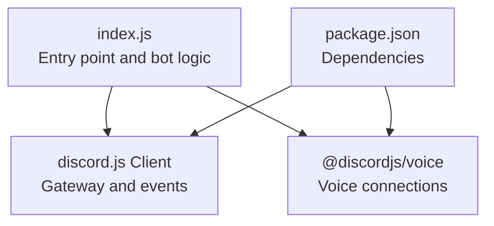
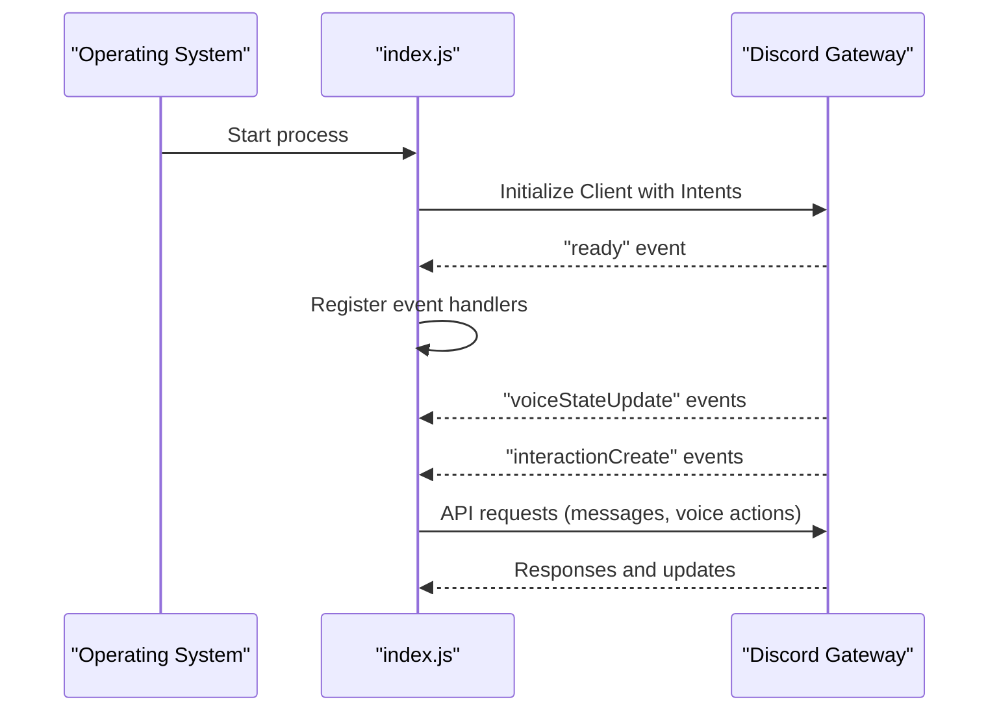
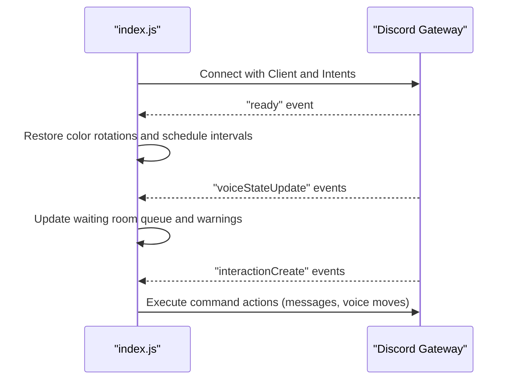
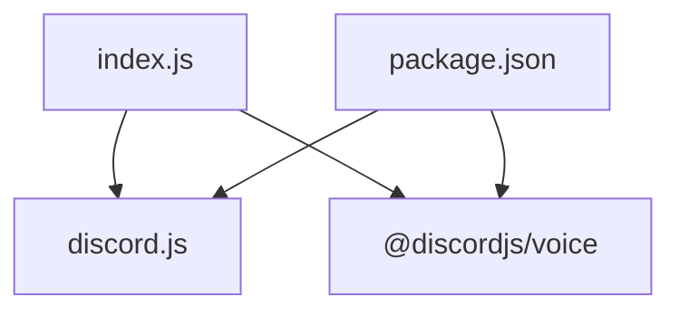

# Connection and API Connectivity Problems

<cite>
**Referenced Files in This Document**
- [index.js](file://index.js)
- [package.json](file://package.json)
- [README.md](file://README.md)
</cite>

## Table of Contents
1. [Introduction](#introduction)
2. [Project Structure](#project-structure)
3. [Core Components](#core-components)
4. [Architecture Overview](#architecture-overview)
5. [Detailed Component Analysis](#detailed-component-analysis)
6. [Dependency Analysis](#dependency-analysis)
7. [Performance Considerations](#performance-considerations)
8. [Troubleshooting Guide](#troubleshooting-guide)
9. [Conclusion](#conclusion)

## Introduction
This document focuses on the connection and API connectivity aspects of the Discord bot implemented in the repository. It explains how the bot connects to Discord’s API, handles connection lifecycle events, manages intents and permissions, and deals with common connectivity issues such as ECONNREFUSED and ETIMEDOUT. It also covers network configuration requirements, firewall and proxy considerations, API rate limiting, and practical diagnostics to ensure reliable operation.

## Project Structure
The bot is primarily implemented in a single entry file that initializes the Discord client, registers event handlers, and orchestrates bot functionality. The runtime dependencies are declared in the package manifest.

**Diagram sources**
- [index.js](file://index.js#L1-L60)
- [package.json](file://package.json#L1-L27)

**Section sources**
- [index.js](file://index.js#L1-L60)
- [package.json](file://package.json#L1-L27)

## Core Components
- Discord Client initialization with gateway intents and partials
- Event-driven lifecycle handlers for ready, voice state updates, and interactions
- Global error handlers for uncaught exceptions and unhandled rejections
- Voice connection management and audio player utilities
- Network configuration and environment variables for credentials

Key implementation references:
- Client creation with intents and partials
  - [index.js](file://index.js#L490-L500)
- Ready event handler
  - [index.js](file://index.js#L708-L720)
- Voice state update handler
  - [index.js](file://index.js#L2443-L2450)
- Global error handlers
  - [index.js](file://index.js#L1-L10)
- Voice connection utilities
  - [index.js](file://index.js#L33-L40)

**Section sources**
- [index.js](file://index.js#L1-L10)
- [index.js](file://index.js#L33-L40)
- [index.js](file://index.js#L490-L500)
- [index.js](file://index.js#L708-L720)
- [index.js](file://index.js#L2443-L2450)

## Architecture Overview
The bot uses discord.js to connect to Discord’s gateway and receive events. The event-driven architecture listens for ready, voice state updates, and interaction events. The bot also manages voice connections and audio players for voice features.

**Diagram sources**
- [index.js](file://index.js#L490-L500)
- [index.js](file://index.js#L708-L720)
- [index.js](file://index.js#L2443-L2450)

## Detailed Component Analysis

### Connection Lifecycle and Event Handling
The bot relies on discord.js events to manage connectivity and runtime behavior:
- Ready event: Initializes internal state and schedules periodic tasks
- Voice state update: Manages voice room queues, warnings, and access restrictions
- Interaction create: Handles slash commands and button clicks

**Diagram sources**
- [index.js](file://index.js#L708-L720)
- [index.js](file://index.js#L2443-L2450)
- [index.js](file://index.js#L824-L876)

**Section sources**
- [index.js](file://index.js#L708-L720)
- [index.js](file://index.js#L2443-L2450)
- [index.js](file://index.js#L824-L876)

### Intents and Permissions
The bot declares gateway intents required to receive events and operate effectively. These include guilds, members, voice states, messages, and message content. Permissions are required for bot operations (e.g., managing channels, connecting to voice, sending messages).

- Intents configuration
  - [index.js](file://index.js#L492-L498)
- Permissions overview
  - [README.md](file://README.md#L128-L141)

**Section sources**
- [index.js](file://index.js#L492-L498)
- [README.md](file://README.md#L128-L141)

### Error Handling and Global Observers
The bot sets up global error handlers to capture uncaught exceptions and unhandled rejections, preventing crashes and logging stack traces for diagnosis.

- Global error observers
  - [index.js](file://index.js#L1-L10)

**Section sources**
- [index.js](file://index.js#L1-L10)

### Voice Connections and Audio Players
The bot integrates voice capabilities using @discordjs/voice. It maintains collections for voice connections and audio players and exposes utilities for joining voice channels and managing audio resources.

- Voice utilities import and usage
  - [index.js](file://index.js#L33-L40)
- Package dependencies
  - [package.json](file://package.json#L10-L25)

**Section sources**
- [index.js](file://index.js#L33-L40)
- [package.json](file://package.json#L10-L25)

### Environment and Credentials
The bot loads environment variables using dotenv. The README describes required environment variables for bot token, client ID, and guild ID.

- Environment loading
  - [index.js](file://index.js#L1-L5)
- Environment variables reference
  - [README.md](file://README.md#L111-L116)

**Section sources**
- [index.js](file://index.js#L1-L5)
- [README.md](file://README.md#L111-L116)

## Dependency Analysis
The bot depends on discord.js for gateway connectivity and event handling, and @discordjs/voice for voice features. The package manifest lists these and other runtime dependencies.

**Diagram sources**
- [index.js](file://index.js#L1-L30)
- [package.json](file://package.json#L10-L25)

**Section sources**
- [index.js](file://index.js#L1-L30)
- [package.json](file://package.json#L10-L25)

## Performance Considerations
- Minimize synchronous I/O during event handlers; defer heavy operations to background tasks
- Use efficient data structures (Maps, Sets) for state tracking (e.g., voice queues, waiting times)
- Batch API calls where possible and avoid unnecessary fetches
- Monitor memory usage and clean up stale state periodically

[No sources needed since this section provides general guidance]

## Troubleshooting Guide

### Connectivity Issues: ECONNREFUSED and ETIMEDOUT
Common symptoms:
- The bot fails to connect to Discord
- Frequent disconnects or timeouts during voice operations

Diagnostic steps:
- Verify network connectivity to Discord endpoints
  - Test outbound TCP connectivity to Discord’s gateway and API hosts
  - Confirm DNS resolution for Discord domains
- Check firewall and proxy configurations
  - Ensure outbound HTTPS traffic (port 443) is permitted
  - Configure proxies if required by your environment
- Validate SSL/TLS configuration
  - Ensure system certificates are up to date
  - Confirm Node.js can establish TLS handshakes
- Inspect environment variables and credentials
  - Confirm the bot token is correct and not expired
  - Verify client ID and guild ID if used by commands

Operational checks:
- Review ready event logs to confirm successful connection
  - [index.js](file://index.js#L708-L720)
- Monitor voice state update logs for unexpected disconnections
  - [index.js](file://index.js#L2443-L2450)
- Use global error handlers to capture uncaught exceptions and unhandled rejections
  - [index.js](file://index.js#L1-L10)

### Rate Limiting and API Errors
- Observe rate limits from Discord API responses and back off accordingly
- Implement retry logic with exponential backoff for transient failures
- Avoid spamming API calls; batch operations when feasible
- Log and monitor error codes for actionable insights

### Network Configuration Requirements
- Outbound HTTPS (port 443) must be allowed to reach Discord’s endpoints
- Ensure DNS resolution for Discord domains is functional
- If behind a corporate proxy, configure Node.js proxy settings appropriately

### Proxy Considerations
- Configure environment variables for proxy support if required
- Validate that proxy settings do not block Discord endpoints
- Test connectivity using curl or similar tools through the proxy

### SSL/TLS Configuration
- Keep system certificates updated
- Verify that Node.js runtime trusts the CA bundle used by Discord
- If self-signed certificates or custom CAs are involved, adjust trust stores carefully

### IP Blocking and Access Restrictions
- If a server IP is blocked, coordinate with Discord support and review your infrastructure’s reputation
- Avoid abusive behavior that could trigger rate limits or blocks

### Event-Driven Connection Lifecycle
- Ready event: Initialize internal state and schedule recurring tasks
  - [index.js](file://index.js#L708-L720)
- Voice state update: Manage waiting rooms, warnings, and access control
  - [index.js](file://index.js#L2443-L2450)
- Interaction create: Execute commands and handle UI interactions
  - [index.js](file://index.js#L824-L876)

**Section sources**
- [index.js](file://index.js#L1-L10)
- [index.js](file://index.js#L708-L720)
- [index.js](file://index.js#L2443-L2450)
- [index.js](file://index.js#L824-L876)

## Conclusion
The bot’s connectivity hinges on proper discord.js configuration, robust error handling, and sound network hygiene. By validating intents, credentials, and network settings, and by monitoring connection lifecycle events, you can diagnose and resolve most connectivity issues. Implementing rate-limit-aware logic and maintaining secure SSL/TLS configurations further strengthens reliability.