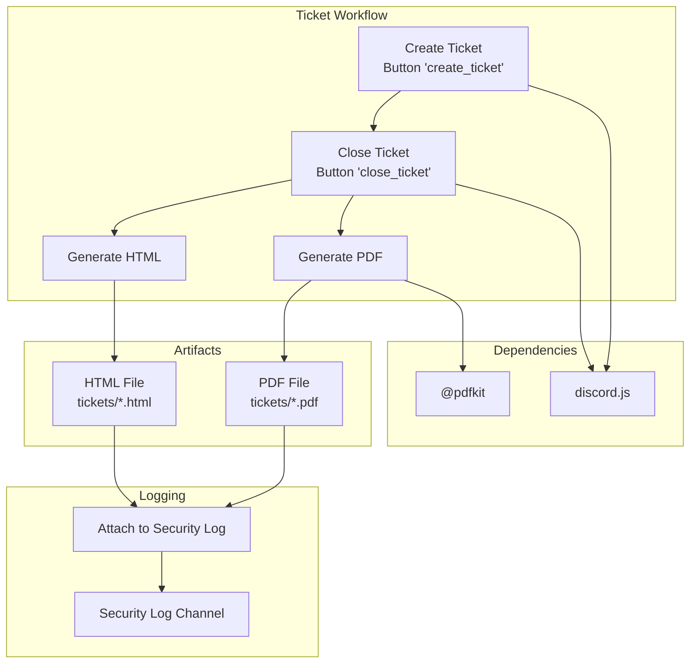
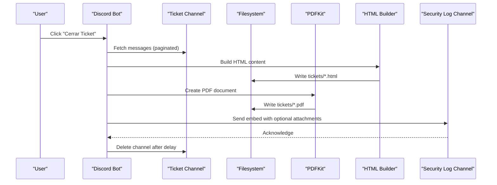
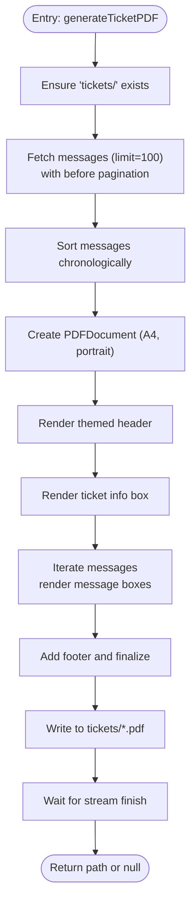
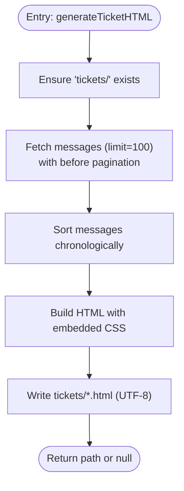
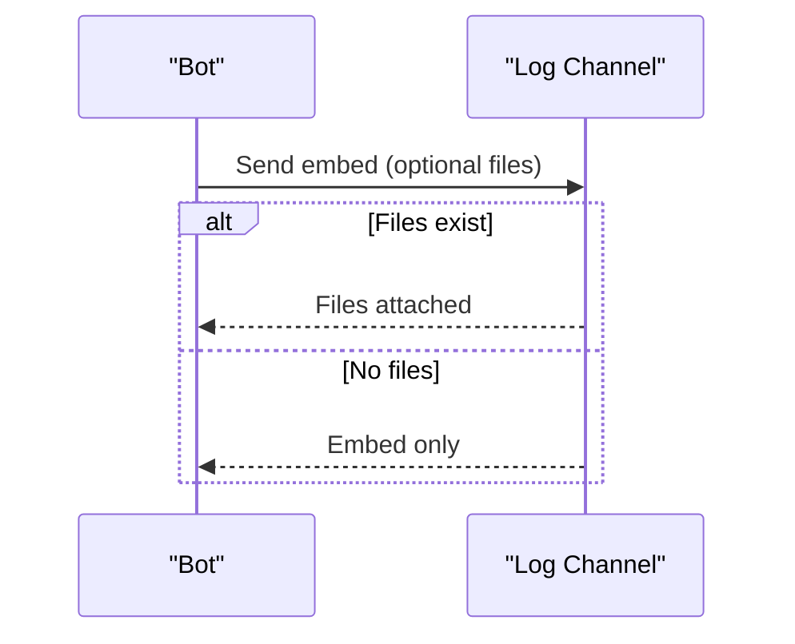
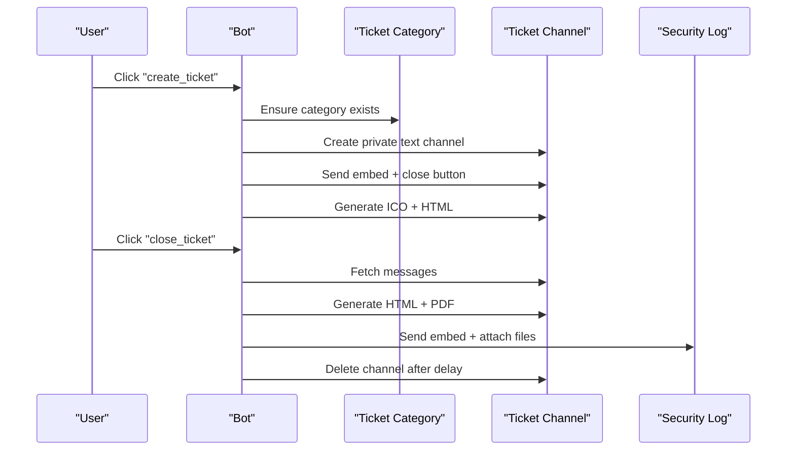
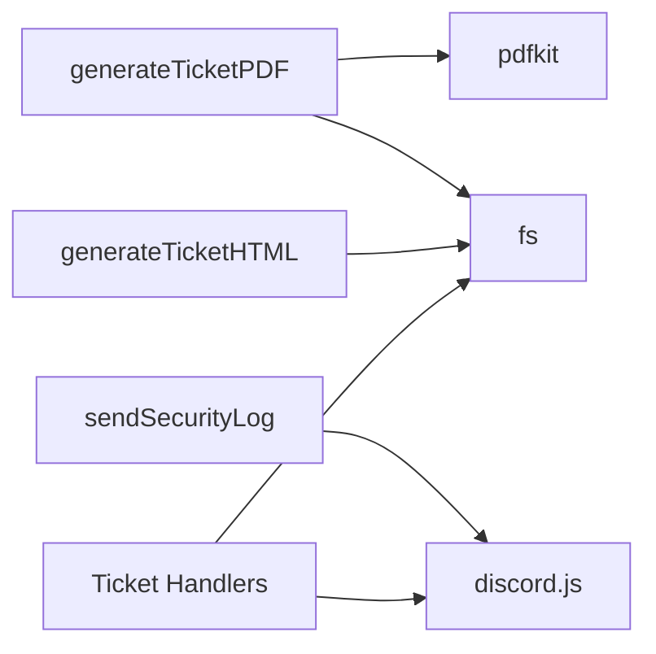

# Ticket System Specific Issues

<cite>
**Referenced Files in This Document**
- [index.js](file://index.js)
- [TICKET_PDF_FEATURE.md](file://TICKET_PDF_FEATURE.md)
- [README.md](file://README.md)
- [package.json](file://package.json)
</cite>

## Table of Contents
1. [Introduction](#introduction)
2. [Project Structure](#project-structure)
3. [Core Components](#core-components)
4. [Architecture Overview](#architecture-overview)
5. [Detailed Component Analysis](#detailed-component-analysis)
6. [Dependency Analysis](#dependency-analysis)
7. [Performance Considerations](#performance-considerations)
8. [Troubleshooting Guide](#troubleshooting-guide)
9. [Conclusion](#conclusion)

## Introduction
This document focuses on the ticket system’s PDF/HTML generation feature and the specific “Error generando PDF del ticket” issue. It explains how tickets are created and closed, how PDF and HTML artifacts are generated, and how they are logged and attached to the server’s security log channel. It also covers prerequisites such as filesystem permissions, disk space, and handling of special characters in filenames, along with troubleshooting steps for common failures.

## Project Structure
The ticket system spans several areas:
- Ticket creation and closure workflows
- PDF generation using the pdfkit library
- HTML generation using pure Node.js file writing
- Logging and file attachment to a configured log channel
- Staff role configuration for mentions and permissions

**Diagram sources**
- [index.js](file://index.js#L5764-L5893)
- [index.js](file://index.js#L74-L274)
- [index.js](file://index.js#L276-L489)
- [index.js](file://index.js#L880-L934)
- [package.json](file://package.json#L1-L27)

**Section sources**
- [index.js](file://index.js#L5764-L5893)
- [index.js](file://index.js#L74-L274)
- [index.js](file://index.js#L276-L489)
- [index.js](file://index.js#L880-L934)
- [package.json](file://package.json#L1-L27)

## Core Components
- Ticket creation and closure:
  - Creation button triggers channel creation and initial HTML generation.
  - Closing button triggers HTML and PDF generation, logging, and channel deletion.
- PDF generation:
  - Uses pdfkit to build a PDF with styled header, ticket info, and message history.
- HTML generation:
  - Builds a self-contained HTML file with embedded styles and message blocks.
- Logging and file attachment:
  - sendSecurityLog attaches generated files to the configured log channel.

Key functions and responsibilities:
- generateTicketPDF(ticketChannel, ticketName, closedBy) — builds and writes a PDF
- generateTicketHTML(ticketChannel, ticketName, closedBy) — builds and writes an HTML file
- sendSecurityLog(guild, embed, htmlPath, pdfPath) — sends logs with optional attachments
- Ticket creation and closing handlers manage the workflow and error reporting

**Section sources**
- [index.js](file://index.js#L74-L274)
- [index.js](file://index.js#L276-L489)
- [index.js](file://index.js#L880-L934)
- [index.js](file://index.js#L5764-L5893)

## Architecture Overview
The ticket workflow integrates Discord interactions, filesystem writes, and logging. The following sequence diagram maps the end-to-end flow for closing a ticket and generating artifacts.

**Diagram sources**
- [index.js](file://index.js#L5847-L5893)
- [index.js](file://index.js#L74-L274)
- [index.js](file://index.js#L276-L489)
- [index.js](file://index.js#L880-L934)

## Detailed Component Analysis

### PDF Generation Pipeline (generateTicketPDF)
- Directory preparation:
  - Ensures the tickets directory exists; creates it if missing.
- Message fetching:
  - Paginates messages using before pagination to collect all messages.
  - Sorts messages chronologically.
- PDF rendering:
  - Creates a PDFDocument with portrait orientation and A4 size.
  - Renders a themed header, ticket info box, and a message list with distinct styling for bot and user messages.
  - Adds attachments metadata and a footer.
- File completion:
  - Ends the PDF and waits for the write stream finish event.
  - Returns the file path or null on error.

**Diagram sources**
- [index.js](file://index.js#L74-L274)

**Section sources**
- [index.js](file://index.js#L74-L274)

### HTML Generation Pipeline (generateTicketHTML)
- Directory preparation:
  - Ensures the tickets directory exists; creates it if missing.
- Message fetching:
  - Paginates messages using before pagination to collect all messages.
  - Sorts messages chronologically.
- HTML building:
  - Generates a complete HTML document with embedded CSS and message cards.
  - Handles bot vs user messages, timestamps, embeds, and attachments.
- File writing:
  - Writes UTF-8 encoded HTML to tickets/*.html.
  - Returns the file path or null on error.

**Diagram sources**
- [index.js](file://index.js#L276-L489)

**Section sources**
- [index.js](file://index.js#L276-L489)

### Logging and Attachment (sendSecurityLog)
- Retrieves the configured log channel for the guild.
- Attaches files if present and accessible.
- Sends an embed with artifact availability status.

**Diagram sources**
- [index.js](file://index.js#L880-L934)

**Section sources**
- [index.js](file://index.js#L880-L934)

### Ticket Workflow: Creation to Closure
- Creation:
  - Button click creates a private text channel under a category named after tickets.
  - Sends an embed with a close button and optional staff mention based on configured role.
  - Generates ICO and HTML immediately upon creation.
- Closure:
  - On close, generates HTML and PDF, logs with attachments, deletes the channel after a short delay.

**Diagram sources**
- [index.js](file://index.js#L5764-L5893)
- [index.js](file://index.js#L5847-L5893)

**Section sources**
- [index.js](file://index.js#L5764-L5893)
- [index.js](file://index.js#L5847-L5893)

## Dependency Analysis
- pdfkit:
  - Used by generateTicketPDF to render PDFs.
  - Declared in dependencies.
- discord.js:
  - Used for interactions, channels, and message sending.
- Node.js filesystem:
  - Used to create directories and write files.
- Environment:
  - BOT_TOKEN loaded via dotenv.

**Diagram sources**
- [index.js](file://index.js#L74-L274)
- [index.js](file://index.js#L276-L489)
- [index.js](file://index.js#L880-L934)
- [package.json](file://package.json#L1-L27)

**Section sources**
- [package.json](file://package.json#L1-L27)
- [index.js](file://index.js#L74-L274)
- [index.js](file://index.js#L276-L489)
- [index.js](file://index.js#L880-L934)

## Performance Considerations
- Message pagination:
  - Both generators fetch messages in batches of 100 using before pagination to handle large histories efficiently.
- Rendering:
  - PDF generation uses streaming; ensure adequate disk I/O throughput.
  - HTML generation writes a single file; keep message counts reasonable to avoid extremely large files.
- Disk space:
  - Ensure sufficient free space for multiple PDF/HTML files, especially on servers with frequent ticket closures.
- Character encoding:
  - HTML is written as UTF-8; PDF rendering handles Unicode text via pdfkit fonts.

[No sources needed since this section provides general guidance]

## Troubleshooting Guide

### Error generando PDF del ticket
Symptoms:
- Console logs show the error message indicating PDF generation failure.
- The ticket still closes even if PDF fails to generate.
- HTML may succeed or fail independently.

Common causes and fixes:
- Missing tickets directory or insufficient permissions:
  - Ensure the bot process has write permissions to the bot’s working directory and can create the tickets subdirectory.
  - Verify the directory exists and is writable by the runtime user.
- Insufficient disk space:
  - Confirm available disk space before attempting generation.
- Large message history:
  - Very long histories increase PDF size and memory usage; consider archiving old tickets or reducing retention.
- Special characters in ticket names:
  - Filenames are derived from ticketName and timestamp; sanitize or avoid unusual characters in channel names to prevent invalid paths.
- pdfkit errors:
  - pdfkit depends on underlying font and image libraries; ensure the environment has required native dependencies installed.

Evidence in code:
- Error logging occurs in the PDF generator and is returned as null.
- The closure flow continues even if PDF fails.

**Section sources**
- [index.js](file://index.js#L270-L273)
- [index.js](file://index.js#L5847-L5893)

### Missing ticket records or empty histories
- Cause:
  - If a channel lacks messages or messages are inaccessible due to permissions, histories may be empty.
- Fix:
  - Verify bot permissions to read message history in the ticket channel.
  - Ensure the channel is not archived or restricted.

**Section sources**
- [index.js](file://index.js#L5847-L5893)

### Failed file generation (HTML or PDF)
- Causes:
  - Filesystem errors, permission issues, or out-of-memory conditions.
- Fixes:
  - Check directory permissions and disk space.
  - Reduce message count or split histories if necessary.
  - Validate encoding and filename sanitization.

**Section sources**
- [index.js](file://index.js#L276-L489)
- [index.js](file://index.js#L74-L274)

### Staff role configuration issues
- Symptom:
  - Staff mention does not appear when opening tickets.
- Cause:
  - The staff role has not been configured for the server.
- Fix:
  - Use the command to set the staff role for tickets.
  - Ensure the bot has Manage Roles permission to configure roles.

**Section sources**
- [index.js](file://index.js#L4614-L4622)
- [index.js](file://index.js#L5764-L5817)

### Logs not received or attachments missing
- Causes:
  - No log channel configured for the server.
  - Files not found or unreadable.
- Fixes:
  - Configure the log channel via the anti-raid system and ensure it matches the expected naming convention.
  - Verify that the generated files exist and are readable by the bot process.

**Section sources**
- [index.js](file://index.js#L880-L934)

### Practical checks
- Verify dependencies:
  - Ensure pdfkit is installed.
- Verify environment:
  - Confirm BOT_TOKEN is set.
- Verify permissions:
  - Ensure the bot has permissions to read channels, manage messages, and create/delete channels.

**Section sources**
- [package.json](file://package.json#L1-L27)
- [README.md](file://README.md#L105-L141)

## Conclusion
The ticket system integrates robust PDF and HTML generation with a clear workflow from creation to closure. The “Error generando PDF del ticket” error typically stems from filesystem or environment issues rather than Discord API limitations. By validating permissions, disk space, and filename safety, and by ensuring the log channel is configured, most failures can be resolved quickly. The system gracefully continues even when PDF generation fails, preserving HTML artifacts and logging outcomes for staff review.