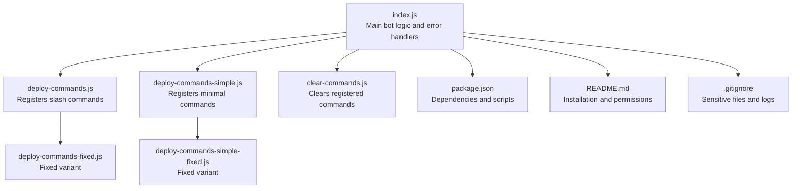
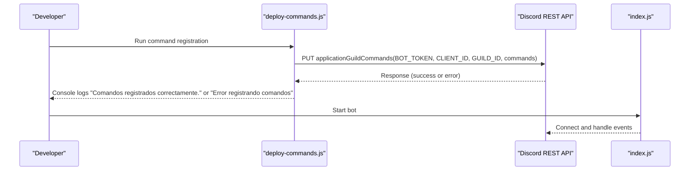
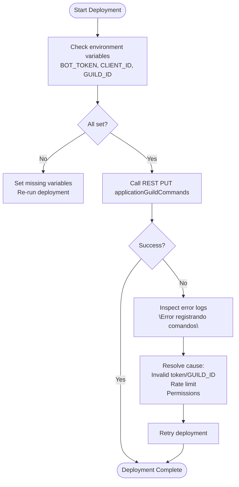
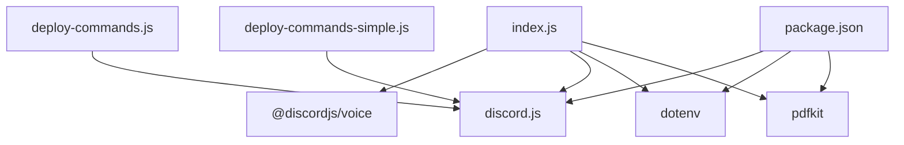

# Troubleshooting

<cite>
**Referenced Files in This Document**
- [index.js](file://index.js)
- [deploy-commands.js](file://deploy-commands.js)
- [deploy-commands-simple.js](file://deploy-commands-simple.js)
- [clear-commands.js](file://clear-commands.js)
- [deploy-commands-fixed.js](file://deploy-commands-fixed.js)
- [deploy-commands-simple-fixed.js](file://deploy-commands-simple-fixed.js)
- [package.json](file://package.json)
- [README.md](file://README.md)
- [.gitignore](file://.gitignore)
</cite>

## Table of Contents
1. [Introduction](#introduction)
2. [Project Structure](#project-structure)
3. [Core Components](#core-components)
4. [Architecture Overview](#architecture-overview)
5. [Detailed Component Analysis](#detailed-component-analysis)
6. [Dependency Analysis](#dependency-analysis)
7. [Performance Considerations](#performance-considerations)
8. [Troubleshooting Guide](#troubleshooting-guide)
9. [Conclusion](#conclusion)

## Introduction
This Troubleshooting section focuses on diagnosing and resolving common issues encountered when running the Discord bot. It covers bot not responding, command registration failures, permission errors, and connection problems. Specific error messages from the codebase are documented along with their causes and solutions. Debugging tips include checking environment variables, verifying bot permissions, and reviewing console logs. Step-by-step procedures are provided for diagnosing connectivity issues with Discord’s API. Performance considerations and optimization tips are included to reduce latency.

## Project Structure
The repository contains the main bot entry point, command deployment scripts, and supporting documentation. Key areas relevant to troubleshooting include:
- Command registration and cleanup scripts
- Main bot logic with extensive error logging
- Environment configuration and dependency management
- Documentation and security considerations

**Diagram sources**
- [index.js](file://index.js#L1-L120)
- [deploy-commands.js](file://deploy-commands.js#L1-L60)
- [deploy-commands-simple.js](file://deploy-commands-simple.js#L1-L60)
- [clear-commands.js](file://clear-commands.js#L1-L40)
- [deploy-commands-fixed.js](file://deploy-commands-fixed.js#L1-L60)
- [deploy-commands-simple-fixed.js](file://deploy-commands-simple-fixed.js#L1-L60)
- [package.json](file://package.json#L1-L27)
- [README.md](file://README.md#L104-L141)
- [.gitignore](file://.gitignore#L1-L32)

**Section sources**
- [index.js](file://index.js#L1-L120)
- [deploy-commands.js](file://deploy-commands.js#L1-L60)
- [deploy-commands-simple.js](file://deploy-commands-simple.js#L1-L60)
- [clear-commands.js](file://clear-commands.js#L1-L40)
- [deploy-commands-fixed.js](file://deploy-commands-fixed.js#L1-L60)
- [deploy-commands-simple-fixed.js](file://deploy-commands-simple-fixed.js#L1-L60)
- [package.json](file://package.json#L1-L27)
- [README.md](file://README.md#L104-L141)
- [.gitignore](file://.gitignore#L1-L32)

## Core Components
- Main bot entry point with global error handlers and extensive logging for PDF/HTML/ticket generation, voice support, moderation, and anti-raid systems.
- Command deployment scripts that register slash commands for the bot in a specific guild.
- Command clearing script to remove all registered commands from a guild and globally.
- Package configuration with dependencies and npm scripts for starting the bot and deploying commands.
- Documentation covering installation steps, environment variables, and required permissions.

Key troubleshooting-relevant elements:
- Global uncaught exception and unhandled rejection handlers.
- Explicit error logging for command registration failures and ticket generation failures.
- Environment variable loading via dotenv for BOT_TOKEN, CLIENT_ID, and GUILD_ID.

**Section sources**
- [index.js](file://index.js#L1-L120)
- [deploy-commands.js](file://deploy-commands.js#L280-L293)
- [deploy-commands-simple.js](file://deploy-commands-simple.js#L150-L164)
- [clear-commands.js](file://clear-commands.js#L1-L35)
- [package.json](file://package.json#L1-L27)
- [README.md](file://README.md#L104-L141)

## Architecture Overview
The bot architecture centers around the main entry point and command registration utilities. The main bot handles events, commands, and subsystems (voice, tickets, logs, moderation, anti-raid). Command registration is performed via REST endpoints using the Discord API.

**Diagram sources**
- [deploy-commands.js](file://deploy-commands.js#L280-L293)
- [deploy-commands-simple.js](file://deploy-commands-simple.js#L150-L164)
- [index.js](file://index.js#L1-L120)

## Detailed Component Analysis

### Command Registration Failures
Common symptoms:
- Slash commands do not appear in the selected guild.
- Console shows “Error registrando comandos” during deployment.

Root causes and solutions:
- Missing or invalid environment variables (BOT_TOKEN, CLIENT_ID, GUILD_ID).
- Incorrect GUILD_ID extraction or formatting.
- Rate limits or API errors from Discord.
- Token permissions mismatch (requires appropriate OAuth scopes and bot permissions).

Diagnosis steps:
1. Verify environment variables are present and correctly formatted.
2. Confirm CLIENT_ID and GUILD_ID match the intended server.
3. Re-run the deployment script and review console logs for the exact error message.
4. If rate limited, wait and retry; otherwise, inspect network connectivity and API status.

**Diagram sources**
- [deploy-commands.js](file://deploy-commands.js#L280-L293)
- [deploy-commands-simple.js](file://deploy-commands-simple.js#L150-L164)

**Section sources**
- [deploy-commands.js](file://deploy-commands.js#L280-L293)
- [deploy-commands-simple.js](file://deploy-commands-simple.js#L150-L164)
- [deploy-commands-fixed.js](file://deploy-commands-fixed.js#L268-L279)
- [deploy-commands-simple-fixed.js](file://deploy-commands-simple-fixed.js#L150-L163)

### Permission Errors
Common symptoms:
- Bot responds with permission-related messages when executing commands.
- Some commands fail silently or return generic errors.

Root causes and solutions:
- Missing required permissions for the bot in the server (e.g., Manage Roles, Manage Channels, Send Messages, Use Slash Commands).
- Role hierarchy issues preventing role assignment or moderation actions.
- DM-related permission errors when attempting to send direct messages.

Diagnosis steps:
1. Review the required permissions list in the documentation.
2. Verify the bot’s role position and hierarchy in the server.
3. Test DM sending to a user who may have blocked DMs (error code 50007).
4. Confirm the user invoking the command has the necessary role restrictions configured.

**Section sources**
- [README.md](file://README.md#L128-L141)
- [index.js](file://index.js#L590-L610)

### Bot Not Responding
Common symptoms:
- No response to slash commands or events.
- Exceptions or unhandled rejections logged.

Root causes and solutions:
- Uncaught exceptions or unhandled rejections in runtime.
- Missing environment variables causing initialization failures.
- Network connectivity issues to Discord API.

Diagnosis steps:
1. Check global error handlers for uncaught exceptions and unhandled rejections.
2. Verify environment variables are loaded and correct.
3. Review startup logs and confirm the bot connects successfully.
4. Inspect network connectivity and firewall settings.

**Section sources**
- [index.js](file://index.js#L1-L12)
- [README.md](file://README.md#L104-L126)

### Connection Problems with Discord API
Common symptoms:
- Deployment or runtime errors when interacting with Discord API.
- Intermittent connectivity or timeouts.

Root causes and solutions:
- Network instability or DNS resolution issues.
- API rate limits or temporary service outages.
- Incorrect token or missing OAuth scopes.

Diagnosis steps:
1. Validate environment variables and token validity.
2. Test basic connectivity using a simple REST call to the Discord API.
3. Monitor for rate limit responses and back off accordingly.
4. Check Discord status pages for ongoing incidents.

**Section sources**
- [deploy-commands.js](file://deploy-commands.js#L280-L293)
- [deploy-commands-simple.js](file://deploy-commands-simple.js#L150-L164)
- [index.js](file://index.js#L1-L12)

### Ticket Generation Failures
Common symptoms:
- Errors when generating PDF or HTML for tickets.
- Files not created or partially written.

Root causes and solutions:
- File system write permissions or disk space issues.
- Large message histories causing memory pressure or timeouts.
- Missing or inaccessible directories for storing generated files.

Diagnosis steps:
1. Ensure the tickets directory exists and is writable.
2. Reduce message fetch limits or paginate more carefully.
3. Check for disk space and file system errors.
4. Review console logs for the exact error message indicating failure.

**Section sources**
- [index.js](file://index.js#L74-L120)
- [index.js](file://index.js#L260-L274)
- [index.js](file://index.js#L276-L489)

## Dependency Analysis
External dependencies relevant to troubleshooting:
- discord.js: Provides client, REST, Routes, and error types.
- dotenv: Loads environment variables from .env.
- pdfkit: Used for generating PDFs.
- @discordjs/voice: Used for voice functionality.

Potential issues:
- Outdated or incompatible versions of discord.js affecting REST behavior.
- Missing ffmpeg-static/opusscript/prism-media for voice features.
- Missing dotenv leading to undefined environment variables.

**Diagram sources**
- [index.js](file://index.js#L1-L40)
- [deploy-commands.js](file://deploy-commands.js#L1-L10)
- [deploy-commands-simple.js](file://deploy-commands-simple.js#L1-L10)
- [package.json](file://package.json#L1-L27)

**Section sources**
- [package.json](file://package.json#L1-L27)
- [index.js](file://index.js#L1-L40)
- [deploy-commands.js](file://deploy-commands.js#L1-L10)
- [deploy-commands-simple.js](file://deploy-commands-simple.js#L1-L10)

## Performance Considerations
- Minimize message fetch sizes when generating tickets to reduce memory and latency.
- Use pagination efficiently to avoid long-running operations.
- Avoid unnecessary file writes; ensure directories exist before writing.
- Monitor and handle rate limits gracefully during command registration and API calls.
- Keep dependencies updated to benefit from performance improvements and bug fixes.

[No sources needed since this section provides general guidance]

## Troubleshooting Guide

### Environment Variables and Setup
- Ensure .env contains BOT_TOKEN, CLIENT_ID, and GUILD_ID.
- Confirm .env is ignored by version control (.gitignore).
- Reinstall dependencies if environment variables are not loading.

**Section sources**
- [README.md](file://README.md#L104-L126)
- [.gitignore](file://.gitignore#L1-L10)
- [package.json](file://package.json#L1-L27)

### Command Registration Failures
- Symptom: “Error registrando comandos”
- Causes:
  - Missing or invalid BOT_TOKEN, CLIENT_ID, or GUILD_ID.
  - Incorrect GUILD_ID extraction/formatting.
  - API rate limits or temporary service issues.
- Resolution:
  - Verify environment variables and re-run deployment.
  - Use the clearing script to remove duplicates, then redeploy.
  - Retry after cooldown if rate limited.

**Section sources**
- [deploy-commands.js](file://deploy-commands.js#L280-L293)
- [deploy-commands-simple.js](file://deploy-commands-simple.js#L150-L164)
- [clear-commands.js](file://clear-commands.js#L1-L35)

### Permission Errors
- Symptom: DM sending fails with error code 50007 (blocked DMs) or 50001 (cannot access user).
- Resolution:
  - Check if the user has blocked DMs or left the server.
  - Adjust bot permissions and role hierarchy.
  - Verify required permissions for commands.

**Section sources**
- [index.js](file://index.js#L590-L610)
- [README.md](file://README.md#L128-L141)

### Bot Not Responding
- Symptom: No response to commands or events.
- Causes:
  - Uncaught exceptions or unhandled rejections.
  - Missing environment variables.
  - Network connectivity issues.
- Resolution:
  - Review global error handlers and startup logs.
  - Verify environment variables and restart the bot.
  - Check network connectivity and firewall settings.

**Section sources**
- [index.js](file://index.js#L1-L12)
- [README.md](file://README.md#L104-L126)

### Connection Problems with Discord API
- Symptom: Deployment or runtime API errors.
- Causes:
  - Network instability or DNS issues.
  - API rate limits or service outages.
- Resolution:
  - Validate environment variables and token.
  - Retry after cooldown; monitor Discord status.

**Section sources**
- [deploy-commands.js](file://deploy-commands.js#L280-L293)
- [deploy-commands-simple.js](file://deploy-commands-simple.js#L150-L164)

### Ticket Generation Failures
- Symptom: “Error generando PDF del ticket” or related errors.
- Causes:
  - File system write permissions or disk issues.
  - Large message histories causing timeouts.
- Resolution:
  - Ensure tickets directory exists and is writable.
  - Reduce message fetch limits and optimize pagination.
  - Check disk space and file system errors.

**Section sources**
- [index.js](file://index.js#L74-L120)
- [index.js](file://index.js#L260-L274)
- [index.js](file://index.js#L276-L489)

### Step-by-Step Diagnosis Procedures for Connectivity Issues
1. Verify environment variables:
   - Confirm BOT_TOKEN, CLIENT_ID, and GUILD_ID are set and correct.
2. Test deployment:
   - Run the deployment script and observe console logs for success or error messages.
3. Clear duplicates if needed:
   - Use the clearing script to remove existing commands, then redeploy.
4. Check network:
   - Validate DNS resolution and outbound connectivity.
5. Monitor rate limits:
   - If rate limited, wait and retry.
6. Review logs:
   - Inspect console logs for detailed error messages and stack traces.

**Section sources**
- [deploy-commands.js](file://deploy-commands.js#L280-L293)
- [clear-commands.js](file://clear-commands.js#L1-L35)
- [README.md](file://README.md#L104-L126)

### Debugging Tips
- Enable verbose logging for PDF/HTML generation and command registration.
- Use the clearing script to reset command state when diagnosing duplicates.
- Validate role hierarchy and permissions for commands.
- Check .gitignore to ensure sensitive files are not committed.

**Section sources**
- [index.js](file://index.js#L74-L120)
- [index.js](file://index.js#L260-L274)
- [index.js](file://index.js#L276-L489)
- [clear-commands.js](file://clear-commands.js#L1-L35)
- [.gitignore](file://.gitignore#L1-L10)

## Conclusion
This Troubleshooting section consolidates practical steps to diagnose and resolve common issues with the Discord bot. By validating environment variables, verifying permissions, addressing command registration failures, and following the connectivity and performance guidelines, most problems can be quickly identified and resolved. Use the provided procedures and logs to pinpoint root causes and apply targeted fixes.